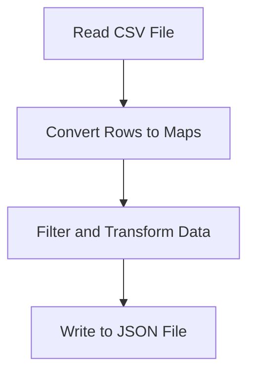

## 13.2.1 Working with CSV and JSON

In the world of data processing, CSV and JSON are ubiquitous formats. CSV files are often used for exporting and importing data between systems, while JSON is a preferred format for web APIs due to its lightweight nature and ease of use with JavaScript. In this section, we will explore how to work with these formats in Clojure, leveraging its functional programming paradigms to read, transform, and output data efficiently. This guide is tailored for Java developers who are transitioning to Clojure, providing insights into how these tasks can be accomplished in a functional way.

### Understanding CSV and JSON

Before diving into the code, let's briefly understand the formats:

- **CSV (Comma-Separated Values):** A simple file format used to store tabular data, such as a spreadsheet or database. Each line of the file is a data record, and each record consists of one or more fields separated by commas.

- **JSON (JavaScript Object Notation):** A lightweight data interchange format that is easy for humans to read and write, and easy for machines to parse and generate. JSON is built on two structures: a collection of name/value pairs (often realized as an object, record, struct, dictionary, hash table, keyed list, or associative array) and an ordered list of values (often realized as an array, vector, list, or sequence).

### Setting Up Your Clojure Environment

Before we begin, ensure that your Clojure development environment is set up. You should have Leiningen installed, which will help manage dependencies and run your Clojure projects.

```bash
lein -v
```

### Reading Data from a CSV File

To read CSV data in Clojure, we can use the `clojure.data.csv` library, which provides a simple and efficient way to parse CSV files. Let's start by adding this dependency to your `project.clj` file:

```clojure
(defproject csv-json-example "0.1.0-SNAPSHOT"
  :dependencies [[org.clojure/clojure "1.10.3"]
                 [org.clojure/data.csv "1.0.0"]
                 [org.clojure/data.json "2.4.0"]])
```

#### Reading CSV Data

Here's a step-by-step guide to reading CSV data:

1. **Import the Required Libraries:**

   ```clojure
   (require '[clojure.data.csv :as csv]
            '[clojure.java.io :as io])
   ```

2. **Read the CSV File:**

   Let's assume we have a CSV file named `data.csv` with the following content:

   ```
   name,age,city
   John Doe,30,New York
   Jane Smith,25,Los Angeles
   ```

   We can read this file as follows:

   ```clojure
   (defn read-csv [file-path]
     (with-open [reader (io/reader file-path)]
       (doall
         (csv/read-csv reader))))
   ```

   Usage:

   ```clojure
   (def csv-data (read-csv "data.csv"))
   ```

   The `read-csv` function reads the CSV file and returns a sequence of sequences, where each inner sequence represents a row of the CSV file.

### Transforming Data Structures

Once we have the CSV data, we often need to transform it into a more usable format. In Clojure, we can leverage its powerful sequence operations to achieve this.

#### Converting CSV Rows to Maps

A common transformation is converting each row of the CSV into a map, using the first row as the keys:

```clojure
(defn csv-to-maps [csv-data]
  (let [headers (first csv-data)
        rows (rest csv-data)]
    (map #(zipmap headers %) rows)))

(def csv-maps (csv-to-maps csv-data))
```

In this code, `zipmap` is used to create a map for each row, with keys from the headers and values from the row itself.

#### Example Transformation

Suppose we want to filter out people older than 28 and transform the data to include only their names and cities:

```clojure
(defn filter-and-transform [data]
  (->> data
       (filter #(> (Integer. (get % "age")) 28))
       (map #(select-keys % ["name" "city"]))))

(def transformed-data (filter-and-transform csv-maps))
```

### Outputting to JSON

With the data transformed, the next step is to output it to JSON. For this, we can use the `clojure.data.json` library.

#### Converting Maps to JSON

Here's how you can convert the transformed data to JSON:

1. **Import the JSON Library:**

   ```clojure
   (require '[clojure.data.json :as json])
   ```

2. **Convert and Write to JSON:**

   ```clojure
   (defn write-json [data file-path]
     (with-open [writer (io/writer file-path)]
       (json/write data writer)))

   (write-json transformed-data "output.json")
   ```

This function writes the transformed data to a file named `output.json` in JSON format.

### Practical Example: End-to-End

Let's put it all together in a complete example:

```clojure
(ns csv-json-example.core
  (:require [clojure.data.csv :as csv]
            [clojure.java.io :as io]
            [clojure.data.json :as json]))

(defn read-csv [file-path]
  (with-open [reader (io/reader file-path)]
    (doall
      (csv/read-csv reader))))

(defn csv-to-maps [csv-data]
  (let [headers (first csv-data)
        rows (rest csv-data)]
    (map #(zipmap headers %) rows)))

(defn filter-and-transform [data]
  (->> data
       (filter #(> (Integer. (get % "age")) 28))
       (map #(select-keys % ["name" "city"]))))

(defn write-json [data file-path]
  (with-open [writer (io/writer file-path)]
    (json/write data writer)))

(defn process-csv-to-json [input-csv output-json]
  (let [csv-data (read-csv input-csv)
        csv-maps (csv-to-maps csv-data)
        transformed-data (filter-and-transform csv-maps)]
    (write-json transformed-data output-json)))

;; Run the process
(process-csv-to-json "data.csv" "output.json")
```

### Best Practices and Optimization Tips

- **Lazy Sequences:** Clojure's sequences are lazy by default. Use functions like `doall` or `dorun` when you need to force evaluation, especially when dealing with I/O operations.
  
- **Error Handling:** Always include error handling when dealing with file I/O to gracefully manage issues like missing files or read/write errors.

- **Performance Considerations:** For large datasets, consider streaming the data instead of loading it all into memory at once.

- **Data Validation:** Implement validation checks on your CSV data to ensure data integrity before processing.

### Common Pitfalls

- **Data Types:** Be mindful of data types when transforming data. For instance, converting strings to integers can lead to errors if the data is not clean.

- **File Encoding:** Ensure that the file encoding is consistent, especially when dealing with non-ASCII characters.

- **JSON Structure:** JSON requires valid key-value pairs. Ensure that your data transformation maintains this structure to avoid JSON parsing errors.

### Diagrams and Flowcharts

To better understand the flow of data processing from CSV to JSON, consider the following flowchart:



This flowchart illustrates the sequential steps involved in processing CSV data and outputting it to JSON.

### Conclusion

Working with CSV and JSON in Clojure provides a powerful way to handle data transformation tasks. By leveraging Clojure's functional programming capabilities, you can write concise and efficient code that is easy to maintain and extend. As you continue to explore Clojure, consider experimenting with different data transformation techniques and libraries to further enhance your data processing workflows.

## Quiz Time!



### What library is used in Clojure to read CSV files?

- [x] clojure.data.csv
- [ ] clojure.data.json
- [ ] clojure.java.io
- [ ] clojure.core

> **Explanation:** The `clojure.data.csv` library is specifically used for reading and writing CSV files in Clojure.

### Which function is used to convert CSV rows to maps in the example?

- [x] zipmap
- [ ] map
- [ ] filter
- [ ] reduce

> **Explanation:** The `zipmap` function is used to create a map from two sequences: one for the keys (headers) and one for the values (row data).

### What is the purpose of the `doall` function in the CSV reading process?

- [x] To force the evaluation of a lazy sequence
- [ ] To read the entire file into memory
- [ ] To write data to a file
- [ ] To filter data

> **Explanation:** `doall` is used to force the evaluation of a lazy sequence, which is necessary when performing I/O operations to ensure the entire sequence is processed.

### What is the main advantage of using JSON for data interchange?

- [x] It is lightweight and easy to parse
- [ ] It supports complex data types
- [ ] It is faster than XML
- [ ] It is human-readable only

> **Explanation:** JSON is lightweight and easy for both humans to read and machines to parse, making it ideal for data interchange.

### How can you filter data in Clojure?

- [x] Using the `filter` function
- [ ] Using the `map` function
- [ ] Using the `reduce` function
- [ ] Using the `zipmap` function

> **Explanation:** The `filter` function is used to select elements from a sequence that satisfy a given predicate.

### Which function is used to write JSON data to a file?

- [x] json/write
- [ ] json/read
- [ ] io/writer
- [ ] csv/write

> **Explanation:** The `json/write` function is used to serialize Clojure data structures to JSON and write them to a file.

### What is a common pitfall when converting CSV data to JSON?

- [x] Data type mismatches
- [ ] File not found errors
- [ ] JSON parsing errors
- [ ] Incorrect file paths

> **Explanation:** Data type mismatches, such as converting strings to integers, can lead to errors if the data is not clean.

### What is the purpose of the `select-keys` function in the transformation process?

- [x] To extract specific keys from a map
- [ ] To convert a sequence to a map
- [ ] To filter a sequence
- [ ] To write data to a file

> **Explanation:** `select-keys` is used to create a new map containing only the specified keys from an existing map.

### What is a benefit of using Clojure's functional programming paradigm for data processing?

- [x] Concise and maintainable code
- [ ] Faster execution times
- [ ] Easier debugging
- [ ] Better error handling

> **Explanation:** Functional programming in Clojure allows for concise and maintainable code, which is easier to reason about and extend.

### True or False: JSON requires valid key-value pairs.

- [x] True
- [ ] False

> **Explanation:** JSON is structured as key-value pairs, and maintaining this structure is essential for valid JSON data.


