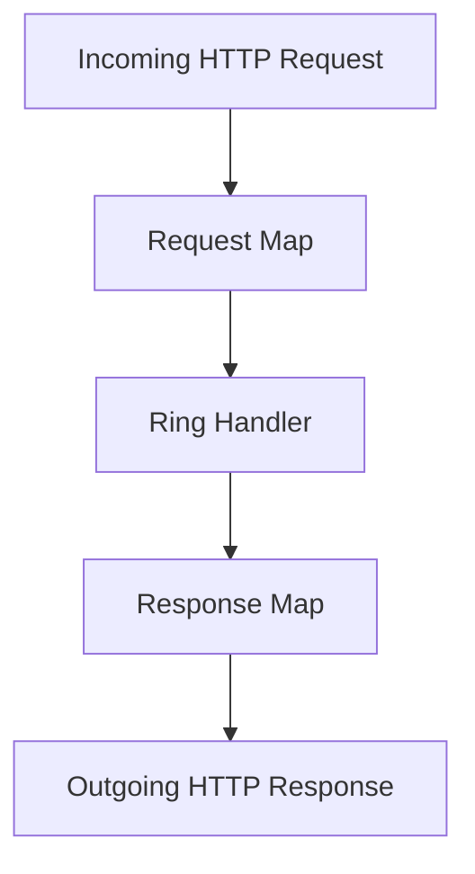

## 13.2.1 Understanding Ring

As experienced Java developers, you're likely familiar with the intricacies of handling HTTP requests and responses using frameworks like Spring or Java EE. In Clojure, the Ring library serves as the foundational tool for web development, offering a minimalist and functional approach to HTTP interactions. In this section, we'll explore the Ring specification, its data-driven model, and how middleware enhances its capabilities. We'll also provide practical examples to help you create a simple web server using Ring.

### Introduction to Ring

Ring is a Clojure library that provides a simple and flexible way to handle HTTP requests and responses. It is inspired by Ruby's Rack and Python's WSGI, focusing on a minimalistic and composable design. At its core, Ring models HTTP interactions as simple Clojure maps, making it easy to manipulate and extend.

#### The Ring Specification

The Ring specification defines a standard way to represent HTTP requests and responses as Clojure maps. This approach aligns with Clojure's philosophy of using immutable data structures and functional programming principles. Let's break down the key components of the Ring specification:

- **Request Map**: Represents an incoming HTTP request. It includes keys such as `:request-method`, `:uri`, `:headers`, and `:body`.
- **Response Map**: Represents an HTTP response. It includes keys like `:status`, `:headers`, and `:body`.

Here's a simple example of a Ring request map:

```clojure
{:request-method :get
 :uri "/hello"
 :headers {"host" "localhost:3000"}
 :body nil}
```

And a corresponding response map:

```clojure
{:status 200
 :headers {"Content-Type" "text/plain"}
 :body "Hello, World!"}
```

### Modeling HTTP Interactions

Ring's use of maps to model HTTP interactions allows for a straightforward and flexible way to handle web requests. This simplicity is a stark contrast to the more complex object-oriented models often used in Java frameworks. By leveraging Clojure's immutable data structures, Ring ensures that HTTP interactions are predictable and easy to reason about.

#### Creating a Basic Ring Handler

A Ring handler is a Clojure function that takes a request map and returns a response map. Let's create a simple handler that responds with "Hello, World!":

```clojure
(defn hello-world-handler [request]
  {:status 200
   :headers {"Content-Type" "text/plain"}
   :body "Hello, World!"})
```

This handler function is a pure function, meaning it has no side effects and always returns the same response for the same request. This purity is a key advantage of using Clojure for web development, as it simplifies testing and debugging.

### Setting Up a Simple Web Server

To serve HTTP requests using Ring, we need a web server. The `ring.adapter.jetty` library provides a simple way to start a Jetty server with a Ring handler. Here's how you can set up a basic web server:

```clojure
(require '[ring.adapter.jetty :refer [run-jetty]])

(defn start-server []
  (run-jetty hello-world-handler {:port 3000}))
```

Running `start-server` will start a Jetty server on port 3000, serving requests using the `hello-world-handler`.

### Understanding Middleware

Middleware in Ring is a powerful concept that allows you to compose and extend handlers. Middleware functions wrap handlers, adding additional functionality such as logging, authentication, or session management.

#### Creating a Simple Middleware

Let's create a simple middleware that logs each request:

```clojure
(defn wrap-logger [handler]
  (fn [request]
    (println "Received request:" (:uri request))
    (handler request)))
```

We can apply this middleware to our handler using function composition:

```clojure
(def app (wrap-logger hello-world-handler))
```

Now, when a request is received, the middleware will log the request URI before passing the request to the handler.

### Comparing Ring with Java Frameworks

In Java, frameworks like Spring provide extensive features for web development, often at the cost of complexity and configuration overhead. Ring, on the other hand, offers a lightweight and functional approach, focusing on simplicity and composability.

#### Java Example: Handling HTTP Requests with Spring

Here's a basic example of handling HTTP requests in Spring:

```java
@RestController
public class HelloWorldController {

    @GetMapping("/hello")
    public ResponseEntity<String> helloWorld() {
        return new ResponseEntity<>("Hello, World!", HttpStatus.OK);
    }
}
```

In contrast, the Ring handler we created earlier achieves the same functionality with less boilerplate and a more functional style.

### Try It Yourself

To deepen your understanding of Ring, try modifying the examples provided:

- **Change the response body** in the `hello-world-handler` to return a different message.
- **Add additional middleware** to log request headers or measure request processing time.
- **Experiment with different HTTP methods** by modifying the request map in your tests.

### Visualizing Ring's Architecture

To better understand how Ring processes requests and responses, let's visualize the flow using a Mermaid.js diagram:



**Diagram Description**: This flowchart illustrates the process of handling an HTTP request in Ring. The incoming request is converted into a request map, processed by a Ring handler, and transformed into a response map, which is then sent as an HTTP response.

### Key Takeaways

- **Ring models HTTP interactions** using simple Clojure maps, aligning with functional programming principles.
- **Handlers are pure functions** that take a request map and return a response map.
- **Middleware enhances handlers** by adding additional functionality, promoting code reuse and separation of concerns.
- **Ring offers a lightweight alternative** to Java web frameworks, focusing on simplicity and composability.

### Further Reading

For more information on Ring and its ecosystem, consider exploring the following resources:

- [Official Ring Documentation](https://github.com/ring-clojure/ring)
- [ClojureDocs: Ring](https://clojuredocs.org/ring)
- [Ring Middleware Examples](https://github.com/ring-clojure/ring/wiki/Middleware)

### Exercises

1. **Create a new Ring handler** that responds with JSON data. Use the `cheshire` library to encode a Clojure map as JSON.
2. **Implement a middleware** that adds a custom header to each response.
3. **Set up a simple REST API** using Ring and Compojure, handling different HTTP methods and routes.

By exploring these exercises, you'll gain hands-on experience with Ring and deepen your understanding of functional web development in Clojure.

## Quiz: Mastering Ring in Clojure



### What is the primary purpose of the Ring library in Clojure?

- [x] To handle HTTP requests and responses
- [ ] To manage database connections
- [ ] To provide a GUI framework
- [ ] To perform mathematical computations

> **Explanation:** Ring is designed to handle HTTP requests and responses in Clojure, providing a simple and flexible way to build web applications.

### How does Ring model HTTP requests and responses?

- [x] As Clojure maps
- [ ] As Java objects
- [ ] As XML documents
- [ ] As JSON strings

> **Explanation:** Ring uses Clojure maps to represent HTTP requests and responses, aligning with Clojure's functional programming principles.

### What is a Ring handler?

- [x] A function that takes a request map and returns a response map
- [ ] A class that manages HTTP sessions
- [ ] A database connection pool
- [ ] A configuration file for routing

> **Explanation:** A Ring handler is a Clojure function that processes a request map and returns a response map, embodying the functional nature of Clojure.

### What is the role of middleware in Ring?

- [x] To wrap handlers and add additional functionality
- [ ] To manage database transactions
- [ ] To compile Clojure code
- [ ] To generate HTML templates

> **Explanation:** Middleware in Ring wraps handlers to add functionality such as logging, authentication, or session management, promoting code reuse.

### Which of the following is a key advantage of using Ring over traditional Java web frameworks?

- [x] Simplicity and composability
- [ ] Built-in ORM support
- [ ] Automatic code generation
- [ ] Native mobile app integration

> **Explanation:** Ring offers simplicity and composability, allowing developers to build web applications with minimal boilerplate and high flexibility.

### How can you start a simple web server using Ring?

- [x] By using the `ring.adapter.jetty` library
- [ ] By writing a custom HTTP server in Java
- [ ] By configuring a Spring Boot application
- [ ] By deploying to a cloud service

> **Explanation:** The `ring.adapter.jetty` library provides a straightforward way to start a Jetty server with a Ring handler.

### What is a common use case for Ring middleware?

- [x] Logging HTTP requests
- [ ] Compiling Java code
- [ ] Rendering 3D graphics
- [ ] Managing network sockets

> **Explanation:** Middleware is often used for logging HTTP requests, among other tasks like authentication and session management.

### How does Ring's approach to HTTP handling differ from Java frameworks like Spring?

- [x] It uses functional programming and simple data structures
- [ ] It requires XML configuration files
- [ ] It is object-oriented and class-based
- [ ] It relies on annotations for routing

> **Explanation:** Ring leverages functional programming and simple data structures, contrasting with the object-oriented and configuration-heavy approach of Java frameworks like Spring.

### What is the benefit of using pure functions as Ring handlers?

- [x] They simplify testing and debugging
- [ ] They automatically scale with traffic
- [ ] They integrate with mobile apps
- [ ] They provide real-time analytics

> **Explanation:** Pure functions, being deterministic and side-effect-free, simplify testing and debugging, making them ideal for use as Ring handlers.

### True or False: Ring requires extensive configuration files similar to Java EE.

- [ ] True
- [x] False

> **Explanation:** Ring does not require extensive configuration files, as it focuses on simplicity and minimalism, using Clojure's functional capabilities.


