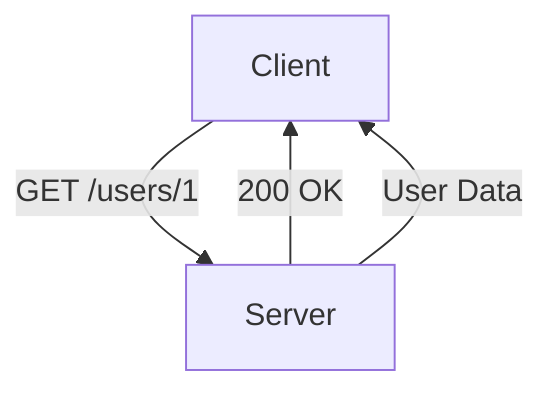
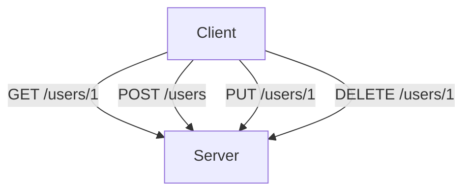

## 13.3.1 Principles of RESTful API Design

As experienced Java developers transitioning to Clojure, understanding the principles of RESTful API design is crucial for building robust, scalable web services. REST (Representational State Transfer) is an architectural style that leverages the stateless nature of HTTP, providing a uniform interface for interacting with resources. In this section, we'll explore the core principles of RESTful API design, including statelessness, resource identification, standard HTTP methods, and the use of appropriate status codes. We'll also provide Clojure code examples to illustrate these concepts and compare them with Java implementations where applicable.

### Understanding REST: A Brief Overview

REST is an architectural style defined by Roy Fielding in his doctoral dissertation. It emphasizes a stateless, client-server communication model, where resources are identified by URIs (Uniform Resource Identifiers). RESTful APIs are designed to be simple, scalable, and easily maintainable, making them a popular choice for web services.

#### Key Principles of REST

1. **Statelessness**: Each request from a client to a server must contain all the information needed to understand and process the request. The server does not store any client context between requests, which simplifies server design and improves scalability.

2. **Resource Identification**: Resources are identified by URIs. Each resource should have a unique URI, and the URI should be descriptive of the resource it represents.

3. **Uniform Interface**: RESTful APIs provide a uniform interface for interacting with resources, typically using standard HTTP methods such as GET, POST, PUT, DELETE, etc.

4. **Representation**: Resources can have multiple representations, such as JSON, XML, or HTML. The client specifies the desired representation using the `Accept` header.

5. **Stateless Communication**: Communication between client and server is stateless, meaning each request from the client must contain all the information needed to understand and process the request.

6. **Cacheability**: Responses from the server should be cacheable to improve performance and reduce server load.

7. **Layered System**: REST allows for a layered system architecture, where intermediaries such as proxies and gateways can be used to improve scalability and performance.

8. **Code on Demand (Optional)**: Servers can extend client functionality by transferring executable code, such as JavaScript.

### Statelessness in REST

Statelessness is a fundamental principle of REST that simplifies server design and improves scalability. In a stateless system, each request from a client to a server must contain all the information needed to understand and process the request. This means that the server does not store any client context between requests.

#### Statelessness in Clojure

In Clojure, we can leverage immutable data structures and functional programming paradigms to build stateless services. Let's look at a simple example of a stateless Clojure function that processes an HTTP request:

```clojure
(ns myapp.api
  (:require [ring.util.response :refer [response]]))

(defn process-request [request]
  ;; Extract necessary information from the request
  (let [user-id (get-in request [:params :user-id])]
    ;; Process the request and return a response
    (response {:message (str "Hello, user " user-id)})))
```

In this example, the `process-request` function takes an HTTP request as input, extracts the `user-id` parameter, and returns a response. The function does not rely on any external state, making it stateless.

#### Statelessness in Java

In Java, achieving statelessness often involves using frameworks like Spring Boot, which provide abstractions for handling HTTP requests. Here's a similar example in Java:

```java
@RestController
public class ApiController {

    @GetMapping("/hello")
    public ResponseEntity<String> processRequest(@RequestParam String userId) {
        // Process the request and return a response
        return ResponseEntity.ok("Hello, user " + userId);
    }
}
```

In this Java example, the `processRequest` method is a stateless endpoint that processes an HTTP request and returns a response.

### Resource Identification

In REST, resources are identified by URIs. Each resource should have a unique URI, and the URI should be descriptive of the resource it represents. This allows clients to interact with resources using a consistent and predictable interface.

#### Resource Identification in Clojure

In Clojure, we can define routes using libraries like Compojure, which provide a DSL (Domain-Specific Language) for defining routes. Here's an example:

```clojure
(ns myapp.routes
  (:require [compojure.core :refer :all]
            [ring.util.response :refer [response]]))

(defroutes app-routes
  (GET "/users/:id" [id]
    (response {:user-id id})))
```

In this example, we define a route for accessing a user resource by ID. The URI `/users/:id` identifies the user resource, and the `id` parameter is extracted from the URI.

#### Resource Identification in Java

In Java, resource identification is often handled using annotations provided by frameworks like Spring Boot. Here's a similar example:

```java
@RestController
@RequestMapping("/users")
public class UserController {

    @GetMapping("/{id}")
    public ResponseEntity<User> getUser(@PathVariable String id) {
        // Retrieve and return the user resource
        User user = userService.getUserById(id);
        return ResponseEntity.ok(user);
    }
}
```

In this Java example, the `@RequestMapping` and `@GetMapping` annotations define the URI for accessing a user resource by ID.

### Standard HTTP Methods

RESTful APIs use standard HTTP methods to perform operations on resources. The most common methods are:

- **GET**: Retrieve a representation of a resource.
- **POST**: Create a new resource.
- **PUT**: Update an existing resource.
- **DELETE**: Delete a resource.

#### HTTP Methods in Clojure

In Clojure, we can use libraries like Compojure to define routes that handle different HTTP methods. Here's an example:

```clojure
(ns myapp.routes
  (:require [compojure.core :refer :all]
            [ring.util.response :refer [response]]))

(defroutes app-routes
  (GET "/users/:id" [id]
    (response {:user-id id}))
  (POST "/users" [user]
    (response {:message "User created"}))
  (PUT "/users/:id" [id user]
    (response {:message "User updated"}))
  (DELETE "/users/:id" [id]
    (response {:message "User deleted"})))
```

In this example, we define routes for handling GET, POST, PUT, and DELETE requests for a user resource.

#### HTTP Methods in Java

In Java, HTTP methods are often handled using annotations provided by frameworks like Spring Boot. Here's a similar example:

```java
@RestController
@RequestMapping("/users")
public class UserController {

    @GetMapping("/{id}")
    public ResponseEntity<User> getUser(@PathVariable String id) {
        // Retrieve and return the user resource
        User user = userService.getUserById(id);
        return ResponseEntity.ok(user);
    }

    @PostMapping
    public ResponseEntity<String> createUser(@RequestBody User user) {
        // Create a new user resource
        userService.createUser(user);
        return ResponseEntity.status(HttpStatus.CREATED).body("User created");
    }

    @PutMapping("/{id}")
    public ResponseEntity<String> updateUser(@PathVariable String id, @RequestBody User user) {
        // Update the user resource
        userService.updateUser(id, user);
        return ResponseEntity.ok("User updated");
    }

    @DeleteMapping("/{id}")
    public ResponseEntity<String> deleteUser(@PathVariable String id) {
        // Delete the user resource
        userService.deleteUser(id);
        return ResponseEntity.ok("User deleted");
    }
}
```

In this Java example, the `@GetMapping`, `@PostMapping`, `@PutMapping`, and `@DeleteMapping` annotations define the HTTP methods for interacting with a user resource.

### Use of Appropriate Status Codes

RESTful APIs should use appropriate HTTP status codes to indicate the outcome of a request. Common status codes include:

- **200 OK**: The request was successful.
- **201 Created**: A new resource was created.
- **204 No Content**: The request was successful, but there is no content to return.
- **400 Bad Request**: The request was invalid.
- **404 Not Found**: The requested resource was not found.
- **500 Internal Server Error**: An error occurred on the server.

#### Status Codes in Clojure

In Clojure, we can use libraries like Ring to set the status code of a response. Here's an example:

```clojure
(ns myapp.api
  (:require [ring.util.response :refer [response status]]))

(defn create-user [request]
  ;; Create a new user resource
  (status (response {:message "User created"}) 201))
```

In this example, the `status` function is used to set the status code of the response to `201 Created`.

#### Status Codes in Java

In Java, status codes are often set using the `ResponseEntity` class provided by frameworks like Spring Boot. Here's a similar example:

```java
@PostMapping
public ResponseEntity<String> createUser(@RequestBody User user) {
    // Create a new user resource
    userService.createUser(user);
    return ResponseEntity.status(HttpStatus.CREATED).body("User created");
}
```

In this Java example, the `ResponseEntity.status` method is used to set the status code of the response to `201 Created`.

### Designing Clean, Intuitive APIs

Designing clean, intuitive APIs is essential for providing a good developer experience. Here are some best practices for designing RESTful APIs:

1. **Use Consistent Naming Conventions**: Use consistent naming conventions for URIs, parameters, and fields. This makes the API easier to understand and use.

2. **Provide Clear Documentation**: Provide clear, comprehensive documentation for your API. This helps developers understand how to use the API and reduces the learning curve.

3. **Version Your API**: Use versioning to manage changes to your API. This allows you to introduce new features and improvements without breaking existing clients.

4. **Use Hypermedia**: Use hypermedia to provide links to related resources. This allows clients to discover and navigate the API more easily.

5. **Handle Errors Gracefully**: Provide meaningful error messages and use appropriate status codes to indicate errors. This helps developers diagnose and fix issues more easily.

6. **Optimize for Performance**: Use caching, pagination, and other techniques to optimize the performance of your API. This improves the user experience and reduces server load.

### Try It Yourself

Now that we've explored the principles of RESTful API design, let's apply these concepts in practice. Try modifying the Clojure code examples to add new routes or change the response format. Experiment with different HTTP methods and status codes to see how they affect the behavior of the API.

### Diagrams and Visualizations

To enhance your understanding of RESTful API design, let's look at a few diagrams that illustrate key concepts.

#### Resource Identification Diagram



*Diagram 1: This diagram illustrates the process of resource identification in a RESTful API. The client sends a GET request to the server to retrieve a user resource identified by the URI `/users/1`.*

#### HTTP Methods Diagram



*Diagram 2: This diagram shows the use of standard HTTP methods in a RESTful API. The client can perform GET, POST, PUT, and DELETE operations on the user resource.*

### Further Reading

For more information on RESTful API design, consider exploring the following resources:

- [RESTful Web Services by Leonard Richardson and Sam Ruby](https://www.oreilly.com/library/view/restful-web-services/9780596529260/)
- [REST API Tutorial](https://restfulapi.net/)
- [Clojure Web Development with Ring](https://github.com/ring-clojure/ring)

### Exercises

1. **Create a New Resource**: Modify the Clojure code examples to add a new resource, such as a `product` resource. Define routes for handling GET, POST, PUT, and DELETE requests for the new resource.

2. **Implement Error Handling**: Add error handling to the Clojure code examples. Use appropriate status codes and error messages to indicate errors.

3. **Optimize for Performance**: Implement caching and pagination in the Clojure code examples to optimize the performance of the API.

### Key Takeaways

- RESTful APIs are designed to be simple, scalable, and easily maintainable.
- Statelessness is a fundamental principle of REST that simplifies server design and improves scalability.
- Resources are identified by URIs, and standard HTTP methods are used to perform operations on resources.
- Appropriate status codes should be used to indicate the outcome of a request.
- Designing clean, intuitive APIs is essential for providing a good developer experience.

Now that we've explored the principles of RESTful API design, let's apply these concepts to build robust, scalable web services in Clojure.

## Quiz: Test Your Knowledge on RESTful API Design Principles



### Which of the following is a key principle of RESTful API design?

- [x] Statelessness
- [ ] Stateful communication
- [ ] Client-side caching
- [ ] Synchronous processing

> **Explanation:** Statelessness is a key principle of RESTful API design, meaning each request must contain all the information needed to process it.

### What does URI stand for in the context of RESTful APIs?

- [x] Uniform Resource Identifier
- [ ] Universal Resource Identifier
- [ ] Unified Resource Interface
- [ ] Uniform Resource Interface

> **Explanation:** URI stands for Uniform Resource Identifier, which is used to identify resources in RESTful APIs.

### Which HTTP method is typically used to create a new resource in a RESTful API?

- [ ] GET
- [x] POST
- [ ] PUT
- [ ] DELETE

> **Explanation:** The POST method is typically used to create a new resource in a RESTful API.

### What HTTP status code indicates that a new resource was successfully created?

- [ ] 200 OK
- [x] 201 Created
- [ ] 204 No Content
- [ ] 404 Not Found

> **Explanation:** The 201 Created status code indicates that a new resource was successfully created.

### Which of the following is NOT a standard HTTP method used in RESTful APIs?

- [ ] GET
- [ ] POST
- [ ] PUT
- [x] FETCH

> **Explanation:** FETCH is not a standard HTTP method used in RESTful APIs; the standard methods include GET, POST, PUT, and DELETE.

### What is the purpose of using hypermedia in RESTful APIs?

- [x] To provide links to related resources
- [ ] To cache responses
- [ ] To encrypt data
- [ ] To compress data

> **Explanation:** Hypermedia is used in RESTful APIs to provide links to related resources, allowing clients to discover and navigate the API more easily.

### Which status code indicates that the requested resource was not found?

- [ ] 200 OK
- [ ] 201 Created
- [ ] 204 No Content
- [x] 404 Not Found

> **Explanation:** The 404 Not Found status code indicates that the requested resource was not found.

### What is the benefit of using a layered system architecture in RESTful APIs?

- [x] It improves scalability and performance
- [ ] It simplifies client-side caching
- [ ] It reduces the need for error handling
- [ ] It eliminates the need for authentication

> **Explanation:** A layered system architecture improves scalability and performance by allowing intermediaries such as proxies and gateways to be used.

### Which of the following is an optional constraint in RESTful API design?

- [ ] Statelessness
- [ ] Resource identification
- [ ] Uniform interface
- [x] Code on demand

> **Explanation:** Code on demand is an optional constraint in RESTful API design, allowing servers to extend client functionality by transferring executable code.

### True or False: In a RESTful API, the server stores client context between requests.

- [ ] True
- [x] False

> **Explanation:** False. In a RESTful API, the server does not store client context between requests, adhering to the principle of statelessness.


