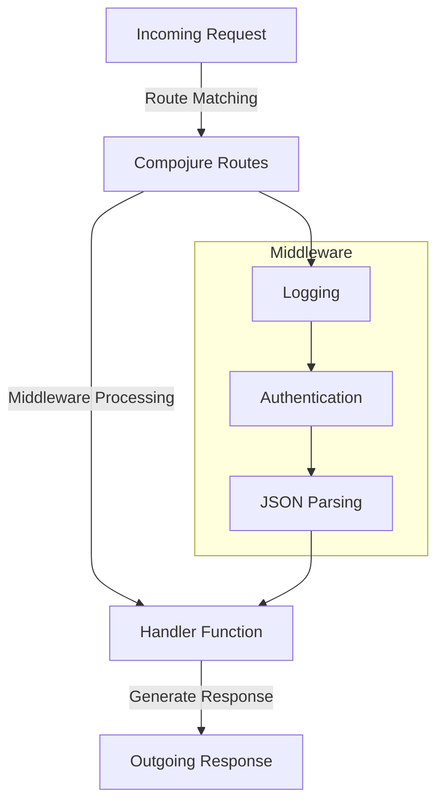

## 13.3.2 Creating API Endpoints with Compojure

As experienced Java developers, you are likely familiar with building RESTful APIs using frameworks like Spring Boot. In Clojure, Compojure is a popular routing library that allows you to define API endpoints in a concise and expressive manner. In this section, we'll explore how to create RESTful API endpoints using Compojure, handle various HTTP methods, and utilize route and query parameters effectively.

### Introduction to Compojure

Compojure is a routing library for Clojure that provides a simple and intuitive way to define routes for web applications. It is built on top of Ring, a Clojure web application library that provides a common interface for handling HTTP requests and responses. Compojure allows you to define routes using a DSL (Domain-Specific Language) that is both expressive and concise.

#### Key Concepts

- **Routes**: Define the paths and HTTP methods that your application will respond to.
- **Handlers**: Functions that process incoming requests and generate responses.
- **Middleware**: Functions that wrap handlers to add additional functionality, such as logging or authentication.

### Setting Up a Basic Compojure Application

Before we dive into creating API endpoints, let's set up a basic Compojure application. We'll start by creating a new Clojure project using Leiningen, a popular build tool for Clojure.

```bash
lein new compojure-api-example
```

Navigate to the project directory and add Compojure and Ring dependencies to your `project.clj` file:

```clojure
(defproject compojure-api-example "0.1.0-SNAPSHOT"
  :dependencies [[org.clojure/clojure "1.10.3"]
                 [compojure "1.6.2"]
                 [ring/ring-core "1.9.3"]
                 [ring/ring-jetty-adapter "1.9.3"]])
```

Now, let's create a basic Compojure application. Open `src/compojure_api_example/core.clj` and add the following code:

```clojure
(ns compojure-api-example.core
  (:require [compojure.core :refer :all]
            [compojure.route :as route]
            [ring.adapter.jetty :refer [run-jetty]]))

(defroutes app-routes
  (GET "/" [] "Welcome to Compojure!")
  (route/not-found "Page not found"))

(defn -main []
  (run-jetty app-routes {:port 3000}))
```

This code defines a simple Compojure application with a single route that responds to GET requests at the root path (`/`). The `run-jetty` function starts a Jetty server on port 3000.

### Handling HTTP Methods

In RESTful APIs, different HTTP methods are used to perform various operations on resources. Compojure provides a straightforward way to handle these methods.

#### GET Method

The GET method is used to retrieve resources. Let's define a route that responds to GET requests and returns a list of items.

```clojure
(GET "/items" []
  {:status 200
   :headers {"Content-Type" "application/json"}
   :body (json/write-str [{:id 1 :name "Item 1"} {:id 2 :name "Item 2"}])})
```

#### POST Method

The POST method is used to create new resources. We'll define a route that accepts JSON data and creates a new item.

```clojure
(POST "/items" {body :body}
  (let [item (json/read-str (slurp body) :key-fn keyword)]
    {:status 201
     :headers {"Content-Type" "application/json"}
     :body (json/write-str (assoc item :id (rand-int 1000)))}))
```

#### PUT Method

The PUT method is used to update existing resources. Here's how you can define a route to update an item.

```clojure
(PUT "/items/:id" [id :as {body :body}]
  (let [updated-item (json/read-str (slurp body) :key-fn keyword)]
    {:status 200
     :headers {"Content-Type" "application/json"}
     :body (json/write-str (assoc updated-item :id id))}))
```

#### DELETE Method

The DELETE method is used to remove resources. Define a route to delete an item by its ID.

```clojure
(DELETE "/items/:id" [id]
  {:status 204})
```

### Using Route Parameters

Route parameters allow you to capture dynamic parts of the URL. In Compojure, you can define route parameters using a colon (`:`) followed by the parameter name.

```clojure
(GET "/items/:id" [id]
  {:status 200
   :headers {"Content-Type" "application/json"}
   :body (json/write-str {:id id :name (str "Item " id)})})
```

In this example, the `:id` parameter captures the item ID from the URL, which can then be used in the handler function.

### Handling Query Parameters

Query parameters are used to pass additional data in the URL. In Compojure, you can access query parameters using the `:query-params` key in the request map.

```clojure
(GET "/search" {params :query-params}
  (let [query (get params "q")]
    {:status 200
     :headers {"Content-Type" "application/json"}
     :body (json/write-str {:query query :results []})}))
```

### Integrating with Middleware

Middleware functions wrap handlers to provide additional functionality, such as logging, authentication, or error handling. Let's add a simple logging middleware to our application.

```clojure
(defn wrap-logging [handler]
  (fn [request]
    (println "Request:" request)
    (handler request)))

(def app
  (-> app-routes
      wrap-logging))
```

### Complete Example

Here's a complete example of a Compojure application with multiple routes and middleware integration.

```clojure
(ns compojure-api-example.core
  (:require [compojure.core :refer :all]
            [compojure.route :as route]
            [ring.adapter.jetty :refer [run-jetty]]
            [ring.middleware.json :refer [wrap-json-body wrap-json-response]]
            [clojure.data.json :as json]))

(defn wrap-logging [handler]
  (fn [request]
    (println "Request:" request)
    (handler request)))

(defroutes app-routes
  (GET "/" [] "Welcome to Compojure!")
  (GET "/items" []
    {:status 200
     :headers {"Content-Type" "application/json"}
     :body (json/write-str [{:id 1 :name "Item 1"} {:id 2 :name "Item 2"}])})
  (POST "/items" {body :body}
    (let [item (json/read-str (slurp body) :key-fn keyword)]
      {:status 201
       :headers {"Content-Type" "application/json"}
       :body (json/write-str (assoc item :id (rand-int 1000)))}))
  (PUT "/items/:id" [id :as {body :body}]
    (let [updated-item (json/read-str (slurp body) :key-fn keyword)]
      {:status 200
       :headers {"Content-Type" "application/json"}
       :body (json/write-str (assoc updated-item :id id))}))
  (DELETE "/items/:id" [id]
    {:status 204})
  (route/not-found "Page not found"))

(def app
  (-> app-routes
      wrap-logging
      wrap-json-body
      wrap-json-response))

(defn -main []
  (run-jetty app {:port 3000}))
```

### Try It Yourself

Experiment with the following modifications to deepen your understanding:

- Add a new route that handles PATCH requests to partially update an item.
- Implement authentication middleware that checks for a valid API key in the request headers.
- Extend the logging middleware to log the response status and headers.

### Diagram: Compojure Routing Flow

Below is a diagram illustrating the flow of a request through Compojure routes and middleware.



*Diagram: The flow of a request through Compojure routes and middleware layers.*

### Key Takeaways

- **Compojure** provides a DSL for defining routes in a concise and expressive manner.
- **HTTP Methods**: Compojure supports handling various HTTP methods like GET, POST, PUT, and DELETE.
- **Route Parameters**: Capture dynamic parts of the URL using route parameters.
- **Query Parameters**: Access additional data passed in the URL using query parameters.
- **Middleware**: Enhance your application with additional functionality using middleware.

### Further Reading

- [Compojure GitHub Repository](https://github.com/weavejester/compojure)
- [Ring GitHub Repository](https://github.com/ring-clojure/ring)
- [Official Clojure Documentation](https://clojure.org/reference/documentation)

### Exercises

1. **Create a new route** that handles PATCH requests to update specific fields of an item.
2. **Implement a middleware** that checks for a valid API key in the request headers and returns a 401 Unauthorized response if the key is missing or invalid.
3. **Extend the logging middleware** to log the response status and headers in addition to the request details.

## Quiz: Mastering Compojure for RESTful API Development



### What is Compojure primarily used for in Clojure web applications?

- [x] Defining routes
- [ ] Handling database operations
- [ ] Managing application state
- [ ] Performing authentication

> **Explanation:** Compojure is a routing library used to define routes in Clojure web applications.

### Which HTTP method is typically used to retrieve resources in a RESTful API?

- [x] GET
- [ ] POST
- [ ] PUT
- [ ] DELETE

> **Explanation:** The GET method is used to retrieve resources in a RESTful API.

### How do you define a route parameter in Compojure?

- [x] Using a colon followed by the parameter name (e.g., `:id`)
- [ ] Using curly braces (e.g., `{id}`)
- [ ] Using square brackets (e.g., `[id]`)
- [ ] Using angle brackets (e.g., `<id>`)

> **Explanation:** Route parameters in Compojure are defined using a colon followed by the parameter name.

### What is the purpose of middleware in a Compojure application?

- [x] To add additional functionality to handlers
- [ ] To define routes
- [ ] To manage database connections
- [ ] To compile Clojure code

> **Explanation:** Middleware functions wrap handlers to provide additional functionality, such as logging or authentication.

### Which library does Compojure build upon to handle HTTP requests and responses?

- [x] Ring
- [ ] Jetty
- [ ] Leiningen
- [ ] ClojureScript

> **Explanation:** Compojure is built on top of Ring, which provides a common interface for handling HTTP requests and responses.

### What is the typical response status code for a successful DELETE operation?

- [x] 204
- [ ] 200
- [ ] 201
- [ ] 404

> **Explanation:** A successful DELETE operation typically returns a 204 No Content status code.

### How can you access query parameters in a Compojure route?

- [x] Using the `:query-params` key in the request map
- [ ] Using the `:params` key in the request map
- [ ] Using the `:headers` key in the request map
- [ ] Using the `:body` key in the request map

> **Explanation:** Query parameters can be accessed using the `:query-params` key in the request map.

### What is the purpose of the `wrap-json-body` middleware?

- [x] To parse JSON request bodies
- [ ] To log request details
- [ ] To handle authentication
- [ ] To manage sessions

> **Explanation:** The `wrap-json-body` middleware is used to parse JSON request bodies.

### Which of the following is NOT a valid HTTP method in a RESTful API?

- [ ] GET
- [ ] POST
- [ ] PUT
- [x] FETCH

> **Explanation:** FETCH is not a valid HTTP method in a RESTful API. The common methods are GET, POST, PUT, and DELETE.

### True or False: Compojure can only be used with the Jetty server.

- [ ] True
- [x] False

> **Explanation:** False. Compojure can be used with any Ring-compatible server, not just Jetty.


