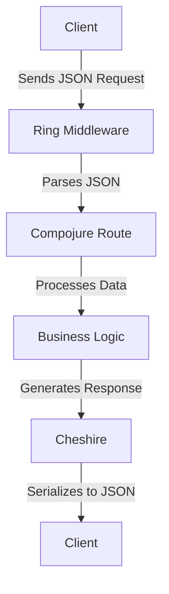

## 13.3.3 Handling JSON Data

In the realm of web development, JSON (JavaScript Object Notation) has become the de facto standard for data interchange. As experienced Java developers transitioning to Clojure, understanding how to handle JSON data efficiently is crucial for building robust web applications. This section will guide you through the process of working with JSON in Clojure, leveraging libraries like `cheshire` for parsing and generating JSON data.

### Understanding JSON in Clojure

JSON is a lightweight data interchange format that's easy for humans to read and write, and easy for machines to parse and generate. In Clojure, JSON handling is typically done using libraries that provide functions for converting between Clojure data structures and JSON strings.

#### JSON and Clojure Data Structures

Clojure's native data structures map naturally to JSON:

- **Maps** in Clojure correspond to JSON objects.
- **Vectors** in Clojure correspond to JSON arrays.
- **Strings, numbers, booleans, and nil** in Clojure map directly to their JSON equivalents.

Here's a simple comparison:

| Clojure Data Structure | JSON Equivalent |
|------------------------|-----------------|
| `{:key "value"}`       | `{"key": "value"}` |
| `[1, 2, 3]`            | `[1, 2, 3]`     |
| `"string"`             | `"string"`      |
| `42`                   | `42`            |
| `true`                 | `true`          |
| `nil`                  | `null`          |

### Introducing Cheshire

One of the most popular libraries for handling JSON in Clojure is `cheshire`. It provides a simple and efficient way to parse JSON strings into Clojure data structures and serialize Clojure data structures into JSON strings.

#### Adding Cheshire to Your Project

To use `cheshire`, you need to add it as a dependency in your `project.clj` file if you're using Leiningen:

```clojure
(defproject my-clojure-app "0.1.0-SNAPSHOT"
  :dependencies [[org.clojure/clojure "1.10.3"]
                 [cheshire "5.10.0"]])
```

For those using `tools.deps`, add it to your `deps.edn`:

```clojure
{:deps {cheshire {:mvn/version "5.10.0"}}}
```

### Parsing JSON in Clojure

Parsing JSON involves converting a JSON string into a Clojure data structure. With `cheshire`, this is straightforward using the `parse-string` function.

#### Example: Parsing JSON

Let's parse a simple JSON string into a Clojure map:

```clojure
(require '[cheshire.core :as json])

(def json-str "{\"name\": \"Alice\", \"age\": 30}")

(def parsed-data (json/parse-string json-str true))
;; The second argument `true` indicates that keys should be converted to keywords

(println parsed-data)
;; Output: {:name "Alice", :age 30}
```

**Explanation:**

- We use `cheshire.core/parse-string` to convert the JSON string into a Clojure map.
- The `true` flag converts JSON keys to Clojure keywords, which is a common practice for idiomatic Clojure code.

### Serializing Clojure Data to JSON

Serialization is the process of converting Clojure data structures into JSON strings. This is essential when sending data from a Clojure application to a client or another service.

#### Example: Serializing Clojure Data

Here's how you can serialize a Clojure map to a JSON string:

```clojure
(def data {:name "Bob", :age 25})

(def json-output (json/generate-string data))

(println json-output)
;; Output: "{\"name\":\"Bob\",\"age\":25}"
```

**Explanation:**

- `cheshire.core/generate-string` is used to convert a Clojure map into a JSON string.
- The resulting JSON string can be sent over HTTP or saved to a file.

### Handling JSON in RESTful APIs

In a RESTful API, JSON is often used for both request and response bodies. Let's explore how to handle JSON data in a Clojure web application using the `ring` and `compojure` libraries.

#### Setting Up a Basic RESTful API

First, ensure you have `ring` and `compojure` in your project dependencies:

```clojure
(defproject my-clojure-api "0.1.0-SNAPSHOT"
  :dependencies [[org.clojure/clojure "1.10.3"]
                 [cheshire "5.10.0"]
                 [ring/ring-core "1.9.0"]
                 [ring/ring-jetty-adapter "1.9.0"]
                 [compojure "1.6.2"]])
```

#### Example: JSON Request Handling

Let's create a simple API endpoint that accepts a JSON request and responds with a JSON object:

```clojure
(require '[ring.adapter.jetty :refer [run-jetty]]
         '[ring.middleware.json :refer [wrap-json-body wrap-json-response]]
         '[compojure.core :refer [defroutes POST]]
         '[compojure.route :as route])

(defroutes app-routes
  (POST "/api/data" request
    (let [body (:body request)]
      {:status 200
       :headers {"Content-Type" "application/json"}
       :body (json/generate-string {:received body})})))

(def app
  (-> app-routes
      (wrap-json-body {:keywords? true})
      wrap-json-response))

(run-jetty app {:port 3000})
```

**Explanation:**

- **Middleware**: We use `wrap-json-body` to automatically parse JSON request bodies into Clojure maps and `wrap-json-response` to serialize response bodies into JSON.
- **Route Definition**: The `POST` route `/api/data` extracts the parsed JSON body and returns it in the response.
- **Server Setup**: We use `run-jetty` to start the server on port 3000.

### Comparing JSON Handling in Java and Clojure

In Java, handling JSON typically involves using libraries like Jackson or Gson. Let's compare a simple JSON parsing example in both Java and Clojure.

#### Java Example: Parsing JSON with Jackson

```java
import com.fasterxml.jackson.databind.ObjectMapper;
import java.util.Map;

public class JsonExample {
    public static void main(String[] args) throws Exception {
        String jsonStr = "{\"name\": \"Alice\", \"age\": 30}";
        ObjectMapper objectMapper = new ObjectMapper();
        Map<String, Object> map = objectMapper.readValue(jsonStr, Map.class);
        System.out.println(map);
    }
}
```

#### Clojure Example: Parsing JSON with Cheshire

```clojure
(require '[cheshire.core :as json])

(def json-str "{\"name\": \"Alice\", \"age\": 30}")

(def parsed-data (json/parse-string json-str true))

(println parsed-data)
;; Output: {:name "Alice", :age 30}
```

**Comparison:**

- **Simplicity**: Clojure's `cheshire` provides a more concise syntax for JSON parsing compared to Java's Jackson.
- **Immutability**: Clojure's data structures are immutable by default, promoting safer concurrent programming.
- **Functional Paradigm**: Clojure embraces a functional approach, making it easier to reason about data transformations.

### Try It Yourself

To deepen your understanding, try modifying the provided examples:

1. **Add New Fields**: Extend the JSON data with additional fields and update the parsing logic.
2. **Nested Structures**: Experiment with nested JSON objects and arrays.
3. **Error Handling**: Implement error handling for invalid JSON inputs.

### Diagram: JSON Data Flow in a Clojure Web Application



**Caption**: This diagram illustrates the flow of JSON data in a Clojure web application, from client request to server response.

### Exercises

1. **Create a JSON API**: Build a simple API that accepts a JSON object with user details and returns a greeting message.
2. **Nested JSON Parsing**: Parse a complex JSON structure with nested objects and arrays, and extract specific values.
3. **Error Handling**: Implement robust error handling for malformed JSON inputs, returning appropriate HTTP status codes.

### Key Takeaways

- **Cheshire** is a powerful library for JSON parsing and serialization in Clojure.
- **Middleware** like `wrap-json-body` and `wrap-json-response` simplifies JSON handling in web applications.
- **Clojure's Functional Paradigm** offers concise and expressive syntax for working with JSON data.
- **Comparison with Java** highlights the benefits of immutability and functional programming in Clojure.

By mastering JSON handling in Clojure, you can build efficient and reliable web applications that seamlessly integrate with modern web technologies. Now that we've explored JSON handling, let's apply these concepts to enhance your Clojure web applications.

For further reading, consider exploring the [Official Clojure Documentation](https://clojure.org/reference/documentation) and [ClojureDocs](https://clojuredocs.org/).

---

## Quiz: Mastering JSON Handling in Clojure



### What is the primary library used for JSON parsing and serialization in Clojure?

- [x] Cheshire
- [ ] Jackson
- [ ] Gson
- [ ] JSON.simple

> **Explanation:** Cheshire is the most popular library for handling JSON in Clojure, providing functions for parsing and generating JSON data.

### How do you convert JSON keys to Clojure keywords using Cheshire?

- [x] By passing `true` as the second argument to `parse-string`
- [ ] By using the `:keywordize-keys` option
- [ ] By calling `keywordize-keys` function
- [ ] By using `json/parse-keyword`

> **Explanation:** Passing `true` as the second argument to `parse-string` converts JSON keys to Clojure keywords.

### Which Clojure data structure corresponds to a JSON object?

- [x] Map
- [ ] Vector
- [ ] List
- [ ] Set

> **Explanation:** In Clojure, maps correspond to JSON objects, where keys are typically keywords.

### What middleware is used to parse JSON request bodies in a Clojure web application?

- [x] wrap-json-body
- [ ] wrap-json-response
- [ ] wrap-params
- [ ] wrap-content-type

> **Explanation:** `wrap-json-body` is used to parse JSON request bodies into Clojure data structures.

### What is the output of `(json/generate-string {:name "Bob", :age 25})`?

- [x] "{\"name\":\"Bob\",\"age\":25}"
- [ ] "{name: Bob, age: 25}"
- [ ] "{'name': 'Bob', 'age': 25}"
- [ ] "{\"name\": Bob, \"age\": 25}"

> **Explanation:** `json/generate-string` converts a Clojure map into a JSON string with keys and values as strings.

### Which of the following is NOT a JSON data type?

- [x] Symbol
- [ ] String
- [ ] Number
- [ ] Boolean

> **Explanation:** JSON does not have a symbol data type; it supports strings, numbers, booleans, arrays, and objects.

### How can you handle errors when parsing JSON in Clojure?

- [x] Use try-catch blocks around `parse-string`
- [ ] Use `json/parse-safe`
- [ ] Use `json/parse-with-errors`
- [ ] Use `json/parse-exception`

> **Explanation:** You can handle errors by wrapping `parse-string` in a try-catch block to catch exceptions.

### What is the purpose of `wrap-json-response` middleware?

- [x] To serialize response bodies into JSON
- [ ] To parse JSON request bodies
- [ ] To handle URL parameters
- [ ] To set content type headers

> **Explanation:** `wrap-json-response` is used to serialize Clojure data structures into JSON for HTTP responses.

### Which Java library is commonly used for JSON handling, similar to Cheshire in Clojure?

- [x] Jackson
- [ ] Gson
- [ ] JSON.simple
- [ ] org.json

> **Explanation:** Jackson is a popular Java library for JSON parsing and serialization, similar to Cheshire in Clojure.

### True or False: Clojure's data structures are mutable by default.

- [ ] True
- [x] False

> **Explanation:** Clojure's data structures are immutable by default, promoting safer concurrent programming.


