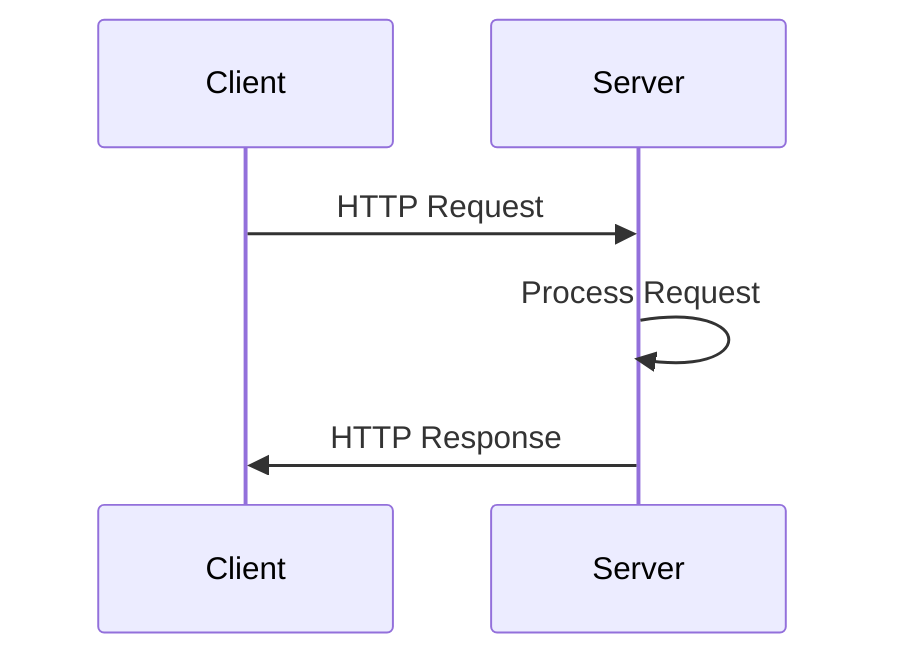

## 13.4.1 The Ring Request and Response Model

As experienced Java developers, you're likely familiar with handling HTTP requests and responses using frameworks like Spring or Java EE. In Clojure, the Ring library provides a similar foundation for web applications, but with a functional twist. This section will guide you through understanding the Ring request and response model, which is central to web development in Clojure.

### Introduction to Ring

Ring is a Clojure web application library that abstracts HTTP requests and responses into simple Clojure maps. This design aligns with Clojure's functional programming paradigm, allowing developers to handle web interactions in a more declarative and immutable manner.

#### Why Use Ring?

- **Simplicity**: Ring abstracts the complexities of HTTP into simple data structures.
- **Flexibility**: It allows for easy composition of middleware and handlers.
- **Compatibility**: Ring is the foundation for many Clojure web frameworks, such as Compojure and Luminus.

### The Ring Request Map

In Ring, an HTTP request is represented as a Clojure map. This map contains several keys that provide information about the incoming request. Let's explore these keys:

#### Key Components of the Request Map

1. **`:uri`**: The URI of the request.
2. **`:request-method`**: The HTTP method (e.g., `:get`, `:post`).
3. **`:headers`**: A map of HTTP headers.
4. **`:params`**: A map of query and form parameters.
5. **`:query-string`**: The query string from the URL.
6. **`:body`**: The request body, typically an InputStream.
7. **`:server-name`**: The server's hostname.
8. **`:server-port`**: The port on which the server is running.
9. **`:remote-addr`**: The IP address of the client.

#### Example Request Map

Here's a simple example of what a Ring request map might look like:

```clojure
{
  :uri "/api/data"
  :request-method :get
  :headers {"accept" "application/json"}
  :params {"id" "123"}
  :query-string "id=123"
  :body nil
  :server-name "localhost"
  :server-port 8080
  :remote-addr "127.0.0.1"
}
```

#### Accessing Request Data

Accessing data from the request map is straightforward. You can use Clojure's map functions to retrieve values:

```clojure
(defn handle-request [request]
  (let [uri (:uri request)
        method (:request-method request)
        params (:params request)]
    (println "Request URI:" uri)
    (println "HTTP Method:" method)
    (println "Parameters:" params)))
```

### The Ring Response Map

Just as requests are represented as maps, so are responses. A Ring response map contains keys that define the HTTP response sent back to the client.

#### Key Components of the Response Map

1. **`:status`**: The HTTP status code (e.g., 200, 404).
2. **`:headers`**: A map of response headers.
3. **`:body`**: The response body, which can be a string, a byte array, or an InputStream.

#### Example Response Map

Here's an example of a simple Ring response map:

```clojure
{
  :status 200
  :headers {"Content-Type" "application/json"}
  :body "{\"message\": \"Hello, World!\"}"
}
```

#### Constructing a Response

Creating a response in Ring is as simple as returning a map. Here's a basic example:

```clojure
(defn create-response []
  {:status 200
   :headers {"Content-Type" "text/plain"}
   :body "Hello, World!"})
```

### Handling Requests and Responses

In a typical Ring application, you define handlers that process requests and return responses. A handler is simply a function that takes a request map and returns a response map.

#### Example Handler Function

```clojure
(defn my-handler [request]
  (let [name (get-in request [:params "name"] "Guest")]
    {:status 200
     :headers {"Content-Type" "text/plain"}
     :body (str "Hello, " name "!")}))
```

In this example, the handler retrieves a `name` parameter from the request and constructs a personalized greeting.

### Middleware in Ring

Middleware functions wrap handlers to add additional functionality, such as logging, authentication, or content negotiation. Middleware is a powerful concept in Ring, allowing for modular and reusable code.

#### Example Middleware

```clojure
(defn wrap-logging [handler]
  (fn [request]
    (println "Received request:" (:uri request))
    (handler request)))

(def app (wrap-logging my-handler))
```

In this example, `wrap-logging` is a middleware function that logs each request's URI before passing it to the handler.

### Comparing with Java

In Java, handling HTTP requests and responses often involves working with complex objects like `HttpServletRequest` and `HttpServletResponse`. Ring simplifies this by using plain Clojure maps, which are easier to manipulate and test.

#### Java Example

```java
protected void doGet(HttpServletRequest request, HttpServletResponse response) throws ServletException, IOException {
    String name = request.getParameter("name");
    if (name == null) {
        name = "Guest";
    }
    response.setContentType("text/plain");
    response.getWriter().write("Hello, " + name + "!");
}
```

#### Clojure Equivalent

```clojure
(defn my-handler [request]
  (let [name (get-in request [:params "name"] "Guest")]
    {:status 200
     :headers {"Content-Type" "text/plain"}
     :body (str "Hello, " name "!")}))
```

### Try It Yourself

To deepen your understanding, try modifying the handler to return a JSON response instead of plain text. You can use the `cheshire` library to encode Clojure data structures as JSON.

```clojure
(require '[cheshire.core :as json])

(defn json-handler [request]
  (let [name (get-in request [:params "name"] "Guest")]
    {:status 200
     :headers {"Content-Type" "application/json"}
     :body (json/generate-string {:message (str "Hello, " name "!")})}))
```

### Visualizing the Request-Response Flow

Below is a sequence diagram illustrating the flow of data in a Ring application:



**Diagram Caption**: This sequence diagram shows the basic flow of an HTTP request and response in a Ring application.

### Exercises

1. **Modify the Handler**: Change the handler to return different status codes based on query parameters.
2. **Add Middleware**: Implement a middleware function that adds a custom header to all responses.
3. **Explore Headers**: Experiment with setting different response headers and observe the effects.

### Key Takeaways

- **Ring uses simple maps** to represent HTTP requests and responses, making it easy to manipulate and test.
- **Handlers are functions** that process requests and return responses.
- **Middleware enhances functionality** by wrapping handlers with additional behavior.
- **Clojure's functional approach** offers a clean and concise way to handle web interactions compared to Java's object-oriented model.

### Further Reading

- [Official Ring Documentation](https://github.com/ring-clojure/ring)
- [ClojureDocs: Ring](https://clojuredocs.org/ring)
- [Cheshire JSON Library](https://github.com/dakrone/cheshire)

By understanding the Ring request and response model, you're well on your way to building robust web applications in Clojure. Let's continue to explore how these concepts can be applied to create dynamic and responsive web services.

## Quiz: Mastering the Ring Request and Response Model



### What is the primary data structure used by Ring to represent HTTP requests and responses?

- [x] Clojure maps
- [ ] Java objects
- [ ] XML documents
- [ ] JSON strings

> **Explanation:** Ring uses Clojure maps to represent both HTTP requests and responses, aligning with Clojure's functional programming paradigm.

### Which key in the Ring request map contains the HTTP method of the request?

- [ ] :uri
- [x] :request-method
- [ ] :headers
- [ ] :params

> **Explanation:** The `:request-method` key in the Ring request map specifies the HTTP method, such as `:get` or `:post`.

### In a Ring response map, what does the `:status` key represent?

- [x] The HTTP status code
- [ ] The response body
- [ ] The request URI
- [ ] The server name

> **Explanation:** The `:status` key in a Ring response map represents the HTTP status code, indicating the result of the request.

### How can you access the query parameters in a Ring request map?

- [ ] Using the :uri key
- [ ] Using the :headers key
- [x] Using the :params key
- [ ] Using the :body key

> **Explanation:** Query parameters are accessed through the `:params` key in the Ring request map.

### What is the purpose of middleware in Ring?

- [x] To add additional functionality to handlers
- [ ] To handle database connections
- [ ] To manage user sessions
- [ ] To render HTML templates

> **Explanation:** Middleware in Ring wraps handlers to add additional functionality, such as logging or authentication.

### Which library can be used to encode Clojure data structures as JSON in a Ring response?

- [ ] Ring
- [ ] Compojure
- [x] Cheshire
- [ ] Luminus

> **Explanation:** The Cheshire library is commonly used to encode Clojure data structures as JSON for Ring responses.

### What is a common use case for the `:headers` key in a Ring response map?

- [x] To specify content type and caching policies
- [ ] To store request parameters
- [ ] To define the server's hostname
- [ ] To log request details

> **Explanation:** The `:headers` key in a Ring response map is used to specify HTTP headers, such as content type and caching policies.

### How does Ring's approach to handling HTTP requests differ from Java's?

- [x] Ring uses immutable maps, while Java uses mutable objects
- [ ] Ring uses XML, while Java uses JSON
- [ ] Ring requires a database, while Java does not
- [ ] Ring is object-oriented, while Java is functional

> **Explanation:** Ring uses immutable Clojure maps to handle HTTP requests, contrasting with Java's use of mutable objects like `HttpServletRequest`.

### What is the role of the `:body` key in a Ring response map?

- [x] To contain the response content
- [ ] To specify the HTTP method
- [ ] To define the request URI
- [ ] To log server errors

> **Explanation:** The `:body` key in a Ring response map contains the content of the HTTP response, such as HTML or JSON.

### True or False: In Ring, a handler is a function that takes a request map and returns a response map.

- [x] True
- [ ] False

> **Explanation:** True. In Ring, a handler is indeed a function that processes a request map and returns a response map.


