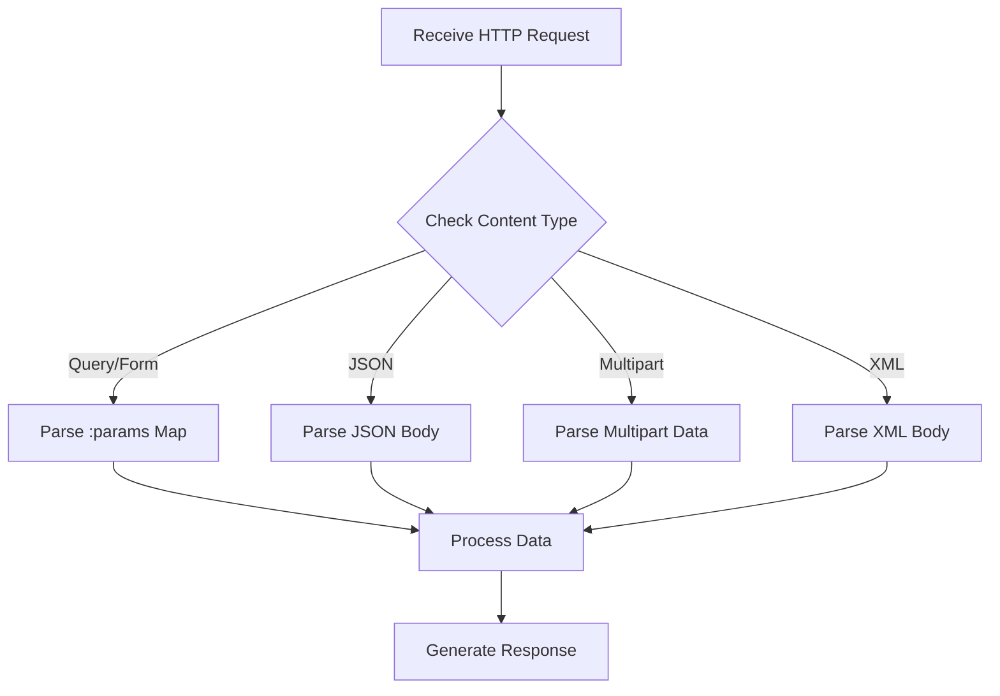

## 13.4.2 Parsing Request Parameters and Body

In web development, handling HTTP requests is a fundamental task. As experienced Java developers transitioning to Clojure, understanding how to parse request parameters and body content is crucial. This section will guide you through accessing query parameters, form data, and multipart file uploads using Clojure's web libraries, primarily Ring and Compojure. We'll also explore handling different content types and parsing request bodies appropriately.

### Understanding the Request Map

In Clojure, the Ring library is the foundation for handling HTTP requests and responses. When a request is received, Ring represents it as a map, which contains various keys such as `:uri`, `:headers`, `:params`, and `:body`. This map-based approach is different from Java's object-oriented model but offers a flexible and immutable way to handle requests.

Here's a simple representation of a Ring request map:

```clojure
{:uri "/example"
 :request-method :get
 :headers {"host" "localhost:3000"}
 :params {:name "Clojure"}
 :body nil}
```

### Accessing Query Parameters

Query parameters are part of the URL and are typically used to pass data to the server. In Clojure, these parameters are accessible through the `:params` key in the request map.

#### Example: Retrieving Query Parameters

Let's consider a simple example where we want to retrieve query parameters from a request:

```clojure
(ns myapp.handler
  (:require [ring.util.response :refer [response]]))

(defn handle-request [request]
  (let [params (:params request)
        name (get params "name")]
    (response (str "Hello, " name "!"))))
```

In this example, we use the `get` function to retrieve the `name` parameter from the `:params` map. This is similar to accessing query parameters in Java using `HttpServletRequest.getParameter()`.

### Handling Form Data

Form data is typically sent using the `application/x-www-form-urlencoded` content type. In Clojure, form data is automatically parsed and included in the `:params` map, just like query parameters.

#### Example: Handling Form Data

Here's how you can handle form data in a Clojure web application:

```clojure
(ns myapp.handler
  (:require [ring.util.response :refer [response]]))

(defn handle-form [request]
  (let [params (:params request)
        username (get params "username")
        password (get params "password")]
    (response (str "Received username: " username " and password: " password))))
```

In this example, the `username` and `password` fields are extracted from the form data using the `:params` map.

### Parsing JSON Request Bodies

When dealing with JSON data, the request body needs to be explicitly parsed. Clojure provides several libraries, such as `cheshire`, to handle JSON parsing.

#### Example: Parsing JSON Request Body

Let's parse a JSON request body in a Clojure web application:

```clojure
(ns myapp.handler
  (:require [ring.util.response :refer [response]]
            [cheshire.core :as json]))

(defn handle-json [request]
  (let [body (slurp (:body request))
        json-data (json/parse-string body true)]
    (response (str "Parsed JSON: " json-data))))
```

In this example, we use `slurp` to read the request body and `cheshire` to parse the JSON string into a Clojure map. This is akin to using libraries like Jackson in Java for JSON parsing.

### Handling Multipart File Uploads

Multipart file uploads are common in web applications. In Clojure, the `ring-multipart-params` middleware can be used to handle multipart form data.

#### Example: Handling File Uploads

Here's an example of handling file uploads in a Clojure web application:

```clojure
(ns myapp.handler
  (:require [ring.util.response :refer [response]]
            [ring.middleware.multipart-params :refer [wrap-multipart-params]]))

(defn handle-upload [request]
  (let [params (:params request)
        file (get params "file")]
    (response (str "Uploaded file: " (:filename file)))))

(def app
  (wrap-multipart-params handle-upload))
```

In this example, the `wrap-multipart-params` middleware is used to parse multipart form data. The uploaded file is accessed from the `:params` map, and its filename is retrieved.

### Comparing with Java

In Java, handling HTTP requests involves using `HttpServletRequest` to access parameters and body content. Clojure's approach, using a map to represent requests, offers a more functional and flexible way to handle data.

#### Java Example: Handling Request Parameters

```java
import javax.servlet.http.HttpServletRequest;

public class MyServlet extends HttpServlet {
    protected void doGet(HttpServletRequest request, HttpServletResponse response) {
        String name = request.getParameter("name");
        response.getWriter().write("Hello, " + name + "!");
    }
}
```

In this Java example, we use `getParameter` to retrieve query parameters, similar to accessing the `:params` map in Clojure.

### Handling Different Content Types

Clojure's flexibility allows you to handle various content types, such as XML, CSV, and more. Libraries like `clojure.data.xml` and `clojure.data.csv` can be used to parse these formats.

#### Example: Parsing XML Request Body

```clojure
(ns myapp.handler
  (:require [ring.util.response :refer [response]]
            [clojure.data.xml :as xml]))

(defn handle-xml [request]
  (let [body (slurp (:body request))
        xml-data (xml/parse-str body)]
    (response (str "Parsed XML: " xml-data))))
```

In this example, we use `clojure.data.xml` to parse an XML request body, similar to using libraries like JAXB in Java.

### Try It Yourself

To deepen your understanding, try modifying the code examples to handle additional parameters or different content types. Experiment with different libraries to parse XML or CSV data.

### Diagrams and Visualizations

Below is a flowchart illustrating the process of parsing request parameters and body content in a Clojure web application.



**Diagram Description**: This flowchart shows the decision-making process for parsing different types of request data in a Clojure web application.

### Exercises

1. Modify the JSON parsing example to handle nested JSON objects.
2. Implement a handler that processes CSV data from the request body.
3. Create a middleware that logs all request parameters and body content.

### Key Takeaways

- Clojure's Ring library uses a map-based approach to represent HTTP requests, offering flexibility and immutability.
- Query parameters and form data are accessible through the `:params` map in the request.
- JSON and XML request bodies require explicit parsing using libraries like `cheshire` and `clojure.data.xml`.
- Multipart file uploads can be handled using the `ring-multipart-params` middleware.
- Clojure's functional approach provides a more flexible way to handle HTTP requests compared to Java's object-oriented model.

### Further Reading

- [Ring Documentation](https://github.com/ring-clojure/ring)
- [Cheshire JSON Library](https://github.com/dakrone/cheshire)
- [Clojure Data XML](https://github.com/clojure/data.xml)

Now that we've explored how to parse request parameters and body content in Clojure, let's apply these concepts to build robust web applications. By leveraging Clojure's functional programming paradigm, you can create more maintainable and scalable web services.

## Quiz: Mastering Request Parsing in Clojure



### What is the primary library used in Clojure for handling HTTP requests and responses?

- [x] Ring
- [ ] Cheshire
- [ ] Compojure
- [ ] Reagent

> **Explanation:** Ring is the foundational library in Clojure for handling HTTP requests and responses.

### How are query parameters accessed in a Ring request map?

- [x] Through the `:params` key
- [ ] Through the `:headers` key
- [ ] Through the `:uri` key
- [ ] Through the `:body` key

> **Explanation:** Query parameters are accessed through the `:params` key in the Ring request map.

### Which library is commonly used for parsing JSON in Clojure?

- [x] Cheshire
- [ ] Ring
- [ ] Compojure
- [ ] Reagent

> **Explanation:** Cheshire is a popular library in Clojure for parsing JSON data.

### What middleware is used to handle multipart file uploads in Clojure?

- [x] ring-multipart-params
- [ ] ring-json
- [ ] ring-xml
- [ ] ring-form-params

> **Explanation:** The `ring-multipart-params` middleware is used to handle multipart file uploads in Clojure.

### In Clojure, how is the request body typically read?

- [x] Using `slurp`
- [ ] Using `read-line`
- [ ] Using `get`
- [ ] Using `parse`

> **Explanation:** The request body is typically read using `slurp` in Clojure.

### Which key in the Ring request map contains the HTTP method?

- [x] :request-method
- [ ] :uri
- [ ] :headers
- [ ] :params

> **Explanation:** The `:request-method` key in the Ring request map contains the HTTP method.

### How can XML data be parsed in a Clojure web application?

- [x] Using `clojure.data.xml`
- [ ] Using `cheshire`
- [ ] Using `ring-xml`
- [ ] Using `reagent`

> **Explanation:** XML data can be parsed using the `clojure.data.xml` library in Clojure.

### What is the purpose of the `wrap-multipart-params` middleware?

- [x] To parse multipart form data
- [ ] To parse JSON data
- [ ] To parse XML data
- [ ] To parse query parameters

> **Explanation:** The `wrap-multipart-params` middleware is used to parse multipart form data.

### Which function is used to retrieve a specific parameter from the `:params` map?

- [x] get
- [ ] slurp
- [ ] parse
- [ ] read

> **Explanation:** The `get` function is used to retrieve a specific parameter from the `:params` map.

### Clojure's approach to handling HTTP requests is more flexible than Java's object-oriented model.

- [x] True
- [ ] False

> **Explanation:** Clojure's map-based approach offers more flexibility and immutability compared to Java's object-oriented model.


