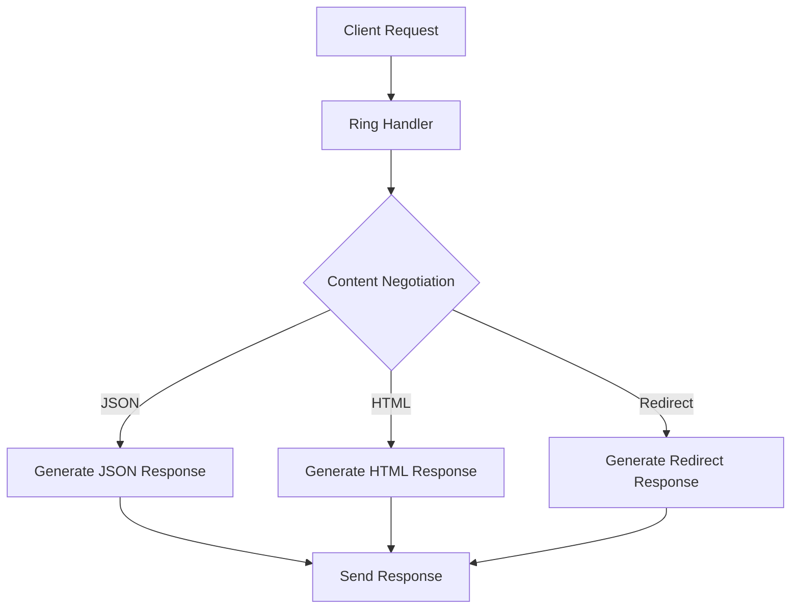

## 13.4.3 Generating Responses

In web development, generating appropriate HTTP responses is crucial for communicating effectively with clients. In this section, we'll explore how to generate various types of responses in Clojure, including HTML, JSON, and redirects. We'll also delve into setting response headers and status codes, and how to return different content types based on the client's `Accept` header.

### Understanding HTTP Responses

An HTTP response is composed of three main parts:

1. **Status Line**: Indicates the status of the request (e.g., 200 OK, 404 Not Found).
2. **Headers**: Provide metadata about the response (e.g., content type, content length).
3. **Body**: Contains the actual content of the response (e.g., HTML, JSON).

In Clojure, the Ring library is commonly used to handle HTTP requests and responses. A Ring response is a simple Clojure map with keys for the status, headers, and body.

```clojure
{:status 200
 :headers {"Content-Type" "text/html"}
 :body "<h1>Hello, World!</h1>"}
```

### Generating HTML Responses

HTML responses are often used for rendering web pages. In Clojure, you can generate HTML responses using libraries like Hiccup, which allows you to write HTML in a Clojure data structure.

#### Example: Generating a Simple HTML Response

```clojure
(require '[hiccup.core :refer [html]])

(defn html-response []
  {:status 200
   :headers {"Content-Type" "text/html"}
   :body (html [:html
                [:head
                 [:title "Welcome"]]
                [:body
                 [:h1 "Hello, World!"]
                 [:p "Welcome to our website."]]])})
```

In this example, we use Hiccup to create an HTML document. The `html` function converts the Clojure data structure into an HTML string.

### Generating JSON Responses

JSON is a popular format for data interchange, especially in RESTful APIs. Clojure provides several libraries for working with JSON, such as Cheshire.

#### Example: Generating a JSON Response

```clojure
(require '[cheshire.core :as json])

(defn json-response []
  {:status 200
   :headers {"Content-Type" "application/json"}
   :body (json/generate-string {:message "Hello, World!" :status "success"})})
```

Here, we use Cheshire to convert a Clojure map into a JSON string. The `generate-string` function serializes the map into JSON format.

### Handling Redirects

Redirects are used to guide the client to a different URL. In HTTP, a redirect is indicated by a status code in the 3xx range, such as 302 Found or 301 Moved Permanently.

#### Example: Generating a Redirect Response

```clojure
(defn redirect-response [url]
  {:status 302
   :headers {"Location" url}
   :body ""})
```

This function creates a redirect response by setting the status to 302 and including a `Location` header with the target URL.

### Setting Response Headers and Status Codes

Headers provide additional information about the response, such as content type, caching policies, and more. Status codes indicate the result of the request.

#### Example: Customizing Headers and Status Codes

```clojure
(defn custom-response []
  {:status 201
   :headers {"Content-Type" "application/json"
             "Cache-Control" "no-cache"}
   :body (json/generate-string {:message "Resource created"})})
```

In this example, we set a custom status code (201 Created) and add a `Cache-Control` header to prevent caching.

### Content Negotiation with the `Accept` Header

Content negotiation allows the server to serve different content types based on the client's `Accept` header. This is useful for APIs that support multiple formats, such as JSON and XML.

#### Example: Handling Content Negotiation

```clojure
(defn negotiate-response [accept-header]
  (cond
    (clojure.string/includes? accept-header "application/json")
    {:status 200
     :headers {"Content-Type" "application/json"}
     :body (json/generate-string {:message "Hello, JSON!"})}

    (clojure.string/includes? accept-header "text/html")
    {:status 200
     :headers {"Content-Type" "text/html"}
     :body "<h1>Hello, HTML!</h1>"}

    :else
    {:status 406
     :headers {"Content-Type" "text/plain"}
     :body "Not Acceptable"}))
```

This function checks the `Accept` header and returns the appropriate response. If the client requests JSON, it returns a JSON response; if HTML is requested, it returns an HTML response. If neither is acceptable, it returns a 406 Not Acceptable status.

### Try It Yourself

Experiment with the examples above by modifying the content types and headers. Try adding new content types or handling additional status codes. For instance, you could add support for XML responses or implement a 404 Not Found response.

### Diagrams and Visual Aids

Below is a diagram illustrating the flow of data through a Clojure web application, from request to response generation.



**Diagram Description**: This flowchart shows how a Clojure web application processes a client request, performs content negotiation, and generates the appropriate response based on the client's `Accept` header.

### Further Reading

For more information on generating responses in Clojure, consider exploring the following resources:

- [Official Clojure Documentation](https://clojure.org/)
- [Ring GitHub Repository](https://github.com/ring-clojure/ring)
- [Cheshire JSON Library](https://github.com/dakrone/cheshire)

### Exercises

1. Modify the `negotiate-response` function to support XML responses using a library of your choice.
2. Implement a function that returns a 404 Not Found response with a custom HTML error page.
3. Create a response that sets multiple cookies in the headers.

### Key Takeaways

- **HTTP Responses**: Understand the components of an HTTP response, including status, headers, and body.
- **HTML and JSON**: Learn how to generate HTML and JSON responses using libraries like Hiccup and Cheshire.
- **Redirects**: Implement redirects using appropriate status codes and headers.
- **Content Negotiation**: Use the `Accept` header to serve different content types based on client preferences.

By mastering these concepts, you'll be well-equipped to handle HTTP responses in your Clojure web applications, providing a robust and flexible user experience.

## Quiz: Mastering HTTP Responses in Clojure



### What is the primary purpose of the `Content-Type` header in an HTTP response?

- [x] To specify the media type of the response body
- [ ] To indicate the status of the response
- [ ] To redirect the client to a different URL
- [ ] To set caching policies

> **Explanation:** The `Content-Type` header specifies the media type of the response body, such as `text/html` or `application/json`.

### Which library is commonly used in Clojure to generate JSON responses?

- [x] Cheshire
- [ ] Hiccup
- [ ] Ring
- [ ] Compojure

> **Explanation:** Cheshire is a popular library in Clojure for generating and parsing JSON data.

### How do you indicate a redirect in an HTTP response?

- [x] By setting the status code to 302 and including a `Location` header
- [ ] By setting the status code to 404
- [ ] By setting the `Content-Type` to `text/html`
- [ ] By including a `Cache-Control` header

> **Explanation:** A redirect is indicated by a 302 status code and a `Location` header specifying the target URL.

### What does the `Accept` header in an HTTP request specify?

- [x] The media types that the client can process
- [ ] The status of the previous request
- [ ] The client's preferred language
- [ ] The client's IP address

> **Explanation:** The `Accept` header specifies the media types that the client can process, allowing for content negotiation.

### Which function is used in Cheshire to convert a Clojure map to a JSON string?

- [x] `generate-string`
- [ ] `parse-string`
- [ ] `html`
- [ ] `redirect`

> **Explanation:** The `generate-string` function in Cheshire is used to serialize a Clojure map into a JSON string.

### What status code is typically used to indicate a successful HTTP response?

- [x] 200
- [ ] 404
- [ ] 500
- [ ] 302

> **Explanation:** A 200 status code indicates a successful HTTP response.

### In Clojure, which library is used to write HTML in a Clojure data structure?

- [x] Hiccup
- [ ] Cheshire
- [ ] Ring
- [ ] Compojure

> **Explanation:** Hiccup is a Clojure library that allows you to write HTML using Clojure data structures.

### What status code indicates that the requested resource was not found?

- [x] 404
- [ ] 200
- [ ] 302
- [ ] 500

> **Explanation:** A 404 status code indicates that the requested resource was not found.

### Which header is used to prevent caching in an HTTP response?

- [x] `Cache-Control`
- [ ] `Content-Type`
- [ ] `Location`
- [ ] `Accept`

> **Explanation:** The `Cache-Control` header is used to specify caching policies, including preventing caching.

### True or False: The `Location` header is used to specify the media type of the response body.

- [ ] True
- [x] False

> **Explanation:** The `Location` header is used in redirects to specify the target URL, not the media type of the response body.


