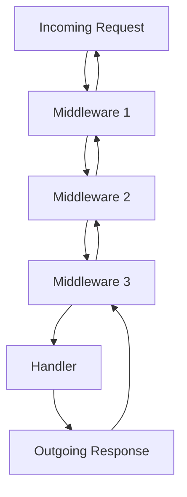
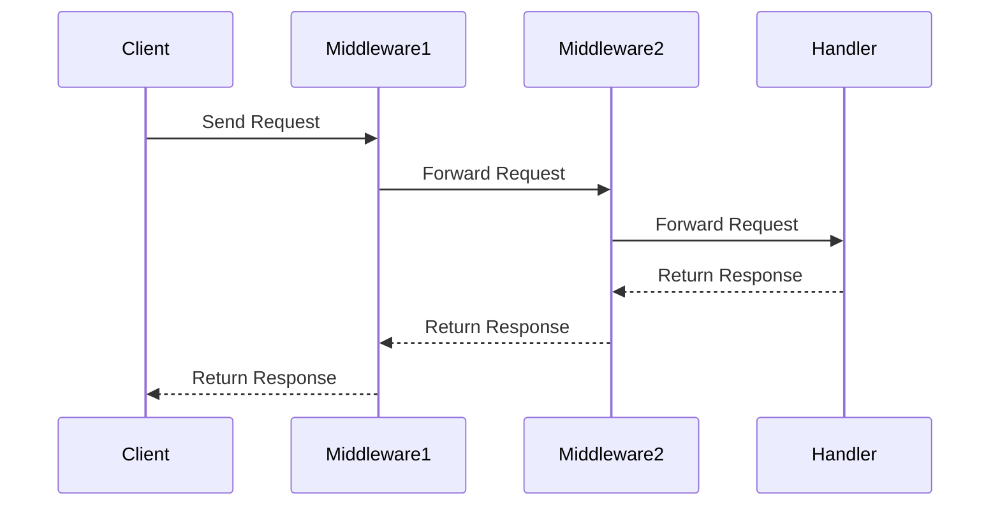

## 13.5.1 Understanding Middleware Concepts

Middleware is a fundamental concept in web development, particularly in the Clojure ecosystem, where it plays a crucial role in handling HTTP requests and responses. In this section, we will delve into what middleware is, how it functions within the Ring framework, and how it can be used to enhance the functionality of web applications. We will also draw parallels to Java's servlet filters to help Java developers transition smoothly into Clojure's web development paradigm.

### What is Middleware?

In the context of web development, **middleware** refers to functions that sit between the incoming HTTP request and the final request handler. Middleware can modify the request before it reaches the handler, alter the response before it is sent back to the client, or perform side effects such as logging or authentication.

#### Middleware in Ring

**Ring** is a Clojure web application library that provides a simple and flexible way to handle HTTP requests. It is inspired by Ruby's Rack and Python's WSGI. In Ring, middleware is used to wrap handlers, allowing developers to add cross-cutting concerns like logging, authentication, and error handling in a modular fashion.

### The Middleware Chain

The **middleware chain** is a sequence of middleware functions that wrap around a core handler. Each middleware function takes a handler as an argument and returns a new handler. This new handler can modify the request, the response, or both.

Here's a simple diagram to illustrate the middleware chain:



**Diagram Explanation**: The diagram shows how an incoming request passes through a series of middleware functions before reaching the handler. The response then travels back through the middleware in reverse order.

### Middleware Functions in Clojure

In Clojure, a middleware function is a higher-order function that takes a handler and returns a new handler. This new handler can perform operations on the request and response.

#### Example Middleware Function

Let's look at a simple example of a middleware function that logs requests:

```clojure
(defn wrap-log-request [handler]
  (fn [request]
    (println "Request received:" request)
    (handler request)))
```

**Code Explanation**: 
- `wrap-log-request` is a middleware function that takes a `handler`.
- It returns a new function that logs the request and then calls the original handler with the request.

### Using Middleware in a Ring Application

To use middleware in a Ring application, you wrap your handler with the middleware functions. Here's an example:

```clojure
(require '[ring.adapter.jetty :refer [run-jetty]])
(require '[ring.util.response :refer [response]])

(defn my-handler [request]
  (response "Hello, World!"))

(def app
  (-> my-handler
      wrap-log-request))

(run-jetty app {:port 3000})
```

**Code Explanation**:
- `my-handler` is a simple handler that returns a "Hello, World!" response.
- `app` is the handler wrapped with the `wrap-log-request` middleware.
- `run-jetty` starts a Jetty server with the wrapped handler.

### Comparing Middleware to Java Servlet Filters

Java developers might find middleware similar to **servlet filters**. Both concepts allow for pre-processing and post-processing of requests and responses. However, middleware in Clojure is more flexible and composable due to Clojure's functional nature.

#### Java Servlet Filter Example

Here's a simple example of a Java servlet filter:

```java
import javax.servlet.*;
import java.io.IOException;

public class LogFilter implements Filter {
    public void doFilter(ServletRequest request, ServletResponse response, FilterChain chain)
            throws IOException, ServletException {
        System.out.println("Request received: " + request);
        chain.doFilter(request, response);
    }
}
```

**Comparison**:
- Both the Clojure middleware and Java filter log the request.
- Clojure's middleware is more concise and leverages functional programming paradigms.

### Common Middleware Use Cases

Middleware is used for a variety of purposes in web applications. Here are some common use cases:

1. **Logging**: Record incoming requests and outgoing responses.
2. **Authentication**: Verify user credentials before processing the request.
3. **Authorization**: Check if the user has permission to access a resource.
4. **Error Handling**: Catch and handle exceptions, returning appropriate error responses.
5. **Compression**: Compress responses to reduce bandwidth usage.
6. **Session Management**: Handle user sessions and store session data.

### Creating Custom Middleware

Creating custom middleware in Clojure is straightforward. Let's create a middleware that adds a custom header to the response:

```clojure
(defn wrap-custom-header [handler]
  (fn [request]
    (let [response (handler request)]
      (assoc-in response [:headers "X-Custom-Header"] "MyValue"))))
```

**Code Explanation**:
- `wrap-custom-header` takes a handler and returns a new handler.
- It calls the original handler to get the response.
- It adds a custom header to the response using `assoc-in`.

### Middleware Composition

Middleware functions can be composed using the `->` threading macro, which makes it easy to apply multiple middleware functions to a handler.

```clojure
(def app
  (-> my-handler
      wrap-log-request
      wrap-custom-header))
```

**Code Explanation**:
- The `->` macro threads the handler through the middleware functions, applying each one in sequence.

### Try It Yourself

To deepen your understanding, try modifying the middleware examples above:

- Add a middleware that times how long the handler takes to process a request.
- Create a middleware that checks for a specific header in the request and returns a 403 Forbidden response if it's missing.

### Visualizing Middleware Flow

To further illustrate how middleware functions wrap handlers, consider the following sequence diagram:



**Diagram Explanation**: This sequence diagram shows the flow of a request through two middleware functions before reaching the handler, and the flow of the response back through the middleware to the client.

### Best Practices for Middleware

- **Keep Middleware Focused**: Each middleware should have a single responsibility.
- **Order Matters**: The order in which middleware is applied can affect the behavior of your application.
- **Avoid Side Effects**: Middleware should be pure functions when possible, avoiding side effects that can lead to unexpected behavior.

### Exercises

1. **Implement a Middleware Chain**: Create a chain of middleware functions that log requests, check for authentication, and add a custom header.
2. **Refactor Java Filters**: Take a Java servlet filter and refactor it into a Clojure middleware function.
3. **Performance Testing**: Measure the performance impact of adding multiple middleware functions to a handler.

### Key Takeaways

- Middleware in Clojure is a powerful tool for handling cross-cutting concerns in web applications.
- It allows for clean separation of concerns and enhances code modularity.
- Understanding the middleware chain is crucial for effectively managing request and response processing.
- Clojure's functional nature makes middleware more flexible and composable compared to traditional Java servlet filters.

By mastering middleware concepts, you'll be well-equipped to build robust and maintainable web applications in Clojure. Now that we've explored middleware, let's apply these concepts to enhance your Clojure web applications.

### Further Reading

- [Ring Documentation](https://github.com/ring-clojure/ring)
- [ClojureDocs Middleware Examples](https://clojuredocs.org)
- [Official Clojure Documentation](https://clojure.org)

## SEO optimized quiz title



### What is the primary role of middleware in a Clojure web application?

- [x] To modify requests and responses
- [ ] To handle database connections
- [ ] To serve static files
- [ ] To compile Clojure code

> **Explanation:** Middleware functions in Clojure are used to modify requests and responses, adding functionality such as logging, authentication, and error handling.

### How does middleware in Clojure differ from Java servlet filters?

- [x] Middleware is more flexible and composable
- [ ] Middleware is less powerful
- [ ] Middleware cannot modify responses
- [ ] Middleware is only used for logging

> **Explanation:** Middleware in Clojure is more flexible and composable due to Clojure's functional programming paradigm, allowing for cleaner and more modular code.

### What is the purpose of the `->` threading macro in middleware composition?

- [x] To apply multiple middleware functions in sequence
- [ ] To execute middleware functions in parallel
- [ ] To remove middleware functions
- [ ] To handle errors in middleware

> **Explanation:** The `->` threading macro is used to apply multiple middleware functions in sequence, making the code more readable and maintainable.

### Which of the following is a common use case for middleware?

- [x] Authentication
- [ ] Database indexing
- [ ] File compression
- [ ] Code compilation

> **Explanation:** Authentication is a common use case for middleware, as it allows for verifying user credentials before processing requests.

### What does the `wrap-log-request` middleware function do?

- [x] Logs incoming requests
- [ ] Compresses responses
- [ ] Handles database transactions
- [ ] Serves static files

> **Explanation:** The `wrap-log-request` middleware function logs incoming requests, providing insight into the requests being processed by the application.

### In the middleware chain, what happens after a request is processed by the handler?

- [x] The response is passed back through the middleware in reverse order
- [ ] The response is sent directly to the client
- [ ] The request is discarded
- [ ] The handler modifies the middleware

> **Explanation:** After a request is processed by the handler, the response is passed back through the middleware in reverse order, allowing each middleware to modify the response if needed.

### What is a key benefit of using middleware in web applications?

- [x] Separation of concerns
- [ ] Increased code complexity
- [ ] Reduced performance
- [ ] Direct database access

> **Explanation:** Middleware provides separation of concerns, allowing developers to handle cross-cutting concerns like logging and authentication in a modular way.

### How can middleware functions be composed in Clojure?

- [x] Using the `->` threading macro
- [ ] Using the `let` binding
- [ ] Using the `defn` keyword
- [ ] Using the `if` statement

> **Explanation:** Middleware functions can be composed using the `->` threading macro, which threads the handler through each middleware function in sequence.

### What is the main advantage of keeping middleware focused?

- [x] It ensures each middleware has a single responsibility
- [ ] It increases the number of middleware functions
- [ ] It makes middleware harder to debug
- [ ] It reduces code readability

> **Explanation:** Keeping middleware focused ensures that each middleware function has a single responsibility, making the code easier to understand and maintain.

### True or False: Middleware should avoid side effects when possible.

- [x] True
- [ ] False

> **Explanation:** Middleware should avoid side effects when possible to ensure predictable behavior and maintainability of the code.


