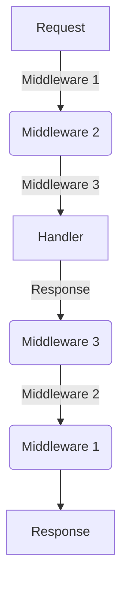

## 13.5.2 Common Middleware Functions

As experienced Java developers transitioning to Clojure, understanding middleware in the context of web development is crucial. Middleware functions in Clojure, particularly within the Ring library, play a significant role in handling HTTP requests and responses. They provide a modular way to add functionality such as session management, cookies handling, URL encoding/decoding, and content-type handling to your web applications.

### Understanding Middleware in Clojure

Middleware in Clojure is akin to filters or interceptors in Java-based web frameworks like Spring or Java EE. They are functions that wrap around your core application logic, allowing you to modify requests and responses or perform actions before or after the main application logic is executed.

In Clojure's Ring library, middleware is typically a higher-order function that takes a handler (the core application logic) and returns a new handler. This new handler can then process requests and responses, adding or modifying headers, managing sessions, or handling cookies.

### Session Management

Session management is a common requirement in web applications, allowing you to maintain state across multiple requests from the same client. In Ring, session management is handled through middleware that reads and writes session data to a client-side cookie or a server-side store.

#### Using Session Middleware

To use session middleware in a Ring application, you can leverage the `wrap-session` function. This middleware function adds session support to your handler, allowing you to store and retrieve session data.

```clojure
(ns myapp.core
  (:require [ring.middleware.session :refer [wrap-session]]
            [ring.adapter.jetty :refer [run-jetty]]))

(defn handler [request]
  (let [session (:session request)
        counter (get session :counter 0)]
    {:status 200
     :headers {"Content-Type" "text/plain"}
     :body (str "You have visited this page " counter " times.")
     :session (assoc session :counter (inc counter))}))

(def app
  (wrap-session handler))

(run-jetty app {:port 3000})
```

In this example, the `wrap-session` middleware is used to manage a simple session counter. Each time the page is visited, the counter is incremented and stored in the session.

### Cookies Handling

Cookies are a fundamental part of web development, used to store small pieces of data on the client side. Ring provides middleware to simplify cookie handling, allowing you to read and write cookies in your application.

#### Using Cookies Middleware

The `wrap-cookies` middleware function in Ring allows you to easily manage cookies. It parses cookies from the request and adds them to the request map, and it can also set cookies in the response.

```clojure
(ns myapp.core
  (:require [ring.middleware.cookies :refer [wrap-cookies]]
            [ring.adapter.jetty :refer [run-jetty]]))

(defn handler [request]
  (let [cookies (:cookies request)
        visits (get-in cookies ["visits" :value] "0")
        new-visits (inc (Integer. visits))]
    {:status 200
     :headers {"Content-Type" "text/plain"}
     :body (str "You have visited this page " new-visits " times.")
     :cookies {"visits" {:value (str new-visits)}}}))

(def app
  (wrap-cookies handler))

(run-jetty app {:port 3000})
```

Here, the `wrap-cookies` middleware is used to track the number of visits using a cookie. The cookie value is incremented with each request and sent back to the client.

### URL Encoding/Decoding

URL encoding and decoding are essential for handling special characters in URLs. Ring provides middleware to automatically encode and decode URL parameters, ensuring that your application can handle complex URLs correctly.

#### Using URL Encoding/Decoding Middleware

The `wrap-params` middleware in Ring handles URL encoding and decoding, parsing query parameters and form data into a map that is added to the request.

```clojure
(ns myapp.core
  (:require [ring.middleware.params :refer [wrap-params]]
            [ring.adapter.jetty :refer [run-jetty]]))

(defn handler [request]
  (let [params (:params request)]
    {:status 200
     :headers {"Content-Type" "text/plain"}
     :body (str "Received parameters: " params)}))

(def app
  (wrap-params handler))

(run-jetty app {:port 3000})
```

In this example, `wrap-params` middleware is used to parse query parameters from the URL, making them easily accessible in the request map.

### Content-Type Handling

Handling content types is crucial for ensuring that your application can process different types of data, such as JSON or XML. Ring provides middleware to automatically set and parse content types based on the request and response.

#### Using Content-Type Middleware

The `wrap-content-type` middleware sets the `Content-Type` header in the response, ensuring that clients know how to interpret the data.

```clojure
(ns myapp.core
  (:require [ring.middleware.content-type :refer [wrap-content-type]]
            [ring.adapter.jetty :refer [run-jetty]]))

(defn handler [request]
  {:status 200
   :body "<h1>Hello, World!</h1>"})

(def app
  (wrap-content-type handler "text/html"))

(run-jetty app {:port 3000})
```

In this example, `wrap-content-type` middleware is used to set the `Content-Type` header to `text/html`, indicating that the response body is HTML.

### Comparing with Java

In Java, similar functionality is often achieved using filters or interceptors. For example, session management in Java might involve using the `HttpSession` interface, while cookies are managed using the `Cookie` class. URL encoding and decoding are typically handled using utility classes like `URLEncoder` and `URLDecoder`.

Clojure's approach with middleware provides a more functional and composable way to handle these concerns, allowing you to easily chain middleware functions together to build complex request handling pipelines.

### Try It Yourself

To deepen your understanding, try modifying the examples above:

- **Session Management**: Add additional session data, such as a user ID or preferences, and display them in the response.
- **Cookies Handling**: Implement a cookie-based login system that tracks whether a user is logged in.
- **URL Encoding/Decoding**: Add form handling to the URL encoding example, allowing users to submit data via a form.
- **Content-Type Handling**: Modify the content-type example to serve JSON data instead of HTML.

### Diagrams and Visualizations

To better understand the flow of data through middleware, consider the following diagram illustrating how middleware functions wrap around the core handler:



**Diagram Description**: This flowchart shows how a request passes through multiple middleware layers before reaching the core handler, and how the response is processed through the middleware in reverse order.

### Further Reading

For more information on middleware in Clojure, consider exploring the following resources:

- [Ring Middleware Documentation](https://github.com/ring-clojure/ring/wiki/Middleware)
- [ClojureDocs Middleware Examples](https://clojuredocs.org/clojure.core/middleware)
- [Official Clojure Documentation](https://clojure.org/)

### Exercises

1. **Implement a Custom Middleware**: Create a middleware function that logs each request's method and URL.
2. **Enhance Session Management**: Add expiration handling to the session management example.
3. **Advanced Cookie Handling**: Implement secure cookies that are only sent over HTTPS.
4. **Complex URL Handling**: Extend the URL encoding example to handle nested parameters.
5. **Dynamic Content-Type Handling**: Modify the content-type middleware to dynamically set the content type based on the request's Accept header.

### Key Takeaways

- **Middleware Functions**: Middleware in Clojure provides a functional way to handle common web application concerns.
- **Session and Cookies**: Easily manage session data and cookies using Ring's middleware functions.
- **URL and Content-Type**: Simplify URL parameter handling and content-type management with dedicated middleware.
- **Functional Composition**: Leverage the power of functional programming to compose middleware functions for complex request handling.

Now that we've explored common middleware functions in Clojure, you're well-equipped to manage HTTP requests and responses effectively in your web applications.

## Quiz: Mastering Middleware Functions in Clojure



### What is the primary purpose of middleware in Clojure's Ring library?

- [x] To modify requests and responses before and after the main application logic
- [ ] To handle database connections
- [ ] To manage user authentication
- [ ] To compile Clojure code to Java bytecode

> **Explanation:** Middleware functions in Ring are used to wrap around the core application logic, allowing modifications to requests and responses.

### Which middleware function is used for session management in Ring?

- [x] `wrap-session`
- [ ] `wrap-cookies`
- [ ] `wrap-params`
- [ ] `wrap-content-type`

> **Explanation:** The `wrap-session` middleware function is specifically designed to handle session management in Ring applications.

### How does the `wrap-cookies` middleware function help in a Clojure web application?

- [x] It parses cookies from the request and allows setting cookies in the response.
- [ ] It encrypts all cookies for security.
- [ ] It automatically deletes expired cookies.
- [ ] It logs all cookie values to the console.

> **Explanation:** `wrap-cookies` middleware parses cookies from incoming requests and allows setting cookies in outgoing responses.

### What is the role of `wrap-params` middleware in Ring?

- [x] To parse query parameters and form data into a map
- [ ] To encrypt URL parameters
- [ ] To validate URL syntax
- [ ] To log URL access times

> **Explanation:** `wrap-params` middleware parses query parameters and form data, making them accessible in the request map.

### Which middleware function is used to set the `Content-Type` header in a response?

- [x] `wrap-content-type`
- [ ] `wrap-session`
- [ ] `wrap-cookies`
- [ ] `wrap-params`

> **Explanation:** The `wrap-content-type` middleware function is used to set the `Content-Type` header in HTTP responses.

### In Java, which class is commonly used for managing cookies?

- [x] `Cookie`
- [ ] `Session`
- [ ] `HttpRequest`
- [ ] `HttpResponse`

> **Explanation:** The `Cookie` class in Java is used to create and manage cookies in web applications.

### What is a key advantage of using middleware in Clojure over traditional Java filters?

- [x] Functional composition allows for more modular and reusable code.
- [ ] Middleware automatically handles all security concerns.
- [ ] Middleware is faster than Java filters.
- [ ] Middleware requires no configuration.

> **Explanation:** Middleware in Clojure benefits from functional composition, making it easier to create modular and reusable code.

### How can you modify the session data in a Ring application?

- [x] By using the `:session` key in the response map
- [ ] By directly modifying the request object
- [ ] By using a global variable
- [ ] By calling a session API

> **Explanation:** Session data can be modified by including the `:session` key in the response map with the updated session data.

### What is the purpose of URL encoding/decoding in web applications?

- [x] To handle special characters in URLs
- [ ] To encrypt URL data
- [ ] To compress URL length
- [ ] To validate URL structure

> **Explanation:** URL encoding/decoding ensures that special characters in URLs are correctly interpreted by the server.

### True or False: Middleware functions in Clojure can only be used for request handling.

- [ ] True
- [x] False

> **Explanation:** Middleware functions in Clojure can be used for both request and response handling, allowing modifications at both stages.


