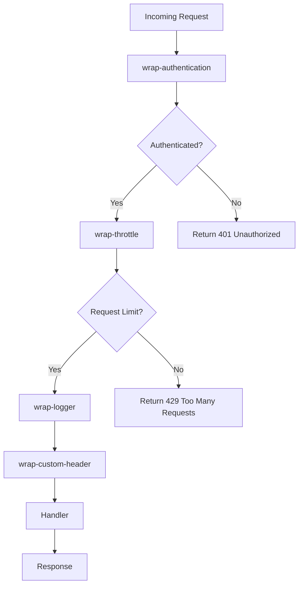

## 13.5.3 Writing Custom Middleware

Middleware in web development acts as a bridge between the HTTP request and the application logic. It is used to handle cross-cutting concerns such as logging, authentication, request throttling, and request/response transformation. In Clojure, middleware is a powerful concept that allows developers to compose web applications in a modular and reusable way. In this section, we will explore how to write custom middleware in Clojure, drawing parallels to Java concepts where applicable.

### Understanding Middleware in Clojure

In Clojure, middleware is a higher-order function that takes a handler function and returns a new handler function. This new handler can modify the request before passing it to the original handler or modify the response before returning it to the client. This concept is similar to Java's servlet filters, which intercept requests and responses to apply cross-cutting concerns.

#### Middleware Structure

A typical middleware function in Clojure looks like this:

```clojure
(defn wrap-example-middleware [handler]
  (fn [request]
    ;; Pre-processing the request
    (let [modified-request (assoc request :example-key "example-value")]
      ;; Call the original handler with the modified request
      (let [response (handler modified-request)]
        ;; Post-processing the response
        (assoc response :example-header "example-value")))))
```

- **Pre-processing**: Modify the incoming request before passing it to the handler.
- **Post-processing**: Modify the response before sending it back to the client.

### Writing Custom Middleware

Let's create a custom middleware that logs requests and responses. This middleware will demonstrate how to intercept and log HTTP requests and responses, a common requirement in web applications.

#### Step 1: Define the Middleware Function

First, we define a middleware function `wrap-logger` that logs the request method and URI, as well as the response status.

```clojure
(defn wrap-logger [handler]
  (fn [request]
    ;; Log the incoming request
    (println "Request:" (:request-method request) (:uri request))
    ;; Call the original handler
    (let [response (handler request)]
      ;; Log the response status
      (println "Response status:" (:status response))
      ;; Return the response
      response)))
```

#### Step 2: Apply the Middleware

To apply the middleware, we wrap it around our handler function. In a Clojure web application, handlers are typically defined using libraries like Ring and Compojure.

```clojure
(require '[ring.adapter.jetty :refer [run-jetty]]
         '[ring.middleware.defaults :refer [wrap-defaults site-defaults]])

(defn handler [request]
  {:status 200
   :headers {"Content-Type" "text/plain"}
   :body "Hello, World!"})

(def app
  (-> handler
      wrap-logger
      (wrap-defaults site-defaults)))

(run-jetty app {:port 3000})
```

In this example, `wrap-logger` is applied to the `handler`, and the resulting application is run on a Jetty server.

### Middleware for Authentication

Authentication is another common use case for middleware. Let's create a simple authentication middleware that checks for a specific header in the request.

#### Step 1: Define the Authentication Middleware

```clojure
(defn wrap-authentication [handler]
  (fn [request]
    (if (= "secret-token" (get-in request [:headers "authorization"]))
      (handler request)
      {:status 401
       :headers {"Content-Type" "text/plain"}
       :body "Unauthorized"})))
```

This middleware checks if the `authorization` header contains the value `"secret-token"`. If it does, the request is passed to the handler; otherwise, a 401 Unauthorized response is returned.

#### Step 2: Apply the Authentication Middleware

```clojure
(def app
  (-> handler
      wrap-authentication
      wrap-logger
      (wrap-defaults site-defaults)))

(run-jetty app {:port 3000})
```

Here, `wrap-authentication` is applied before `wrap-logger`, ensuring that only authenticated requests are logged.

### Request Throttling Middleware

Request throttling is used to limit the number of requests a client can make in a given time period. Let's implement a simple throttling middleware.

#### Step 1: Define the Throttling Middleware

```clojure
(def request-count (atom {}))

(defn wrap-throttle [handler]
  (fn [request]
    (let [client-ip (:remote-addr request)
          current-count (get @request-count client-ip 0)]
      (if (< current-count 10)
        (do
          (swap! request-count update client-ip (fnil inc 0))
          (handler request))
        {:status 429
         :headers {"Content-Type" "text/plain"}
         :body "Too Many Requests"}))))
```

This middleware uses an atom to keep track of the number of requests from each client IP. If the count exceeds 10, a 429 Too Many Requests response is returned.

#### Step 2: Apply the Throttling Middleware

```clojure
(def app
  (-> handler
      wrap-throttle
      wrap-authentication
      wrap-logger
      (wrap-defaults site-defaults)))

(run-jetty app {:port 3000})
```

### Request/Response Transformation Middleware

Sometimes, you may need to transform requests or responses. Let's create middleware that adds a custom header to every response.

#### Step 1: Define the Transformation Middleware

```clojure
(defn wrap-custom-header [handler]
  (fn [request]
    (let [response (handler request)]
      (assoc-in response [:headers "X-Custom-Header"] "CustomValue"))))
```

This middleware adds an `X-Custom-Header` to every response.

#### Step 2: Apply the Transformation Middleware

```clojure
(def app
  (-> handler
      wrap-custom-header
      wrap-throttle
      wrap-authentication
      wrap-logger
      (wrap-defaults site-defaults)))

(run-jetty app {:port 3000})
```

### Try It Yourself

Now that we've explored several examples of custom middleware, try modifying the code to:

- Log additional request details, such as headers or query parameters.
- Implement a more sophisticated authentication mechanism, such as checking a database.
- Enhance the throttling middleware to reset counts after a certain time period.

### Visualizing Middleware Flow

To better understand how middleware functions are composed and executed, let's visualize the flow of data through middleware layers.



**Diagram Description**: This flowchart illustrates the sequence of middleware execution. The request passes through authentication, throttling, logging, and custom header middleware before reaching the handler. Each middleware layer can modify the request or response.

### Key Takeaways

- **Middleware Composition**: Middleware in Clojure is composed by wrapping handler functions, allowing for modular and reusable code.
- **Cross-Cutting Concerns**: Middleware is ideal for handling cross-cutting concerns such as logging, authentication, and request transformation.
- **Functional Approach**: Clojure's functional programming paradigm makes middleware composition intuitive and powerful.
- **Customization**: Custom middleware can be tailored to meet specific application needs, enhancing flexibility and control.

### Exercises

1. **Enhance Logging Middleware**: Modify the `wrap-logger` middleware to log request headers and response times.
2. **Advanced Authentication**: Implement middleware that checks a user's role and restricts access to certain endpoints.
3. **Dynamic Throttling**: Create a throttling middleware that adjusts limits based on user roles or IP addresses.
4. **Response Compression**: Write middleware that compresses responses for clients that support it.

### Further Reading

- [Official Clojure Documentation](https://clojure.org/reference/documentation)
- [Ring Middleware Documentation](https://github.com/ring-clojure/ring/wiki)
- [Compojure Documentation](https://github.com/weavejester/compojure)

By mastering custom middleware in Clojure, you can build robust web applications that efficiently handle cross-cutting concerns. Now, let's apply these concepts to create more sophisticated and responsive web applications.

## Quiz: Mastering Custom Middleware in Clojure



### What is the primary purpose of middleware in Clojure web applications?

- [x] To handle cross-cutting concerns like logging and authentication
- [ ] To directly modify the database schema
- [ ] To replace the main application logic
- [ ] To manage user sessions exclusively

> **Explanation:** Middleware is used to handle cross-cutting concerns such as logging, authentication, and request transformation, without altering the core application logic.

### How does middleware in Clojure differ from Java's servlet filters?

- [x] Middleware is a higher-order function that wraps handlers
- [ ] Middleware directly modifies the HTTP protocol
- [ ] Middleware is used only for error handling
- [ ] Middleware is built into the Java language

> **Explanation:** Middleware in Clojure is a higher-order function that wraps handlers, allowing for modular composition, whereas Java's servlet filters are part of the servlet API.

### In the provided `wrap-logger` middleware, what does the middleware log?

- [x] The request method and URI, and the response status
- [ ] The database queries executed
- [ ] The user's session data
- [ ] The server's CPU usage

> **Explanation:** The `wrap-logger` middleware logs the request method and URI, and the response status, providing insight into the request/response cycle.

### What response does the `wrap-authentication` middleware return if the authorization header is incorrect?

- [x] 401 Unauthorized
- [ ] 200 OK
- [ ] 404 Not Found
- [ ] 500 Internal Server Error

> **Explanation:** If the authorization header is incorrect, the `wrap-authentication` middleware returns a 401 Unauthorized response.

### Which Clojure construct is used to keep track of request counts in the `wrap-throttle` middleware?

- [x] Atom
- [ ] Ref
- [ ] Var
- [ ] Agent

> **Explanation:** An atom is used to keep track of request counts in the `wrap-throttle` middleware, allowing for safe concurrent updates.

### What is the purpose of the `wrap-custom-header` middleware?

- [x] To add a custom header to every response
- [ ] To modify the request body
- [ ] To log the server's memory usage
- [ ] To authenticate users

> **Explanation:** The `wrap-custom-header` middleware adds a custom header to every response, demonstrating response transformation.

### How can you apply multiple middleware functions to a handler in Clojure?

- [x] By using the `->` threading macro
- [ ] By nesting function calls
- [ ] By using a for loop
- [ ] By defining a new handler class

> **Explanation:** The `->` threading macro is used to apply multiple middleware functions to a handler in a readable and concise manner.

### What does the `wrap-throttle` middleware return if the request limit is exceeded?

- [x] 429 Too Many Requests
- [ ] 200 OK
- [ ] 403 Forbidden
- [ ] 500 Internal Server Error

> **Explanation:** If the request limit is exceeded, the `wrap-throttle` middleware returns a 429 Too Many Requests response.

### What is a common use case for custom middleware in web applications?

- [x] Logging request and response details
- [ ] Compiling Java bytecode
- [ ] Rendering HTML templates
- [ ] Managing database transactions

> **Explanation:** A common use case for custom middleware is logging request and response details, which helps in monitoring and debugging applications.

### True or False: Middleware can only modify the request, not the response.

- [ ] True
- [x] False

> **Explanation:** Middleware can modify both the request and the response, allowing for comprehensive handling of cross-cutting concerns.


