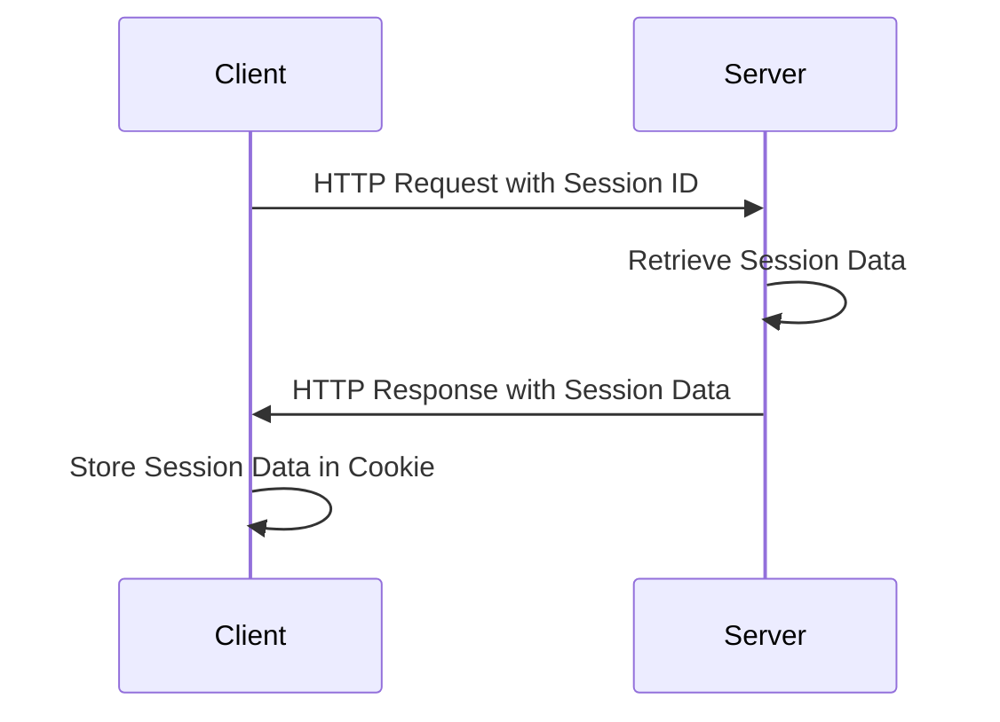

## 13.6.1 Managing Sessions

In web development, managing user sessions is crucial for maintaining state across multiple requests. This is especially important for applications that require user authentication and personalized experiences. In this section, we'll explore how to manage sessions in a Clojure web application using Ring's session middleware. We'll discuss different session stores, such as in-memory, cookies, and database-backed solutions, and provide practical examples to illustrate these concepts.

### Understanding Sessions in Web Applications

A session is a way to persist user data across multiple requests. In a typical web application, a session might store information such as user authentication status, preferences, or shopping cart contents. Sessions are usually identified by a unique session ID, which is sent to the client and returned with each request.

In Java-based web applications, sessions are often managed using the `HttpSession` interface. In Clojure, we use the Ring library, which provides middleware for session management.

### Ring's Session Middleware

Ring is a Clojure web application library that provides a simple and flexible way to handle HTTP requests and responses. One of its features is session middleware, which allows you to manage session data easily.

#### Setting Up Ring's Session Middleware

To use Ring's session middleware, you need to include the Ring library in your project. If you're using Leiningen, add the following dependency to your `project.clj` file:

```clojure
:dependencies [[ring/ring-core "1.9.0"]
               [ring/ring-session "1.9.0"]]
```

Next, you'll need to wrap your handler with the session middleware. Here's a basic example:

```clojure
(ns myapp.core
  (:require [ring.middleware.session :refer [wrap-session]]
            [ring.adapter.jetty :refer [run-jetty]]))

(defn handler [request]
  (let [session (:session request)]
    {:status 200
     :headers {"Content-Type" "text/html"}
     :body (str "<h1>Hello, " (get session :username "Guest") "!</h1>")}))

(def app
  (wrap-session handler))

(defn -main []
  (run-jetty app {:port 3000}))
```

In this example, we define a simple handler that retrieves the `:username` from the session and displays it in the response. The `wrap-session` middleware is used to add session support to the handler.

### Session Stores

Ring's session middleware supports various session stores. Let's explore the different options available.

#### In-Memory Session Store

The in-memory session store is the simplest option, storing session data in memory. This is suitable for development and testing but not recommended for production due to its lack of persistence and scalability.

To use the in-memory session store, you don't need to do anything special. It's the default store used by Ring's session middleware.

#### Cookie-Based Session Store

The cookie-based session store stores session data in cookies. This approach is stateless and can be useful for simple applications where the session data is small and doesn't contain sensitive information.

To use a cookie-based session store, you can configure the session middleware as follows:

```clojure
(ns myapp.core
  (:require [ring.middleware.session :refer [wrap-session]]
            [ring.middleware.session.cookie :refer [cookie-store]]
            [ring.adapter.jetty :refer [run-jetty]]))

(def app
  (wrap-session handler {:store (cookie-store {:key "a-very-secret-key"})}))

(defn -main []
  (run-jetty app {:port 3000}))
```

In this example, we use the `cookie-store` function to create a cookie-based session store. The `:key` option is used to encrypt the session data stored in cookies.

#### Database-Backed Session Store

For applications that require persistent session data, a database-backed session store is a good choice. This approach stores session data in a database, allowing it to persist across server restarts.

To use a database-backed session store, you'll need to implement a custom session store or use an existing library that supports your database of choice. Here's an example using a hypothetical `db-store`:

```clojure
(ns myapp.core
  (:require [ring.middleware.session :refer [wrap-session]]
            [myapp.db :refer [db-store]]
            [ring.adapter.jetty :refer [run-jetty]]))

(def app
  (wrap-session handler {:store (db-store)}))

(defn -main []
  (run-jetty app {:port 3000}))
```

In this example, `db-store` is a custom function that returns a session store backed by a database. You'll need to implement this function based on your database and requirements.

### Storing and Retrieving Session Data

Once you've set up session management, you can store and retrieve session data in your handlers. Here's an example of how to store data in a session:

```clojure
(defn login-handler [request]
  (let [username (get-in request [:params :username])]
    (-> (response "Logged in!")
        (assoc-in [:session :username] username))))
```

In this example, the `login-handler` retrieves the `username` from the request parameters and stores it in the session.

To retrieve session data, you can access the `:session` key in the request map:

```clojure
(defn profile-handler [request]
  (let [username (get-in request [:session :username])]
    (response (str "Welcome, " username "!"))))
```

### Try It Yourself

To experiment with session management in Clojure, try modifying the examples above:

- Change the session store to use cookies and observe how the session data is stored in the browser.
- Implement a custom database-backed session store using your preferred database.
- Add additional session data, such as user roles or preferences, and use it in your handlers.

### Diagrams and Visualizations

To better understand how session management works in Clojure, let's visualize the flow of data through the session middleware.



*Diagram 1: Flow of data through session management in a Clojure web application.*

### External Resources

For more information on session management in Clojure, check out the following resources:

- [Ring Documentation](https://github.com/ring-clojure/ring)
- [ClojureDocs: Ring Middleware](https://clojuredocs.org/ring.middleware.session)

### Exercises

1. **Implement a Custom Session Store**: Create a custom session store that uses a file-based storage system.
2. **Session Expiration**: Modify the session middleware to include session expiration logic.
3. **Secure Session Data**: Implement additional security measures to protect session data, such as using HTTPS and secure cookies.

### Key Takeaways

- **Session management** is essential for maintaining state in web applications.
- **Ring's session middleware** provides a flexible way to manage sessions in Clojure.
- **Different session stores** offer various trade-offs in terms of persistence, scalability, and security.
- **Practical examples** help illustrate how to set up and use session management in Clojure web applications.

Now that we've explored how to manage sessions in Clojure, let's apply these concepts to build secure and scalable web applications.

## Quiz: Mastering Session Management in Clojure



### What is the primary purpose of session management in web applications?

- [x] To maintain state across multiple requests
- [ ] To handle HTTP requests and responses
- [ ] To manage database connections
- [ ] To render HTML pages

> **Explanation:** Session management is used to maintain state across multiple requests, allowing for user authentication and personalized experiences.

### Which Ring middleware is used for session management in Clojure?

- [x] wrap-session
- [ ] wrap-params
- [ ] wrap-cookies
- [ ] wrap-content-type

> **Explanation:** The `wrap-session` middleware is used to add session support to a handler in Ring.

### What is the default session store used by Ring's session middleware?

- [x] In-memory session store
- [ ] Cookie-based session store
- [ ] Database-backed session store
- [ ] File-based session store

> **Explanation:** The in-memory session store is the default store used by Ring's session middleware.

### Which session store is suitable for applications that require persistent session data?

- [ ] In-memory session store
- [ ] Cookie-based session store
- [x] Database-backed session store
- [ ] File-based session store

> **Explanation:** A database-backed session store is suitable for applications that require persistent session data.

### How can you store session data in a handler?

- [x] Use `assoc-in` to add data to the `:session` key in the response
- [ ] Use `get-in` to retrieve data from the `:session` key in the request
- [ ] Use `dissoc` to remove data from the `:session` key in the response
- [ ] Use `update` to modify data in the `:session` key in the request

> **Explanation:** You can use `assoc-in` to add data to the `:session` key in the response to store session data.

### What is a potential drawback of using a cookie-based session store?

- [x] Limited storage capacity and potential security risks
- [ ] Lack of persistence across server restarts
- [ ] Complexity of implementation
- [ ] Incompatibility with modern browsers

> **Explanation:** Cookie-based session stores have limited storage capacity and can pose security risks if sensitive data is stored in cookies.

### What is the purpose of the `:key` option in a cookie-based session store?

- [x] To encrypt the session data stored in cookies
- [ ] To specify the session ID
- [ ] To define the session expiration time
- [ ] To set the cookie domain

> **Explanation:** The `:key` option is used to encrypt the session data stored in cookies for security purposes.

### Which of the following is a benefit of using Ring's session middleware?

- [x] Flexibility in choosing different session stores
- [ ] Automatic HTML rendering
- [ ] Built-in database connection pooling
- [ ] Native support for WebSockets

> **Explanation:** Ring's session middleware provides flexibility in choosing different session stores, allowing developers to select the best option for their needs.

### True or False: The in-memory session store is recommended for production environments.

- [ ] True
- [x] False

> **Explanation:** The in-memory session store is not recommended for production environments due to its lack of persistence and scalability.


