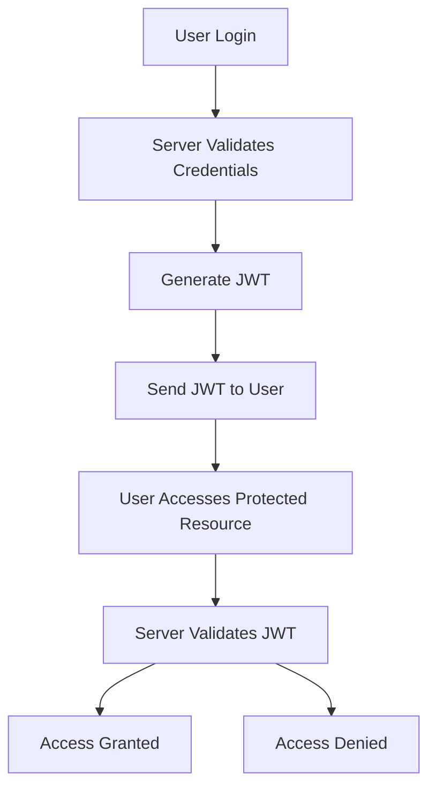

## 13.6.2 Implementing Authentication

Authentication is a critical aspect of web application security, ensuring that users are who they claim to be. In this section, we will explore various strategies for implementing authentication in Clojure web applications. We'll cover form-based login, token-based authentication using JSON Web Tokens (JWT), and integrating with OAuth providers. We'll also introduce the `buddy-auth` library, which simplifies handling authentication flows in Clojure.

### Understanding Authentication in Web Applications

Authentication is the process of verifying the identity of a user or system. In web applications, this typically involves checking credentials such as usernames and passwords. Once authenticated, users can access resources and perform actions based on their permissions.

#### Key Concepts

- **Authentication vs. Authorization**: Authentication verifies identity, while authorization determines access rights.
- **Session Management**: Maintaining user state across requests, often using cookies or tokens.
- **Security Best Practices**: Protecting user data and preventing unauthorized access.

### Form-Based Authentication

Form-based authentication is a common method where users provide credentials via a login form. The server validates these credentials and establishes a session for the user.

#### Implementing Form-Based Authentication in Clojure

Let's walk through a basic implementation using Clojure and the `ring` library for handling HTTP requests.

```clojure
(ns myapp.auth
  (:require [ring.util.response :refer [response redirect]]
            [ring.middleware.session :refer [wrap-session]]
            [buddy.auth :refer [authenticated?]]
            [buddy.auth.backends.session :refer [session-backend]]))

(def users {"user1" "password1"})

(defn login-handler [request]
  (let [{:keys [username password]} (:params request)]
    (if (= (get users username) password)
      (-> (response "Login successful")
          (assoc :session {:identity username}))
      (response "Invalid credentials"))))

(defn logout-handler [request]
  (-> (response "Logged out")
      (assoc :session nil)))

(def app
  (-> (routes
        (POST "/login" request (login-handler request))
        (GET "/logout" request (logout-handler request)))
      (wrap-session)
      (buddy.auth.middleware/wrap-authentication (session-backend))))
```

**Explanation**:
- We define a simple user map for demonstration purposes.
- The `login-handler` checks the credentials and sets the session if valid.
- The `logout-handler` clears the session.
- We use `wrap-session` to manage sessions and `buddy.auth.middleware/wrap-authentication` for authentication.

#### Security Considerations

- **Password Storage**: Never store passwords in plain text. Use hashing algorithms like bcrypt.
- **Session Security**: Use secure cookies and consider session expiration.

### Token-Based Authentication with JWT

JSON Web Tokens (JWT) are a compact, URL-safe means of representing claims to be transferred between two parties. They are commonly used for stateless authentication.

#### Implementing JWT Authentication

We'll use the `buddy-auth` library to handle JWT authentication.

```clojure
(ns myapp.jwt-auth
  (:require [buddy.auth.backends.token :refer [jws-backend]]
            [buddy.sign.jwt :as jwt]
            [ring.util.response :refer [response]]))

(def secret "my-secret-key")

(defn generate-token [username]
  (jwt/sign {:user username} secret))

(defn authenticate [request]
  (let [token (generate-token "user1")]
    (response {:token token})))

(def app
  (-> (routes
        (POST "/authenticate" request (authenticate request)))
      (buddy.auth.middleware/wrap-authentication
        (jws-backend {:secret secret}))))
```

**Explanation**:
- We define a secret key for signing tokens.
- The `generate-token` function creates a JWT for a given user.
- The `authenticate` endpoint issues a token upon successful authentication.

#### Advantages of JWT

- **Stateless**: No need to store session data on the server.
- **Scalable**: Suitable for distributed systems.

#### Security Considerations

- **Token Expiration**: Set expiration times to limit token validity.
- **Secure Storage**: Store tokens securely on the client side.

### Integrating with OAuth Providers

OAuth is an open standard for access delegation, commonly used for granting websites or applications limited access to user information from another service.

#### Implementing OAuth with Clojure

We'll use the `clj-oauth` library to integrate with an OAuth provider like Google.

```clojure
(ns myapp.oauth
  (:require [clj-oauth.client :as oauth]
            [ring.util.response :refer [redirect]]))

(def consumer
  (oauth/make-consumer "client-id"
                       "client-secret"
                       "https://accounts.google.com/o/oauth2/auth"
                       "https://accounts.google.com/o/oauth2/token"
                       "https://www.googleapis.com/oauth2/v1/userinfo"
                       :hmac-sha1))

(defn oauth-callback [request]
  (let [access-token (oauth/access-token consumer (:params request))]
    (response (str "Access token: " access-token))))

(def app
  (routes
    (GET "/oauth-callback" request (oauth-callback request))))
```

**Explanation**:
- We configure an OAuth consumer with client credentials and endpoints.
- The `oauth-callback` function handles the OAuth callback and retrieves the access token.

#### Benefits of OAuth

- **Delegated Access**: Allows users to grant access without sharing credentials.
- **Wide Adoption**: Supported by major providers like Google, Facebook, and GitHub.

### Using `buddy-auth` for Authentication Flows

The `buddy-auth` library provides a comprehensive set of tools for implementing authentication in Clojure applications.

#### Key Features

- **Multiple Backends**: Supports session, token, and OAuth authentication.
- **Middleware**: Easily integrates with Ring applications.

#### Example: Combining Session and JWT Authentication

```clojure
(ns myapp.combined-auth
  (:require [buddy.auth :refer [authenticated?]]
            [buddy.auth.backends.session :refer [session-backend]]
            [buddy.auth.backends.token :refer [jws-backend]]
            [ring.util.response :refer [response]]))

(def secret "my-secret-key")

(defn protected-route [request]
  (if (authenticated? request)
    (response "Access granted")
    (response "Access denied")))

(def app
  (-> (routes
        (GET "/protected" request (protected-route request)))
      (buddy.auth.middleware/wrap-authentication
        [(session-backend)
         (jws-backend {:secret secret})])))
```

**Explanation**:
- We define a `protected-route` that checks if the user is authenticated.
- We use both session and JWT backends for authentication.

### Try It Yourself

Experiment with the code examples by:

- Modifying the user credentials and testing different login scenarios.
- Changing the JWT secret and observing the impact on token validation.
- Integrating with a different OAuth provider by updating the consumer configuration.

### Diagrams and Visualizations

Below is a flowchart illustrating the authentication process using JWT:



**Diagram Explanation**: This flowchart shows the steps involved in JWT authentication, from user login to accessing a protected resource.

### Further Reading

- [Official Clojure Documentation](https://clojure.org/reference/documentation)
- [ClojureDocs](https://clojuredocs.org/)
- [Buddy Auth GitHub Repository](https://github.com/funcool/buddy-auth)

### Exercises

1. Implement a form-based authentication system with hashed passwords.
2. Create a JWT authentication system with token expiration.
3. Integrate an OAuth provider of your choice and retrieve user information.

### Key Takeaways

- Authentication is crucial for securing web applications.
- Clojure provides flexible libraries like `buddy-auth` for implementing various authentication strategies.
- Understanding the differences between session-based and token-based authentication can help you choose the right approach for your application.

Now that we've explored authentication in Clojure, let's apply these concepts to secure your web applications effectively.

## Quiz: Mastering Authentication in Clojure Web Applications



### What is the primary purpose of authentication in web applications?

- [x] To verify the identity of users
- [ ] To determine user permissions
- [ ] To encrypt user data
- [ ] To manage user sessions

> **Explanation:** Authentication is primarily about verifying the identity of users, ensuring they are who they claim to be.

### Which library is commonly used in Clojure for handling authentication flows?

- [x] buddy-auth
- [ ] clj-http
- [ ] ring-core
- [ ] compojure

> **Explanation:** `buddy-auth` is a popular library in Clojure for handling authentication flows, providing support for various authentication strategies.

### What is a key advantage of using JWT for authentication?

- [x] Statelessness
- [ ] Requires server-side session storage
- [ ] Complex to implement
- [ ] Limited scalability

> **Explanation:** JWTs are stateless, meaning they do not require server-side session storage, making them scalable and suitable for distributed systems.

### In form-based authentication, what is typically used to maintain user state across requests?

- [x] Sessions
- [ ] JWTs
- [ ] OAuth tokens
- [ ] API keys

> **Explanation:** Sessions are commonly used in form-based authentication to maintain user state across requests.

### What is a common security practice when storing passwords?

- [x] Hashing passwords
- [ ] Storing passwords in plain text
- [ ] Encrypting passwords with a symmetric key
- [ ] Using passwords as JWTs

> **Explanation:** Hashing passwords is a common security practice to protect them from being exposed in plain text.

### Which of the following is a benefit of OAuth?

- [x] Delegated access
- [ ] Requires sharing user credentials
- [ ] Limited to internal applications
- [ ] Incompatible with major providers

> **Explanation:** OAuth allows delegated access, enabling users to grant access without sharing their credentials.

### How does `buddy-auth` support multiple authentication strategies?

- [x] By providing multiple backends
- [ ] By using a single authentication method
- [ ] By integrating with clj-http
- [ ] By requiring custom implementations

> **Explanation:** `buddy-auth` supports multiple authentication strategies by providing different backends, such as session and token-based authentication.

### What is a common use case for OAuth in web applications?

- [x] Integrating with third-party services
- [ ] Encrypting user data
- [ ] Managing server-side sessions
- [ ] Implementing form-based login

> **Explanation:** OAuth is commonly used to integrate with third-party services, allowing users to authenticate using their existing accounts.

### Which of the following is a security consideration when using JWTs?

- [x] Setting token expiration
- [ ] Storing tokens in plain text
- [ ] Using symmetric encryption for tokens
- [ ] Allowing unlimited token validity

> **Explanation:** Setting token expiration is a security consideration to limit the validity of JWTs and reduce the risk of misuse.

### True or False: OAuth is only used for authentication.

- [ ] True
- [x] False

> **Explanation:** OAuth is primarily used for authorization, allowing applications to access user data from other services without sharing credentials.


