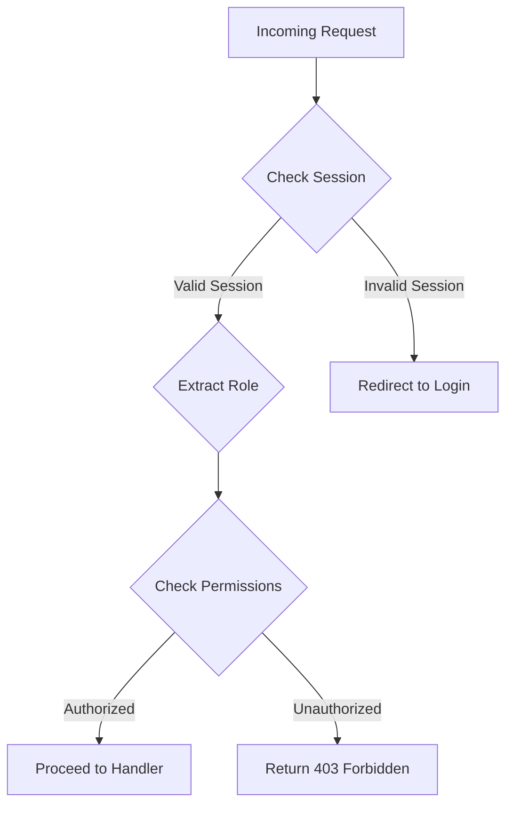

## 13.6.3 Authorization and Access Control

In the realm of web development, ensuring that users have appropriate access to resources is crucial for maintaining security and integrity. Authorization and access control are key components of this process. In this section, we'll explore how to implement these concepts in Clojure web applications, drawing parallels with Java to ease the transition for experienced Java developers.

### Understanding Authorization and Access Control

**Authorization** is the process of determining whether a user has permission to perform a specific action or access a particular resource. This is typically based on user roles or permissions. **Access Control** refers to the mechanisms that enforce these authorization rules.

In Java, you might be familiar with frameworks like Spring Security, which provides comprehensive tools for managing authentication and authorization. In Clojure, we often use middleware to achieve similar functionality, leveraging the language's functional programming paradigms.

### Key Concepts in Authorization

1. **Roles and Permissions**: Users are assigned roles, and roles are granted permissions. This allows for flexible and scalable access control.
2. **Access Control Lists (ACLs)**: Define which roles have access to specific resources or actions.
3. **Middleware**: In Clojure, middleware functions are used to intercept requests and apply authorization logic.

### Implementing Authorization in Clojure

Let's dive into implementing authorization in a Clojure web application. We'll use the popular **Ring** and **Compojure** libraries to handle HTTP requests and routing.

#### Defining Roles and Permissions

First, we need to define the roles and permissions for our application. This can be done using simple data structures in Clojure.

```clojure
(def roles
  {:admin #{:read :write :delete}
   :user #{:read}
   :guest #{}})

(defn has-permission? [role permission]
  (contains? (get roles role) permission))
```

In this example, we define a map `roles` where each key is a role and the value is a set of permissions associated with that role. The `has-permission?` function checks if a given role has a specific permission.

#### Applying Authorization in Middleware

Middleware in Clojure is a function that takes a handler and returns a new handler. We can use middleware to enforce authorization rules.

```clojure
(defn wrap-authorization [handler]
  (fn [request]
    (let [user-role (:role (:session request))
          required-permission (:permission (:route request))]
      (if (has-permission? user-role required-permission)
        (handler request)
        {:status 403
         :body "Forbidden"}))))
```

The `wrap-authorization` middleware extracts the user's role from the session and the required permission from the route. It then checks if the user has the necessary permission to proceed.

#### Integrating with Routes

Now, let's integrate our authorization middleware with Compojure routes.

```clojure
(require '[compojure.core :refer :all])

(defroutes app-routes
  (GET "/admin" request
       :permission :write
       (wrap-authorization
         (fn [req] {:status 200 :body "Welcome, Admin!"})))
  (GET "/user" request
       :permission :read
       (wrap-authorization
         (fn [req] {:status 200 :body "Welcome, User!"}))))
```

Here, we define routes with specific permissions required for access. The `wrap-authorization` middleware ensures that only users with the appropriate permissions can access these routes.

### Comparing with Java

In Java, you might use annotations or XML configuration to define access control rules. Clojure's approach is more dynamic and flexible, allowing you to define rules programmatically and apply them using middleware.

#### Java Example

```java
import org.springframework.security.access.annotation.Secured;

@RestController
public class MyController {

    @Secured("ROLE_ADMIN")
    @GetMapping("/admin")
    public String adminAccess() {
        return "Welcome, Admin!";
    }

    @Secured("ROLE_USER")
    @GetMapping("/user")
    public String userAccess() {
        return "Welcome, User!";
    }
}
```

In this Java example, we use the `@Secured` annotation to specify the roles required for each endpoint. This is similar to specifying permissions in Clojure routes.

### Advanced Authorization Techniques

#### Role Hierarchies

In some cases, roles may inherit permissions from other roles. This can be implemented using a hierarchy.

```clojure
(def role-hierarchy
  {:admin [:user]
   :user [:guest]})

(defn inherited-permissions [role]
  (let [base-permissions (get roles role)
        inherited-roles (get role-hierarchy role)]
    (reduce #(clojure.set/union %1 (get roles %2)) base-permissions inherited-roles)))

(defn has-inherited-permission? [role permission]
  (contains? (inherited-permissions role) permission))
```

This code defines a role hierarchy and a function to compute inherited permissions. The `has-inherited-permission?` function checks permissions, considering both direct and inherited permissions.

#### Attribute-Based Access Control (ABAC)

ABAC is a more granular approach that considers user attributes, resource attributes, and environment conditions.

```clojure
(defn abac-authorize [user resource action]
  (and (= (:role user) :admin)
       (= (:resource-type resource) :confidential)
       (= action :read)))
```

In this example, we define an ABAC rule that allows admins to read confidential resources.

### Visualizing Authorization Flow

Below is a flowchart illustrating the authorization process in a Clojure web application.



**Diagram Description**: This flowchart shows the steps involved in processing an incoming request, checking the session, extracting the user role, and verifying permissions before proceeding to the request handler or returning a forbidden response.

### Best Practices for Authorization

- **Principle of Least Privilege**: Assign the minimum permissions necessary for users to perform their tasks.
- **Regular Audits**: Periodically review roles and permissions to ensure they align with current security policies.
- **Separation of Concerns**: Keep authorization logic separate from business logic to maintain clean and maintainable code.
- **Use Libraries**: Consider using libraries like [Friend](https://github.com/cemerick/friend) for more complex authorization needs.

### Try It Yourself

Experiment with the code examples provided. Try adding new roles and permissions, or implement a custom middleware to log unauthorized access attempts. Consider how you might integrate these concepts into a larger application.

### Exercises

1. **Implement a New Role**: Add a new role called `:editor` with permissions to `:read` and `:write`. Update the middleware and routes to accommodate this role.
2. **ABAC Rule**: Create an ABAC rule that allows users to delete resources only if they are the owner.
3. **Role Hierarchy**: Modify the role hierarchy to allow `:editor` to inherit permissions from `:user`.

### Key Takeaways

- Authorization and access control are essential for securing web applications.
- Clojure's functional programming paradigm offers a flexible and dynamic approach to implementing these concepts.
- Middleware is a powerful tool for enforcing authorization rules in Clojure.
- Regularly review and update roles and permissions to maintain security.

By understanding and implementing these concepts, you can build secure and robust Clojure web applications that effectively manage user access to resources.

## Quiz: Mastering Authorization and Access Control in Clojure



### What is the primary purpose of authorization in web applications?

- [x] To determine if a user has permission to access a resource
- [ ] To authenticate a user's identity
- [ ] To log user activities
- [ ] To encrypt data

> **Explanation:** Authorization is about determining if a user has the right to access a particular resource or perform a specific action.

### In Clojure, which construct is commonly used to enforce authorization rules?

- [x] Middleware
- [ ] Macros
- [ ] Atoms
- [ ] Protocols

> **Explanation:** Middleware in Clojure is used to intercept requests and apply authorization logic before passing the request to the handler.

### How does the `wrap-authorization` middleware function determine access?

- [x] By checking the user's role and required permission
- [ ] By validating the user's session token
- [ ] By encrypting the request data
- [ ] By logging the request details

> **Explanation:** The `wrap-authorization` middleware checks the user's role from the session and the required permission from the route to determine access.

### What is a key advantage of using middleware for authorization in Clojure?

- [x] It separates authorization logic from business logic
- [ ] It improves the performance of the application
- [ ] It simplifies database interactions
- [ ] It enhances the user interface

> **Explanation:** Middleware allows for a clean separation of concerns, keeping authorization logic separate from the core business logic.

### Which of the following is an example of a role in an access control system?

- [x] Admin
- [ ] Read
- [ ] Write
- [ ] Delete

> **Explanation:** Roles like "Admin" are used to group permissions and assign them to users.

### What is the principle of least privilege?

- [x] Assigning the minimum permissions necessary for users
- [ ] Granting all permissions to administrators
- [ ] Allowing users to request additional permissions
- [ ] Denying all permissions by default

> **Explanation:** The principle of least privilege involves giving users only the permissions they need to perform their tasks.

### How can role hierarchies benefit an access control system?

- [x] By allowing roles to inherit permissions from other roles
- [ ] By simplifying the user interface
- [ ] By reducing the number of roles needed
- [ ] By enhancing data encryption

> **Explanation:** Role hierarchies allow roles to inherit permissions, making it easier to manage complex permission structures.

### What is a potential risk of not regularly auditing roles and permissions?

- [x] Unauthorized access to sensitive resources
- [ ] Improved application performance
- [ ] Increased user satisfaction
- [ ] Enhanced data encryption

> **Explanation:** Without regular audits, outdated or incorrect permissions may lead to unauthorized access to sensitive resources.

### What does ABAC stand for in the context of access control?

- [x] Attribute-Based Access Control
- [ ] Action-Based Access Control
- [ ] Application-Based Access Control
- [ ] Authentication-Based Access Control

> **Explanation:** ABAC stands for Attribute-Based Access Control, which considers user attributes, resource attributes, and environment conditions.

### True or False: In Clojure, authorization logic should be tightly coupled with business logic for efficiency.

- [ ] True
- [x] False

> **Explanation:** Authorization logic should be separate from business logic to maintain clean and maintainable code.


