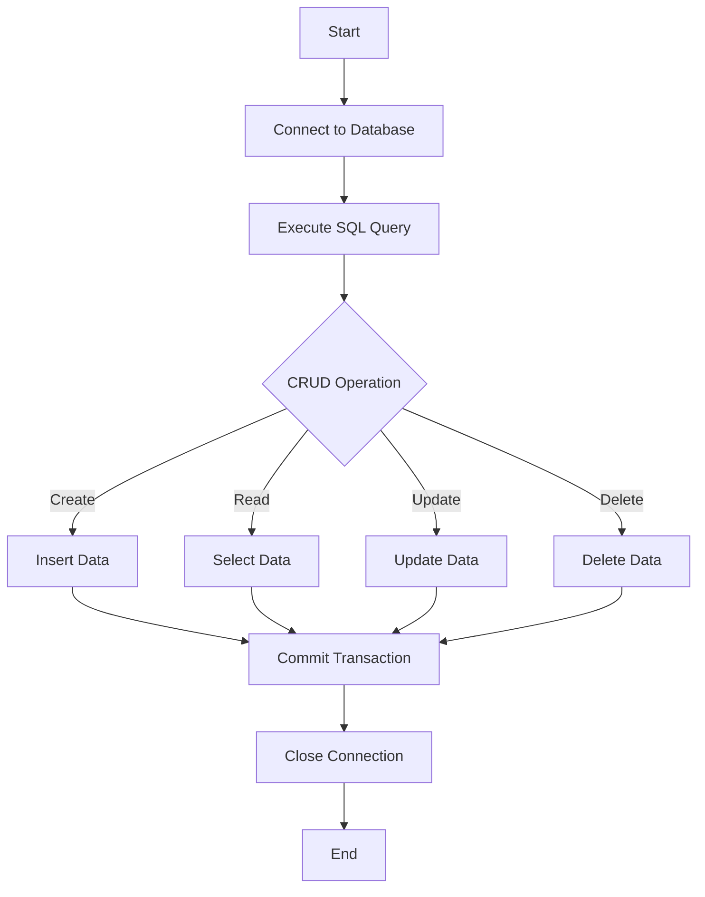

## 13.7.1 Using clojure.java.jdbc

In this section, we delve into the powerful `clojure.java.jdbc` library, a key tool for interacting with relational databases in Clojure. As experienced Java developers, you are likely familiar with JDBC (Java Database Connectivity) for database operations. `clojure.java.jdbc` builds on this foundation, offering a more idiomatic and functional approach to database interactions in Clojure.

### Introduction to clojure.java.jdbc

`clojure.java.jdbc` is a Clojure library that provides a simple and idiomatic way to interact with SQL databases. It abstracts the complexities of JDBC, allowing you to focus on writing clean and concise Clojure code for database operations. This library is particularly useful for performing CRUD (Create, Read, Update, Delete) operations, managing transactions, and executing SQL queries.

#### Key Features of clojure.java.jdbc

- **Simplicity**: Provides a straightforward API for database operations.
- **Flexibility**: Supports various SQL databases, including PostgreSQL, MySQL, and SQLite.
- **Functional Approach**: Encourages the use of Clojure's functional programming paradigms.
- **Transaction Management**: Simplifies handling of transactions with built-in support.

### Setting Up clojure.java.jdbc

Before we dive into code examples, let's set up `clojure.java.jdbc` in your Clojure project. You'll need to add the library as a dependency in your `project.clj` file if you're using Leiningen:

```clojure
(defproject my-clojure-app "0.1.0-SNAPSHOT"
  :dependencies [[org.clojure/clojure "1.10.3"]
                 [org.clojure/java.jdbc "0.7.12"]
                 [mysql/mysql-connector-java "8.0.26"]])
```

For tools.deps, add the following to your `deps.edn`:

```clojure
{:deps {org.clojure/clojure {:mvn/version "1.10.3"}
        org.clojure/java.jdbc {:mvn/version "0.7.12"}
        mysql/mysql-connector-java {:mvn/version "8.0.26"}}}
```

### Establishing a Database Connection

To interact with a database, you first need to establish a connection. `clojure.java.jdbc` uses a map to define the connection parameters. Here's an example of connecting to a MySQL database:

```clojure
(require '[clojure.java.jdbc :as jdbc])

(def db-spec
  {:dbtype "mysql"
   :dbname "my_database"
   :host "localhost"
   :user "root"
   :password "password"})

;; Establish a connection
(jdbc/with-db-connection [conn db-spec]
  (println "Connected to the database!"))
```

**Explanation**: The `db-spec` map contains the database type, name, host, user, and password. The `with-db-connection` macro ensures that the connection is properly managed and closed after use.

### Executing SQL Queries

Once connected, you can execute SQL queries using `clojure.java.jdbc`. Let's start with a simple SELECT query:

```clojure
(jdbc/with-db-connection [conn db-spec]
  (jdbc/query conn ["SELECT * FROM users"]))
```

**Explanation**: The `query` function takes a connection and a vector containing the SQL query. It returns a sequence of maps, where each map represents a row from the result set.

### CRUD Operations

#### Create

To insert data into a table, use the `insert!` function:

```clojure
(jdbc/with-db-connection [conn db-spec]
  (jdbc/insert! conn :users {:name "Alice" :email "alice@example.com"}))
```

**Explanation**: The `insert!` function takes a connection, the table name (as a keyword), and a map of column-value pairs to insert.

#### Read

Reading data is done using the `query` function, as shown earlier. You can also use SQL parameters to filter results:

```clojure
(jdbc/with-db-connection [conn db-spec]
  (jdbc/query conn ["SELECT * FROM users WHERE name = ?" "Alice"]))
```

**Explanation**: The `?` is a placeholder for SQL parameters, which are provided as additional arguments.

#### Update

To update existing records, use the `update!` function:

```clojure
(jdbc/with-db-connection [conn db-spec]
  (jdbc/update! conn :users {:email "alice@newdomain.com"} ["name = ?" "Alice"]))
```

**Explanation**: The `update!` function takes a connection, the table name, a map of column-value pairs to update, and a vector specifying the WHERE clause.

#### Delete

Deleting records is done with the `delete!` function:

```clojure
(jdbc/with-db-connection [conn db-spec]
  (jdbc/delete! conn :users ["name = ?" "Alice"]))
```

**Explanation**: The `delete!` function takes a connection, the table name, and a vector specifying the WHERE clause.

### Handling Transactions

Transactions are crucial for ensuring data integrity. `clojure.java.jdbc` provides the `with-db-transaction` macro for managing transactions:

```clojure
(jdbc/with-db-transaction [t-conn db-spec]
  (jdbc/insert! t-conn :users {:name "Bob" :email "bob@example.com"})
  (jdbc/update! t-conn :users {:email "bob@newdomain.com"} ["name = ?" "Bob"]))
```

**Explanation**: The `with-db-transaction` macro ensures that all operations within its body are executed within a single transaction. If any operation fails, the transaction is rolled back.

### Comparing with Java JDBC

In Java, database operations typically involve boilerplate code for managing connections, statements, and result sets. Here's a simple Java example for comparison:

```java
import java.sql.Connection;
import java.sql.DriverManager;
import java.sql.PreparedStatement;
import java.sql.ResultSet;

public class DatabaseExample {
    public static void main(String[] args) {
        String url = "jdbc:mysql://localhost:3306/my_database";
        String user = "root";
        String password = "password";

        try (Connection conn = DriverManager.getConnection(url, user, password)) {
            PreparedStatement stmt = conn.prepareStatement("SELECT * FROM users");
            ResultSet rs = stmt.executeQuery();

            while (rs.next()) {
                System.out.println("User: " + rs.getString("name"));
            }
        } catch (Exception e) {
            e.printStackTrace();
        }
    }
}
```

**Comparison**: Notice the verbosity in Java with explicit connection management and result set handling. In contrast, `clojure.java.jdbc` abstracts these details, allowing for more concise and readable code.

### Try It Yourself

To deepen your understanding, try modifying the examples above:

- **Add a new column** to the `users` table and update the `insert!` and `update!` operations to include this column.
- **Implement a transaction** that inserts multiple users and rolls back if any insertion fails.
- **Experiment with different SQL databases** by changing the `db-spec` map.

### Diagram: Data Flow in CRUD Operations

Below is a diagram illustrating the flow of data through CRUD operations using `clojure.java.jdbc`.



**Diagram Explanation**: This flowchart represents the typical steps involved in performing CRUD operations using `clojure.java.jdbc`. It starts with establishing a connection, executing queries, performing CRUD operations, committing transactions, and closing the connection.

### Exercises

1. **Create a new table** in your database and perform all CRUD operations using `clojure.java.jdbc`.
2. **Write a function** that retrieves users based on a specific condition and returns the result as a Clojure map.
3. **Implement error handling** for database operations using try-catch blocks to manage exceptions gracefully.

### Key Takeaways

- `clojure.java.jdbc` simplifies database interactions in Clojure by abstracting JDBC complexities.
- It supports a functional programming approach, making it easier to write clean and maintainable code.
- Understanding how to manage connections, execute queries, and handle transactions is crucial for effective database integration.
- Comparing Clojure's approach with Java highlights the benefits of functional programming in reducing boilerplate code.

By mastering `clojure.java.jdbc`, you can seamlessly integrate databases into your Clojure applications, leveraging the power of functional programming to build robust and efficient systems.

---

## Quiz: Mastering clojure.java.jdbc for Database Operations



### What is the primary purpose of clojure.java.jdbc?

- [x] To provide a simple and idiomatic way to interact with SQL databases in Clojure.
- [ ] To replace the need for SQL databases entirely.
- [ ] To offer a graphical user interface for database management.
- [ ] To convert SQL queries into JSON format.

> **Explanation:** `clojure.java.jdbc` is designed to simplify database interactions in Clojure by providing a functional and idiomatic API for SQL operations.

### How do you establish a database connection using clojure.java.jdbc?

- [x] By defining a `db-spec` map and using the `with-db-connection` macro.
- [ ] By writing a Java class to manage connections.
- [ ] By using a graphical tool to connect to the database.
- [ ] By manually opening and closing connections in every function.

> **Explanation:** `clojure.java.jdbc` uses a `db-spec` map to define connection parameters and the `with-db-connection` macro to manage connections.

### Which function is used to insert data into a table?

- [x] `insert!`
- [ ] `add!`
- [ ] `put!`
- [ ] `create!`

> **Explanation:** The `insert!` function is used to add new records to a table in `clojure.java.jdbc`.

### What does the `with-db-transaction` macro do?

- [x] It ensures that all operations within its body are executed within a single transaction.
- [ ] It automatically backs up the database.
- [ ] It converts SQL queries to NoSQL.
- [ ] It logs all database operations to a file.

> **Explanation:** `with-db-transaction` manages transactions, ensuring atomicity of operations within its scope.

### How does clojure.java.jdbc handle SQL parameters in queries?

- [x] By using `?` placeholders in the SQL string and providing parameters as additional arguments.
- [ ] By embedding parameters directly into the SQL string.
- [ ] By using XML configuration files.
- [ ] By requiring a separate parameter file.

> **Explanation:** SQL parameters are handled using `?` placeholders, which are replaced by the provided arguments in `clojure.java.jdbc`.

### What is a key advantage of using clojure.java.jdbc over Java's JDBC?

- [x] It reduces boilerplate code and provides a more concise API.
- [ ] It eliminates the need for SQL databases.
- [ ] It automatically generates SQL queries.
- [ ] It provides a graphical interface for database operations.

> **Explanation:** `clojure.java.jdbc` abstracts many of the complexities of JDBC, resulting in less boilerplate and more readable code.

### Which of the following is NOT a CRUD operation?

- [ ] Create
- [ ] Read
- [x] Compile
- [ ] Delete

> **Explanation:** CRUD stands for Create, Read, Update, and Delete. Compile is not part of CRUD operations.

### How can you handle errors in database operations using clojure.java.jdbc?

- [x] By using try-catch blocks to manage exceptions.
- [ ] By ignoring errors and continuing execution.
- [ ] By writing errors to a log file only.
- [ ] By restarting the database server.

> **Explanation:** Error handling in `clojure.java.jdbc` can be managed using try-catch blocks to catch and handle exceptions gracefully.

### What is the purpose of the `query` function in clojure.java.jdbc?

- [x] To execute a SELECT statement and return the result set as a sequence of maps.
- [ ] To insert data into a database.
- [ ] To update existing records in a table.
- [ ] To delete records from a database.

> **Explanation:** The `query` function is used to execute SELECT statements and retrieve data from the database.

### True or False: clojure.java.jdbc can only be used with MySQL databases.

- [ ] True
- [x] False

> **Explanation:** `clojure.java.jdbc` is versatile and can be used with various SQL databases, including PostgreSQL, SQLite, and others.


