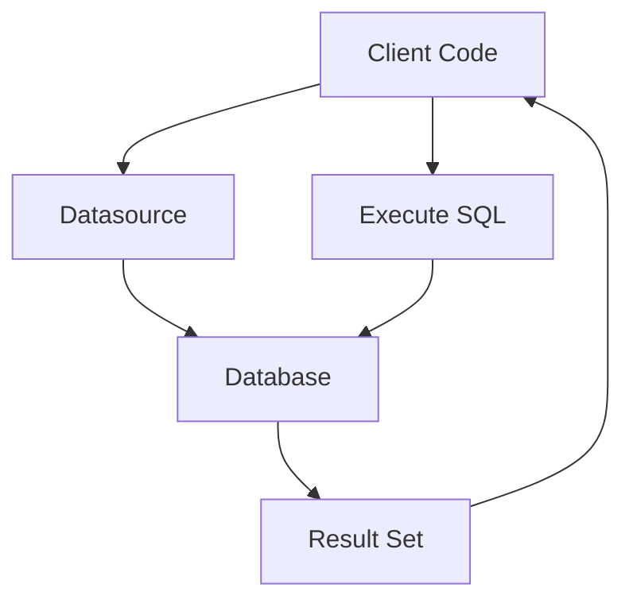

## 13.7.2 Introducing Next.jdbc

As experienced Java developers transitioning to Clojure, you may be familiar with the intricacies of database interactions using JDBC (Java Database Connectivity). In the Clojure ecosystem, `clojure.java.jdbc` has been a popular choice for database operations. However, a newer library, `next.jdbc`, has emerged as a more modern and efficient alternative. In this section, we'll explore `next.jdbc`, highlighting its advantages in terms of simplicity and performance, and provide practical examples to demonstrate its usage.

### Why Choose Next.jdbc?

`next.jdbc` was designed to address some of the limitations and complexities of `clojure.java.jdbc`. Here are some key reasons why you might consider using `next.jdbc` for your Clojure projects:

- **Simplicity**: `next.jdbc` offers a more straightforward API, making it easier to perform common database operations without boilerplate code.
- **Performance**: It is optimized for performance, leveraging the latest JDBC features and best practices.
- **Flexibility**: The library provides flexible options for handling result sets and transactions, allowing you to tailor database interactions to your specific needs.
- **Modern Design**: Built with a focus on immutability and functional programming principles, `next.jdbc` aligns well with Clojure's philosophy.

### Getting Started with Next.jdbc

Before diving into code examples, let's set up `next.jdbc` in your Clojure project. You'll need to add the library as a dependency in your `deps.edn` or `project.clj` file, depending on whether you're using `tools.deps` or Leiningen.

#### Adding Next.jdbc to Your Project

For `tools.deps`, add the following to your `deps.edn`:

```clojure
{:deps {seancorfield/next.jdbc {:mvn/version "1.2.780"}}}
```

For Leiningen, add this to your `project.clj`:

```clojure
:dependencies [[seancorfield/next.jdbc "1.2.780"]]
```

### Establishing a Database Connection

In `next.jdbc`, establishing a connection to the database is straightforward. You typically use a database specification map to define your connection parameters.

Here's a simple example of connecting to a PostgreSQL database:

```clojure
(require '[next.jdbc :as jdbc])

(def db-spec
  {:dbtype "postgresql"
   :dbname "mydatabase"
   :host "localhost"
   :user "myuser"
   :password "mypassword"})

(def datasource (jdbc/get-datasource db-spec))
```

**Explanation**: 
- `db-spec` is a map containing the database connection details.
- `jdbc/get-datasource` creates a connection pool, which is more efficient for handling multiple database requests.

### Performing Basic CRUD Operations

With the connection established, let's explore how to perform basic CRUD (Create, Read, Update, Delete) operations using `next.jdbc`.

#### Creating Records

To insert a new record into a database table, you can use the `jdbc/execute!` function:

```clojure
(jdbc/execute! datasource
               ["INSERT INTO users (name, email) VALUES (?, ?)" "Alice" "alice@example.com"])
```

**Explanation**: 
- The SQL query is parameterized using `?`, which helps prevent SQL injection attacks.
- The values to be inserted are provided as a vector following the SQL string.

#### Reading Records

To retrieve data from the database, use the `jdbc/execute!` function with a `SELECT` query:

```clojure
(def users (jdbc/execute! datasource ["SELECT * FROM users"]))

;; Print the retrieved users
(prn users)
```

**Explanation**: 
- The result is a vector of maps, where each map represents a row in the result set.

#### Updating Records

Updating records is similar to inserting them. Use the `jdbc/execute!` function with an `UPDATE` query:

```clojure
(jdbc/execute! datasource
               ["UPDATE users SET email = ? WHERE name = ?" "alice@newdomain.com" "Alice"])
```

**Explanation**: 
- The query updates the email of the user named Alice.

#### Deleting Records

To delete records, use the `jdbc/execute!` function with a `DELETE` query:

```clojure
(jdbc/execute! datasource ["DELETE FROM users WHERE name = ?" "Alice"])
```

**Explanation**: 
- This query deletes the user named Alice from the database.

### Handling Transactions

Transactions are crucial for ensuring data integrity. `next.jdbc` provides a simple way to manage transactions using the `jdbc/with-transaction` macro.

Here's an example of using a transaction to ensure multiple operations are atomic:

```clojure
(jdbc/with-transaction [tx datasource]
  (jdbc/execute! tx ["INSERT INTO accounts (name, balance) VALUES (?, ?)" "Bob" 1000])
  (jdbc/execute! tx ["UPDATE accounts SET balance = balance - ? WHERE name = ?" 100 "Alice"]))
```

**Explanation**: 
- The `jdbc/with-transaction` macro ensures that both operations are committed together. If any operation fails, the transaction is rolled back.

### Advanced Features of Next.jdbc

`next.jdbc` offers several advanced features that enhance its flexibility and performance.

#### Customizing Result Set Handling

By default, `next.jdbc` returns result sets as vectors of maps. However, you can customize this behavior using the `:builder-fn` option.

For example, to return results as a sequence of vectors:

```clojure
(def users (jdbc/execute! datasource
                          ["SELECT * FROM users"]
                          {:builder-fn jdbc/as-arrays}))

(prn users)
```

**Explanation**: 
- The `jdbc/as-arrays` function changes the result set format to a sequence of vectors.

#### Using Prepared Statements

Prepared statements can improve performance and security. `next.jdbc` supports prepared statements through the `jdbc/prepare` function.

Here's how to use a prepared statement to insert a record:

```clojure
(let [stmt (jdbc/prepare datasource ["INSERT INTO users (name, email) VALUES (?, ?)"])]
  (jdbc/execute! stmt ["Charlie" "charlie@example.com"]))
```

**Explanation**: 
- The `jdbc/prepare` function creates a prepared statement, which can be executed multiple times with different parameters.

### Comparing Next.jdbc with clojure.java.jdbc

To appreciate the improvements `next.jdbc` offers, let's compare it with `clojure.java.jdbc` using a simple example.

#### Inserting a Record with clojure.java.jdbc

```clojure
(require '[clojure.java.jdbc :as old-jdbc])

(old-jdbc/insert! db-spec :users {:name "Alice" :email "alice@example.com"})
```

#### Inserting a Record with Next.jdbc

```clojure
(jdbc/execute! datasource
               ["INSERT INTO users (name, email) VALUES (?, ?)" "Alice" "alice@example.com"])
```

**Comparison**:
- `next.jdbc` uses a more explicit and flexible approach with parameterized queries, while `clojure.java.jdbc` relies on maps for data insertion.
- `next.jdbc` provides better performance and security through prepared statements.

### Visualizing the Data Flow

To better understand how data flows through `next.jdbc`, let's visualize the process using a diagram.



**Diagram Explanation**: 
- The client code interacts with the datasource to execute SQL queries.
- The datasource manages connections to the database.
- Results are returned to the client code for further processing.

### Try It Yourself

To solidify your understanding of `next.jdbc`, try modifying the examples provided:

- Change the database type and connection parameters to connect to a different database, such as MySQL or SQLite.
- Experiment with different SQL queries, such as complex joins or aggregations.
- Use transactions to perform a series of operations that must succeed or fail together.

### Further Reading

For more information on `next.jdbc`, consider exploring the following resources:

- [Next.jdbc GitHub Repository](https://github.com/seancorfield/next-jdbc)
- [Official Clojure Documentation](https://clojure.org/)
- [ClojureDocs](https://clojuredocs.org/)

### Exercises

1. **Connect to a Different Database**: Modify the connection parameters to connect to a MySQL database and perform basic CRUD operations.
2. **Implement a Transaction**: Use `jdbc/with-transaction` to implement a transaction that transfers funds between two accounts.
3. **Customize Result Sets**: Use the `:builder-fn` option to return result sets as sequences of vectors instead of maps.

### Key Takeaways

- **Simplicity and Performance**: `next.jdbc` offers a simpler and more performant API compared to `clojure.java.jdbc`.
- **Flexibility**: The library provides flexible options for handling result sets and transactions.
- **Modern Design**: `next.jdbc` aligns well with Clojure's functional programming principles.

Now that we've explored `next.jdbc`, you're equipped to integrate databases into your Clojure applications efficiently. Embrace the simplicity and performance improvements it offers, and apply these concepts to build robust data-driven applications.

## Quiz: Mastering Next.jdbc in Clojure



### What is a key advantage of using `next.jdbc` over `clojure.java.jdbc`?

- [x] Simplicity and performance
- [ ] More complex API
- [ ] Less flexible result set handling
- [ ] Requires more boilerplate code

> **Explanation:** `next.jdbc` is designed to be simpler and more performant than `clojure.java.jdbc`, offering a more streamlined API and better performance.

### How do you establish a connection to a database using `next.jdbc`?

- [x] By creating a datasource with `jdbc/get-datasource`
- [ ] By using `jdbc/connect`
- [ ] By calling `jdbc/open-connection`
- [ ] By using `jdbc/init-db`

> **Explanation:** `jdbc/get-datasource` is used to create a connection pool for efficient database interactions.

### Which function is used to perform a transaction in `next.jdbc`?

- [x] `jdbc/with-transaction`
- [ ] `jdbc/start-transaction`
- [ ] `jdbc/begin-transaction`
- [ ] `jdbc/transaction`

> **Explanation:** `jdbc/with-transaction` is a macro that ensures multiple operations are executed as a single transaction.

### What is the purpose of the `:builder-fn` option in `next.jdbc`?

- [x] To customize how result sets are returned
- [ ] To define the database connection parameters
- [ ] To specify the SQL query timeout
- [ ] To enable logging of SQL queries

> **Explanation:** The `:builder-fn` option allows you to customize the format of result sets, such as returning them as vectors instead of maps.

### How can you improve performance and security when inserting records with `next.jdbc`?

- [x] By using prepared statements
- [ ] By using raw SQL strings
- [ ] By avoiding parameterized queries
- [ ] By disabling transactions

> **Explanation:** Prepared statements enhance performance and security by pre-compiling SQL queries and preventing SQL injection attacks.

### What is the default format for result sets returned by `next.jdbc`?

- [x] Vectors of maps
- [ ] Sequences of strings
- [ ] Arrays of integers
- [ ] Lists of tuples

> **Explanation:** By default, `next.jdbc` returns result sets as vectors of maps, where each map represents a row.

### Which of the following is NOT a feature of `next.jdbc`?

- [ ] Simplicity
- [ ] Performance
- [ ] Flexibility
- [x] Requires manual connection management

> **Explanation:** `next.jdbc` manages connections automatically through a datasource, eliminating the need for manual connection management.

### How does `next.jdbc` align with Clojure's functional programming principles?

- [x] By emphasizing immutability and functional design
- [ ] By using object-oriented patterns
- [ ] By requiring mutable state
- [ ] By relying on inheritance

> **Explanation:** `next.jdbc` is designed with immutability and functional programming in mind, aligning with Clojure's core principles.

### What is the purpose of the `jdbc/prepare` function?

- [x] To create a prepared statement for repeated execution
- [ ] To initialize a database connection
- [ ] To execute a SQL query immediately
- [ ] To close a database connection

> **Explanation:** `jdbc/prepare` creates a prepared statement that can be executed multiple times with different parameters.

### True or False: `next.jdbc` requires more boilerplate code than `clojure.java.jdbc`.

- [ ] True
- [x] False

> **Explanation:** `next.jdbc` is designed to reduce boilerplate code, offering a more streamlined and efficient API than `clojure.java.jdbc`.


