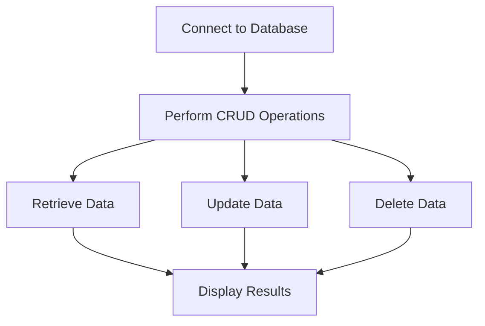

## 13.7.4 Working with NoSQL Databases

In this section, we will explore how to integrate Clojure with popular NoSQL databases such as MongoDB and Cassandra. We'll introduce relevant Clojure libraries, demonstrate basic operations, and compare these with Java approaches to highlight the differences and advantages of using Clojure.

### Introduction to NoSQL Databases

NoSQL databases are designed to handle large volumes of data and provide flexible data models. Unlike traditional relational databases, NoSQL databases do not require a fixed schema and can store unstructured data. This makes them ideal for applications that need to scale horizontally and handle diverse data types.

#### Key Features of NoSQL Databases

- **Schema-less Data Models**: NoSQL databases allow for flexible data structures, enabling developers to store data without a predefined schema.
- **Horizontal Scalability**: They are designed to scale out by adding more servers, making them suitable for large-scale applications.
- **High Availability**: Many NoSQL databases offer built-in replication and distribution features to ensure data availability.
- **Variety of Data Models**: NoSQL databases can be document-based, key-value stores, column-family stores, or graph databases.

### MongoDB with Clojure

MongoDB is a popular document-oriented NoSQL database known for its flexibility and scalability. In Clojure, we can use the `monger` library to interact with MongoDB.

#### Setting Up MongoDB

Before we dive into Clojure code, ensure you have MongoDB installed and running on your machine. You can download MongoDB from the [official website](https://www.mongodb.com/try/download/community).

#### Installing the Monger Library

To use MongoDB with Clojure, add the `monger` dependency to your `project.clj` file:

```clojure
(defproject my-clojure-app "0.1.0-SNAPSHOT"
  :dependencies [[org.clojure/clojure "1.10.3"]
                 [com.novemberain/monger "3.5.0"]])
```

Run `lein deps` to install the dependencies.

#### Connecting to MongoDB

Let's start by establishing a connection to MongoDB using the `monger` library:

```clojure
(ns my-clojure-app.core
  (:require [monger.core :as mg]
            [monger.collection :as mc]))

(defn connect-to-mongo []
  ;; Connect to the MongoDB server
  (let [conn (mg/connect)
        db (mg/get-db conn "my-database")]
    db))
```

In this example, we connect to a MongoDB server and access a database named `my-database`.

#### Basic CRUD Operations

Now that we have a connection, let's perform some basic CRUD (Create, Read, Update, Delete) operations.

**Create a Document**

```clojure
(defn insert-document [db]
  ;; Insert a document into the "users" collection
  (mc/insert db "users" {:name "Alice" :age 30 :email "alice@example.com"}))
```

**Read Documents**

```clojure
(defn find-documents [db]
  ;; Find all documents in the "users" collection
  (mc/find-maps db "users"))
```

**Update a Document**

```clojure
(defn update-document [db]
  ;; Update a document in the "users" collection
  (mc/update db "users" {:name "Alice"} {$set {:age 31}}))
```

**Delete a Document**

```clojure
(defn delete-document [db]
  ;; Delete a document from the "users" collection
  (mc/remove db "users" {:name "Alice"}))
```

These examples demonstrate how to perform basic operations on a MongoDB collection using Clojure.

#### Comparison with Java

In Java, interacting with MongoDB typically involves using the MongoDB Java Driver. Here's a comparison of inserting a document in Java:

```java
import com.mongodb.MongoClient;
import com.mongodb.client.MongoCollection;
import com.mongodb.client.MongoDatabase;
import org.bson.Document;

public class MongoDBExample {
    public static void main(String[] args) {
        MongoClient mongoClient = new MongoClient("localhost", 27017);
        MongoDatabase database = mongoClient.getDatabase("my-database");
        MongoCollection<Document> collection = database.getCollection("users");

        Document doc = new Document("name", "Alice")
                .append("age", 30)
                .append("email", "alice@example.com");
        collection.insertOne(doc);
    }
}
```

As you can see, Clojure's concise syntax and functional approach make it easier to work with MongoDB compared to Java's more verbose style.

### Cassandra with Clojure

Cassandra is a distributed NoSQL database designed for handling large amounts of data across many commodity servers. It offers high availability and no single point of failure.

#### Setting Up Cassandra

Ensure you have Cassandra installed and running. You can download it from the [Apache Cassandra website](https://cassandra.apache.org/download/).

#### Installing the Clojure Cassandra Library

For Cassandra, we can use the `clojurewerkz/cassaforte` library. Add it to your `project.clj`:

```clojure
(defproject my-clojure-app "0.1.0-SNAPSHOT"
  :dependencies [[org.clojure/clojure "1.10.3"]
                 [clojurewerkz/cassaforte "3.0.0"]])
```

Run `lein deps` to install the dependencies.

#### Connecting to Cassandra

Let's establish a connection to Cassandra:

```clojure
(ns my-clojure-app.core
  (:require [qbits.alia :as alia]))

(defn connect-to-cassandra []
  ;; Connect to the Cassandra cluster
  (let [session (alia/connect {:contact-points ["127.0.0.1"]})]
    session))
```

Here, we connect to a Cassandra cluster running on `localhost`.

#### Basic CRUD Operations

**Create a Keyspace and Table**

```clojure
(defn create-keyspace-and-table [session]
  ;; Create a keyspace and a table
  (alia/execute session "CREATE KEYSPACE IF NOT EXISTS my_keyspace WITH replication = {'class': 'SimpleStrategy', 'replication_factor': 1};")
  (alia/execute session "CREATE TABLE IF NOT EXISTS my_keyspace.users (id UUID PRIMARY KEY, name text, age int, email text);"))
```

**Insert a Record**

```clojure
(defn insert-record [session]
  ;; Insert a record into the "users" table
  (alia/execute session "INSERT INTO my_keyspace.users (id, name, age, email) VALUES (uuid(), 'Bob', 25, 'bob@example.com');"))
```

**Query Records**

```clojure
(defn query-records [session]
  ;; Query records from the "users" table
  (alia/execute session "SELECT * FROM my_keyspace.users;"))
```

**Update a Record**

```clojure
(defn update-record [session]
  ;; Update a record in the "users" table
  (alia/execute session "UPDATE my_keyspace.users SET age = 26 WHERE name = 'Bob';"))
```

**Delete a Record**

```clojure
(defn delete-record [session]
  ;; Delete a record from the "users" table
  (alia/execute session "DELETE FROM my_keyspace.users WHERE name = 'Bob';"))
```

These examples show how to perform basic operations in Cassandra using Clojure.

#### Comparison with Java

In Java, working with Cassandra involves using the DataStax Java Driver. Here's a comparison of inserting a record in Java:

```java
import com.datastax.driver.core.Cluster;
import com.datastax.driver.core.Session;

public class CassandraExample {
    public static void main(String[] args) {
        Cluster cluster = Cluster.builder().addContactPoint("127.0.0.1").build();
        Session session = cluster.connect();

        session.execute("CREATE KEYSPACE IF NOT EXISTS my_keyspace WITH replication = {'class': 'SimpleStrategy', 'replication_factor': 1};");
        session.execute("CREATE TABLE IF NOT EXISTS my_keyspace.users (id UUID PRIMARY KEY, name text, age int, email text);");
        session.execute("INSERT INTO my_keyspace.users (id, name, age, email) VALUES (uuid(), 'Bob', 25, 'bob@example.com');");
    }
}
```

Again, Clojure's syntax is more concise and expressive, making it easier to work with Cassandra.

### Try It Yourself

Now that we've covered the basics, try modifying the code examples to perform different operations. For instance, add more fields to the documents or records, or try querying data with specific conditions.

### Diagrams and Visualizations

Let's visualize the flow of data through a Clojure application interacting with a NoSQL database.



**Diagram Caption**: This flowchart illustrates the typical flow of data operations in a Clojure application using a NoSQL database.

### Further Reading

For more information on using MongoDB with Clojure, visit the [Monger GitHub repository](https://github.com/michaelklishin/monger). For Cassandra, check out the [Cassaforte GitHub repository](https://github.com/clojurewerkz/cassaforte).

### Exercises

1. **Extend the MongoDB Example**: Add a new field to the MongoDB document and update the code to handle this field.
2. **Cassandra Query**: Modify the Cassandra example to query users by age and display the results.
3. **Error Handling**: Implement error handling in the Clojure code for database operations.

### Key Takeaways

- Clojure provides powerful libraries like `monger` and `cassaforte` for interacting with NoSQL databases.
- The functional programming paradigm in Clojure allows for concise and expressive database operations.
- Clojure's syntax and features can simplify complex database interactions compared to traditional Java approaches.

Now that we've explored how to work with NoSQL databases in Clojure, let's apply these concepts to build scalable and flexible applications.

## Quiz: Mastering NoSQL Database Integration with Clojure



### Which library is commonly used in Clojure to interact with MongoDB?

- [x] Monger
- [ ] Cassaforte
- [ ] Alia
- [ ] Datomic

> **Explanation:** Monger is the library used for MongoDB integration in Clojure.

### What is a key advantage of NoSQL databases?

- [x] Schema-less data models
- [ ] Fixed schema requirements
- [ ] Limited scalability
- [ ] Single server deployment

> **Explanation:** NoSQL databases offer schema-less data models, allowing for flexible data storage.

### How do you connect to a MongoDB database in Clojure?

- [x] Using the `monger.core/connect` function
- [ ] Using the `alia/connect` function
- [ ] Using the `datomic/connect` function
- [ ] Using the `jdbc/connect` function

> **Explanation:** The `monger.core/connect` function is used to connect to MongoDB in Clojure.

### Which Clojure library is used for Cassandra integration?

- [ ] Monger
- [x] Cassaforte
- [ ] Alia
- [ ] Datomic

> **Explanation:** Cassaforte is the library used for Cassandra integration in Clojure.

### What is the purpose of the `mc/insert` function in Clojure?

- [x] To insert a document into a MongoDB collection
- [ ] To update a document in a MongoDB collection
- [ ] To delete a document from a MongoDB collection
- [ ] To query a document from a MongoDB collection

> **Explanation:** The `mc/insert` function is used to insert documents into a MongoDB collection.

### Which command is used to create a keyspace in Cassandra using Clojure?

- [x] `alia/execute`
- [ ] `mc/insert`
- [ ] `datomic/transact`
- [ ] `jdbc/execute`

> **Explanation:** The `alia/execute` function is used to execute CQL commands, such as creating a keyspace in Cassandra.

### What is a primary benefit of using Clojure for NoSQL database operations?

- [x] Concise and expressive syntax
- [ ] Verbose and complex syntax
- [ ] Limited data model flexibility
- [ ] Single-threaded operations

> **Explanation:** Clojure's concise and expressive syntax simplifies NoSQL database operations.

### Which function is used to update a document in MongoDB using Clojure?

- [x] `mc/update`
- [ ] `mc/insert`
- [ ] `mc/remove`
- [ ] `mc/find`

> **Explanation:** The `mc/update` function is used to update documents in a MongoDB collection.

### What is a common feature of NoSQL databases?

- [x] High availability
- [ ] Fixed schema
- [ ] Single server deployment
- [ ] Limited scalability

> **Explanation:** NoSQL databases are designed for high availability and scalability.

### True or False: Clojure's functional programming paradigm enhances database interaction.

- [x] True
- [ ] False

> **Explanation:** Clojure's functional programming paradigm allows for concise and expressive database operations, enhancing interaction.


