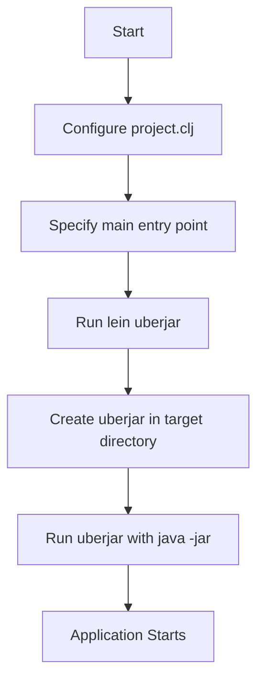

## 13.8.1 Packaging Applications

In this section, we will explore how to package a Clojure web application for deployment. Packaging is a crucial step in the software development lifecycle, as it ensures that your application can be easily distributed and executed in different environments. For Clojure applications, creating an **uberjar** is a common approach. An uberjar is a standalone JAR file that contains all the necessary dependencies, making it easy to deploy and run your application on any system with a Java Virtual Machine (JVM).

### Understanding the Uberjar

An uberjar is essentially a JAR (Java ARchive) file that includes not only your compiled Clojure code but also all the libraries and dependencies your application needs to run. This is similar to creating a "fat JAR" in Java, where all dependencies are bundled into a single archive. The advantage of an uberjar is that it simplifies deployment by reducing the need to manage external dependencies separately.

#### Why Use an Uberjar?

- **Simplicity**: An uberjar encapsulates everything your application needs, reducing the complexity of deployment.
- **Portability**: As long as the target environment has a compatible JVM, your application can run without additional setup.
- **Consistency**: By packaging all dependencies, you ensure that the application behaves consistently across different environments.

### Creating an Uberjar with Leiningen

Leiningen is a popular build automation tool for Clojure, similar to Maven or Gradle in the Java ecosystem. It simplifies the process of managing dependencies, building projects, and creating uberjars.

#### Setting Up Leiningen

Before you can create an uberjar, ensure that Leiningen is installed and configured on your system. You can verify the installation by running:

```bash
lein -v
```

If Leiningen is not installed, follow the instructions on the [official Leiningen website](https://leiningen.org/) to set it up.

#### Configuring Your Project

To create an uberjar, you need to configure your `project.clj` file, which is the configuration file for Leiningen projects. Here is a basic example of a `project.clj` file:

```clojure
(defproject my-clojure-app "0.1.0-SNAPSHOT"
  :description "A simple Clojure web application"
  :url "http://example.com/my-clojure-app"
  :license {:name "Eclipse Public License"
            :url "http://www.eclipse.org/legal/epl-v10.html"}
  :dependencies [[org.clojure/clojure "1.10.3"]
                 [ring/ring-core "1.9.0"]
                 [compojure "1.6.2"]]
  :main ^:skip-aot my-clojure-app.core
  :target-path "target/%s"
  :profiles {:uberjar {:aot :all}})
```

**Key Elements:**

- **`:dependencies`**: Lists all the libraries your application depends on.
- **`:main`**: Specifies the namespace containing the `-main` function, which serves as the entry point for your application.
- **`:profiles`**: Defines different build profiles. The `:uberjar` profile is used to specify settings for creating an uberjar, such as Ahead-of-Time (AOT) compilation.

#### Specifying the Main Entry Point

The `:main` key in `project.clj` is crucial as it tells Leiningen which namespace contains the `-main` function. This function is the starting point of your application, similar to the `main` method in a Java application.

Here's an example of a simple `-main` function in Clojure:

```clojure
(ns my-clojure-app.core
  (:gen-class))

(defn -main
  "The main entry point for the application."
  [& args]
  (println "Hello, World!"))
```

**Explanation:**

- **`(:gen-class)`**: This directive is necessary for generating a Java class file that can be executed by the JVM.
- **`-main` function**: This function is the entry point and can accept command-line arguments.

#### Building the Uberjar

Once your `project.clj` is configured, you can create an uberjar by running the following command in your project's root directory:

```bash
lein uberjar
```

This command compiles your Clojure code, packages it along with all dependencies, and creates an uberjar in the `target` directory.

### Running the Uberjar

After building the uberjar, you can run it using the `java` command:

```bash
java -jar target/my-clojure-app-0.1.0-SNAPSHOT-standalone.jar
```

This command executes the `-main` function specified in your `project.clj`, starting your application.

### Comparing with Java Packaging

In Java, creating a standalone JAR typically involves using build tools like Maven or Gradle to manage dependencies and package the application. The process is conceptually similar to creating an uberjar in Clojure, but with some differences in configuration and syntax.

**Java Example:**

Here's a simple example of a `pom.xml` file for a Maven project that packages a Java application into a JAR:

```xml
<project xmlns="http://maven.apache.org/POM/4.0.0"
         xmlns:xsi="http://www.w3.org/2001/XMLSchema-instance"
         xsi:schemaLocation="http://maven.apache.org/POM/4.0.0 http://maven.apache.org/xsd/maven-4.0.0.xsd">
    <modelVersion>4.0.0</modelVersion>
    <groupId>com.example</groupId>
    <artifactId>my-java-app</artifactId>
    <version>1.0-SNAPSHOT</version>
    <build>
        <plugins>
            <plugin>
                <groupId>org.apache.maven.plugins</groupId>
                <artifactId>maven-jar-plugin</artifactId>
                <version>3.2.0</version>
                <configuration>
                    <archive>
                        <manifest>
                            <mainClass>com.example.Main</mainClass>
                        </manifest>
                    </archive>
                </configuration>
            </plugin>
        </plugins>
    </build>
</project>
```

**Comparison:**

- **Dependency Management**: Both Leiningen and Maven manage dependencies, but Leiningen uses a more concise syntax with Clojure's data structures.
- **Build Configuration**: Leiningen's `project.clj` is more concise compared to Maven's XML-based `pom.xml`.
- **Entry Point Specification**: Both tools require specifying the main class or namespace, but the syntax differs due to language differences.

### Advanced Packaging Techniques

While creating an uberjar is a straightforward process, there are advanced techniques and configurations you can use to optimize your packaging process.

#### Excluding Unnecessary Files

You can exclude certain files or directories from the uberjar to reduce its size. This can be done by adding an `:uberjar-exclusions` key to your `project.clj`:

```clojure
:uberjar-exclusions [#"\.clj$" #"log4j.properties"]
```

This example excludes all `.clj` source files and `log4j.properties` from the uberjar.

#### Customizing the Manifest File

The manifest file in a JAR contains metadata about the archive. You can customize the manifest file by adding a `:manifest` key to your `project.clj`:

```clojure
:manifest {"Built-By" "Your Name"
           "Built-Date" "2024-11-25"}
```

#### Multi-Module Projects

For larger projects with multiple modules, you can use Leiningen's `:sub` key to define subprojects. This allows you to manage dependencies and build configurations for each module separately.

### Try It Yourself

Now that we've covered the basics of creating an uberjar, try packaging a simple Clojure web application yourself. Experiment with different configurations in your `project.clj` file, such as excluding files or customizing the manifest. You can also try creating a multi-module project to see how Leiningen handles complex builds.

### Diagrams and Visual Aids

To help visualize the process of creating an uberjar, let's look at a flowchart that outlines the steps involved:



**Diagram Description**: This flowchart illustrates the steps involved in creating and running an uberjar for a Clojure application. It begins with configuring the `project.clj` file and ends with starting the application using the `java -jar` command.

### External Resources

For more information on packaging Clojure applications, check out the following resources:

- [Leiningen Official Documentation](https://leiningen.org/)
- [Clojure Documentation on Packaging](https://clojure.org/guides/deployment)
- [ClojureDocs](https://clojuredocs.org/)

### Exercises and Practice Problems

1. **Create a Simple Web Application**: Build a basic Clojure web application using Ring and Compojure. Package it as an uberjar and run it on your local machine.

2. **Experiment with Exclusions**: Modify your `project.clj` to exclude certain files from the uberjar. Verify that the excluded files are not present in the final JAR.

3. **Customize the Manifest**: Add custom entries to the manifest file in your uberjar. Use a tool like `jar` to inspect the manifest and verify your changes.

4. **Multi-Module Project**: Create a multi-module Clojure project using Leiningen. Package each module as an uberjar and test their interoperability.

### Summary and Key Takeaways

- **Uberjar**: A standalone JAR file containing all dependencies, simplifying deployment.
- **Leiningen**: A powerful build tool for managing Clojure projects and creating uberjars.
- **Configuration**: The `project.clj` file is central to defining dependencies, the main entry point, and build profiles.
- **Comparison with Java**: Similar to Java's fat JARs, but with a more concise configuration syntax.
- **Advanced Techniques**: Excluding files, customizing the manifest, and handling multi-module projects.

By mastering the process of creating an uberjar, you can streamline the deployment of your Clojure applications, ensuring they run smoothly across different environments. Now, let's apply these concepts to package and deploy your Clojure web applications effectively.

## Quiz: Mastering Clojure Application Packaging



### What is an uberjar in Clojure?

- [x] A standalone JAR file containing all dependencies
- [ ] A JAR file without dependencies
- [ ] A tool for managing Clojure dependencies
- [ ] A build tool for Java applications

> **Explanation:** An uberjar is a standalone JAR file that includes all the necessary dependencies for a Clojure application.

### Which tool is commonly used to create an uberjar in Clojure?

- [x] Leiningen
- [ ] Maven
- [ ] Gradle
- [ ] Ant

> **Explanation:** Leiningen is the build automation tool commonly used in the Clojure ecosystem to create uberjars.

### What key in `project.clj` specifies the main entry point for a Clojure application?

- [x] `:main`
- [ ] `:entry`
- [ ] `:start`
- [ ] `:init`

> **Explanation:** The `:main` key in `project.clj` specifies the namespace containing the `-main` function, which is the entry point for the application.

### How do you run a Clojure uberjar?

- [x] `java -jar target/my-clojure-app-0.1.0-SNAPSHOT-standalone.jar`
- [ ] `lein run`
- [ ] `clojure -M:run`
- [ ] `lein uberjar`

> **Explanation:** The `java -jar` command is used to run a standalone JAR file, such as an uberjar.

### What is the purpose of the `:profiles` key in `project.clj`?

- [x] To define different build configurations
- [ ] To list project dependencies
- [ ] To specify the main entry point
- [ ] To manage version control

> **Explanation:** The `:profiles` key in `project.clj` is used to define different build configurations, such as settings for creating an uberjar.

### Which command creates an uberjar in a Clojure project?

- [x] `lein uberjar`
- [ ] `lein build`
- [ ] `lein package`
- [ ] `lein compile`

> **Explanation:** The `lein uberjar` command compiles the Clojure code and packages it along with all dependencies into an uberjar.

### What is the advantage of using an uberjar?

- [x] Simplifies deployment by bundling all dependencies
- [ ] Reduces application size
- [ ] Increases application performance
- [ ] Eliminates the need for a JVM

> **Explanation:** An uberjar simplifies deployment by bundling all dependencies into a single JAR file, ensuring the application can run consistently across environments.

### How can you exclude files from an uberjar?

- [x] Use the `:uberjar-exclusions` key in `project.clj`
- [ ] Delete files manually before packaging
- [ ] Use a command-line flag with `lein uberjar`
- [ ] Modify the JAR file after creation

> **Explanation:** The `:uberjar-exclusions` key in `project.clj` allows you to specify patterns for files to exclude from the uberjar.

### What is the purpose of the `(:gen-class)` directive in a Clojure namespace?

- [x] To generate a Java class file for execution
- [ ] To import Java classes
- [ ] To define a new Clojure class
- [ ] To compile Clojure code to Java bytecode

> **Explanation:** The `(:gen-class)` directive is used to generate a Java class file that can be executed by the JVM, necessary for the `-main` function.

### True or False: An uberjar can only be created for Clojure applications.

- [ ] True
- [x] False

> **Explanation:** While the term "uberjar" is commonly associated with Clojure, similar standalone JAR files can be created for Java applications using tools like Maven or Gradle.


