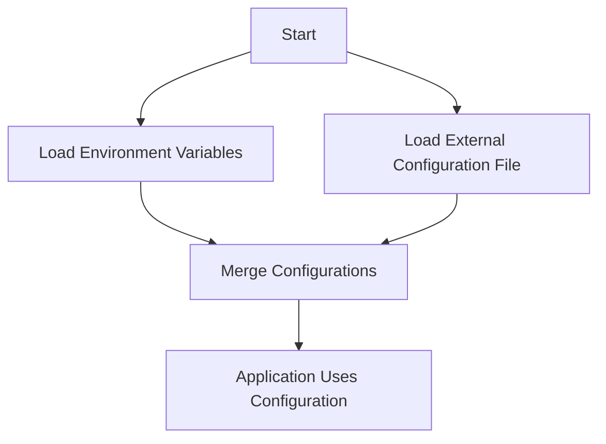

## 13.8.3 Environment Configuration

In the world of web development, managing different configurations for development, testing, and production environments is crucial. This ensures that your application behaves correctly across various stages of deployment. In this section, we'll explore how to handle environment configurations in Clojure web applications, leveraging libraries like `environ` to manage environment variables and external configuration files effectively.

### Understanding Environment Configuration

Environment configuration refers to the practice of setting up different parameters and settings for your application based on the environment it is running in. This includes:

- **Development**: Where you write and test your code.
- **Testing**: Where automated tests are run to ensure code quality.
- **Production**: Where the application is live and used by end-users.

Each environment may require different settings for database connections, API keys, logging levels, and more. Proper configuration management allows you to switch between these environments seamlessly.

### Why Environment Configuration Matters

For experienced Java developers, the concept of environment configuration might be familiar, as it is a common practice in Java applications. However, Clojure offers unique tools and libraries that simplify this process, making it more efficient and less error-prone.

**Key Benefits:**

- **Consistency**: Ensures that the application behaves consistently across different environments.
- **Security**: Keeps sensitive information like API keys and database passwords out of the source code.
- **Flexibility**: Allows easy switching between environments without modifying the codebase.

### Introducing Environ

One of the most popular libraries for managing environment configurations in Clojure is `environ`. It provides a simple way to access environment variables and external configuration files, making it easy to manage different settings for different environments.

#### Installing Environ

To get started with `environ`, you need to add it to your project dependencies. If you're using Leiningen, add the following to your `project.clj` file:

```clojure
:dependencies [[environ "1.2.0"]]
```

For those using `tools.deps`, add it to your `deps.edn`:

```clojure
{:deps {environ {:mvn/version "1.2.0"}}}
```

#### Basic Usage of Environ

`environ` allows you to access environment variables using the `env` function. Here's a simple example:

```clojure
(ns my-app.core
  (:require [environ.core :refer [env]]))

(defn get-database-url []
  (env :database-url))
```

In this example, `get-database-url` retrieves the value of the `DATABASE_URL` environment variable. You can set this variable differently in each environment.

#### Using Profiles for Environment-Specific Configurations

Clojure's build tools, like Leiningen, support profiles that allow you to define environment-specific configurations. Here's how you can set up profiles in your `project.clj`:

```clojure
:profiles {:dev  {:env {:database-url "jdbc:postgresql://localhost/dev-db"}}
           :test {:env {:database-url "jdbc:postgresql://localhost/test-db"}}
           :prod {:env {:database-url "jdbc:postgresql://prod-db"}}}
```

With these profiles, you can run your application in different environments by specifying the profile:

```bash
lein with-profile dev run
lein with-profile test run
lein with-profile prod run
```

### External Configuration Files

In addition to environment variables, you can use external configuration files to manage your settings. This is particularly useful for complex configurations that are difficult to manage as environment variables.

#### Creating a Configuration File

Create a configuration file, such as `config.edn`, with the following content:

```clojure
{:database-url "jdbc:postgresql://localhost/dev-db"
 :api-key "your-api-key"}
```

#### Loading Configuration Files

You can load this configuration file in your application using the `clojure.edn` library:

```clojure
(ns my-app.config
  (:require [clojure.edn :as edn]
            [clojure.java.io :as io]))

(defn load-config []
  (with-open [r (io/reader "config.edn")]
    (edn/read r)))
```

This function reads the configuration file and returns a map of the settings, which you can then use in your application.

### Comparing with Java Configuration Management

In Java, configuration management often involves using properties files or frameworks like Spring Boot, which provides a comprehensive configuration management system. Clojure's approach, while simpler, offers flexibility and ease of use, especially with libraries like `environ`.

**Java Example:**

```java
import java.util.Properties;
import java.io.InputStream;
import java.io.IOException;

public class Config {
    private Properties properties = new Properties();

    public Config() {
        try (InputStream input = getClass().getClassLoader().getResourceAsStream("config.properties")) {
            if (input == null) {
                System.out.println("Sorry, unable to find config.properties");
                return;
            }
            properties.load(input);
        } catch (IOException ex) {
            ex.printStackTrace();
        }
    }

    public String getDatabaseUrl() {
        return properties.getProperty("database.url");
    }
}
```

**Clojure Equivalent:**

```clojure
(ns my-app.config
  (:require [clojure.edn :as edn]
            [clojure.java.io :as io]))

(defn load-config []
  (with-open [r (io/reader "config.edn")]
    (edn/read r)))

(defn get-database-url [config]
  (:database-url config))
```

### Best Practices for Environment Configuration

1. **Keep Configuration Out of Code**: Avoid hardcoding configuration values in your source code. Use environment variables or external configuration files instead.

2. **Use Profiles for Different Environments**: Leverage profiles to manage different configurations for development, testing, and production environments.

3. **Secure Sensitive Information**: Ensure that sensitive information like API keys and database passwords are stored securely and not exposed in your codebase.

4. **Document Configuration Settings**: Maintain clear documentation of all configuration settings and their purpose.

5. **Test Configuration Changes**: Always test configuration changes in a safe environment before deploying to production.

### Try It Yourself

To solidify your understanding, try modifying the configuration examples provided:

- Change the database URL in the configuration file and observe how it affects your application.
- Add a new configuration setting, such as a logging level, and use it in your application.
- Experiment with different profiles and see how they change the behavior of your application.

### Diagram: Configuration Flow

Below is a diagram illustrating the flow of configuration data in a Clojure application using `environ` and external configuration files.



**Diagram Description**: This flowchart shows how a Clojure application loads environment variables and external configuration files, merges them, and uses the resulting configuration.

### Further Reading

For more information on environment configuration in Clojure, consider exploring the following resources:

- [Official Clojure Documentation](https://clojure.org/)
- [Environ GitHub Repository](https://github.com/weavejester/environ)
- [ClojureDocs](https://clojuredocs.org/)

### Exercises

1. **Exercise 1**: Create a new Clojure project and set up environment-specific configurations using `environ`. Test your application in different environments.

2. **Exercise 2**: Implement a feature that requires an API key, and manage this key using environment variables.

3. **Exercise 3**: Refactor an existing Java application to use external configuration files, and compare the process with the Clojure approach.

### Key Takeaways

- Environment configuration is essential for managing different settings across development, testing, and production environments.
- Clojure offers libraries like `environ` to simplify configuration management.
- Using environment variables and external configuration files keeps your application flexible and secure.
- Profiles in Leiningen or `tools.deps` allow you to manage environment-specific configurations easily.

Now that we've explored how to manage environment configurations in Clojure, you're equipped to handle different settings across various stages of your application's lifecycle. This knowledge will help you build robust, flexible, and secure Clojure web applications.

## Quiz: Mastering Environment Configuration in Clojure



### What is the primary purpose of environment configuration in web applications?

- [x] To manage different settings for development, testing, and production environments
- [ ] To compile the application code
- [ ] To handle user authentication
- [ ] To optimize database queries

> **Explanation:** Environment configuration is used to manage different settings for various environments, ensuring consistent application behavior.

### Which library is commonly used in Clojure for managing environment variables?

- [x] Environ
- [ ] Ring
- [ ] Compojure
- [ ] Luminus

> **Explanation:** Environ is a popular library in Clojure for handling environment variables and external configuration files.

### How can you define environment-specific configurations in Leiningen?

- [x] By using profiles in the `project.clj` file
- [ ] By modifying the `src` directory
- [ ] By changing the `README.md` file
- [ ] By editing the `target` directory

> **Explanation:** Profiles in the `project.clj` file allow you to define environment-specific configurations in Leiningen.

### What is a key benefit of using external configuration files?

- [x] They allow for complex configurations that are difficult to manage as environment variables
- [ ] They increase the application's execution speed
- [ ] They reduce the size of the application
- [ ] They eliminate the need for a database

> **Explanation:** External configuration files are useful for managing complex configurations that are not easily handled as environment variables.

### What is the equivalent of Java's properties files in Clojure for configuration management?

- [x] EDN files
- [ ] XML files
- [ ] JSON files
- [ ] YAML files

> **Explanation:** EDN files are commonly used in Clojure for configuration management, similar to Java's properties files.

### Which of the following is a best practice for environment configuration?

- [x] Keeping configuration out of the source code
- [ ] Hardcoding configuration values
- [ ] Using the same configuration for all environments
- [ ] Storing configuration in the database

> **Explanation:** Keeping configuration out of the source code is a best practice to ensure flexibility and security.

### How can you access an environment variable in Clojure using Environ?

- [x] Using the `env` function
- [ ] Using the `get` function
- [ ] Using the `read` function
- [ ] Using the `load` function

> **Explanation:** The `env` function in Environ is used to access environment variables in Clojure.

### What is the purpose of the `with-open` function in Clojure when loading configuration files?

- [x] To ensure the file is properly closed after reading
- [ ] To write data to the file
- [ ] To delete the file after use
- [ ] To encrypt the file contents

> **Explanation:** The `with-open` function ensures that the file is properly closed after reading, preventing resource leaks.

### Which of the following is NOT a benefit of using environment configuration?

- [ ] Consistency across environments
- [ ] Security of sensitive information
- [ ] Flexibility in switching environments
- [x] Increased application speed

> **Explanation:** While environment configuration offers consistency, security, and flexibility, it does not directly increase application speed.

### True or False: Profiles in Leiningen can be used to manage different configurations for development, testing, and production environments.

- [x] True
- [ ] False

> **Explanation:** True. Profiles in Leiningen allow you to manage different configurations for various environments.


