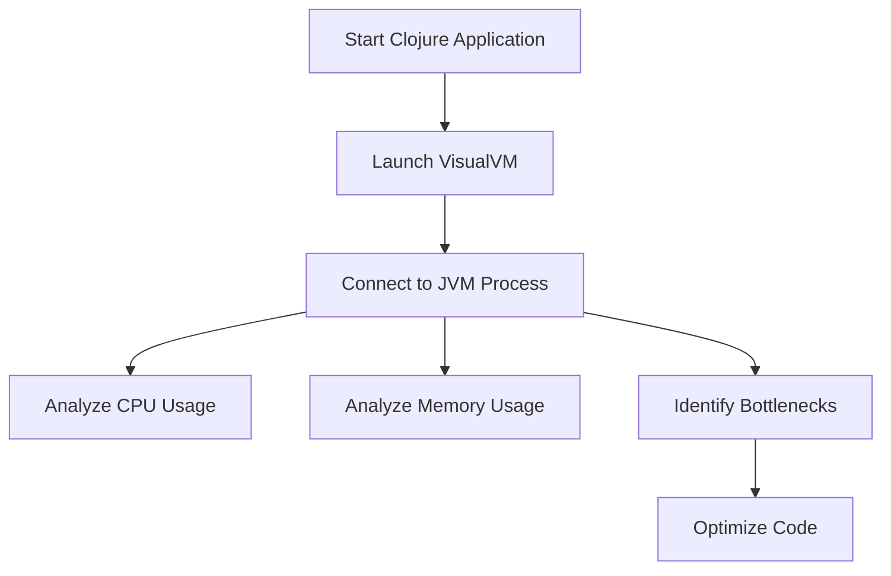

## 13.9.1 Profiling and Benchmarking

In the realm of web development, performance is paramount. As experienced Java developers transitioning to Clojure, understanding how to profile and benchmark your Clojure web applications is crucial for identifying performance bottlenecks and ensuring your applications run efficiently. In this section, we will explore various tools and techniques for profiling and benchmarking Clojure applications, drawing parallels to Java where applicable.

### Understanding Profiling and Benchmarking

**Profiling** is the process of analyzing a program to determine where it spends most of its time or resources, such as CPU or memory usage. **Benchmarking**, on the other hand, involves measuring the performance of specific code segments to evaluate their efficiency.

#### Why Profiling and Benchmarking Matter

- **Identify Bottlenecks**: Detect which parts of your application are consuming the most resources.
- **Optimize Performance**: Improve the efficiency of your code by focusing on critical areas.
- **Ensure Scalability**: Prepare your application to handle increased loads effectively.

### Profiling Clojure Applications

Profiling Clojure applications involves using tools that can analyze JVM performance, as Clojure runs on the Java Virtual Machine (JVM). Here are some popular profiling tools:

#### YourKit

YourKit is a powerful profiler for Java applications, offering features like CPU and memory profiling, thread analysis, and more.

- **Installation**: Download and install YourKit from [YourKit's official website](https://www.yourkit.com/).
- **Integration**: Use the YourKit agent to attach to your running Clojure application.
- **Analysis**: Visualize CPU usage, memory allocation, and thread activity.

#### VisualVM

VisualVM is a free tool that provides detailed information about Java applications running on the JVM.

- **Installation**: VisualVM is included with the JDK. You can also download it separately from [VisualVM's website](https://visualvm.github.io/).
- **Usage**: Launch VisualVM and connect to your Clojure application's JVM process.
- **Features**: Monitor CPU and memory usage, analyze heap dumps, and track thread activity.

#### JProfiler

JProfiler offers advanced profiling capabilities, including CPU, memory, and thread profiling.

- **Installation**: Download JProfiler from [JProfiler's website](https://www.ej-technologies.com/products/jprofiler/overview.html).
- **Integration**: Attach JProfiler to your Clojure application using its agent.
- **Features**: Analyze CPU hotspots, memory leaks, and thread contention.

### Benchmarking Clojure Code

Benchmarking in Clojure can be effectively performed using the `criterium` library, which provides robust tools for measuring code performance.

#### Setting Up Criterium

To use `criterium`, add it to your project dependencies:

```clojure
;; Add to your project.clj or deps.edn
[criterium "0.4.6"]
```

#### Basic Benchmarking with Criterium

Here's a simple example of how to benchmark a function using `criterium`:

```clojure
(ns myapp.benchmark
  (:require [criterium.core :refer [bench]]))

(defn example-function [n]
  (reduce + (range n)))

;; Benchmark the function
(bench (example-function 1000))
```

**Explanation**: The `bench` function runs the provided expression multiple times, measuring execution time and providing statistical analysis.

#### Interpreting Results

Criterium provides detailed output, including:

- **Mean Execution Time**: Average time taken for execution.
- **Standard Deviation**: Variability in execution time.
- **Percentiles**: Execution time distribution.

### Comparing Clojure and Java Profiling

While the tools for profiling Clojure and Java applications are similar due to the shared JVM platform, there are some differences in approach:

- **Clojure's Functional Nature**: Focus on optimizing pure functions and leveraging immutability.
- **Java's Object-Oriented Approach**: Emphasize optimizing object creation and method calls.

### Practical Example: Profiling a Clojure Web Application

Let's profile a simple Clojure web application using Ring and Compojure:

#### Setting Up the Application

```clojure
(ns myapp.core
  (:require [ring.adapter.jetty :refer [run-jetty]]
            [compojure.core :refer [defroutes GET]]
            [compojure.route :as route]))

(defroutes app-routes
  (GET "/" [] "Hello, World!")
  (route/not-found "Not Found"))

(defn -main []
  (run-jetty app-routes {:port 3000}))
```

#### Profiling with VisualVM

1. **Start the Application**: Run your Clojure application.
2. **Launch VisualVM**: Open VisualVM and connect to the JVM process.
3. **Analyze Performance**: Use VisualVM's CPU and memory profiling tools to identify bottlenecks.

### Try It Yourself

Experiment with the following:

- **Modify the Function**: Change the `example-function` to perform different operations and observe the impact on performance.
- **Profile Different Endpoints**: Add more routes to the web application and profile their performance.
- **Compare Tools**: Use both YourKit and VisualVM to profile the same application and compare the insights.

### Diagrams and Visualizations

Below is a flowchart illustrating the process of profiling a Clojure web application using VisualVM:



*Diagram 1: Profiling a Clojure Web Application with VisualVM*

### Key Takeaways

- **Profiling and Benchmarking** are essential for optimizing Clojure web applications.
- **Tools like YourKit, VisualVM, and JProfiler** provide powerful insights into JVM performance.
- **Criterium** is a valuable library for benchmarking Clojure code.
- **Understanding the differences** between Clojure and Java profiling can help in effectively optimizing applications.

### Exercises

1. **Profile a Clojure Web Application**: Set up a simple web application and use VisualVM to profile its performance. Identify any bottlenecks and suggest optimizations.
2. **Benchmark a Function**: Write a Clojure function that performs a computationally intensive task. Use `criterium` to benchmark its performance and explore ways to optimize it.
3. **Compare Profiling Tools**: Use both YourKit and JProfiler to profile the same Clojure application. Compare the insights provided by each tool.

### Further Reading

- [Clojure Official Documentation](https://clojure.org/)
- [Criterium GitHub Repository](https://github.com/hugoduncan/criterium)
- [VisualVM Documentation](https://visualvm.github.io/documentation.html)

Now that we've explored profiling and benchmarking in Clojure, you're equipped to optimize your web applications for performance and scalability. Let's continue to refine our skills and build efficient, high-performing Clojure applications.

## Quiz: Mastering Profiling and Benchmarking in Clojure



### Which tool is included with the JDK and provides detailed JVM information?

- [ ] YourKit
- [x] VisualVM
- [ ] JProfiler
- [ ] Criterium

> **Explanation:** VisualVM is included with the JDK and provides detailed information about Java applications running on the JVM.

### What is the primary purpose of benchmarking in Clojure?

- [ ] To analyze memory usage
- [x] To measure performance of specific code segments
- [ ] To visualize thread activity
- [ ] To monitor CPU usage

> **Explanation:** Benchmarking involves measuring the performance of specific code segments to evaluate their efficiency.

### Which library is commonly used for benchmarking in Clojure?

- [ ] YourKit
- [ ] VisualVM
- [ ] JProfiler
- [x] Criterium

> **Explanation:** Criterium is a library used for benchmarking in Clojure, providing tools for measuring code performance.

### What does the `bench` function in Criterium do?

- [ ] Analyzes memory allocation
- [x] Runs an expression multiple times and measures execution time
- [ ] Visualizes CPU usage
- [ ] Tracks thread activity

> **Explanation:** The `bench` function in Criterium runs the provided expression multiple times, measuring execution time and providing statistical analysis.

### Which of the following is a feature of YourKit?

- [x] CPU and memory profiling
- [ ] Benchmarking specific code segments
- [ ] Included with the JDK
- [ ] Free to use

> **Explanation:** YourKit offers features like CPU and memory profiling, thread analysis, and more.

### What is the main difference between profiling and benchmarking?

- [ ] Profiling measures specific code segments; benchmarking analyzes overall application performance
- [x] Profiling analyzes overall application performance; benchmarking measures specific code segments
- [ ] Profiling and benchmarking are the same
- [ ] Profiling is only for memory usage; benchmarking is only for CPU usage

> **Explanation:** Profiling analyzes overall application performance, while benchmarking measures the performance of specific code segments.

### Which tool provides advanced profiling capabilities including CPU, memory, and thread profiling?

- [ ] VisualVM
- [ ] Criterium
- [x] JProfiler
- [ ] YourKit

> **Explanation:** JProfiler offers advanced profiling capabilities, including CPU, memory, and thread profiling.

### What is the purpose of the `criterium` library in Clojure?

- [ ] To profile memory usage
- [ ] To visualize thread activity
- [x] To benchmark code performance
- [ ] To monitor CPU usage

> **Explanation:** The `criterium` library is used to benchmark code performance in Clojure.

### Which of the following is NOT a feature of VisualVM?

- [ ] Monitoring CPU usage
- [ ] Analyzing heap dumps
- [ ] Tracking thread activity
- [x] Benchmarking specific code segments

> **Explanation:** VisualVM is used for profiling, not benchmarking specific code segments.

### True or False: Clojure's functional nature requires a different approach to profiling compared to Java's object-oriented approach.

- [x] True
- [ ] False

> **Explanation:** Clojure's functional nature, with its emphasis on pure functions and immutability, requires a different approach to profiling compared to Java's object-oriented approach.


