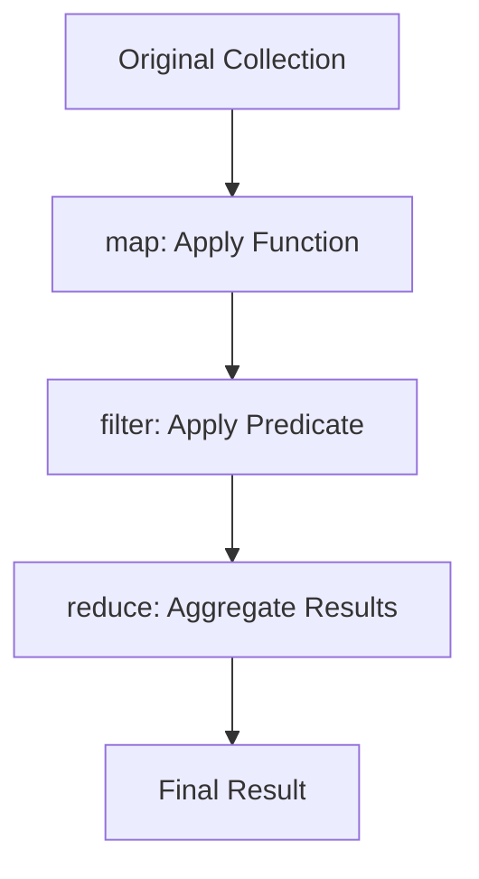

## 14.1.1 Functional Data Transformation

In this section, we delve into the world of functional data transformation in Clojure, a powerful paradigm that allows us to manipulate data with elegance and efficiency. As experienced Java developers, you are likely familiar with the imperative approach to data manipulation, which often involves loops and mutable state. Clojure, with its functional programming roots, offers a different approach that emphasizes immutability and the use of higher-order functions.

### Understanding Functional Data Transformation

Functional data transformation involves using functions to transform data from one form to another. In Clojure, this is achieved through a set of powerful higher-order functions such as `map`, `filter`, `reduce`, and `transduce`. These functions allow us to process collections in a declarative manner, leading to more concise and readable code.

#### The Power of Higher-Order Functions

Higher-order functions are functions that can take other functions as arguments or return them as results. This concept is central to functional programming and is a key feature of Clojure. Let's explore some of the most commonly used higher-order functions for data transformation.

### `map`: Transforming Collections

The `map` function applies a given function to each element of a collection, returning a new collection of the results. This is akin to the `Stream.map` method introduced in Java 8, but with a more concise syntax.

```clojure
;; Clojure example using map
(def numbers [1 2 3 4 5])

(defn square [x]
  (* x x))

(def squared-numbers (map square numbers))
;; => (1 4 9 16 25)

;; Java equivalent using streams
List<Integer> numbers = Arrays.asList(1, 2, 3, 4, 5);
List<Integer> squaredNumbers = numbers.stream()
                                      .map(x -> x * x)
                                      .collect(Collectors.toList());
```

In the Clojure example, `map` takes the `square` function and applies it to each element of the `numbers` vector, returning a new sequence of squared numbers.

### `filter`: Selecting Elements

The `filter` function selects elements from a collection that satisfy a given predicate function. This is similar to the `Stream.filter` method in Java.

```clojure
;; Clojure example using filter
(defn even? [x]
  (zero? (mod x 2)))

(def even-numbers (filter even? numbers))
;; => (2 4)

;; Java equivalent using streams
List<Integer> evenNumbers = numbers.stream()
                                   .filter(x -> x % 2 == 0)
                                   .collect(Collectors.toList());
```

Here, `filter` is used to select only the even numbers from the `numbers` vector.

### `reduce`: Aggregating Data

The `reduce` function is used to aggregate data in a collection, combining elements using a binary function. This is similar to the `Stream.reduce` method in Java.

```clojure
;; Clojure example using reduce
(def sum (reduce + numbers))
;; => 15

;; Java equivalent using streams
int sum = numbers.stream()
                 .reduce(0, Integer::sum);
```

In this example, `reduce` is used to calculate the sum of the numbers in the collection.

### `transduce`: Composing Transformations

`transduce` is a more advanced function that allows for the composition of transformations and reductions. It combines the power of `map`, `filter`, and `reduce` into a single operation, often resulting in more efficient data processing.

```clojure
;; Clojure example using transduce
(defn transduce-example []
  (transduce
    (comp (map square) (filter even?))
    +
    0
    numbers))
;; => 20
```

In this example, `transduce` is used to first square the numbers, then filter for even numbers, and finally sum them up. The `comp` function is used to compose the `map` and `filter` transformations.

### Visualizing Data Transformation

To better understand the flow of data through these transformations, let's visualize the process using a flowchart.



**Diagram Description**: This flowchart illustrates the process of transforming a collection using `map`, `filter`, and `reduce`. Data flows from the original collection through each transformation step, resulting in the final aggregated result.

### Comparing Clojure and Java Approaches

While Java's Stream API introduced functional-style operations, Clojure's approach is more idiomatic and concise due to its functional programming nature. Clojure's emphasis on immutability and first-class functions allows for more expressive and flexible data transformations.

### Try It Yourself

Experiment with the following Clojure code by modifying the transformation functions or the collection:

```clojure
(def data [1 2 3 4 5 6 7 8 9 10])

(defn custom-transform [x]
  (* x 3))

(def transformed-data
  (->> data
       (map custom-transform)
       (filter odd?)
       (reduce +)))

;; Try changing the custom-transform function or the filter predicate
```

### Exercises

1. **Exercise 1**: Write a Clojure function that uses `map` and `filter` to transform a list of strings, converting them to uppercase and selecting only those that start with the letter 'A'.

2. **Exercise 2**: Implement a `reduce` function to find the maximum value in a collection of numbers.

3. **Exercise 3**: Use `transduce` to combine multiple transformations on a collection of integers, such as squaring the numbers, filtering out those greater than 50, and summing the results.

### Key Takeaways

- **Higher-Order Functions**: Clojure's `map`, `filter`, `reduce`, and `transduce` provide powerful tools for functional data transformation.
- **Immutability**: Emphasizing immutable data structures leads to safer and more predictable code.
- **Expressiveness**: Clojure's syntax allows for concise and expressive data manipulation, often with fewer lines of code compared to Java.
- **Efficiency**: Using `transduce` can optimize performance by combining transformations into a single pass over the data.

By mastering these functional data transformation techniques, you can harness the full power of Clojure to write clean, efficient, and maintainable code.

### Further Reading

- [Official Clojure Documentation](https://clojure.org/reference)
- [ClojureDocs](https://clojuredocs.org/)
- [Functional Programming in Java: Harnessing the Power of Java 8 Lambda Expressions](https://www.amazon.com/Functional-Programming-Java-Harnessing-Expressions/dp/1937785467)

## Quiz: Test Your Knowledge on Functional Data Transformation



### What is the primary purpose of the `map` function in Clojure?

- [x] To apply a function to each element of a collection
- [ ] To filter elements from a collection
- [ ] To aggregate elements in a collection
- [ ] To sort elements in a collection

> **Explanation:** The `map` function is used to apply a given function to each element of a collection, resulting in a new collection of transformed elements.

### Which Clojure function is used to select elements from a collection based on a predicate?

- [ ] map
- [x] filter
- [ ] reduce
- [ ] transduce

> **Explanation:** The `filter` function is used to select elements from a collection that satisfy a given predicate function.

### How does `reduce` differ from `map` and `filter`?

- [x] It aggregates data using a binary function
- [ ] It applies a function to each element
- [ ] It selects elements based on a predicate
- [ ] It sorts the collection

> **Explanation:** `reduce` is used to aggregate data in a collection by combining elements using a binary function, unlike `map` and `filter` which transform or select elements.

### What is the advantage of using `transduce` over separate `map` and `filter` operations?

- [x] It combines transformations into a single pass for efficiency
- [ ] It allows for mutable data structures
- [ ] It simplifies syntax
- [ ] It is only used for sorting

> **Explanation:** `transduce` combines multiple transformations into a single pass over the data, which can improve performance by reducing the number of iterations.

### Which of the following is a higher-order function in Clojure?

- [x] map
- [x] filter
- [x] reduce
- [ ] println

> **Explanation:** `map`, `filter`, and `reduce` are higher-order functions because they take other functions as arguments. `println` is not a higher-order function.

### In Clojure, what does the `comp` function do?

- [x] Composes multiple functions into a single function
- [ ] Compares two values
- [ ] Compiles Clojure code
- [ ] Computes the sum of a collection

> **Explanation:** The `comp` function is used to compose multiple functions into a single function, allowing for function composition in Clojure.

### What is the result of `(reduce + [1 2 3 4])` in Clojure?

- [x] 10
- [ ] 24
- [ ] 0
- [ ] 4

> **Explanation:** The `reduce` function aggregates the elements of the collection `[1 2 3 4]` using the `+` operator, resulting in 10.

### Which function would you use to transform a collection of numbers by doubling each value?

- [x] map
- [ ] filter
- [ ] reduce
- [ ] transduce

> **Explanation:** The `map` function is used to apply a transformation, such as doubling each value, to each element of a collection.

### What is the purpose of the `->>` macro in Clojure?

- [x] To thread a collection through a series of transformations
- [ ] To define a new function
- [ ] To declare a variable
- [ ] To create a new namespace

> **Explanation:** The `->>` macro is used to thread a collection through a series of transformations, often used with `map`, `filter`, and `reduce`.

### True or False: Clojure's `map` function modifies the original collection.

- [ ] True
- [x] False

> **Explanation:** Clojure's `map` function returns a new collection with the transformed elements, leaving the original collection unchanged due to immutability.


