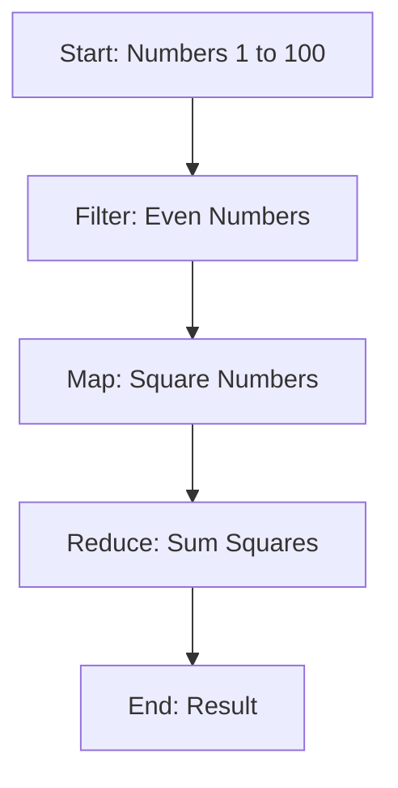

## 14.1.2 Building Data Pipelines

In this section, we will explore how to build efficient data pipelines in Clojure, leveraging its functional programming paradigms. As experienced Java developers, you are likely familiar with data processing using streams and collections. Clojure offers a powerful and expressive way to handle data transformations through its immutable data structures and higher-order functions. Let's dive into the world of data pipelines in Clojure and see how they can simplify and enhance your data processing tasks.

### Understanding Data Pipelines

A data pipeline is a series of data processing steps, where the output of one step serves as the input to the next. This concept is akin to Java's `Stream` API, where operations like `map`, `filter`, and `reduce` are chained together to process collections. In Clojure, we achieve similar functionality using sequences and higher-order functions.

#### Key Concepts

- **Immutability**: Clojure's data structures are immutable, meaning they cannot be changed after creation. This ensures thread safety and simplifies reasoning about data transformations.
- **Higher-Order Functions**: Functions that take other functions as arguments or return them as results. They are the building blocks of data pipelines in Clojure.
- **Lazy Evaluation**: Clojure sequences are lazy, meaning they are computed on demand. This allows for efficient processing of large datasets without loading everything into memory.

### Building a Simple Data Pipeline

Let's start by building a simple data pipeline in Clojure. We'll use a dataset of numbers and perform a series of transformations: filtering, mapping, and reducing.

```clojure
;; Define a sequence of numbers
(def numbers (range 1 101))

;; Define a pipeline to filter even numbers, square them, and sum the results
(defn process-numbers [nums]
  (->> nums
       (filter even?)          ;; Step 1: Filter even numbers
       (map #(* % %))          ;; Step 2: Square each number
       (reduce +)))            ;; Step 3: Sum the squares

;; Execute the pipeline
(def result (process-numbers numbers))
(println "Sum of squares of even numbers:" result)
```

**Explanation**:
- **Filter**: We use `filter` to retain only even numbers.
- **Map**: We apply a function to square each number.
- **Reduce**: We sum the squared numbers.

### Comparing with Java Streams

In Java, a similar pipeline can be constructed using the `Stream` API:

```java
import java.util.stream.IntStream;

public class DataPipeline {
    public static void main(String[] args) {
        int sumOfSquares = IntStream.rangeClosed(1, 100)
                                    .filter(n -> n % 2 == 0)
                                    .map(n -> n * n)
                                    .sum();
        System.out.println("Sum of squares of even numbers: " + sumOfSquares);
    }
}
```

**Comparison**:
- Both Clojure and Java use a sequence of operations to transform data.
- Clojure's syntax is more concise due to its functional nature and use of higher-order functions.
- Java requires explicit type declarations and lambda expressions.

### Advanced Data Pipelines

Now, let's explore more advanced data pipelines in Clojure, incorporating concepts like transducers and parallel processing.

#### Using Transducers

Transducers are a powerful feature in Clojure that allow you to compose transformations without creating intermediate collections. They are particularly useful for processing large datasets efficiently.

```clojure
;; Define a transducer for filtering and mapping
(def my-transducer
  (comp (filter even?)
        (map #(* % %))))

;; Use the transducer with a collection
(def transduced-result (transduce my-transducer + numbers))
(println "Sum of squares using transducers:" transduced-result)
```

**Explanation**:
- **Transducer**: A composable transformation that can be applied to different contexts (e.g., sequences, channels).
- **Transduce**: Applies a transducer to a collection, reducing it to a single value.

#### Parallel Processing with `pmap`

Clojure provides `pmap` for parallel processing, which can be used to speed up data pipelines by distributing work across multiple threads.

```clojure
;; Parallel map to square numbers
(def parallel-result
  (->> numbers
       (pmap #(* % %))
       (reduce +)))

(println "Sum of squares with parallel processing:" parallel-result)
```

**Explanation**:
- **pmap**: A parallel version of `map` that processes elements concurrently.
- **Performance**: Useful for CPU-bound tasks where parallelism can improve performance.

### Visualizing Data Pipelines

To better understand the flow of data through a pipeline, let's visualize the process using a flowchart.



**Diagram Description**: This flowchart illustrates the steps in our data pipeline, from filtering even numbers to summing their squares.

### Try It Yourself

Experiment with the following modifications to deepen your understanding:

- **Change the filter condition**: Try filtering odd numbers instead.
- **Modify the map function**: Use a different mathematical operation, such as cubing the numbers.
- **Explore different reducers**: Calculate the product of the numbers instead of their sum.

### Best Practices for Building Data Pipelines

- **Use Immutability**: Leverage Clojure's immutable data structures to ensure thread safety and simplify debugging.
- **Compose Functions**: Build pipelines by composing small, reusable functions.
- **Leverage Laziness**: Use lazy sequences to handle large datasets efficiently.
- **Optimize with Transducers**: Avoid intermediate collections by using transducers for complex transformations.
- **Consider Parallelism**: Use `pmap` for CPU-bound tasks to take advantage of multi-core processors.

### Exercises

1. **Create a Data Pipeline**: Build a pipeline that processes a list of strings, filtering those that start with a vowel, converting them to uppercase, and concatenating them into a single string.
2. **Optimize with Transducers**: Refactor the above pipeline to use transducers and compare performance.
3. **Parallel Processing**: Implement a parallel data pipeline that processes a large dataset of numbers, applying a custom transformation and aggregation.

### Key Takeaways

- Clojure's functional programming model simplifies the creation of data pipelines through immutability and higher-order functions.
- Transducers and lazy sequences provide efficient ways to process large datasets without unnecessary memory overhead.
- Parallel processing with `pmap` can significantly improve performance for suitable tasks.

By mastering these concepts, you'll be well-equipped to build robust and efficient data pipelines in Clojure, leveraging its unique features to enhance your data processing capabilities.

### Further Reading

- [Official Clojure Documentation](https://clojure.org/reference/documentation)
- [ClojureDocs](https://clojuredocs.org/)
- [Transducers in Clojure](https://clojure.org/reference/transducers)

Now that we've explored how to build data pipelines in Clojure, let's apply these concepts to transform and analyze data effectively in your applications.

## SEO optimized quiz title



### What is a data pipeline in Clojure?

- [x] A series of data processing steps where the output of one step serves as the input to the next
- [ ] A single function that processes data
- [ ] A database query
- [ ] A type of data structure

> **Explanation:** A data pipeline in Clojure is a series of data processing steps, similar to Java's Stream API, where operations are chained together to process data.

### What is the role of higher-order functions in Clojure data pipelines?

- [x] They allow functions to be passed as arguments or returned as results
- [ ] They provide a way to store data
- [ ] They are used for error handling
- [ ] They define data types

> **Explanation:** Higher-order functions are essential in Clojure data pipelines as they enable the composition of functions, allowing for flexible and reusable transformations.

### How does Clojure's immutability benefit data pipelines?

- [x] It ensures thread safety and simplifies reasoning about data transformations
- [ ] It makes data processing faster
- [ ] It allows for mutable state
- [ ] It requires more memory

> **Explanation:** Immutability in Clojure ensures that data structures cannot be changed, which simplifies reasoning about data transformations and ensures thread safety.

### What is a transducer in Clojure?

- [x] A composable transformation that can be applied to different contexts
- [ ] A type of data structure
- [ ] A parallel processing tool
- [ ] A debugging tool

> **Explanation:** A transducer is a composable transformation that can be applied to various contexts, such as sequences and channels, without creating intermediate collections.

### How does `pmap` improve performance in Clojure data pipelines?

- [x] By processing elements concurrently across multiple threads
- [ ] By reducing memory usage
- [ ] By simplifying code
- [ ] By increasing the number of operations

> **Explanation:** `pmap` improves performance by distributing work across multiple threads, making it suitable for CPU-bound tasks.

### What is the advantage of using lazy sequences in Clojure?

- [x] They allow for efficient processing of large datasets without loading everything into memory
- [ ] They make data processing faster
- [ ] They simplify code
- [ ] They require more memory

> **Explanation:** Lazy sequences in Clojure are computed on demand, allowing for efficient processing of large datasets without loading everything into memory.

### What is the purpose of the `reduce` function in a data pipeline?

- [x] To aggregate data into a single value
- [ ] To filter data
- [ ] To map data
- [ ] To create data structures

> **Explanation:** The `reduce` function aggregates data into a single value, such as summing numbers or concatenating strings.

### How can you optimize a data pipeline with transducers?

- [x] By avoiding intermediate collections and composing transformations
- [ ] By using more memory
- [ ] By simplifying code
- [ ] By increasing the number of operations

> **Explanation:** Transducers optimize data pipelines by avoiding intermediate collections and allowing for the composition of transformations.

### What is the difference between `map` and `pmap` in Clojure?

- [x] `map` processes elements sequentially, while `pmap` processes them concurrently
- [ ] `map` is faster than `pmap`
- [ ] `pmap` uses less memory than `map`
- [ ] `map` is used for filtering data

> **Explanation:** `map` processes elements sequentially, while `pmap` processes them concurrently, making `pmap` suitable for parallel processing.

### True or False: Transducers in Clojure create intermediate collections.

- [ ] True
- [x] False

> **Explanation:** Transducers in Clojure do not create intermediate collections, which makes them efficient for processing large datasets.


