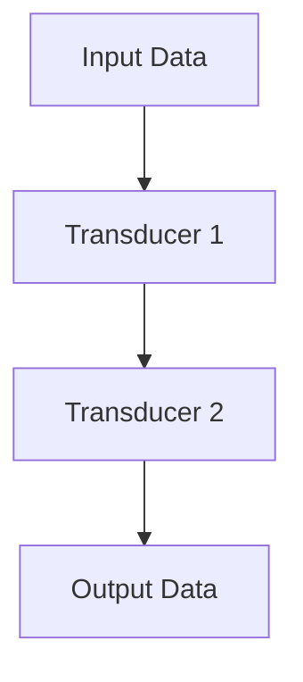

## 14.1.3 Using Transducers

In this section, we delve into **transducers**, a powerful feature in Clojure that allows for efficient data transformation. Transducers enable you to compose and apply data transformations without creating intermediate collections, thus optimizing performance. As experienced Java developers, you will appreciate how transducers can streamline data processing tasks, offering a functional approach that complements your existing knowledge.

### Understanding Transducers

Transducers are a generalization of the map, filter, and other sequence operations. They decouple the transformation logic from the context of its application, allowing you to apply the same transformation logic across different data structures and contexts.

#### Key Concepts

- **Composability**: Transducers allow you to compose multiple transformations into a single operation.
- **Efficiency**: By eliminating intermediate collections, transducers reduce memory overhead and improve performance.
- **Reusability**: Transducers can be applied to various data sources, such as lists, vectors, channels, and streams.

### How Transducers Work

Transducers work by transforming a reducing function. A reducing function is a function that takes an accumulator and an input value and returns a new accumulator. Transducers allow you to compose these functions in a way that can be applied to any context that supports reduction.

#### Basic Example

Let's start with a simple example to illustrate how transducers work:

```clojure
;; Define a transducer that increments each element
(def inc-xf (map inc))

;; Apply the transducer to a collection
(def result (transduce inc-xf + 0 [1 2 3 4 5]))

(println result) ; Output: 20
```

In this example, `inc-xf` is a transducer created using the `map` function. We then use `transduce` to apply this transducer to a collection `[1 2 3 4 5]`, summing the incremented values.

### Transducers vs. Traditional Sequence Operations

In Java, you might use streams to perform similar operations. However, streams often create intermediate collections, which can be inefficient for large datasets. Transducers, on the other hand, eliminate these intermediate steps.

#### Java Stream Example

```java
import java.util.Arrays;
import java.util.List;

public class StreamExample {
    public static void main(String[] args) {
        List<Integer> numbers = Arrays.asList(1, 2, 3, 4, 5);
        int result = numbers.stream()
                            .map(n -> n + 1)
                            .reduce(0, Integer::sum);
        System.out.println(result); // Output: 20
    }
}
```

While Java streams provide a functional approach to data processing, they may not always be as efficient as transducers due to the creation of intermediate collections.

### Composing Transducers

One of the most powerful features of transducers is their ability to compose multiple transformations. This allows you to build complex data processing pipelines with ease.

#### Example: Composing Map and Filter

```clojure
;; Define a transducer that increments and filters even numbers
(def inc-and-filter-even (comp (map inc) (filter even?)))

;; Apply the composed transducer
(def result (transduce inc-and-filter-even conj [] [1 2 3 4 5]))

(println result) ; Output: [2 4 6]
```

In this example, we compose a `map` transducer with a `filter` transducer. The composed transducer increments each number and then filters out the odd numbers.

### Applying Transducers to Different Contexts

Transducers can be applied to various contexts beyond collections, such as channels in Clojure's `core.async` library.

#### Example: Using Transducers with Channels

```clojure
(require '[clojure.core.async :as async])

;; Create a channel with a transducer
(def ch (async/chan 10 (map inc)))

;; Put values into the channel
(async/put! ch 1)
(async/put! ch 2)
(async/put! ch 3)

;; Take values from the channel
(println (async/<!! ch)) ; Output: 2
(println (async/<!! ch)) ; Output: 3
(println (async/<!! ch)) ; Output: 4
```

Here, we create a channel with a transducer that increments each value. This demonstrates the flexibility of transducers in different contexts.

### Performance Benefits of Transducers

Transducers offer significant performance benefits by reducing the need for intermediate collections. This is particularly advantageous when processing large datasets or streams of data.

#### Diagram: Transducer Data Flow



*Diagram: This flowchart illustrates how data flows through a series of transducers, transforming the input data into the desired output without intermediate collections.*

### When to Use Transducers

Transducers are ideal for scenarios where you need to apply the same transformation logic across different data structures or contexts. They are particularly useful when:

- Processing large datasets where memory efficiency is crucial.
- Building reusable data transformation pipelines.
- Integrating with Clojure's `core.async` for asynchronous data processing.

### Try It Yourself

Experiment with the following code snippets to deepen your understanding of transducers:

1. Modify the `inc-and-filter-even` transducer to filter odd numbers instead.
2. Create a transducer that squares each number and then filters numbers greater than 10.
3. Apply a transducer to a channel and observe how it transforms the data.

### Further Reading

For more information on transducers, consider exploring the following resources:

- [Official Clojure Documentation on Transducers](https://clojure.org/reference/transducers)
- [ClojureDocs: Transducers](https://clojuredocs.org/clojure.core/transduce)
- [GitHub: Clojure Transducers Examples](https://github.com/clojure-examples/transducers)

### Exercises

1. **Exercise 1**: Create a transducer that combines `map` and `filter` to transform a list of strings by converting them to uppercase and filtering out those with less than five characters.

2. **Exercise 2**: Implement a transducer-based pipeline to process a stream of numbers, doubling each number and summing only those greater than 10.

3. **Exercise 3**: Use transducers to process a collection of maps, extracting a specific key and filtering maps based on a condition.

### Summary and Key Takeaways

- **Transducers** provide a powerful way to compose and apply data transformations without creating intermediate collections.
- They offer **performance benefits** by reducing memory overhead and improving efficiency.
- Transducers are **composable and reusable**, making them ideal for building complex data processing pipelines.
- They can be applied to various contexts, including collections and channels, enhancing their versatility.

Now that we've explored the power of transducers in Clojure, let's apply these concepts to optimize data processing tasks in your applications.

## Quiz: Mastering Transducers in Clojure



### What is a key advantage of using transducers in Clojure?

- [x] They eliminate intermediate collections, improving performance.
- [ ] They are easier to write than traditional loops.
- [ ] They automatically parallelize computations.
- [ ] They are only used for filtering data.

> **Explanation:** Transducers eliminate intermediate collections, which reduces memory overhead and enhances performance.

### How do transducers differ from Java streams?

- [x] Transducers do not create intermediate collections.
- [ ] Transducers are only used for asynchronous processing.
- [ ] Java streams are more efficient than transducers.
- [ ] Transducers require more memory than Java streams.

> **Explanation:** Unlike Java streams, transducers do not create intermediate collections, making them more memory-efficient.

### Which Clojure function is used to apply a transducer to a collection?

- [x] `transduce`
- [ ] `map`
- [ ] `filter`
- [ ] `reduce`

> **Explanation:** The `transduce` function is used to apply a transducer to a collection.

### What does the `comp` function do in the context of transducers?

- [x] It composes multiple transducers into a single transducer.
- [ ] It compiles transducers into machine code.
- [ ] It compares two transducers for equality.
- [ ] It compresses data processed by transducers.

> **Explanation:** The `comp` function composes multiple transducers into a single transducer, allowing for complex transformations.

### In which scenarios are transducers particularly useful?

- [x] Processing large datasets where memory efficiency is crucial.
- [x] Building reusable data transformation pipelines.
- [ ] Automatically parallelizing computations.
- [ ] Simplifying error handling in asynchronous code.

> **Explanation:** Transducers are useful for processing large datasets and building reusable pipelines due to their memory efficiency.

### What is the role of a reducing function in transducers?

- [x] It takes an accumulator and an input value, returning a new accumulator.
- [ ] It reduces the size of the input data.
- [ ] It increases the speed of data processing.
- [ ] It automatically handles errors in data transformation.

> **Explanation:** A reducing function takes an accumulator and an input value, returning a new accumulator, which is central to how transducers operate.

### Which Clojure library integrates transducers with channels?

- [x] `core.async`
- [ ] `clojure.java.jdbc`
- [ ] `clojure.data.json`
- [ ] `clojure.test`

> **Explanation:** The `core.async` library integrates transducers with channels, allowing for efficient asynchronous data processing.

### What is a common use case for transducers?

- [x] Applying the same transformation logic across different data structures.
- [ ] Automatically generating user interfaces.
- [ ] Simplifying database queries.
- [ ] Enhancing security in web applications.

> **Explanation:** Transducers are commonly used to apply the same transformation logic across different data structures, enhancing reusability.

### True or False: Transducers can only be applied to collections in Clojure.

- [ ] True
- [x] False

> **Explanation:** False. Transducers can be applied to various contexts, including collections and channels, making them versatile.

### What is a benefit of using transducers with `core.async` channels?

- [x] They allow for efficient data transformation without blocking operations.
- [ ] They automatically encrypt data in transit.
- [ ] They simplify error handling in concurrent code.
- [ ] They increase the speed of network communication.

> **Explanation:** Transducers with `core.async` channels allow for efficient data transformation without blocking operations, enhancing performance in concurrent applications.


