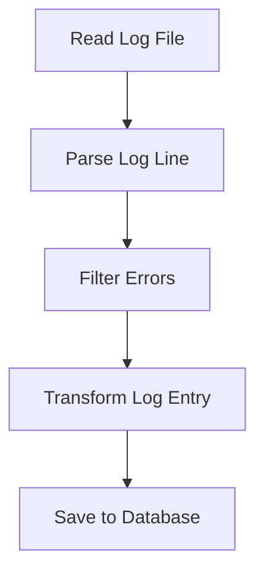
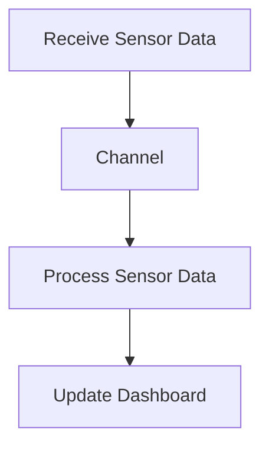
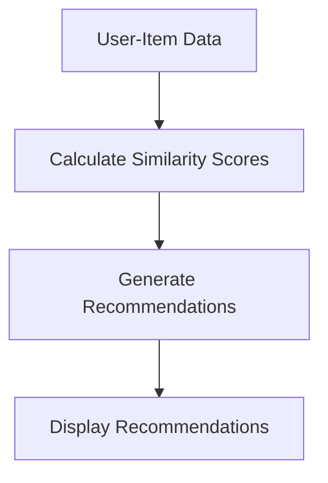

## 14.10.1 Sample Projects

In this section, we will delve into practical projects that leverage Clojure's strengths in data processing and functional programming. These projects are designed to help you apply the concepts discussed in previous chapters, such as immutability, higher-order functions, and concurrency. We'll explore three sample projects:

1. **Building a Data Pipeline to Process Log Files**
2. **Creating a Real-Time Dashboard for Sensor Data**
3. **Implementing a Recommendation System**

Each project will include detailed explanations, code examples, and diagrams to illustrate key concepts. Let's get started!

### Building a Data Pipeline to Process Log Files

Data pipelines are essential for processing and analyzing large volumes of data efficiently. In this project, we'll build a data pipeline to process log files using Clojure's functional programming capabilities.

#### Project Overview

Our goal is to create a pipeline that reads log files, filters relevant entries, transforms the data, and outputs the results to a database or file. This project will demonstrate how to use Clojure's sequence operations and transducers to handle data streams efficiently.

#### Key Concepts

- **Functional Data Transformation**: Using Clojure's sequence operations (`map`, `filter`, `reduce`) to process data.
- **Immutability**: Ensuring data integrity by using immutable data structures.
- **Concurrency**: Leveraging Clojure's concurrency primitives to process data in parallel.

#### Code Example

Let's start by defining a simple log file processing pipeline in Clojure:

```clojure
(ns log-pipeline.core
  (:require [clojure.java.io :as io]
            [clojure.string :as str]))

(defn parse-log-line [line]
  "Parses a single log line into a map with relevant fields."
  (let [[timestamp level message] (str/split line #"\s+" 3)]
    {:timestamp timestamp :level level :message message}))

(defn filter-errors [log-entry]
  "Filters log entries to include only error messages."
  (= (:level log-entry) "ERROR"))

(defn transform-log-entry [log-entry]
  "Transforms log entry to a more structured format."
  (assoc log-entry :processed-time (System/currentTimeMillis)))

(defn process-log-file [file-path]
  "Processes a log file and returns a sequence of transformed log entries."
  (with-open [reader (io/reader file-path)]
    (->> (line-seq reader)
         (map parse-log-line)
         (filter filter-errors)
         (map transform-log-entry))))

(defn save-to-database [log-entries]
  "Saves the processed log entries to a database."
  ;; Placeholder for database saving logic
  (println "Saving to database:" log-entries))

(defn run-pipeline [file-path]
  "Runs the entire log processing pipeline."
  (let [processed-logs (process-log-file file-path)]
    (save-to-database processed-logs)))

;; Example usage
(run-pipeline "path/to/logfile.log")
```

**Explanation:**

- **`parse-log-line`**: Parses each log line into a map with `timestamp`, `level`, and `message`.
- **`filter-errors`**: Filters log entries to include only those with an "ERROR" level.
- **`transform-log-entry`**: Adds a `processed-time` field to each log entry.
- **`process-log-file`**: Reads the log file, processes each line, and returns a sequence of transformed log entries.
- **`save-to-database`**: Placeholder function to save processed entries to a database.

#### Try It Yourself

- Modify the `filter-errors` function to filter different log levels.
- Add additional transformations in `transform-log-entry`.
- Implement the `save-to-database` function to store results in a real database.

#### Diagram



*Diagram 1: Data flow in the log file processing pipeline.*

### Creating a Real-Time Dashboard for Sensor Data

Real-time dashboards provide immediate insights into data streams, making them invaluable for monitoring and decision-making. In this project, we'll create a real-time dashboard for sensor data using Clojure's concurrency and web capabilities.

#### Project Overview

We'll build a web application that receives sensor data, processes it in real-time, and displays it on a dashboard. This project will demonstrate how to use Clojure's `core.async` library for handling asynchronous data streams.

#### Key Concepts

- **Concurrency**: Using `core.async` channels to manage data streams.
- **Web Development**: Leveraging Clojure web frameworks to build interactive dashboards.
- **Real-Time Processing**: Updating the dashboard as new data arrives.

#### Code Example

Let's create a simple real-time dashboard using Clojure and `core.async`:

```clojure
(ns sensor-dashboard.core
  (:require [clojure.core.async :as async]
            [ring.adapter.jetty :refer [run-jetty]]
            [ring.middleware.defaults :refer [wrap-defaults site-defaults]]))

(def sensor-channel (async/chan))

(defn process-sensor-data [data]
  "Processes incoming sensor data."
  ;; Placeholder for data processing logic
  (println "Processing data:" data))

(defn sensor-data-handler [request]
  "Handles incoming sensor data requests."
  (let [data (get-in request [:params :data])]
    (async/>!! sensor-channel data)
    {:status 200 :body "Data received"}))

(defn start-dashboard []
  "Starts the real-time dashboard server."
  (run-jetty (wrap-defaults sensor-data-handler site-defaults) {:port 3000}))

(defn start-processing-loop []
  "Starts the loop to process sensor data from the channel."
  (async/go-loop []
    (when-let [data (async/<! sensor-channel)]
      (process-sensor-data data)
      (recur))))

;; Start the dashboard and processing loop
(start-dashboard)
(start-processing-loop)
```

**Explanation:**

- **`sensor-channel`**: An asynchronous channel for receiving sensor data.
- **`process-sensor-data`**: Processes each piece of sensor data.
- **`sensor-data-handler`**: HTTP handler for receiving sensor data.
- **`start-dashboard`**: Starts the web server for the dashboard.
- **`start-processing-loop`**: Continuously processes data from the channel.

#### Try It Yourself

- Extend `process-sensor-data` to perform more complex transformations.
- Add a front-end component to visualize the processed data.
- Experiment with different concurrency models using `core.async`.

#### Diagram



*Diagram 2: Real-time data flow in the sensor dashboard.*

### Implementing a Recommendation System

Recommendation systems are widely used to suggest products, content, or services to users. In this project, we'll implement a simple recommendation system using Clojure's data processing capabilities.

#### Project Overview

We'll build a recommendation system that suggests items to users based on their past interactions. This project will demonstrate how to use Clojure's data structures and algorithms to implement collaborative filtering.

#### Key Concepts

- **Data Structures**: Using Clojure's maps and vectors to represent user-item interactions.
- **Algorithms**: Implementing collaborative filtering to generate recommendations.
- **Immutability**: Ensuring data consistency with immutable data structures.

#### Code Example

Let's create a basic recommendation system using collaborative filtering:

```clojure
(ns recommendation-system.core)

(def user-item-data
  {:user1 {:itemA 5 :itemB 3 :itemC 4}
   :user2 {:itemA 4 :itemB 5 :itemC 3}
   :user3 {:itemA 3 :itemB 4 :itemC 5}})

(defn similarity-score [user1 user2]
  "Calculates similarity score between two users."
  (let [common-items (clojure.set/intersection (set (keys user1)) (set (keys user2)))]
    (reduce + (map #(Math/abs (- (user1 %) (user2 %))) common-items))))

(defn recommend-items [user-id]
  "Recommends items to a user based on similarity scores."
  (let [user-data (user-item-data user-id)
        other-users (dissoc user-item-data user-id)
        scores (map (fn [[other-id other-data]]
                      [other-id (similarity-score user-data other-data)])
                    other-users)
        sorted-scores (sort-by second scores)]
    (println "Recommendations for" user-id ":" (first sorted-scores))))

;; Example usage
(recommend-items :user1)
```

**Explanation:**

- **`user-item-data`**: A map representing user ratings for different items.
- **`similarity-score`**: Calculates the similarity score between two users based on common items.
- **`recommend-items`**: Recommends items to a user by finding the most similar other user.

#### Try It Yourself

- Extend `similarity-score` to use different similarity metrics.
- Add more users and items to `user-item-data`.
- Implement a more sophisticated recommendation algorithm.

#### Diagram



*Diagram 3: Flow of data in the recommendation system.*

### Summary and Key Takeaways

In this section, we've explored three practical projects that demonstrate how to apply Clojure's functional programming capabilities to real-world data processing tasks. By building a data pipeline, creating a real-time dashboard, and implementing a recommendation system, we've seen how Clojure's immutable data structures, concurrency primitives, and sequence operations can simplify complex data workflows.

**Key Takeaways:**

- **Functional Programming**: Clojure's functional paradigm allows for concise and expressive data processing.
- **Immutability**: Immutable data structures ensure data integrity and simplify concurrency.
- **Concurrency**: Clojure's concurrency primitives enable efficient real-time data processing.
- **Data Structures**: Clojure's rich data structures facilitate complex data transformations.

Now that we've explored these sample projects, consider how you can apply these concepts to your own data processing challenges. Experiment with the code examples, extend the projects, and leverage Clojure's unique features to build robust and scalable data applications.

### Exercises and Practice Problems

1. **Extend the Log File Pipeline**: Add functionality to aggregate log entries by date and output a summary report.
2. **Enhance the Real-Time Dashboard**: Integrate a front-end library to visualize sensor data in real-time.
3. **Improve the Recommendation System**: Implement a hybrid recommendation algorithm that combines collaborative filtering with content-based filtering.

By working through these exercises, you'll gain hands-on experience with Clojure's data processing capabilities and deepen your understanding of functional programming concepts.

## Quiz: Test Your Understanding of Clojure Data Projects



### Which Clojure function is used to transform data in a sequence?

- [x] `map`
- [ ] `filter`
- [ ] `reduce`
- [ ] `assoc`

> **Explanation:** The `map` function is used to apply a transformation function to each element in a sequence.

### What is the purpose of `core.async` in Clojure?

- [x] To handle asynchronous data streams
- [ ] To perform synchronous I/O operations
- [ ] To manage stateful computations
- [ ] To define macros

> **Explanation:** `core.async` is used for managing asynchronous data streams and concurrency in Clojure.

### How does Clojure ensure data integrity in concurrent applications?

- [x] By using immutable data structures
- [ ] By using synchronized blocks
- [ ] By using locks
- [ ] By using mutable variables

> **Explanation:** Clojure uses immutable data structures to ensure data integrity, making it easier to manage concurrency.

### What is a key advantage of using Clojure for data processing?

- [x] Immutability simplifies concurrency
- [ ] It requires less memory
- [ ] It is faster than Java
- [ ] It has a larger community

> **Explanation:** Immutability in Clojure simplifies concurrency by eliminating the need for locks and reducing the risk of race conditions.

### Which Clojure function is used to filter elements in a sequence?

- [ ] `map`
- [x] `filter`
- [ ] `reduce`
- [ ] `assoc`

> **Explanation:** The `filter` function is used to select elements from a sequence that satisfy a given predicate.

### What is the role of `recur` in Clojure?

- [x] To enable tail recursion
- [ ] To define a new function
- [ ] To create a loop
- [ ] To handle exceptions

> **Explanation:** `recur` is used to enable tail recursion in Clojure, allowing functions to call themselves without growing the stack.

### How can you visualize real-time data in a Clojure web application?

- [x] By integrating a front-end library
- [ ] By using `core.async`
- [ ] By using `map`
- [ ] By using `reduce`

> **Explanation:** Integrating a front-end library allows you to create interactive visualizations for real-time data in a Clojure web application.

### What is a common use case for recommendation systems?

- [x] Suggesting products to users
- [ ] Filtering log files
- [ ] Processing sensor data
- [ ] Managing state

> **Explanation:** Recommendation systems are commonly used to suggest products, content, or services to users based on their preferences.

### Which Clojure data structure is best suited for representing user-item interactions?

- [x] Maps
- [ ] Lists
- [ ] Vectors
- [ ] Sets

> **Explanation:** Maps are well-suited for representing user-item interactions, as they allow for easy lookup and association of user ratings with items.

### True or False: Clojure's immutable data structures make it difficult to manage state in applications.

- [ ] True
- [x] False

> **Explanation:** Clojure's immutable data structures actually simplify state management by ensuring data consistency and reducing the risk of side effects.


