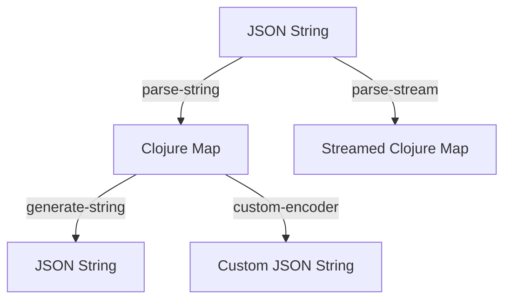

## 14.2.1 Working with JSON

In the world of modern software development, JSON (JavaScript Object Notation) has become a ubiquitous data interchange format. Its lightweight and human-readable structure makes it ideal for APIs, configuration files, and data storage. As experienced Java developers, you're likely familiar with JSON processing libraries such as Jackson or Gson. In Clojure, we have a powerful library called **Cheshire** that simplifies JSON parsing and generation.

### Introduction to Cheshire

Cheshire is a Clojure library that provides fast and flexible JSON encoding and decoding. It leverages the Jackson library under the hood, ensuring high performance and compatibility with Java-based systems. Cheshire is idiomatic to Clojure, allowing seamless conversion between JSON and Clojure data structures.

#### Key Features of Cheshire

- **Fast JSON Parsing and Generation**: Built on Jackson, Cheshire offers high-speed JSON processing.
- **Seamless Integration with Clojure Data Structures**: Convert JSON to Clojure maps, vectors, and other data types effortlessly.
- **Customizable Encoding and Decoding**: Supports custom encoders and decoders for complex data types.
- **Support for JSON Streams**: Efficiently handle large JSON data through streaming.

### Setting Up Cheshire

To start using Cheshire in your Clojure project, add it as a dependency in your `project.clj` file if you're using Leiningen:

```clojure
(defproject my-json-project "0.1.0-SNAPSHOT"
  :dependencies [[org.clojure/clojure "1.10.3"]
                 [cheshire "5.10.0"]])
```

For those using `tools.deps`, add Cheshire to your `deps.edn`:

```clojure
{:deps {org.clojure/clojure {:mvn/version "1.10.3"}
        cheshire {:mvn/version "5.10.0"}}}
```

### Parsing JSON with Cheshire

Parsing JSON in Clojure using Cheshire is straightforward. Let's explore how to convert JSON strings into Clojure data structures.

#### Basic JSON Parsing

Consider a simple JSON string representing a user:

```json
{
  "name": "Alice",
  "age": 30,
  "email": "alice@example.com"
}
```

To parse this JSON string into a Clojure map, use the `cheshire.core/parse-string` function:

```clojure
(ns my-json-project.core
  (:require [cheshire.core :as json]))

(def json-str "{\"name\":\"Alice\",\"age\":30,\"email\":\"alice@example.com\"}")

(def user-map (json/parse-string json-str true))
;; => {"name" "Alice", "age" 30, "email" "alice@example.com"}

;; The `true` argument indicates that keys should be converted to keywords.
```

**Explanation**: The `parse-string` function takes a JSON string and an optional boolean argument. When `true`, it converts JSON keys to Clojure keywords, which is a common practice for idiomatic Clojure code.

#### Handling Nested JSON Structures

JSON data often contains nested structures. Cheshire handles these seamlessly, converting them into nested Clojure maps and vectors.

```json
{
  "name": "Bob",
  "age": 25,
  "address": {
    "street": "123 Main St",
    "city": "Springfield"
  },
  "phones": ["123-456-7890", "987-654-3210"]
}
```

```clojure
(def nested-json-str "{\"name\":\"Bob\",\"age\":25,\"address\":{\"street\":\"123 Main St\",\"city\":\"Springfield\"},\"phones\":[\"123-456-7890\",\"987-654-3210\"]}")

(def nested-map (json/parse-string nested-json-str true))
;; => {:name "Bob", :age 25, :address {:street "123 Main St", :city "Springfield"}, :phones ["123-456-7890" "987-654-3210"]}
```

**Try It Yourself**: Modify the JSON string to include additional nested objects or arrays, and observe how Cheshire parses them into Clojure data structures.

### Generating JSON with Cheshire

Generating JSON from Clojure data structures is equally simple. Cheshire provides the `generate-string` function to convert Clojure maps, vectors, and other data types into JSON strings.

#### Basic JSON Generation

Let's convert a Clojure map into a JSON string:

```clojure
(def user-data {:name "Charlie" :age 28 :email "charlie@example.com"})

(def json-output (json/generate-string user-data))
;; => "{\"name\":\"Charlie\",\"age\":28,\"email\":\"charlie@example.com\"}"
```

**Explanation**: The `generate-string` function takes a Clojure data structure and returns a JSON string representation.

#### Customizing JSON Output

Cheshire allows customization of JSON output through options such as pretty printing and custom encoders.

```clojure
(def pretty-json (json/generate-string user-data {:pretty true}))
;; => "{\n  \"name\" : \"Charlie\",\n  \"age\" : 28,\n  \"email\" : \"charlie@example.com\"\n}"
```

**Explanation**: The `:pretty true` option formats the JSON string with indentation for readability.

### Comparing JSON Handling in Java and Clojure

Let's compare JSON processing in Java using Jackson with Clojure's Cheshire. Consider the following Java code snippet for parsing JSON:

```java
import com.fasterxml.jackson.databind.ObjectMapper;

public class JsonExample {
    public static void main(String[] args) throws Exception {
        String jsonStr = "{\"name\":\"Alice\",\"age\":30,\"email\":\"alice@example.com\"}";
        ObjectMapper mapper = new ObjectMapper();
        Map<String, Object> userMap = mapper.readValue(jsonStr, Map.class);
        System.out.println(userMap);
    }
}
```

**Comparison**:

- **Simplicity**: Clojure's Cheshire provides a more concise syntax for JSON parsing and generation, reducing boilerplate code.
- **Data Structures**: Clojure's native data structures (maps, vectors) seamlessly integrate with JSON, eliminating the need for additional conversion.
- **Customization**: Both Jackson and Cheshire offer customization options, but Cheshire's integration with Clojure's functional paradigm provides more idiomatic solutions.

### Advanced JSON Handling

Cheshire supports advanced JSON handling features such as custom encoders/decoders and JSON streams.

#### Custom Encoders and Decoders

For complex data types, define custom encoders and decoders to control JSON serialization and deserialization.

```clojure
(defrecord User [name age email])

(defn user-encoder [user]
  {:name (:name user)
   :age (:age user)
   :email (:email user)})

(json/add-encoder User user-encoder)

(def user (->User "Dana" 32 "dana@example.com"))

(def custom-json (json/generate-string user))
;; => "{\"name\":\"Dana\",\"age\":32,\"email\":\"dana@example.com\"}"
```

**Explanation**: The `add-encoder` function registers a custom encoder for the `User` record, allowing precise control over JSON output.

#### Streaming JSON

For large JSON data, use Cheshire's streaming capabilities to process data efficiently without loading it entirely into memory.

```clojure
(with-open [reader (clojure.java.io/reader "large-file.json")]
  (json/parse-stream reader true))
```

**Explanation**: The `parse-stream` function reads JSON data from a stream, ideal for handling large files.

### Visualizing JSON Processing

To better understand JSON processing in Clojure, let's visualize the flow of data using a Mermaid diagram.



**Diagram Explanation**: This diagram illustrates the flow of JSON data through Cheshire's parsing and generation functions, including custom encoding and streaming.

### Exercises and Practice Problems

1. **Parse and Generate**: Write a Clojure function that takes a JSON string representing a list of users and returns a JSON string with an additional field `active: true` for each user.
2. **Custom Encoder**: Create a custom encoder for a Clojure record representing a product, including fields for name, price, and availability.
3. **Stream Processing**: Implement a function that reads a large JSON file containing transaction data and calculates the total amount spent.

### Key Takeaways

- **Cheshire** is a powerful library for JSON processing in Clojure, offering fast parsing and generation.
- **Seamless Integration**: Clojure's data structures naturally map to JSON, simplifying data interchange.
- **Customization**: Cheshire supports custom encoders and decoders for complex data types.
- **Efficiency**: Use streaming for handling large JSON data efficiently.

By mastering JSON processing with Cheshire, you can enhance your Clojure applications' data handling capabilities, making them more robust and efficient. Now that we've explored JSON processing, let's apply these concepts to manage data effectively in your Clojure applications.

For further reading, explore the [Cheshire GitHub repository](https://github.com/dakrone/cheshire) and the [Official Clojure Documentation](https://clojure.org/).

## Quiz: Mastering JSON Processing in Clojure with Cheshire



### Which library does Cheshire use under the hood for JSON processing?

- [x] Jackson
- [ ] Gson
- [ ] Moshi
- [ ] Fastjson

> **Explanation:** Cheshire uses the Jackson library under the hood for JSON processing, ensuring high performance and compatibility with Java-based systems.

### What function is used to parse a JSON string into a Clojure map?

- [x] parse-string
- [ ] generate-string
- [ ] parse-stream
- [ ] read-json

> **Explanation:** The `parse-string` function is used to parse a JSON string into a Clojure map.

### How can you convert JSON keys to Clojure keywords during parsing?

- [x] Pass `true` as the second argument to `parse-string`
- [ ] Use `generate-string` with a keyword option
- [ ] Use `parse-stream` with a keyword option
- [ ] Convert manually after parsing

> **Explanation:** Passing `true` as the second argument to `parse-string` converts JSON keys to Clojure keywords.

### What option can you use to pretty-print JSON output in Cheshire?

- [x] :pretty true
- [ ] :indent true
- [ ] :format pretty
- [ ] :beautify true

> **Explanation:** The `:pretty true` option can be used to pretty-print JSON output in Cheshire.

### Which function allows you to read JSON data from a stream?

- [x] parse-stream
- [ ] parse-string
- [ ] generate-string
- [ ] read-json

> **Explanation:** The `parse-stream` function allows you to read JSON data from a stream, making it ideal for handling large files.

### How do you register a custom encoder for a Clojure record in Cheshire?

- [x] Use `add-encoder`
- [ ] Use `register-encoder`
- [ ] Use `define-encoder`
- [ ] Use `set-encoder`

> **Explanation:** The `add-encoder` function is used to register a custom encoder for a Clojure record in Cheshire.

### What is the primary advantage of using Cheshire over Java's Jackson directly?

- [x] Seamless integration with Clojure data structures
- [ ] Faster performance
- [ ] More features
- [ ] Better documentation

> **Explanation:** Cheshire provides seamless integration with Clojure data structures, making JSON processing more idiomatic and concise.

### What is the output of `generate-string` when given a Clojure map?

- [x] A JSON string
- [ ] A Clojure map
- [ ] A JSON object
- [ ] A Java object

> **Explanation:** The `generate-string` function converts a Clojure map into a JSON string.

### Can Cheshire handle nested JSON structures?

- [x] True
- [ ] False

> **Explanation:** Cheshire can handle nested JSON structures, converting them into nested Clojure maps and vectors.

### What is the purpose of using streaming in JSON processing?

- [x] To handle large JSON data efficiently
- [ ] To improve JSON parsing speed
- [ ] To simplify JSON generation
- [ ] To enhance JSON security

> **Explanation:** Streaming is used in JSON processing to handle large JSON data efficiently without loading it entirely into memory.


