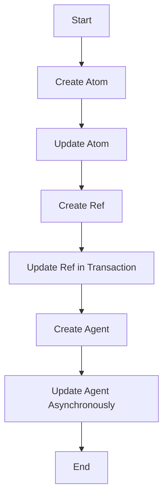

## 14.2.2 Managing State in Clojure

In the world of functional programming, managing state is a topic that often sparks curiosity and debate. Unlike imperative programming languages such as Java, where state is mutable and can be changed at will, Clojure embraces immutability as a core principle. However, real-world applications often require some form of state management. Clojure provides a robust set of tools for managing state in a controlled and safe manner, namely atoms, refs, and agents. In this section, we will explore these constructs in detail, understand their use cases, and learn how to update state safely in Clojure.

### Understanding the Need for State Management

Before diving into the specifics of Clojure's state management tools, it's essential to understand why state management is necessary, even in a functional programming language. In many applications, certain components need to maintain a state that changes over time. For example, a web server might need to keep track of active sessions, or a game might need to maintain the current score. While immutability is beneficial for reasoning about code and avoiding side effects, it doesn't eliminate the need for state; rather, it changes how we manage it.

### Atoms: Simple and Synchronous State Management

Atoms are one of the simplest ways to manage state in Clojure. They provide a way to manage shared, synchronous, independent state. Atoms are ideal for situations where you have a single piece of state that can be updated independently of other states.

#### Creating and Using Atoms

To create an atom, you use the `atom` function, passing the initial value as an argument:

```clojure
(def my-atom (atom 0))
```

You can read the current value of an atom using the `deref` function or the `@` reader macro:

```clojure
(println @my-atom)  ; prints 0
```

#### Updating Atoms

Atoms are updated using the `swap!` and `reset!` functions. The `swap!` function takes an atom and a function, applies the function to the current value of the atom, and sets the atom to the result:

```clojure
(swap! my-atom inc)  ; increments the value by 1
```

The `reset!` function sets the atom to a new value directly:

```clojure
(reset! my-atom 10)  ; sets the value to 10
```

#### Ensuring Safe Updates

Atoms ensure safe updates through a mechanism called compare-and-swap (CAS). This mechanism guarantees that updates are atomic and consistent, even in a multithreaded environment. If the value of the atom changes between the time it is read and the time the update is applied, the update is retried.

### Refs: Coordinated State Changes

While atoms are suitable for managing independent state, refs are designed for coordinated, synchronous updates to multiple pieces of state. Refs are used in conjunction with Clojure's Software Transactional Memory (STM) system, which allows you to group multiple state changes into a single transaction.

#### Creating and Using Refs

Refs are created using the `ref` function:

```clojure
(def my-ref (ref 0))
```

Like atoms, you can read the current value of a ref using `deref` or `@`:

```clojure
(println @my-ref)  ; prints 0
```

#### Updating Refs

Refs are updated within a transaction using the `dosync` macro. Inside a `dosync` block, you can use the `alter` function to update the value of a ref:

```clojure
(dosync
  (alter my-ref inc))
```

The `ref-set` function can be used to set the value of a ref directly:

```clojure
(dosync
  (ref-set my-ref 10))
```

#### Ensuring Consistency

The STM system ensures that all changes within a transaction are applied atomically. If any part of the transaction fails, the entire transaction is retried. This guarantees consistency across multiple refs.

### Agents: Asynchronous State Management

Agents provide a way to manage state asynchronously. They are ideal for situations where you want to update state in the background without blocking the main thread.

#### Creating and Using Agents

Agents are created using the `agent` function:

```clojure
(def my-agent (agent 0))
```

You can read the current value of an agent using `deref` or `@`:

```clojure
(println @my-agent)  ; prints 0
```

#### Updating Agents

Agents are updated using the `send` and `send-off` functions. The `send` function queues a function to be applied to the agent's value:

```clojure
(send my-agent inc)
```

The `send-off` function is similar to `send`, but is used for tasks that might block, such as I/O operations.

#### Handling Errors

If an error occurs during an agent update, the agent is put into a failed state. You can check if an agent is in a failed state using the `agent-error` function and clear the error using `restart-agent`.

### Practical Code Examples

Let's explore a practical example that demonstrates the use of atoms, refs, and agents in a simple banking application. We'll simulate a scenario where multiple accounts need to be updated concurrently.

#### Example: Banking Application

```clojure
(def account-a (atom 100))
(def account-b (atom 200))

(defn transfer [from to amount]
  (dosync
    (swap! from - amount)
    (swap! to + amount)))

(transfer account-a account-b 50)

(println "Account A:" @account-a)  ; prints 50
(println "Account B:" @account-b)  ; prints 250
```

In this example, we use atoms to represent account balances and a simple function to transfer money between accounts. The `dosync` block ensures that the transfer is atomic.

### Best Practices for State Management

1. **Use Atoms for Independent State**: Atoms are best for managing independent pieces of state that don't need to be coordinated with other states.

2. **Use Refs for Coordinated State**: Refs are ideal for situations where you need to update multiple pieces of state in a coordinated manner.

3. **Use Agents for Asynchronous Updates**: Agents are suitable for tasks that can be performed asynchronously, such as background processing or I/O operations.

4. **Minimize State**: Wherever possible, minimize the amount of state your application needs to manage. This reduces complexity and potential for errors.

5. **Leverage Immutability**: Use immutable data structures to represent state whenever possible. This makes your code easier to reason about and reduces the risk of unintended side effects.

### Common Pitfalls and Optimization Tips

- **Avoid Overusing Atoms**: While atoms are simple and convenient, overusing them can lead to complex and hard-to-maintain code. Consider whether refs or agents might be more appropriate for your use case.

- **Be Mindful of Transaction Size**: When using refs, keep transactions small and focused. Large transactions can lead to contention and performance issues.

- **Handle Agent Errors Gracefully**: Always check for agent errors and handle them appropriately to prevent your application from entering an inconsistent state.

- **Profile and Optimize**: Use Clojure's built-in profiling tools to identify bottlenecks in your state management code and optimize accordingly.

### Diagrams and Visualizations

To better understand the flow of state management in Clojure, let's visualize the interactions between atoms, refs, and agents using a flowchart.



This flowchart illustrates the typical lifecycle of managing state in Clojure, from creating and updating atoms to managing refs in transactions and updating agents asynchronously.

### Conclusion

Managing state in Clojure requires a shift in mindset from traditional imperative programming. By leveraging atoms, refs, and agents, you can manage state safely and effectively in a functional programming paradigm. Understanding when and how to use these constructs is key to building robust and maintainable Clojure applications.

## Quiz Time!



### What is the primary use case for atoms in Clojure?

- [x] Managing independent, synchronous state
- [ ] Coordinating multiple state changes
- [ ] Asynchronous state updates
- [ ] Handling I/O operations

> **Explanation:** Atoms are used for managing independent, synchronous state changes in Clojure.

### How do refs ensure consistency in state updates?

- [x] By using Software Transactional Memory (STM)
- [ ] By locking the state
- [ ] By using asynchronous updates
- [ ] By using compare-and-swap

> **Explanation:** Refs use Software Transactional Memory (STM) to ensure consistency and atomicity in state updates.

### Which function is used to update an agent in Clojure?

- [x] `send`
- [ ] `swap!`
- [ ] `alter`
- [ ] `reset!`

> **Explanation:** The `send` function is used to update an agent asynchronously in Clojure.

### What happens if an error occurs during an agent update?

- [x] The agent enters a failed state
- [ ] The update is retried
- [ ] The agent is reset to its initial value
- [ ] The error is ignored

> **Explanation:** If an error occurs during an agent update, the agent enters a failed state and must be handled appropriately.

### Which Clojure construct is best for coordinated updates to multiple pieces of state?

- [x] Refs
- [ ] Atoms
- [ ] Agents
- [ ] Vars

> **Explanation:** Refs are designed for coordinated updates to multiple pieces of state using transactions.

### What is the purpose of the `dosync` macro in Clojure?

- [x] To group multiple state changes into a single transaction
- [ ] To update an atom
- [ ] To send a message to an agent
- [ ] To handle errors in agents

> **Explanation:** The `dosync` macro is used to group multiple state changes into a single transaction when using refs.

### How can you check if an agent is in a failed state?

- [x] Using the `agent-error` function
- [ ] Using the `deref` function
- [ ] Using the `swap!` function
- [ ] Using the `alter` function

> **Explanation:** The `agent-error` function is used to check if an agent is in a failed state.

### What is the main advantage of using agents for state management?

- [x] Asynchronous updates without blocking the main thread
- [ ] Synchronous updates with transactions
- [ ] Coordinated updates to multiple states
- [ ] Handling I/O operations synchronously

> **Explanation:** Agents allow for asynchronous updates without blocking the main thread, making them ideal for background tasks.

### Which function is used to directly set the value of a ref in a transaction?

- [x] `ref-set`
- [ ] `swap!`
- [ ] `send`
- [ ] `reset!`

> **Explanation:** The `ref-set` function is used to directly set the value of a ref within a transaction.

### True or False: Atoms use compare-and-swap to ensure safe updates.

- [x] True
- [ ] False

> **Explanation:** Atoms use compare-and-swap (CAS) to ensure that updates are atomic and consistent, even in a multithreaded environment.


