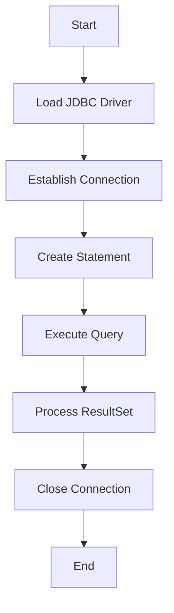

## 14.3.1 JDBC Basics

Java Database Connectivity (JDBC) is a crucial component for any developer working with databases in Java or Clojure. It provides a standard API that allows applications to interact with a wide variety of databases, making it a versatile tool in your development toolkit. In this section, we will explore the fundamentals of JDBC, how it integrates with Clojure, and how you can leverage it to manage data effectively in your applications.

### Understanding JDBC

JDBC is an API that enables Java applications to interact with databases. It provides methods to query and update data in a database, and it is designed to work with any database that supports SQL. JDBC is part of the Java Standard Edition platform, and it is widely used in enterprise applications.

**Key Components of JDBC:**

1. **Driver Manager**: Manages a list of database drivers. It matches connection requests from the application with the appropriate driver using the connection URL.
2. **Driver**: Handles the communications with the database server. Each database vendor provides its own implementation of the JDBC driver.
3. **Connection**: Represents a connection to a specific database. It is used to create statements for executing SQL queries.
4. **Statement**: Used to execute SQL queries against the database.
5. **ResultSet**: Represents the result set of a query. It provides methods to iterate through the results.
6. **SQLException**: Handles any errors that occur in the database interaction.

### JDBC in Java: A Quick Overview

Let's start by looking at a simple Java example to understand how JDBC works in a typical Java application. This will help us draw parallels when we transition to using JDBC in Clojure.

```java
import java.sql.Connection;
import java.sql.DriverManager;
import java.sql.ResultSet;
import java.sql.Statement;

public class JDBCExample {
    public static void main(String[] args) {
        String url = "jdbc:mysql://localhost:3306/mydatabase";
        String user = "username";
        String password = "password";

        try (Connection connection = DriverManager.getConnection(url, user, password);
             Statement statement = connection.createStatement();
             ResultSet resultSet = statement.executeQuery("SELECT * FROM mytable")) {

            while (resultSet.next()) {
                System.out.println("Column 1: " + resultSet.getString(1));
                System.out.println("Column 2: " + resultSet.getString(2));
            }
        } catch (Exception e) {
            e.printStackTrace();
        }
    }
}
```

**Explanation:**

- **DriverManager.getConnection**: Establishes a connection to the database using the provided URL, username, and password.
- **Statement**: Created from the connection to execute SQL queries.
- **ResultSet**: Iterates through the results of the query.

### JDBC in Clojure

Clojure, being a JVM language, can leverage JDBC through Java interop. This allows Clojure applications to interact with databases using the same JDBC drivers and APIs as Java applications. Let's explore how to set up and use JDBC in a Clojure application.

#### Setting Up JDBC in Clojure

To use JDBC in Clojure, you need to include the necessary dependencies in your project. Typically, this involves adding the JDBC driver for your database to your `project.clj` or `deps.edn` file.

**Example for MySQL:**

```clojure
;; project.clj
(defproject my-clojure-app "0.1.0-SNAPSHOT"
  :dependencies [[org.clojure/clojure "1.10.3"]
                 [mysql/mysql-connector-java "8.0.26"]])
```

**Example for PostgreSQL:**

```clojure
;; deps.edn
{:deps {org.clojure/clojure {:mvn/version "1.10.3"}
        org.postgresql/postgresql {:mvn/version "42.2.23"}}}
```

#### Connecting to a Database

In Clojure, you can use the `clojure.java.jdbc` library to simplify JDBC operations. This library provides a more idiomatic way to interact with databases in Clojure.

**Connecting to a Database:**

```clojure
(require '[clojure.java.jdbc :as jdbc])

(def db-spec {:dbtype "mysql"
              :dbname "mydatabase"
              :host "localhost"
              :user "username"
              :password "password"})

(jdbc/with-db-connection [conn db-spec]
  (println "Connected to the database!"))
```

**Explanation:**

- **db-spec**: A map containing the database connection details.
- **jdbc/with-db-connection**: Establishes a connection to the database using the provided specifications.

#### Executing Queries

Once connected, you can execute SQL queries using the `jdbc/query` function. This function returns the results as a sequence of maps, where each map represents a row in the result set.

**Example:**

```clojure
(jdbc/with-db-connection [conn db-spec]
  (let [results (jdbc/query conn ["SELECT * FROM mytable"])]
    (doseq [row results]
      (println "Row:" row))))
```

**Explanation:**

- **jdbc/query**: Executes the SQL query and returns the results.
- **doseq**: Iterates over the sequence of results, printing each row.

#### Inserting Data

To insert data into a database, you can use the `jdbc/insert!` function. This function takes the connection, table name, and a map of column-value pairs to insert.

**Example:**

```clojure
(jdbc/with-db-connection [conn db-spec]
  (jdbc/insert! conn :mytable {:column1 "value1" :column2 "value2"}))
```

**Explanation:**

- **jdbc/insert!**: Inserts a new row into the specified table with the given column values.

#### Updating and Deleting Data

Updating and deleting data can be done using the `jdbc/execute!` function, which allows you to execute any SQL statement.

**Update Example:**

```clojure
(jdbc/with-db-connection [conn db-spec]
  (jdbc/execute! conn ["UPDATE mytable SET column1 = ? WHERE column2 = ?" "newvalue" "value2"]))
```

**Delete Example:**

```clojure
(jdbc/with-db-connection [conn db-spec]
  (jdbc/execute! conn ["DELETE FROM mytable WHERE column1 = ?" "value1"]))
```

**Explanation:**

- **jdbc/execute!**: Executes the SQL statement, which can be an update or delete operation.

### Comparing JDBC in Java and Clojure

While the underlying JDBC operations remain the same, Clojure provides a more functional and concise approach to database interactions. Here's a comparison of the same operations in Java and Clojure:

**Java:**

```java
// Java code for querying a database
try (Connection connection = DriverManager.getConnection(url, user, password);
     Statement statement = connection.createStatement();
     ResultSet resultSet = statement.executeQuery("SELECT * FROM mytable")) {

    while (resultSet.next()) {
        System.out.println("Column 1: " + resultSet.getString(1));
        System.out.println("Column 2: " + resultSet.getString(2));
    }
} catch (Exception e) {
    e.printStackTrace();
}
```

**Clojure:**

```clojure
;; Clojure code for querying a database
(jdbc/with-db-connection [conn db-spec]
  (let [results (jdbc/query conn ["SELECT * FROM mytable"])]
    (doseq [row results]
      (println "Row:" row))))
```

**Key Differences:**

- **Conciseness**: Clojure's functional approach allows for more concise code.
- **Error Handling**: Java requires explicit try-catch blocks, while Clojure can leverage its error handling mechanisms.
- **Data Representation**: Clojure returns results as sequences of maps, making it easier to work with in a functional style.

### Visualizing JDBC Workflow

To better understand the flow of data and operations in JDBC, let's visualize the process using a diagram.



**Diagram Explanation:**

- **Load JDBC Driver**: The application loads the JDBC driver for the database.
- **Establish Connection**: A connection to the database is established.
- **Create Statement**: A statement object is created to execute SQL queries.
- **Execute Query**: The SQL query is executed against the database.
- **Process ResultSet**: The results are processed, typically iterating over the ResultSet.
- **Close Connection**: The connection to the database is closed to free resources.

### Try It Yourself

To reinforce your understanding, try modifying the examples provided:

1. **Change the Database**: Use a different database (e.g., PostgreSQL) and update the connection details.
2. **Add New Columns**: Modify the table structure to include additional columns and update the queries accordingly.
3. **Handle Exceptions**: Implement error handling in Clojure to manage potential database errors.

### Exercises

1. **Create a New Table**: Write a Clojure script to create a new table in your database.
2. **Batch Insert**: Implement a batch insert operation to add multiple rows to a table.
3. **Transaction Management**: Use Clojure's transaction support to perform multiple operations atomically.

### Key Takeaways

- **JDBC** provides a standard API for interacting with databases in Java and Clojure.
- **Clojure** offers a more concise and functional approach to database operations compared to Java.
- **Understanding JDBC** is essential for managing data effectively in Clojure applications.

By mastering JDBC in Clojure, you can leverage the power of databases in your functional programming projects, ensuring efficient data management and seamless integration with existing systems.

For further reading, explore the [Official Clojure Documentation](https://clojure.org/reference/documentation) and [ClojureDocs](https://clojuredocs.org/).

## Quiz: Mastering JDBC Basics in Clojure



### What is JDBC primarily used for?

- [x] Interacting with databases
- [ ] Managing network connections
- [ ] Handling file I/O
- [ ] Rendering graphics

> **Explanation:** JDBC (Java Database Connectivity) is primarily used for interacting with databases, allowing applications to execute SQL queries and manage data.

### Which component of JDBC is responsible for managing database drivers?

- [x] Driver Manager
- [ ] Connection
- [ ] Statement
- [ ] ResultSet

> **Explanation:** The Driver Manager is responsible for managing database drivers and establishing connections based on the connection URL.

### In Clojure, which library is commonly used to simplify JDBC operations?

- [x] clojure.java.jdbc
- [ ] clojure.core.async
- [ ] clojure.data.json
- [ ] clojure.string

> **Explanation:** The `clojure.java.jdbc` library is commonly used in Clojure to simplify JDBC operations and provide a more idiomatic way to interact with databases.

### What does the `jdbc/query` function return in Clojure?

- [x] A sequence of maps
- [ ] A single map
- [ ] A list of strings
- [ ] A vector of integers

> **Explanation:** The `jdbc/query` function in Clojure returns a sequence of maps, where each map represents a row in the result set.

### How do you insert data into a database table using Clojure's `jdbc` library?

- [x] Using `jdbc/insert!`
- [ ] Using `jdbc/query`
- [ ] Using `jdbc/update!`
- [ ] Using `jdbc/delete!`

> **Explanation:** The `jdbc/insert!` function is used to insert data into a database table in Clojure.

### Which function is used to execute any SQL statement in Clojure?

- [x] jdbc/execute!
- [ ] jdbc/query
- [ ] jdbc/insert!
- [ ] jdbc/update!

> **Explanation:** The `jdbc/execute!` function is used to execute any SQL statement, including updates and deletes, in Clojure.

### What is the primary advantage of using Clojure over Java for JDBC operations?

- [x] Conciseness and functional style
- [ ] Better error handling
- [ ] Faster execution
- [ ] More database support

> **Explanation:** Clojure offers a more concise and functional style for JDBC operations compared to Java, making the code easier to read and maintain.

### Which of the following is NOT a key component of JDBC?

- [x] Servlet
- [ ] Driver
- [ ] Connection
- [ ] Statement

> **Explanation:** Servlet is not a key component of JDBC. The key components include Driver, Connection, and Statement.

### What does the `jdbc/with-db-connection` macro do in Clojure?

- [x] Establishes a connection to the database
- [ ] Closes the database connection
- [ ] Executes a SQL query
- [ ] Inserts data into a table

> **Explanation:** The `jdbc/with-db-connection` macro establishes a connection to the database using the provided specifications.

### True or False: JDBC can only be used with SQL databases.

- [x] True
- [ ] False

> **Explanation:** JDBC is designed to work with SQL databases, providing a standard API for executing SQL queries and managing data.


