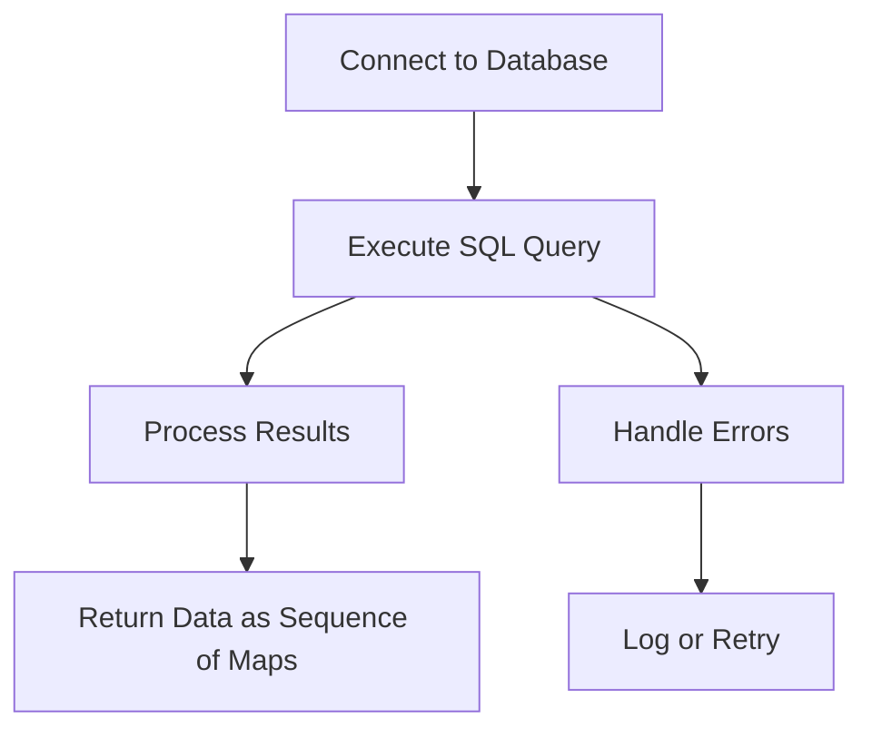

## 14.3.2 Using clojure.java.jdbc

In this section, we will delve into using `clojure.java.jdbc`, a robust library for interacting with relational databases in Clojure. As experienced Java developers, you are likely familiar with JDBC (Java Database Connectivity) for database operations. Clojure builds on this foundation, offering a more idiomatic and functional approach to database interaction. We will explore connecting to databases, executing SQL queries, handling results, and managing transactions using `clojure.java.jdbc`.

### Introduction to clojure.java.jdbc

`clojure.java.jdbc` is a Clojure library that provides a simple and idiomatic way to interact with relational databases. It abstracts the complexities of JDBC while maintaining the flexibility and power of SQL. This library is particularly useful for Clojure developers who need to perform database operations without delving into the intricacies of JDBC.

#### Key Features of clojure.java.jdbc

- **Simplicity**: Provides a straightforward API for common database operations.
- **Flexibility**: Supports raw SQL execution and parameterized queries.
- **Transaction Management**: Offers easy-to-use transaction handling.
- **Compatibility**: Works seamlessly with various databases, including PostgreSQL, MySQL, and SQLite.

### Setting Up clojure.java.jdbc

Before we dive into code examples, let's set up our environment to use `clojure.java.jdbc`. Ensure you have Clojure and Leiningen installed. Add the following dependency to your `project.clj` file:

```clojure
(defproject my-clojure-app "0.1.0-SNAPSHOT"
  :dependencies [[org.clojure/clojure "1.10.3"]
                 [org.clojure/java.jdbc "0.7.12"]
                 [mysql/mysql-connector-java "8.0.26"]]) ; Example for MySQL
```

### Connecting to a Database

To connect to a database, we need to define a database specification map. This map contains the necessary connection details, such as the database type, host, port, and credentials.

```clojure
(require '[clojure.java.jdbc :as jdbc])

(def db-spec
  {:dbtype "mysql"
   :dbname "my_database"
   :host "localhost"
   :port 3306
   :user "root"
   :password "password"})
```

**Note**: Replace the values with your actual database details.

### Executing SQL Queries

With the database connection established, we can execute SQL queries. `clojure.java.jdbc` provides several functions for executing queries, including `query`, `execute!`, and `db-do-prepared`.

#### Selecting Data

Let's start with a simple `SELECT` query to retrieve data from a table.

```clojure
(defn fetch-users []
  (jdbc/query db-spec ["SELECT * FROM users"]))
```

In this example, `jdbc/query` executes the SQL query and returns the results as a sequence of maps, where each map represents a row in the result set.

#### Inserting Data

To insert data into a table, use the `insert!` function.

```clojure
(defn add-user [user]
  (jdbc/insert! db-spec :users user))
```

Here, `:users` is the table name, and `user` is a map representing the data to be inserted.

#### Updating Data

Updating data is straightforward with the `update!` function.

```clojure
(defn update-user [id new-data]
  (jdbc/update! db-spec :users new-data ["id=?" id]))
```

The `update!` function takes the table name, a map of new data, and a vector specifying the condition for the update.

#### Deleting Data

To delete data, use the `delete!` function.

```clojure
(defn delete-user [id]
  (jdbc/delete! db-spec :users ["id=?" id]))
```

### Handling Results

The results of a query are returned as a sequence of maps. You can process these results using Clojure's powerful sequence functions.

```clojure
(defn print-user-names []
  (let [users (fetch-users)]
    (doseq [user users]
      (println (:name user)))))
```

### Managing Transactions

Transactions are crucial for ensuring data integrity. `clojure.java.jdbc` provides the `with-db-transaction` macro for managing transactions.

```clojure
(defn transfer-funds [from-id to-id amount]
  (jdbc/with-db-transaction [t-con db-spec]
    (jdbc/update! t-con :accounts {:balance [- amount]} ["id=?" from-id])
    (jdbc/update! t-con :accounts {:balance [+ amount]} ["id=?" to-id])))
```

In this example, both updates occur within a single transaction. If any part of the transaction fails, all changes are rolled back.

### Error Handling

Error handling is an essential aspect of database operations. You can use Clojure's `try` and `catch` constructs to handle exceptions.

```clojure
(defn safe-fetch-users []
  (try
    (fetch-users)
    (catch Exception e
      (println "Error fetching users:" (.getMessage e)))))
```

### Comparing with Java JDBC

Let's compare the Clojure approach with a typical Java JDBC example. In Java, you might write:

```java
Connection conn = DriverManager.getConnection(url, user, password);
Statement stmt = conn.createStatement();
ResultSet rs = stmt.executeQuery("SELECT * FROM users");
while (rs.next()) {
    System.out.println(rs.getString("name"));
}
```

**Comparison**:
- **Boilerplate**: Java requires more boilerplate code for setting up connections and handling results.
- **Functional Style**: Clojure's approach is more functional, leveraging higher-order functions and immutability.
- **Error Handling**: Clojure's error handling is more concise and integrated with its functional style.

### Try It Yourself

Experiment with the following modifications to the code examples:
- Change the database type and connection details to connect to a different database.
- Modify the SQL queries to interact with different tables or perform different operations.
- Implement additional error handling and logging.

### Diagram: Data Flow in clojure.java.jdbc

Below is a diagram illustrating the flow of data through `clojure.java.jdbc` functions.



**Diagram Description**: This flowchart shows the typical steps in a `clojure.java.jdbc` operation, from connecting to a database to executing a query, processing results, and handling errors.

### Exercises

1. **Database Connection**: Set up a connection to a PostgreSQL database and execute a simple `SELECT` query.
2. **CRUD Operations**: Implement functions for creating, reading, updating, and deleting records in a database table.
3. **Transaction Management**: Write a function that performs multiple database updates within a transaction.
4. **Error Handling**: Enhance the error handling in your database functions to log errors to a file.

### Key Takeaways

- `clojure.java.jdbc` provides a simple and idiomatic way to interact with relational databases in Clojure.
- It abstracts the complexities of JDBC while maintaining the flexibility and power of SQL.
- Transactions and error handling are straightforward, leveraging Clojure's functional programming paradigms.
- Compared to Java, Clojure offers a more concise and expressive approach to database operations.

For further reading, explore the [Official Clojure Documentation](https://clojure.org) and [ClojureDocs](https://clojuredocs.org).

---

## Quiz: Mastering clojure.java.jdbc for Database Operations



### What is the primary purpose of clojure.java.jdbc?

- [x] To provide a simple and idiomatic way to interact with relational databases in Clojure.
- [ ] To replace JDBC entirely with a new database protocol.
- [ ] To handle only NoSQL databases.
- [ ] To provide a graphical interface for database management.

> **Explanation:** clojure.java.jdbc is designed to simplify database interactions in Clojure while leveraging the power of SQL.

### How does clojure.java.jdbc handle SQL query results?

- [x] It returns results as a sequence of maps.
- [ ] It returns results as a list of strings.
- [ ] It returns results as a JSON object.
- [ ] It returns results as a plain text file.

> **Explanation:** clojure.java.jdbc returns query results as a sequence of maps, where each map represents a row.

### Which function is used to execute a SELECT query in clojure.java.jdbc?

- [x] `query`
- [ ] `execute!`
- [ ] `insert!`
- [ ] `delete!`

> **Explanation:** The `query` function is used to execute SELECT queries and retrieve data.

### What is the purpose of the with-db-transaction macro?

- [x] To manage transactions and ensure data integrity.
- [ ] To execute queries in parallel.
- [ ] To connect to multiple databases simultaneously.
- [ ] To log all database operations.

> **Explanation:** The `with-db-transaction` macro is used to manage transactions, ensuring that all operations within it are atomic.

### How can you handle errors in clojure.java.jdbc operations?

- [x] Using Clojure's `try` and `catch` constructs.
- [ ] By ignoring them, as they are automatically resolved.
- [ ] By using a special error-handling library.
- [ ] By writing custom error-handling SQL.

> **Explanation:** Clojure's `try` and `catch` constructs are used to handle exceptions in database operations.

### What is a key advantage of using clojure.java.jdbc over Java's JDBC?

- [x] Reduced boilerplate code and a more functional approach.
- [ ] It is faster than JDBC.
- [ ] It supports more database types.
- [ ] It automatically scales with database size.

> **Explanation:** clojure.java.jdbc reduces boilerplate code and aligns with Clojure's functional programming style.

### Which function is used to insert data into a database table?

- [x] `insert!`
- [ ] `query`
- [ ] `update!`
- [ ] `delete!`

> **Explanation:** The `insert!` function is used to add new records to a database table.

### What does the db-spec map contain?

- [x] Connection details such as database type, host, port, and credentials.
- [ ] Only the database name.
- [ ] SQL queries to be executed.
- [ ] User interface settings for the database.

> **Explanation:** The `db-spec` map contains all necessary connection details for the database.

### Can clojure.java.jdbc be used with NoSQL databases?

- [ ] True
- [x] False

> **Explanation:** clojure.java.jdbc is designed for relational databases and uses SQL for database operations.

### Is it possible to execute raw SQL queries with clojure.java.jdbc?

- [x] True
- [ ] False

> **Explanation:** clojure.java.jdbc allows the execution of raw SQL queries, providing flexibility in database operations.


