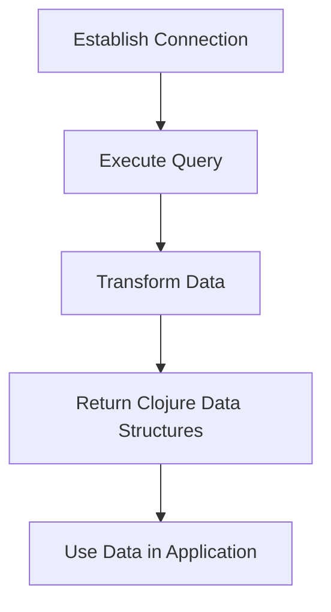

## 14.3.3 Next.jdbc

As experienced Java developers, you are likely familiar with JDBC (Java Database Connectivity) for interacting with relational databases. In Clojure, `next.jdbc` is a modern, high-performance library that provides a more idiomatic and efficient way to work with databases. This section will introduce `next.jdbc`, demonstrate how to perform common database operations, and highlight its advantages over traditional JDBC.

### Introduction to Next.jdbc

`next.jdbc` is a Clojure library designed to simplify database interactions while maintaining high performance. It builds upon the foundation of JDBC, offering a more functional approach that aligns with Clojure's paradigms. Unlike traditional JDBC, which often involves verbose and imperative code, `next.jdbc` allows for concise and expressive database operations.

#### Key Features of Next.jdbc

- **Simplicity and Performance**: Provides a straightforward API that leverages Clojure's strengths, such as immutability and functional programming.
- **Data-Driven**: Returns data in Clojure's native data structures, making it easy to work with.
- **Extensibility**: Supports custom data transformations and extensions.
- **Compatibility**: Works seamlessly with existing JDBC drivers and databases.

### Setting Up Next.jdbc

Before diving into code examples, let's set up `next.jdbc` in your Clojure project. Ensure you have a working Clojure environment and a database to connect to.

#### Adding Next.jdbc to Your Project

Add the following dependency to your `deps.edn` or `project.clj` file:

```clojure
;; deps.edn
{:deps {org.clojure/clojure {:mvn/version "1.10.3"}
        seancorfield/next.jdbc {:mvn/version "1.2.780"}}}

;; project.clj
(defproject my-clojure-project "0.1.0-SNAPSHOT"
  :dependencies [[org.clojure/clojure "1.10.3"]
                 [seancorfield/next.jdbc "1.2.780"]])
```

#### Setting Up a Database Connection

To connect to a database, you'll need a JDBC URL and credentials. Here's how to establish a connection using `next.jdbc`:

```clojure
(require '[next.jdbc :as jdbc])

(def db-spec
  {:dbtype "h2" ; Replace with your database type, e.g., "mysql", "postgresql"
   :dbname "testdb"
   :user "sa"
   :password ""})

(def datasource (jdbc/get-datasource db-spec))
```

### Performing Common Database Operations

Let's explore how to perform common database operations using `next.jdbc`, including querying, inserting, updating, and deleting data.

#### Querying Data

Fetching data from a database is a fundamental operation. With `next.jdbc`, you can execute queries and retrieve results as Clojure data structures.

```clojure
(defn fetch-users []
  (jdbc/execute! datasource ["SELECT * FROM users"]))
```

The `execute!` function executes the SQL query and returns the results as a vector of maps, where each map represents a row.

#### Inserting Data

Inserting data into a database is straightforward with `next.jdbc`. Use the `execute!` function with an insert statement.

```clojure
(defn insert-user [name email]
  (jdbc/execute! datasource
                 ["INSERT INTO users (name, email) VALUES (?, ?)" name email]))
```

This function inserts a new user into the `users` table, using parameterized queries to prevent SQL injection.

#### Updating Data

Updating existing records is similar to inserting. Use the `execute!` function with an update statement.

```clojure
(defn update-user-email [id new-email]
  (jdbc/execute! datasource
                 ["UPDATE users SET email = ? WHERE id = ?" new-email id]))
```

This function updates the email of a user identified by their `id`.

#### Deleting Data

Deleting records is also straightforward. Use the `execute!` function with a delete statement.

```clojure
(defn delete-user [id]
  (jdbc/execute! datasource
                 ["DELETE FROM users WHERE id = ?" id]))
```

This function deletes a user from the `users` table based on their `id`.

### Advanced Features of Next.jdbc

Beyond basic CRUD operations, `next.jdbc` offers advanced features that enhance its functionality and performance.

#### Handling Transactions

Transactions ensure that a series of operations either complete successfully or have no effect. Use `with-transaction` to manage transactions in `next.jdbc`.

```clojure
(defn transfer-funds [from-account to-account amount]
  (jdbc/with-transaction [tx datasource]
    (jdbc/execute! tx ["UPDATE accounts SET balance = balance - ? WHERE id = ?" amount from-account])
    (jdbc/execute! tx ["UPDATE accounts SET balance = balance + ? WHERE id = ?" amount to-account])))
```

This function transfers funds between two accounts, ensuring atomicity.

#### Customizing Data Transformations

`next.jdbc` allows you to customize how data is transformed when retrieved from the database. Use the `:builder-fn` option to specify a custom transformation function.

```clojure
(defn snake-to-kebab [s]
  (clojure.string/replace s "_" "-"))

(defn custom-fetch-users []
  (jdbc/execute! datasource
                 ["SELECT * FROM users"]
                 {:builder-fn (jdbc/as-unqualified-lower-maps snake-to-kebab)}))
```

This example transforms column names from snake_case to kebab-case.

#### Connection Pooling

Efficient database connections are crucial for performance. `next.jdbc` supports connection pooling through libraries like HikariCP.

```clojure
(require '[hikari-cp.core :as hikari])

(def pooled-datasource
  (hikari/make-datasource {:jdbc-url "jdbc:h2:mem:testdb"
                           :username "sa"
                           :password ""}))
```

### Comparing Next.jdbc with Java's JDBC

Let's compare `next.jdbc` with traditional JDBC to highlight the differences and advantages.

#### Java JDBC Example

Here's a typical JDBC example in Java for querying data:

```java
import java.sql.Connection;
import java.sql.DriverManager;
import java.sql.ResultSet;
import java.sql.Statement;

public class JdbcExample {
    public static void main(String[] args) {
        try (Connection conn = DriverManager.getConnection("jdbc:h2:mem:testdb", "sa", "")) {
            Statement stmt = conn.createStatement();
            ResultSet rs = stmt.executeQuery("SELECT * FROM users");
            while (rs.next()) {
                System.out.println("User: " + rs.getString("name"));
            }
        } catch (Exception e) {
            e.printStackTrace();
        }
    }
}
```

#### Clojure Next.jdbc Example

The equivalent operation in Clojure using `next.jdbc` is more concise and expressive:

```clojure
(defn fetch-users []
  (jdbc/execute! datasource ["SELECT * FROM users"]))
```

#### Key Differences

- **Conciseness**: `next.jdbc` reduces boilerplate code, making it easier to read and maintain.
- **Functional Style**: Aligns with Clojure's functional programming paradigm, using immutable data structures.
- **Data Transformation**: Provides built-in support for transforming data into Clojure-friendly formats.

### Try It Yourself

Experiment with the following modifications to deepen your understanding of `next.jdbc`:

- **Add a New Table**: Create a new table and perform CRUD operations on it.
- **Implement Joins**: Write queries that join multiple tables and retrieve combined results.
- **Use Connection Pooling**: Set up connection pooling and observe performance improvements.

### Visualizing Data Flow in Next.jdbc

Below is a diagram illustrating the flow of data through `next.jdbc` operations, from establishing a connection to executing queries and handling results.



*Diagram: Data flow in `next.jdbc`, from connection to data usage.*

### Further Reading

For more information on `next.jdbc`, consider exploring the following resources:

- [Official Next.jdbc Documentation](https://github.com/seancorfield/next-jdbc)
- [ClojureDocs: Next.jdbc](https://clojuredocs.org/)
- [HikariCP Documentation](https://github.com/brettwooldridge/HikariCP)

### Exercises

1. **Create a New Database Schema**: Design a new schema and implement it using `next.jdbc`.
2. **Implement a Complex Query**: Write a query that involves multiple joins and aggregations.
3. **Benchmark Performance**: Compare the performance of `next.jdbc` with traditional JDBC in a sample application.

### Key Takeaways

- `next.jdbc` provides a modern, high-performance way to interact with databases in Clojure.
- It simplifies database operations with a functional approach, reducing boilerplate code.
- The library supports advanced features like transactions, data transformations, and connection pooling.
- By leveraging `next.jdbc`, you can write more expressive and maintainable database code in Clojure.

Now that we've explored how `next.jdbc` enhances database interactions in Clojure, let's apply these concepts to build robust and efficient data-driven applications.

## Quiz: Mastering Next.jdbc for Clojure Database Operations



### What is the primary advantage of using `next.jdbc` over traditional JDBC in Clojure?

- [x] It provides a more functional and idiomatic approach to database operations.
- [ ] It is faster than any other database library.
- [ ] It only works with NoSQL databases.
- [ ] It eliminates the need for SQL queries.

> **Explanation:** `next.jdbc` offers a functional and idiomatic approach that aligns with Clojure's paradigms, making database operations more concise and expressive.

### How does `next.jdbc` handle data returned from a database query?

- [x] It returns data as Clojure's native data structures.
- [ ] It returns data as Java objects.
- [ ] It returns data as XML.
- [ ] It returns data as JSON.

> **Explanation:** `next.jdbc` returns query results as Clojure data structures, such as vectors and maps, which are easy to work with in Clojure.

### Which function is used in `next.jdbc` to execute a SQL query?

- [x] `execute!`
- [ ] `run-query`
- [ ] `perform-query`
- [ ] `query-db`

> **Explanation:** The `execute!` function is used to execute SQL queries in `next.jdbc`.

### What is the purpose of the `:builder-fn` option in `next.jdbc`?

- [x] To customize how data is transformed when retrieved from the database.
- [ ] To specify the database connection timeout.
- [ ] To define the database schema.
- [ ] To set the maximum number of connections.

> **Explanation:** The `:builder-fn` option allows you to define custom data transformations for query results.

### Which library can be used with `next.jdbc` for connection pooling?

- [x] HikariCP
- [ ] Apache Commons DBCP
- [ ] C3P0
- [ ] BoneCP

> **Explanation:** HikariCP is a popular library that can be used with `next.jdbc` to provide efficient connection pooling.

### What is the role of `with-transaction` in `next.jdbc`?

- [x] To manage transactions, ensuring atomicity of operations.
- [ ] To log all database operations.
- [ ] To automatically retry failed queries.
- [ ] To encrypt database connections.

> **Explanation:** `with-transaction` is used to manage transactions, ensuring that a series of operations are executed atomically.

### How does `next.jdbc` improve upon Java's traditional JDBC in terms of code readability?

- [x] By reducing boilerplate code and using functional constructs.
- [ ] By using XML configuration files.
- [ ] By providing a graphical user interface.
- [ ] By eliminating the need for SQL queries.

> **Explanation:** `next.jdbc` reduces boilerplate code and leverages functional programming constructs, making the code more readable and maintainable.

### What is a key difference between `next.jdbc` and traditional JDBC when handling query results?

- [x] `next.jdbc` returns results as Clojure data structures, while JDBC uses Java objects.
- [ ] `next.jdbc` uses XML for results, while JDBC uses JSON.
- [ ] `next.jdbc` requires a GUI, while JDBC is command-line based.
- [ ] `next.jdbc` only supports NoSQL databases.

> **Explanation:** `next.jdbc` returns query results as Clojure data structures, which are more idiomatic and easier to work with in Clojure.

### Which of the following is a benefit of using `next.jdbc` for database operations in Clojure?

- [x] It aligns with Clojure's functional programming paradigm.
- [ ] It requires less memory than any other library.
- [ ] It automatically generates SQL queries.
- [ ] It only works with cloud databases.

> **Explanation:** `next.jdbc` aligns with Clojure's functional programming paradigm, making it a natural fit for Clojure applications.

### True or False: `next.jdbc` can only be used with SQL databases.

- [x] True
- [ ] False

> **Explanation:** `next.jdbc` is designed for use with SQL databases, leveraging JDBC drivers to interact with them.


