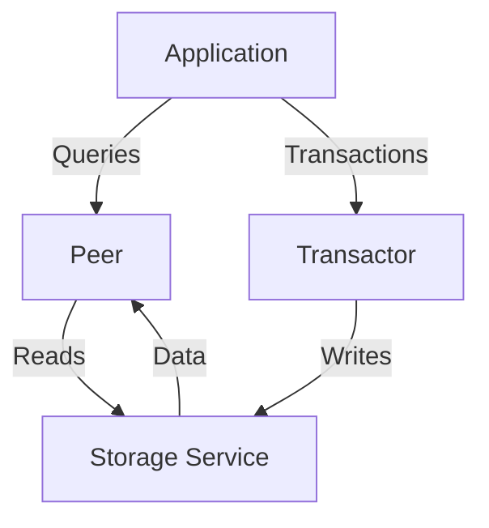

## 14.4.1 Introduction to Datomic

As experienced Java developers transitioning to Clojure, you are likely familiar with traditional relational databases and their limitations when it comes to handling immutable data and scaling distributed systems. Enter **Datomic**, a database designed to address these challenges by embracing immutability and scalability, making it a perfect fit for Clojure's functional programming paradigm.

### What is Datomic?

Datomic is a distributed database system that emphasizes immutability, scalability, and a unique approach to data management. Unlike traditional databases that overwrite data, Datomic stores all changes as immutable facts, allowing you to query the database at any point in time. This feature aligns well with Clojure's philosophy of immutability and functional programming.

#### Key Features of Datomic

- **Immutability**: Data in Datomic is never overwritten. Instead, new facts are added, and the database maintains a complete history of changes.
- **Scalability**: Datomic's architecture separates reads and writes, allowing it to scale horizontally and handle large volumes of data efficiently.
- **Time Travel**: You can query the database as it existed at any point in time, providing powerful auditing and historical analysis capabilities.
- **ACID Transactions**: Datomic supports ACID transactions, ensuring data consistency and reliability.
- **Integration with Clojure**: Datomic is designed to work seamlessly with Clojure, leveraging its functional programming strengths.

### Datomic Architecture

Datomic's architecture is designed to separate concerns and optimize for scalability and performance. Let's explore its components:



**Diagram 1: Datomic Architecture**  
This diagram illustrates the flow of data in Datomic's architecture, highlighting the separation of reads and writes.

#### Components of Datomic

1. **Peers**: These are client libraries that run within your application, allowing you to query the database. Peers cache data locally, reducing the load on the storage service and improving query performance.

2. **Transactor**: This component handles all write operations, ensuring ACID compliance. It serializes transactions and writes them to the storage service.

3. **Storage Service**: Datomic supports various storage backends, such as Amazon DynamoDB, SQL databases, and more. This flexibility allows you to choose the storage solution that best fits your needs.

4. **Data**: The actual data is stored in the storage service, while the peers and transactor interact with it to perform reads and writes.

### Benefits of Using Datomic

Datomic offers several advantages over traditional databases, particularly for applications built with Clojure:

- **Immutable Data Model**: By storing data as immutable facts, Datomic eliminates issues related to data corruption and simplifies reasoning about data changes.
- **Scalable Architecture**: The separation of reads and writes allows Datomic to scale horizontally, handling large datasets and high query loads efficiently.
- **Time Travel Queries**: The ability to query historical data provides powerful insights and auditing capabilities, making it easier to track changes and understand data evolution.
- **Seamless Clojure Integration**: Datomic's API is designed to work naturally with Clojure, leveraging its functional programming strengths and providing a consistent development experience.

### When to Consider Using Datomic

Datomic is particularly well-suited for applications that require:

- **Complex Data Relationships**: Datomic's flexible schema and powerful query capabilities make it ideal for applications with complex data models.
- **Historical Data Analysis**: If your application needs to analyze data over time or maintain a complete audit trail, Datomic's time travel feature is invaluable.
- **Scalability and Performance**: Datomic's architecture allows it to handle large datasets and high query loads efficiently, making it a good choice for scalable applications.

### Comparing Datomic with Traditional Databases

To better understand Datomic's unique approach, let's compare it with a traditional relational database:

| Feature                | Traditional Database | Datomic                      |
|------------------------|----------------------|------------------------------|
| Data Mutability        | Mutable              | Immutable                    |
| Scalability            | Vertical             | Horizontal                   |
| Time Travel Queries    | Limited              | Full Support                 |
| Schema Flexibility     | Rigid                | Flexible                     |
| Integration with Clojure | Limited            | Seamless                     |

### Code Example: Using Datomic with Clojure

Let's explore a simple example of using Datomic with Clojure. We'll create a database, add some data, and perform a query.

```clojure
;; Import necessary libraries
(require '[datomic.api :as d])

;; Connect to a Datomic database
(def uri "datomic:mem://example")
(d/create-database uri)
(def conn (d/connect uri))

;; Define a schema
(def schema [{:db/ident       :person/name
              :db/valueType   :db.type/string
              :db/cardinality :db.cardinality/one
              :db/doc         "A person's name"}])

;; Transact the schema
@(d/transact conn {:tx-data schema})

;; Add some data
(def data [{:person/name "Alice"}
           {:person/name "Bob"}])

;; Transact the data
@(d/transact conn {:tx-data data})

;; Query the database
(def query '[:find ?name
             :where [?e :person/name ?name]])

;; Execute the query
(d/q query (d/db conn))
```

**Code Explanation:**

- We start by requiring the `datomic.api` namespace, which provides the necessary functions to interact with Datomic.
- We create a new in-memory database and establish a connection to it.
- We define a simple schema for a `person` entity with a `name` attribute.
- We transact the schema and some sample data into the database.
- Finally, we perform a query to retrieve the names of all persons in the database.

### Try It Yourself

Experiment with the code example by adding more attributes to the schema, such as `:person/age` or `:person/email`, and update the data and query accordingly. This will help you understand how Datomic handles schema changes and data queries.

### External Resources

For more information on Datomic, consider exploring the following resources:

- [Official Datomic Documentation](https://docs.datomic.com/)
- [ClojureDocs: Datomic](https://clojuredocs.org/datomic.api)
- [Datomic GitHub Repository](https://github.com/Datomic/datomic)

### Exercises

1. **Schema Evolution**: Modify the schema to include additional attributes for the `person` entity. Add new data and perform queries to retrieve specific attributes.
2. **Time Travel Queries**: Explore Datomic's time travel capabilities by querying the database at different points in time. Observe how the results change as you add or modify data.
3. **Scalability Experiment**: Set up a Datomic system with a larger dataset and measure the performance of queries. Experiment with different storage backends to see how they affect performance.

### Key Takeaways

- **Datomic is a powerful database system** that aligns well with Clojure's functional programming paradigm, offering immutability, scalability, and time travel capabilities.
- **Its architecture separates reads and writes**, allowing for efficient scaling and performance optimization.
- **Datomic's integration with Clojure** provides a seamless development experience, leveraging the strengths of both technologies.
- **Consider using Datomic** for applications that require complex data relationships, historical data analysis, and scalability.

Now that we've explored the fundamentals of Datomic, let's delve deeper into its capabilities and see how it can enhance your data management strategies in Clojure applications.

## Quiz: Test Your Knowledge on Datomic



### What is a key feature of Datomic that aligns with Clojure's philosophy?

- [x] Immutability
- [ ] Mutable Data
- [ ] Vertical Scaling
- [ ] Limited Schema Flexibility

> **Explanation:** Datomic's immutable data model aligns with Clojure's philosophy of immutability and functional programming.

### Which component of Datomic handles write operations?

- [ ] Peer
- [x] Transactor
- [ ] Storage Service
- [ ] Data

> **Explanation:** The Transactor component handles all write operations in Datomic, ensuring ACID compliance.

### What is a benefit of Datomic's time travel feature?

- [x] Ability to query historical data
- [ ] Faster write operations
- [ ] Reduced storage requirements
- [ ] Simplified schema design

> **Explanation:** Datomic's time travel feature allows you to query the database as it existed at any point in time, providing powerful insights and auditing capabilities.

### How does Datomic achieve scalability?

- [ ] By using vertical scaling
- [x] By separating reads and writes
- [ ] By limiting data size
- [ ] By using a single storage backend

> **Explanation:** Datomic achieves scalability by separating reads and writes, allowing it to scale horizontally and handle large datasets efficiently.

### Which of the following is NOT a component of Datomic's architecture?

- [ ] Peer
- [ ] Transactor
- [ ] Storage Service
- [x] Indexer

> **Explanation:** The components of Datomic's architecture include Peers, Transactor, and Storage Service. There is no component called Indexer.

### What is the role of Peers in Datomic?

- [x] To query the database
- [ ] To handle write operations
- [ ] To store data
- [ ] To manage transactions

> **Explanation:** Peers are client libraries that run within your application, allowing you to query the database.

### Which storage backend is NOT supported by Datomic?

- [ ] Amazon DynamoDB
- [ ] SQL databases
- [ ] In-memory storage
- [x] MongoDB

> **Explanation:** Datomic supports various storage backends, such as Amazon DynamoDB and SQL databases, but not MongoDB.

### What is a unique advantage of Datomic's immutable data model?

- [x] Eliminates data corruption issues
- [ ] Faster data retrieval
- [ ] Simplified query syntax
- [ ] Reduced memory usage

> **Explanation:** By storing data as immutable facts, Datomic eliminates issues related to data corruption and simplifies reasoning about data changes.

### How does Datomic integrate with Clojure?

- [x] Seamlessly, leveraging Clojure's functional programming strengths
- [ ] With limited support for Clojure's features
- [ ] By using Java interop
- [ ] Through a separate API layer

> **Explanation:** Datomic is designed to work seamlessly with Clojure, leveraging its functional programming strengths and providing a consistent development experience.

### True or False: Datomic supports ACID transactions.

- [x] True
- [ ] False

> **Explanation:** Datomic supports ACID transactions, ensuring data consistency and reliability.


