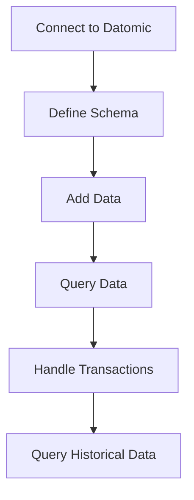
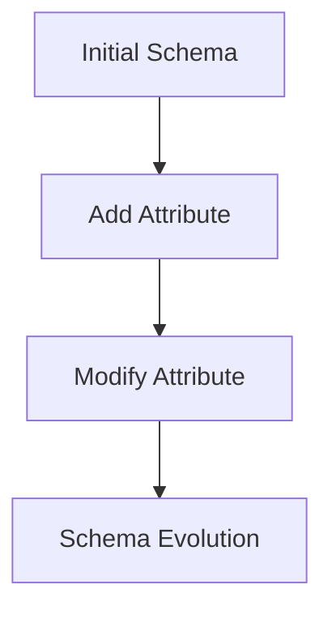

## 14.4.2 Working with Datomic

Datomic is a distributed database system designed to enable scalable, flexible, and intelligent applications. It is particularly well-suited for Clojure developers due to its immutable data model and functional programming principles. In this section, we will explore how to connect to Datomic, define schemas, perform queries using Datalog, and handle transactions. We'll also draw parallels with Java's traditional database approaches to highlight the advantages of using Datomic.

### Introduction to Datomic

Datomic is unique in its approach to data management. Unlike traditional databases, which often focus on mutable state, Datomic emphasizes immutability and time-based data. This allows developers to query not only the current state of the data but also its history, providing a powerful tool for auditing and analysis.

#### Key Features of Datomic

- **Immutability**: Data in Datomic is immutable, meaning once written, it cannot be changed. This aligns with functional programming principles and simplifies reasoning about data.
- **Time-based Queries**: Datomic allows you to query data as of any point in time, providing a historical view of your data.
- **Datalog Queries**: Datomic uses Datalog, a declarative query language, which is more expressive and flexible than SQL.
- **Schema Flexibility**: Datomic schemas are flexible and can evolve over time without requiring migrations.

### Connecting to Datomic

To start working with Datomic, you need to set up a connection to a Datomic database. Datomic provides both a free version, Datomic Free, and a commercial version, Datomic Pro. For this guide, we'll focus on Datomic Free.

#### Setting Up Datomic

1. **Download Datomic**: You can download Datomic Free from the [official Datomic website](https://www.datomic.com/).
2. **Start the Transactor**: The transactor is responsible for managing transactions and coordinating with the storage service. You can start it using the following command:

   ```bash
   bin/transactor config/dev-transactor-template.properties
   ```

3. **Connect to the Database**: In your Clojure project, you can connect to the Datomic database using the following code:

   ```clojure
   (require '[datomic.api :as d])

   ;; Connect to the Datomic database
   (def uri "datomic:free://localhost:4334/my-database")
   (def conn (d/connect uri))
   ```

   Here, `uri` specifies the location of your Datomic database, and `conn` is the connection object you'll use to interact with the database.

### Defining Schemas

Schemas in Datomic define the structure of your data. They specify the attributes that entities can have and the types of those attributes.

#### Creating a Schema

A schema in Datomic is defined using a set of transactions that add attributes to the database. Here's an example schema for a simple user entity:

```clojure
(def user-schema
  [{:db/ident       :user/name
    :db/valueType   :db.type/string
    :db/cardinality :db.cardinality/one
    :db/doc         "The user's name"}

   {:db/ident       :user/email
    :db/valueType   :db.type/string
    :db/cardinality :db.cardinality/one
    :db/unique      :db.unique/identity
    :db/doc         "The user's email address"}

   {:db/ident       :user/age
    :db/valueType   :db.type/long
    :db/cardinality :db.cardinality/one
    :db/doc         "The user's age"}])

;; Transact the schema
@(d/transact conn {:tx-data user-schema})
```

- **:db/ident**: The identifier for the attribute.
- **:db/valueType**: The type of value the attribute can hold.
- **:db/cardinality**: Specifies whether the attribute can have one or many values.
- **:db/unique**: Ensures the attribute value is unique across entities.

#### Schema Evolution

Datomic allows you to evolve your schema over time. You can add new attributes or modify existing ones without needing to migrate your data. This is a significant advantage over traditional databases, where schema changes can be complex and error-prone.

### Performing Queries Using Datalog

Datalog is a powerful query language used by Datomic. It allows you to express complex queries in a concise and readable manner.

#### Basic Datalog Queries

Let's start with a simple query to find all users in the database:

```clojure
(def query '[:find ?e ?name
             :where [?e :user/name ?name]])

;; Execute the query
(d/q query (d/db conn))
```

- **:find**: Specifies the variables to return.
- **:where**: Defines the conditions that must be met for the query to return a result.

#### Advanced Queries

Datalog supports more complex queries, including joins and aggregations. Here's an example of a query that finds users over a certain age:

```clojure
(def query '[:find ?e ?name
             :where [?e :user/name ?name]
                    [?e :user/age ?age]
                    [(> ?age 30)]])

;; Execute the query
(d/q query (d/db conn))
```

This query uses a predicate `[(> ?age 30)]` to filter results based on age.

#### Comparing Datalog and SQL

Datalog is more expressive than SQL, allowing you to write queries that are both concise and powerful. Here's a comparison of a simple query in both languages:

**Datalog**:
```clojure
[:find ?name
 :where [?e :user/name ?name]]
```

**SQL**:
```sql
SELECT name FROM users;
```

While both queries achieve the same result, Datalog's syntax is more flexible and can easily accommodate more complex queries.

### Handling Transactions

Transactions in Datomic are used to add, update, or retract data. They are immutable and can be queried over time.

#### Adding Data

To add data to the database, you create a transaction with the data you want to add:

```clojure
(def add-user
  [{:db/id       (d/tempid :db.part/user)
    :user/name   "Alice"
    :user/email  "alice@example.com"
    :user/age    30}])

;; Transact the data
@(d/transact conn {:tx-data add-user})
```

#### Updating Data

Updating data in Datomic involves retracting the old value and adding the new value:

```clojure
(def update-user
  [[:db/retractEntity [:user/email "alice@example.com"]]
   {:db/id       (d/tempid :db.part/user)
    :user/name   "Alice"
    :user/email  "alice@newdomain.com"
    :user/age    31}])

;; Transact the update
@(d/transact conn {:tx-data update-user})
```

#### Retracting Data

To remove data, you use the `:db.fn/retractEntity` function:

```clojure
(def retract-user
  [[:db.fn/retractEntity [:user/email "alice@newdomain.com"]]])

;; Transact the retraction
@(d/transact conn {:tx-data retract-user})
```

### Try It Yourself

Now that we've covered the basics of working with Datomic, try modifying the examples to add new attributes to the schema, perform more complex queries, or handle transactions with different data. Experimenting with these concepts will deepen your understanding of Datomic's capabilities.

### Diagrams and Visualizations

To better understand the flow of data and transactions in Datomic, let's look at a few diagrams.

#### Data Flow in Datomic



*Diagram 1: The flow of data and transactions in Datomic.*

#### Schema Evolution



*Diagram 2: The process of evolving a schema in Datomic.*

### Further Reading

For more information on Datomic, consider exploring the following resources:

- [Datomic Documentation](https://docs.datomic.com/)
- [ClojureDocs](https://clojuredocs.org/)
- [Datalog Query Language](https://en.wikipedia.org/wiki/Datalog)

### Exercises

1. **Define a New Schema**: Create a schema for a product catalog, including attributes for product name, price, and category.
2. **Perform a Complex Query**: Write a Datalog query to find all products in a specific category with a price above a certain threshold.
3. **Handle Transactions**: Add, update, and retract product data using transactions.

### Key Takeaways

- Datomic's immutable data model and time-based queries provide powerful tools for data management.
- Datalog offers a flexible and expressive query language that simplifies complex queries.
- Transactions in Datomic are immutable, allowing for historical queries and simplifying data management.

By mastering these concepts, you'll be well-equipped to leverage Datomic's capabilities in your Clojure applications, enhancing both the scalability and flexibility of your data management solutions.

## Quiz: Mastering Datomic for Java Developers



### What is a key feature of Datomic that aligns with functional programming principles?

- [x] Immutability
- [ ] Mutable state
- [ ] Synchronous transactions
- [ ] Schema migrations

> **Explanation:** Datomic emphasizes immutability, which aligns with functional programming principles.

### Which query language does Datomic use?

- [x] Datalog
- [ ] SQL
- [ ] NoSQL
- [ ] GraphQL

> **Explanation:** Datomic uses Datalog, a declarative query language.

### How does Datomic handle schema evolution?

- [x] Allows adding and modifying attributes without migrations
- [ ] Requires complex migrations
- [ ] Does not support schema changes
- [ ] Uses SQL scripts for changes

> **Explanation:** Datomic allows schema evolution without requiring migrations, making it flexible.

### What is the purpose of the `:db/ident` attribute in a Datomic schema?

- [x] It identifies the attribute
- [ ] It specifies the data type
- [ ] It defines cardinality
- [ ] It ensures uniqueness

> **Explanation:** The `:db/ident` attribute is used to identify the attribute in a schema.

### In a Datalog query, what does the `:find` clause specify?

- [x] The variables to return
- [ ] The conditions to meet
- [ ] The database to query
- [ ] The transaction to execute

> **Explanation:** The `:find` clause specifies the variables to return in a Datalog query.

### How are transactions in Datomic characterized?

- [x] Immutable
- [ ] Mutable
- [ ] Synchronous
- [ ] Asynchronous

> **Explanation:** Transactions in Datomic are immutable, allowing for historical queries.

### What is a benefit of using Datalog over SQL?

- [x] More expressive and flexible
- [ ] Easier to learn
- [ ] Requires less setup
- [ ] Supports more databases

> **Explanation:** Datalog is more expressive and flexible than SQL, allowing for complex queries.

### How can you remove data in Datomic?

- [x] Using `:db.fn/retractEntity`
- [ ] Using SQL DELETE statement
- [ ] Using `:db.fn/remove`
- [ ] Using `:db.fn/delete`

> **Explanation:** Data can be removed in Datomic using `:db.fn/retractEntity`.

### What is a unique feature of Datomic's query capabilities?

- [x] Time-based queries
- [ ] Real-time updates
- [ ] Graph queries
- [ ] Machine learning integration

> **Explanation:** Datomic allows for time-based queries, providing historical views of data.

### True or False: Datomic requires schema migrations for every change.

- [ ] True
- [x] False

> **Explanation:** Datomic does not require schema migrations for every change, allowing for flexible schema evolution.


