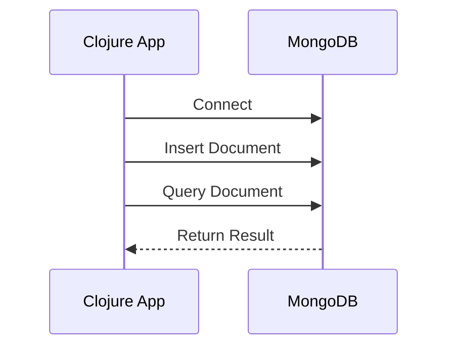
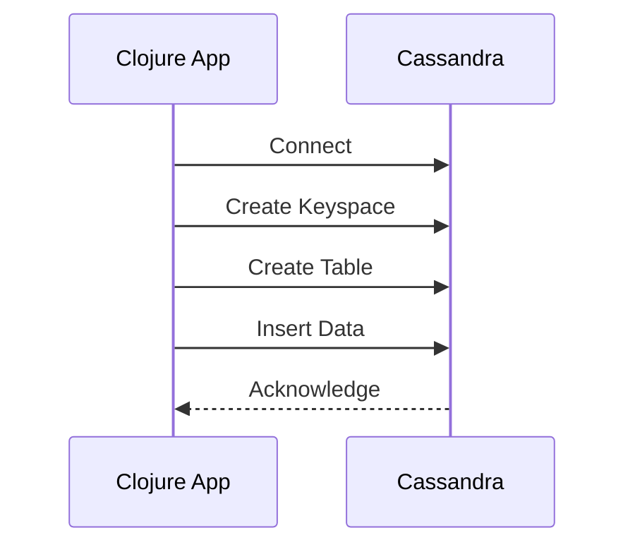
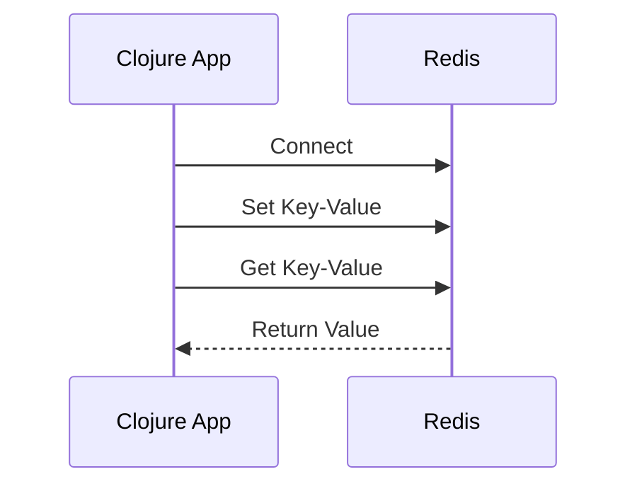

## 14.4.3 Other Datastores

In this section, we will delve into integrating Clojure with various popular datastores, specifically MongoDB, Cassandra, and Redis. These datastores are widely used in the industry due to their scalability, flexibility, and performance. We will explore how to use Clojure libraries such as `monger`, `cassaforte`, and `carmine` to interact with these datastores, providing clear examples and comparisons with Java to highlight the differences and similarities.

### MongoDB with Monger

MongoDB is a NoSQL database known for its flexibility and scalability. In Clojure, the `monger` library, part of the `clojurewerkz` suite, provides a robust interface for interacting with MongoDB.

#### Setting Up Monger

To get started with Monger, add the following dependency to your `project.clj`:

```clojure
:dependencies [[clojurewerkz/monger "3.1.0"]]
```

#### Connecting to MongoDB

Let's begin by establishing a connection to a MongoDB instance:

```clojure
(ns myapp.core
  (:require [monger.core :as mg]
            [monger.collection :as mc]))

;; Connect to MongoDB
(def conn (mg/connect))
(def db (mg/get-db conn "my_database"))

;; Insert a document
(mc/insert db "my_collection" {:name "John Doe" :age 30})

;; Find a document
(defn find-user [name]
  (mc/find-one-as-map db "my_collection" {:name name}))

;; Usage
(println (find-user "John Doe"))
```

**Explanation:**
- We establish a connection using `mg/connect` and retrieve the database with `mg/get-db`.
- We insert a document into a collection using `mc/insert`.
- We define a function `find-user` to retrieve a document based on a query.

#### Comparison with Java

In Java, interacting with MongoDB involves using the MongoDB Java Driver. Here's a simple example:

```java
import com.mongodb.MongoClient;
import com.mongodb.client.MongoCollection;
import com.mongodb.client.MongoDatabase;
import org.bson.Document;

public class MongoExample {
    public static void main(String[] args) {
        MongoClient mongoClient = new MongoClient("localhost", 27017);
        MongoDatabase database = mongoClient.getDatabase("my_database");
        MongoCollection<Document> collection = database.getCollection("my_collection");

        // Insert a document
        Document doc = new Document("name", "John Doe").append("age", 30);
        collection.insertOne(doc);

        // Find a document
        Document found = collection.find(new Document("name", "John Doe")).first();
        System.out.println(found.toJson());
    }
}
```

**Comparison:**
- Both Clojure and Java require setting up a connection and accessing a database and collection.
- Clojure's syntax is more concise and leverages functional programming paradigms, making it easier to express queries and transformations.

### Cassandra with Cassaforte

Cassandra is a distributed NoSQL database designed for handling large amounts of data across many commodity servers. The `cassaforte` library provides a Clojure interface to interact with Cassandra.

#### Setting Up Cassaforte

Add the following dependency to your `project.clj`:

```clojure
:dependencies [[clojurewerkz/cassaforte "3.0.0"]]
```

#### Connecting to Cassandra

Here's how you can connect to a Cassandra cluster and perform basic operations:

```clojure
(ns myapp.cassandra
  (:require [qbits.alia :as alia]
            [qbits.hayt :refer :all]))

;; Connect to Cassandra
(def cluster (alia/cluster {:contact-points ["127.0.0.1"]}))
(def session (alia/connect cluster))

;; Create a keyspace and table
(alia/execute session (create-keyspace :my_keyspace
                                       (if-not-exists)
                                       (with {:replication {:class "SimpleStrategy"
                                                            :replication_factor 1}})))

(alia/execute session (use-keyspace :my_keyspace))

(alia/execute session (create-table :users
                                    (if-not-exists)
                                    (column-definitions {:id :uuid
                                                         :name :text
                                                         :age :int
                                                         :primary-key [:id]})))

;; Insert a user
(defn insert-user [id name age]
  (alia/execute session
                (insert :users
                        (values {:id id :name name :age age}))))

;; Usage
(insert-user (java.util.UUID/randomUUID) "Alice" 25)
```

**Explanation:**
- We establish a connection using `alia/cluster` and `alia/connect`.
- We create a keyspace and table using CQL (Cassandra Query Language) commands.
- We define a function `insert-user` to insert data into the `users` table.

#### Comparison with Java

In Java, using the DataStax Java Driver, the process is as follows:

```java
import com.datastax.driver.core.Cluster;
import com.datastax.driver.core.Session;
import java.util.UUID;

public class CassandraExample {
    public static void main(String[] args) {
        Cluster cluster = Cluster.builder().addContactPoint("127.0.0.1").build();
        Session session = cluster.connect();

        // Create keyspace and table
        session.execute("CREATE KEYSPACE IF NOT EXISTS my_keyspace WITH replication = {'class':'SimpleStrategy', 'replication_factor':1};");
        session.execute("USE my_keyspace;");
        session.execute("CREATE TABLE IF NOT EXISTS users (id uuid PRIMARY KEY, name text, age int);");

        // Insert a user
        UUID id = UUID.randomUUID();
        session.execute("INSERT INTO users (id, name, age) VALUES (" + id + ", 'Alice', 25);");
    }
}
```

**Comparison:**
- Both languages require setting up a cluster and session.
- Clojure's `cassaforte` library provides a more idiomatic and concise way to express CQL commands using Clojure data structures.

### Redis with Carmine

Redis is an in-memory data structure store, used as a database, cache, and message broker. The `carmine` library is a popular choice for interacting with Redis in Clojure.

#### Setting Up Carmine

Add the following dependency to your `project.clj`:

```clojure
:dependencies [[com.taoensso/carmine "2.19.1"]]
```

#### Connecting to Redis

Here's how you can connect to Redis and perform basic operations:

```clojure
(ns myapp.redis
  (:require [taoensso.carmine :as car]))

(def server-conn {:pool {} :spec {:host "127.0.0.1" :port 6379}})

(defmacro wcar* [& body] `(car/wcar server-conn ~@body))

;; Set and get a value
(wcar* (car/set "my-key" "Hello, Redis!"))
(println (wcar* (car/get "my-key")))
```

**Explanation:**
- We define a connection map `server-conn` with Redis server details.
- We use the `wcar*` macro to wrap Redis commands, ensuring they execute within a connection context.
- We perform basic `set` and `get` operations.

#### Comparison with Java

In Java, using the Jedis library, the process is as follows:

```java
import redis.clients.jedis.Jedis;

public class RedisExample {
    public static void main(String[] args) {
        Jedis jedis = new Jedis("localhost");
        
        // Set and get a value
        jedis.set("my-key", "Hello, Redis!");
        System.out.println(jedis.get("my-key"));
    }
}
```

**Comparison:**
- Both Clojure and Java require setting up a connection to the Redis server.
- Clojure's `carmine` library provides a macro-based approach to manage Redis commands, which can be more expressive and concise.

### Try It Yourself

Now that we've explored how to integrate Clojure with MongoDB, Cassandra, and Redis, try modifying the examples to suit your needs:

- **MongoDB**: Add more fields to the document and perform complex queries.
- **Cassandra**: Experiment with different data types and CQL commands.
- **Redis**: Implement a simple caching mechanism using Redis.

### Diagrams

To better understand the flow of data and operations in these datastores, let's visualize the interactions using Mermaid.js diagrams.

#### MongoDB Interaction Flow



*Diagram 1: Sequence diagram showing the interaction between a Clojure application and MongoDB.*

#### Cassandra Interaction Flow



*Diagram 2: Sequence diagram illustrating the interaction between a Clojure application and Cassandra.*

#### Redis Interaction Flow



*Diagram 3: Sequence diagram depicting the interaction between a Clojure application and Redis.*

### Key Takeaways

- **Monger**, **Cassaforte**, and **Carmine** are powerful libraries for integrating Clojure with MongoDB, Cassandra, and Redis, respectively.
- Clojure's functional programming paradigm and concise syntax make it an excellent choice for interacting with these datastores.
- Understanding the differences and similarities between Clojure and Java can help you leverage your existing Java knowledge while adopting Clojure.

### Exercises

1. **MongoDB Exercise**: Extend the MongoDB example to include an update operation and implement a query to find all users older than a certain age.
2. **Cassandra Exercise**: Modify the Cassandra example to include a new column for email addresses and write a query to retrieve users by email.
3. **Redis Exercise**: Implement a simple session management system using Redis, where you can store and retrieve user session data.

### Further Reading

- [Official Clojure Documentation](https://clojure.org/reference/documentation)
- [Monger GitHub Repository](https://github.com/michaelklishin/monger)
- [Cassaforte GitHub Repository](https://github.com/clojurewerkz/cassaforte)
- [Carmine GitHub Repository](https://github.com/ptaoussanis/carmine)

Now that we've explored integrating Clojure with various datastores, let's apply these concepts to manage data effectively in your applications.

## Quiz: Mastering Clojure Datastore Integration



### Which library is used for integrating Clojure with MongoDB?

- [x] Monger
- [ ] Cassaforte
- [ ] Carmine
- [ ] Datomic

> **Explanation:** Monger is the library used for integrating Clojure with MongoDB.

### What is the primary purpose of the `cassaforte` library in Clojure?

- [ ] To interact with Redis
- [x] To interact with Cassandra
- [ ] To interact with MongoDB
- [ ] To interact with SQL databases

> **Explanation:** Cassaforte is used for interacting with Cassandra in Clojure.

### In the Redis example, which macro is used to wrap Redis commands?

- [ ] `defn`
- [ ] `let`
- [x] `wcar*`
- [ ] `do`

> **Explanation:** The `wcar*` macro is used to wrap Redis commands in the Carmine library.

### What is the equivalent of `mc/insert` in Java when using MongoDB?

- [ ] `session.execute`
- [ ] `jedis.set`
- [x] `collection.insertOne`
- [ ] `database.getCollection`

> **Explanation:** `collection.insertOne` is used in Java to insert a document into a MongoDB collection.

### Which of the following is a key feature of Redis?

- [x] In-memory data storage
- [ ] Strong consistency
- [ ] Document-based storage
- [ ] Column-family storage

> **Explanation:** Redis is known for its in-memory data storage capabilities.

### How does Clojure's syntax for interacting with datastores compare to Java's?

- [x] More concise and expressive
- [ ] More verbose
- [ ] Less functional
- [ ] Less flexible

> **Explanation:** Clojure's syntax is more concise and expressive due to its functional programming nature.

### What is the purpose of the `create-keyspace` function in the Cassaforte example?

- [ ] To insert data into a table
- [x] To create a new keyspace in Cassandra
- [ ] To delete a keyspace
- [ ] To update a keyspace

> **Explanation:** The `create-keyspace` function is used to create a new keyspace in Cassandra.

### Which Clojure library is used for interacting with Redis?

- [ ] Monger
- [ ] Cassaforte
- [x] Carmine
- [ ] Datomic

> **Explanation:** Carmine is the library used for interacting with Redis in Clojure.

### What is a common use case for using Redis in applications?

- [ ] Document storage
- [ ] Strong consistency
- [x] Caching
- [ ] Relational data management

> **Explanation:** Redis is commonly used for caching due to its in-memory data storage capabilities.

### True or False: Clojure's functional programming paradigm makes it less suitable for interacting with datastores.

- [ ] True
- [x] False

> **Explanation:** Clojure's functional programming paradigm, with its concise syntax and expressive capabilities, makes it well-suited for interacting with datastores.


