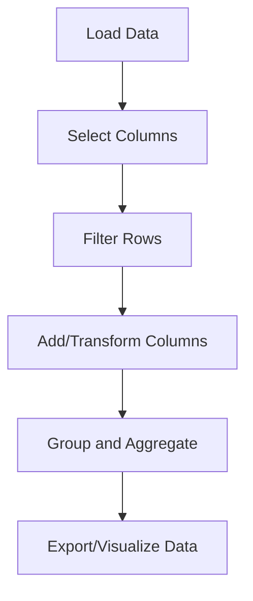

## 14.5.1 Data Analysis Libraries

As experienced Java developers, you are likely familiar with data analysis libraries such as Apache Commons Math or the Java Statistical Analysis Tool (JSAT). In Clojure, we have powerful libraries like **Incanter** and **Tablecloth** that offer robust data analysis capabilities. These libraries leverage Clojure's functional programming paradigm to provide elegant and efficient solutions for statistical computing and data processing.

### Introduction to Incanter

**Incanter** is a Clojure-based platform for statistical computing and graphics. It is inspired by R and provides a rich set of functions for data manipulation, statistical analysis, and visualization. Incanter is built on top of several Java libraries, including Parallel Colt and JFreeChart, making it a powerful tool for data scientists and analysts.

#### Key Features of Incanter

- **Statistical Functions**: Incanter provides a wide range of statistical functions, including descriptive statistics, hypothesis testing, and regression analysis.
- **Data Manipulation**: It offers functions for data transformation, aggregation, and filtering.
- **Visualization**: Incanter includes capabilities for creating various types of plots and charts, such as histograms, scatter plots, and line charts.
- **Integration**: It seamlessly integrates with other Clojure libraries and Java, allowing you to leverage existing Java code and libraries.

#### Getting Started with Incanter

To start using Incanter, you need to add it to your project dependencies. If you are using Leiningen, add the following to your `project.clj`:

```clojure
(defproject my-incanter-project "0.1.0-SNAPSHOT"
  :dependencies [[org.clojure/clojure "1.10.3"]
                 [incanter "1.9.3"]])
```

Once you have Incanter set up, you can begin exploring its capabilities. Let's look at some basic examples to get you started.

#### Basic Statistical Analysis with Incanter

Incanter provides a variety of functions for performing statistical analysis. Here's a simple example of calculating basic descriptive statistics for a dataset:

```clojure
(ns my-incanter-project.core
  (:require [incanter.core :as incanter]
            [incanter.stats :as stats]))

;; Sample data
(def data [1 2 3 4 5 6 7 8 9 10])

;; Calculate mean
(def mean (stats/mean data))
(println "Mean:" mean)

;; Calculate standard deviation
(def std-dev (stats/sd data))
(println "Standard Deviation:" std-dev)

;; Calculate variance
(def variance (stats/variance data))
(println "Variance:" variance)
```

In this example, we use Incanter's `stats` namespace to calculate the mean, standard deviation, and variance of a simple dataset. The functions are straightforward and similar to those you might find in Java's statistical libraries.

#### Data Visualization with Incanter

Visualization is a crucial part of data analysis, and Incanter provides a range of plotting functions. Here's how you can create a simple histogram:

```clojure
(ns my-incanter-project.core
  (:require [incanter.core :as incanter]
            [incanter.charts :as charts]))

;; Sample data
(def data [1 2 3 4 5 6 7 8 9 10])

;; Create a histogram
(def histogram (charts/histogram data :title "Sample Histogram" :x-label "Value" :y-label "Frequency"))

;; Display the histogram
(incanter/view histogram)
```

This code snippet demonstrates how to create and display a histogram using Incanter. The `charts/histogram` function generates the plot, and `incanter/view` displays it in a window.

### Introduction to Tablecloth

**Tablecloth** is a data processing library built on top of `tech.ml.dataset`, providing a high-level API for data manipulation and analysis. It is designed to be intuitive and easy to use, making it an excellent choice for data scientists and analysts who prefer a more functional approach to data processing.

#### Key Features of Tablecloth

- **DataFrame-Like API**: Tablecloth offers a DataFrame-like API, similar to pandas in Python, making it easy to manipulate and analyze tabular data.
- **Functional Programming**: It leverages Clojure's functional programming paradigm, allowing you to compose data transformations elegantly.
- **Interoperability**: Tablecloth integrates well with other Clojure libraries and can interoperate with Java, enabling you to use existing Java code and libraries.

#### Getting Started with Tablecloth

To use Tablecloth, add it to your project dependencies. Here's how you can do it with Leiningen:

```clojure
(defproject my-tablecloth-project "0.1.0-SNAPSHOT"
  :dependencies [[org.clojure/clojure "1.10.3"]
                 [scicloj/tablecloth "6.080"]])
```

With Tablecloth set up, let's explore some basic data manipulation examples.

#### Basic Data Manipulation with Tablecloth

Tablecloth provides a range of functions for manipulating tabular data. Here's a simple example of loading a dataset and performing basic operations:

```clojure
(ns my-tablecloth-project.core
  (:require [tablecloth.api :as tc]))

;; Load a dataset
(def data (tc/dataset {:a [1 2 3 4 5]
                       :b [6 7 8 9 10]}))

;; Print the dataset
(println "Dataset:" data)

;; Select columns
(def selected (tc/select-columns data [:a]))
(println "Selected Columns:" selected)

;; Filter rows
(def filtered (tc/filter-rows data #(> (:a %) 2)))
(println "Filtered Rows:" filtered)

;; Add a new column
(def updated (tc/add-column data :c (map #(+ (:a %) (:b %)) data)))
(println "Updated Dataset:" updated)
```

In this example, we use Tablecloth's API to load a dataset, select columns, filter rows, and add a new column. The API is intuitive and similar to DataFrame operations in other languages like Python.

#### Advanced Data Processing with Tablecloth

Tablecloth also supports more advanced data processing tasks. Here's an example of grouping data and calculating summary statistics:

```clojure
(ns my-tablecloth-project.core
  (:require [tablecloth.api :as tc]))

;; Load a dataset
(def data (tc/dataset {:group ["A" "A" "B" "B" "C"]
                       :value [10 20 30 40 50]}))

;; Group by 'group' column and calculate mean of 'value'
(def grouped (tc/group-by data :group))
(def summary (tc/aggregate grouped {:mean-value #(tc/mean (:value %))}))

(println "Summary Statistics:" summary)
```

This code snippet demonstrates how to group data by a column and calculate summary statistics using Tablecloth. The `group-by` and `aggregate` functions make it easy to perform complex data transformations.

### Comparing Incanter and Tablecloth

Both Incanter and Tablecloth offer powerful data analysis capabilities, but they have different strengths and use cases.

- **Incanter** is ideal for statistical computing and visualization, providing a rich set of functions for statistical analysis and plotting.
- **Tablecloth** excels at data manipulation and processing, offering a DataFrame-like API for working with tabular data.

When choosing between these libraries, consider your specific needs and the type of analysis you want to perform. Incanter is a great choice for statistical analysis and visualization, while Tablecloth is better suited for data manipulation and processing.

### Try It Yourself

To deepen your understanding of these libraries, try modifying the examples provided:

1. **Incanter**: Create a scatter plot using a different dataset and customize the plot's appearance.
2. **Tablecloth**: Load a CSV file into a dataset and perform data cleaning operations, such as handling missing values and normalizing data.

### Diagrams and Visualizations

To help visualize the flow of data through these libraries, let's look at a diagram illustrating the data processing pipeline in Tablecloth:



**Diagram Caption**: This diagram illustrates the typical data processing pipeline in Tablecloth, from loading data to exporting or visualizing the results.

### Further Reading

For more information on these libraries, check out the following resources:

- [Incanter Documentation](http://incanter.org/)
- [Tablecloth GitHub Repository](https://github.com/scicloj/tablecloth)

### Exercises and Practice Problems

1. **Exercise 1**: Use Incanter to perform a linear regression analysis on a dataset of your choice. Visualize the results with a scatter plot and regression line.
2. **Exercise 2**: With Tablecloth, load a dataset containing categorical data. Perform one-hot encoding on the categorical variables and calculate summary statistics for the resulting dataset.

### Key Takeaways

- **Incanter** is a powerful tool for statistical computing and visualization in Clojure, offering a wide range of functions for data analysis.
- **Tablecloth** provides a DataFrame-like API for data manipulation and processing, making it easy to work with tabular data in a functional programming style.
- Both libraries integrate well with Clojure and Java, allowing you to leverage existing code and libraries in your data analysis workflows.

Now that we've explored these data analysis libraries, you're well-equipped to perform sophisticated data analysis tasks in Clojure. Whether you're conducting statistical analysis or processing large datasets, Incanter and Tablecloth offer the tools you need to succeed.

## Clojure Data Analysis Libraries Quiz



### Which Clojure library is inspired by R and provides statistical computing and graphics?

- [x] Incanter
- [ ] Tablecloth
- [ ] tech.ml.dataset
- [ ] Apache Commons Math

> **Explanation:** Incanter is inspired by R and offers statistical computing and graphics capabilities.

### What is the primary focus of the Tablecloth library in Clojure?

- [ ] Statistical computing
- [x] Data manipulation and processing
- [ ] Machine learning
- [ ] Visualization

> **Explanation:** Tablecloth is focused on data manipulation and processing, providing a DataFrame-like API.

### Which function in Incanter is used to create a histogram?

- [ ] incanter/view
- [x] charts/histogram
- [ ] stats/mean
- [ ] core/dataset

> **Explanation:** The `charts/histogram` function in Incanter is used to create histograms.

### How do you add a new column to a dataset in Tablecloth?

- [x] tc/add-column
- [ ] tc/select-columns
- [ ] tc/filter-rows
- [ ] tc/group-by

> **Explanation:** The `tc/add-column` function is used to add a new column to a dataset in Tablecloth.

### What is a key advantage of using Tablecloth for data processing?

- [ ] It provides advanced statistical functions.
- [x] It offers a DataFrame-like API for easy data manipulation.
- [ ] It integrates with machine learning libraries.
- [ ] It is designed for real-time data processing.

> **Explanation:** Tablecloth offers a DataFrame-like API, making data manipulation intuitive and straightforward.

### Which library would you choose for creating complex statistical plots in Clojure?

- [x] Incanter
- [ ] Tablecloth
- [ ] tech.ml.dataset
- [ ] JavaFX

> **Explanation:** Incanter is designed for statistical computing and visualization, making it suitable for creating complex plots.

### What is the purpose of the `tc/group-by` function in Tablecloth?

- [ ] To filter rows
- [x] To group data by a specified column
- [ ] To select specific columns
- [ ] To add new columns

> **Explanation:** The `tc/group-by` function is used to group data by a specified column in Tablecloth.

### Which library is built on top of tech.ml.dataset?

- [ ] Incanter
- [x] Tablecloth
- [ ] Apache Commons Math
- [ ] JFreeChart

> **Explanation:** Tablecloth is built on top of tech.ml.dataset, providing a high-level API for data processing.

### True or False: Incanter can be used for both statistical analysis and data visualization.

- [x] True
- [ ] False

> **Explanation:** Incanter provides functions for statistical analysis and data visualization, making it a versatile tool.

### Which function in Incanter is used to display a plot?

- [x] incanter/view
- [ ] charts/histogram
- [ ] stats/mean
- [ ] core/dataset

> **Explanation:** The `incanter/view` function is used to display plots in Incanter.


