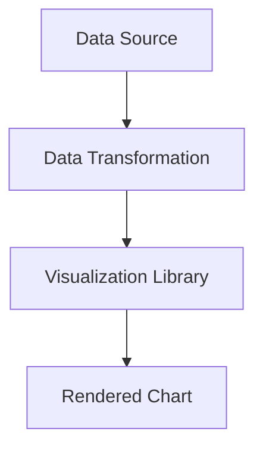

## 14.5.3 Data Visualization

Data visualization is a powerful tool for understanding and communicating insights from data. In this section, we'll explore how to create visualizations in Clojure using three popular libraries: **Incanter**, **Vega/Vega-Lite** with the `oz` library, and **Hanami**. We'll provide examples of generating common chart types and discuss how these tools can be integrated into your Clojure projects.

### Introduction to Data Visualization in Clojure

Data visualization in Clojure leverages the language's functional programming paradigm, allowing for concise and expressive code. As an experienced Java developer, you'll appreciate the seamless integration of these libraries with Clojure's immutable data structures and higher-order functions.

#### Why Use Clojure for Data Visualization?

- **Functional Paradigm**: Clojure's functional nature makes it easy to transform and manipulate data before visualization.
- **Interoperability**: Clojure runs on the JVM, allowing you to leverage existing Java libraries and tools.
- **Expressiveness**: Clojure's syntax is concise, making it easier to express complex data transformations and visualizations.

### Incanter: Statistical Computing and Graphics

**Incanter** is a Clojure-based library for statistical computing and graphics. It provides a rich set of functions for data manipulation, statistical analysis, and visualization.

#### Getting Started with Incanter

To use Incanter, you'll need to add it to your project dependencies. Here's how you can do it using Leiningen:

```clojure
(defproject my-project "0.1.0-SNAPSHOT"
  :dependencies [[org.clojure/clojure "1.10.3"]
                 [incanter "1.9.3"]])
```

Once added, you can start using Incanter to create visualizations.

#### Creating a Simple Line Chart

Let's create a simple line chart to visualize a dataset. We'll use Incanter's `charts` namespace to generate the chart.

```clojure
(ns my-project.core
  (:require [incanter.core :as ic]
            [incanter.charts :as charts]))

(defn line-chart-example []
  (let [x (range 0 10)
        y (map #(* % %) x)] ; y = x^2
    (charts/view (charts/line-chart x y
                                    :title "Line Chart Example"
                                    :x-label "X Axis"
                                    :y-label "Y Axis"))))

(line-chart-example)
```

**Explanation**:
- We define a range of x-values from 0 to 9.
- We compute the y-values as the square of each x-value.
- We create a line chart using `charts/line-chart` and display it with `charts/view`.

#### Try It Yourself

Modify the `y` computation to visualize different mathematical functions, such as `y = x^3` or `y = sin(x)`.

### Vega/Vega-Lite with Oz: Declarative Visualization

**Vega** and **Vega-Lite** are declarative languages for creating, sharing, and exploring interactive visualization designs. The `oz` library provides a Clojure interface to these tools, allowing you to create complex visualizations with minimal code.

#### Setting Up Oz

Add the `oz` library to your project dependencies:

```clojure
(defproject my-project "0.1.0-SNAPSHOT"
  :dependencies [[org.clojure/clojure "1.10.3"]
                 [metasoarous/oz "1.6.0"]])
```

#### Creating a Bar Chart with Vega-Lite

Let's create a bar chart using Vega-Lite through the `oz` library.

```clojure
(ns my-project.core
  (:require [oz.core :as oz]))

(defn bar-chart-example []
  (oz/view!
   {:data {:values [{:category "A" :value 30}
                    {:category "B" :value 80}
                    {:category "C" :value 45}]}
    :mark "bar"
    :encoding {:x {:field "category" :type "nominal"}
               :y {:field "value" :type "quantitative"}}}))

(bar-chart-example)
```

**Explanation**:
- We define a dataset with categories and values.
- We specify the chart type as `bar` and map the data fields to the x and y axes.
- The `oz/view!` function renders the chart in a browser.

#### Try It Yourself

Experiment with different chart types, such as `line`, `point`, or `area`, by changing the `:mark` value.

### Hanami: Declarative Data Visualization

**Hanami** is a declarative data visualization library for Clojure that builds on top of Vega-Lite. It provides a more idiomatic Clojure interface for creating visualizations.

#### Setting Up Hanami

Add Hanami to your project dependencies:

```clojure
(defproject my-project "0.1.0-SNAPSHOT"
  :dependencies [[org.clojure/clojure "1.10.3"]
                 [scicloj/hanami "0.2.6"]])
```

#### Creating a Scatter Plot with Hanami

Let's create a scatter plot using Hanami.

```clojure
(ns my-project.core
  (:require [hanami.core :as hanami]))

(defn scatter-plot-example []
  (hanami/view!
   {:data {:values [{:x 1 :y 2}
                    {:x 2 :y 3}
                    {:x 3 :y 5}
                    {:x 4 :y 7}]}
    :mark "point"
    :encoding {:x {:field "x" :type "quantitative"}
               :y {:field "y" :type "quantitative"}}}))

(scatter-plot-example)
```

**Explanation**:
- We define a dataset with x and y values.
- We specify the chart type as `point` for a scatter plot.
- The `hanami/view!` function renders the chart.

#### Try It Yourself

Add more data points to the dataset and observe how the scatter plot changes.

### Comparing Clojure Visualization Libraries

| Feature         | Incanter                         | Vega-Lite (Oz)                  | Hanami                           |
|-----------------|----------------------------------|---------------------------------|----------------------------------|
| **Paradigm**    | Imperative                       | Declarative                     | Declarative                      |
| **Interactivity** | Limited                        | High                            | High                             |
| **Ease of Use** | Moderate                         | Easy                            | Easy                             |
| **Customization** | High                           | Moderate                        | Moderate                         |
| **Integration** | Seamless with Clojure            | Seamless with Clojure           | Seamless with Clojure            |

**Diagram: Data Flow in Clojure Visualization**



*This diagram illustrates the flow of data from the source through transformation and into the visualization library, resulting in a rendered chart.*

### Best Practices for Data Visualization in Clojure

- **Choose the Right Tool**: Select a visualization library that fits your project's needs in terms of complexity, interactivity, and ease of use.
- **Keep It Simple**: Avoid cluttering your visualizations with too much information. Focus on conveying the key insights.
- **Leverage Clojure's Strengths**: Use Clojure's functional programming capabilities to preprocess and transform data before visualization.
- **Iterate and Experiment**: Visualization is an iterative process. Experiment with different chart types and styles to find the most effective representation.

### Exercises

1. **Create a Multi-Series Line Chart**: Use Incanter to create a line chart with multiple data series. Experiment with different colors and line styles.
2. **Interactive Dashboard**: Use Vega-Lite with Oz to create an interactive dashboard that includes multiple chart types and allows user interaction.
3. **Custom Visualization with Hanami**: Design a custom visualization using Hanami that combines multiple data sources and chart types.

### Key Takeaways

- Clojure offers powerful tools for data visualization, each with unique strengths and use cases.
- Incanter is great for statistical analysis and traditional charts, while Vega-Lite and Hanami excel in creating interactive and declarative visualizations.
- Leveraging Clojure's functional programming paradigm can enhance your data visualization capabilities.

For further reading, explore the [Official Clojure Documentation](https://clojure.org/reference/documentation) and the [Incanter GitHub Repository](https://github.com/incanter/incanter).

## Quiz: Mastering Data Visualization in Clojure



### Which library is best suited for creating interactive visualizations in Clojure?

- [ ] Incanter
- [x] Vega-Lite with Oz
- [ ] Hanami
- [ ] None of the above

> **Explanation:** Vega-Lite with Oz is designed for creating interactive visualizations using a declarative approach.

### What is the primary advantage of using Hanami for data visualization?

- [ ] It is the fastest library.
- [x] It provides an idiomatic Clojure interface for Vega-Lite.
- [ ] It supports 3D visualizations.
- [ ] It is the most lightweight library.

> **Explanation:** Hanami offers a Clojure-friendly interface for creating visualizations using Vega-Lite's declarative syntax.

### How does Incanter differ from Vega-Lite in terms of visualization approach?

- [x] Incanter uses an imperative approach, while Vega-Lite is declarative.
- [ ] Both use a declarative approach.
- [ ] Both use an imperative approach.
- [ ] Incanter is more interactive than Vega-Lite.

> **Explanation:** Incanter requires explicit instructions for creating visualizations, whereas Vega-Lite allows you to declare what you want to visualize.

### Which function is used to render a chart in the Oz library?

- [ ] oz/render!
- [x] oz/view!
- [ ] oz/display!
- [ ] oz/show!

> **Explanation:** The `oz/view!` function is used to render charts in the Oz library.

### What type of chart is created using the `:mark "point"` specification in Vega-Lite?

- [ ] Line chart
- [ ] Bar chart
- [x] Scatter plot
- [ ] Pie chart

> **Explanation:** The `:mark "point"` specification creates a scatter plot in Vega-Lite.

### Which library would you use for statistical analysis and traditional charts in Clojure?

- [x] Incanter
- [ ] Vega-Lite with Oz
- [ ] Hanami
- [ ] All of the above

> **Explanation:** Incanter is specifically designed for statistical analysis and traditional charting.

### What is the purpose of the `hanami/view!` function?

- [ ] To save a chart to a file
- [ ] To export a chart as an image
- [x] To render a chart in a browser
- [ ] To print chart data to the console

> **Explanation:** The `hanami/view!` function is used to render charts in a browser.

### Which of the following is a best practice for data visualization in Clojure?

- [x] Keep visualizations simple and focused.
- [ ] Always use 3D charts for better insights.
- [ ] Avoid using functional programming for data transformation.
- [ ] Use as many colors as possible for clarity.

> **Explanation:** Keeping visualizations simple and focused helps convey key insights effectively.

### What is the main benefit of using a declarative visualization library like Vega-Lite?

- [ ] It requires more code to achieve the same results.
- [x] It allows you to specify what you want to visualize, not how.
- [ ] It is less flexible than imperative libraries.
- [ ] It is only suitable for small datasets.

> **Explanation:** Declarative libraries like Vega-Lite focus on specifying the desired outcome, making it easier to create complex visualizations.

### True or False: Clojure's functional programming paradigm can enhance data visualization capabilities.

- [x] True
- [ ] False

> **Explanation:** Clojure's functional programming paradigm allows for powerful data transformations and manipulations, enhancing visualization capabilities.


