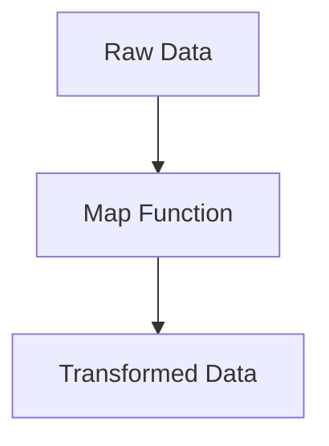

## 14.6.1 Introduction to Big Data Concepts

In today's data-driven world, the term **big data** has become ubiquitous, representing the vast volumes of data generated every second. As experienced Java developers transitioning to Clojure, understanding big data concepts is crucial for leveraging Clojure's functional programming paradigm to handle large datasets efficiently. In this section, we'll explore what constitutes big data, the challenges it presents, and how Clojure can be a powerful tool in managing and processing big data.

### What is Big Data?

Big data refers to datasets that are so large or complex that traditional data processing applications are inadequate to deal with them. The concept of big data is often characterized by the **three Vs**:

1. **Volume**: The sheer amount of data generated every second is staggering. From social media interactions to IoT sensor data, the volume of data is continuously growing.
2. **Velocity**: The speed at which data is generated and processed. Real-time or near-real-time data processing is often required to gain timely insights.
3. **Variety**: Data comes in various formats, including structured, semi-structured, and unstructured data. This variety requires flexible data processing techniques.

### Challenges of Big Data

Handling big data comes with its own set of challenges:

- **Storage**: Storing vast amounts of data efficiently and cost-effectively.
- **Processing**: Analyzing large datasets in a timely manner.
- **Scalability**: Ensuring that systems can scale to accommodate growing data volumes.
- **Data Quality**: Ensuring data accuracy and consistency.
- **Security and Privacy**: Protecting sensitive data from unauthorized access.

### Clojure's Role in Big Data

Clojure, with its functional programming paradigm, offers several advantages for big data processing:

- **Immutability**: Clojure's immutable data structures ensure that data remains consistent and free from side effects, which is crucial when processing large datasets.
- **Concurrency**: Clojure provides powerful concurrency primitives, such as atoms, refs, and agents, which allow for efficient parallel data processing.
- **Interoperability**: Clojure runs on the JVM, allowing seamless integration with Java-based big data tools and libraries, such as Apache Hadoop and Apache Spark.
- **Data-Oriented Programming**: Clojure's emphasis on data as the primary abstraction aligns well with big data processing tasks.

### Comparing Java and Clojure for Big Data

Java has been a popular choice for big data processing due to its performance and mature ecosystem. However, Clojure offers several unique features that can simplify big data tasks:

- **Conciseness**: Clojure's syntax is more concise than Java's, allowing for more readable and maintainable code.
- **Higher-Order Functions**: Clojure's support for higher-order functions enables more expressive data transformations.
- **REPL-Driven Development**: Clojure's REPL allows for interactive data exploration and rapid prototyping.

Let's explore some code examples to illustrate these concepts.

### Code Example: Data Transformation with Clojure

Consider a scenario where we need to transform a large dataset of user interactions. In Java, this might involve iterating over collections and applying transformations using loops. In Clojure, we can leverage higher-order functions for a more concise solution.

```clojure
;; Sample data: A list of user interactions
(def interactions
  [{:user-id 1 :action "click" :timestamp 1627849200}
   {:user-id 2 :action "view" :timestamp 1627849260}
   {:user-id 1 :action "purchase" :timestamp 1627849320}])

;; Transforming data using map
(defn transform-interactions [data]
  (map (fn [interaction]
         (assoc interaction :processed true))
       data))

;; Applying the transformation
(def processed-interactions (transform-interactions interactions))

;; Output the transformed data
(prn processed-interactions)
```

**Explanation**: In this example, we use Clojure's `map` function to iterate over the list of interactions and add a `:processed` key to each map. This approach is more concise and expressive than a traditional loop in Java.

### Try It Yourself

Experiment with the code above by adding additional transformations, such as filtering interactions based on the action type or aggregating data by user ID.

### Diagram: Data Transformation Flow



**Diagram Explanation**: This flowchart illustrates the transformation of raw data into processed data using a map function in Clojure.

### Clojure's Concurrency Model

One of the key challenges in big data processing is efficiently handling concurrent tasks. Clojure's concurrency model provides several primitives that make it easier to manage state and perform parallel computations.

#### Atoms

Atoms provide a way to manage shared, mutable state in a thread-safe manner. They are ideal for scenarios where state changes are independent and do not require coordination.

```clojure
;; Define an atom to hold a count of processed interactions
(def processed-count (atom 0))

;; Function to process an interaction and update the count
(defn process-interaction [interaction]
  (swap! processed-count inc)
  (assoc interaction :processed true))

;; Process interactions in parallel
(doseq [interaction interactions]
  (future (process-interaction interaction)))

;; Output the count of processed interactions
(prn @processed-count)
```

**Explanation**: In this example, we use an atom to keep track of the number of processed interactions. The `swap!` function is used to update the atom's state in a thread-safe manner.

### Comparing with Java's Concurrency

In Java, managing concurrency often involves using synchronized blocks or concurrent collections. Clojure's concurrency primitives provide a higher-level abstraction that simplifies concurrent programming.

### Exercise: Implement a Concurrent Data Processor

Challenge yourself to implement a concurrent data processor using Clojure's agents or refs. Consider scenarios where state changes need to be coordinated or where tasks can be performed asynchronously.

### Key Takeaways

- **Big Data Characteristics**: Volume, velocity, and variety are the defining characteristics of big data.
- **Clojure's Advantages**: Immutability, concurrency primitives, and data-oriented programming make Clojure well-suited for big data tasks.
- **Java vs. Clojure**: While Java offers performance and a mature ecosystem, Clojure provides conciseness and expressive power for data transformations.

By understanding these concepts and leveraging Clojure's unique features, you can effectively tackle big data challenges and build scalable, efficient data processing applications.

### Further Reading

- [Official Clojure Documentation](https://clojure.org/)
- [ClojureDocs](https://clojuredocs.org/)
- [Apache Hadoop](https://hadoop.apache.org/)
- [Apache Spark](https://spark.apache.org/)

Now that we've explored the fundamentals of big data and how Clojure can be leveraged to handle large datasets, let's dive deeper into specific tools and techniques in the following sections.

## Big Data Concepts Quiz for Java Developers Transitioning to Clojure



### What are the three Vs of big data?

- [x] Volume, Velocity, Variety
- [ ] Volume, Value, Variety
- [ ] Velocity, Value, Veracity
- [ ] Volume, Velocity, Veracity

> **Explanation:** The three Vs of big data are Volume, Velocity, and Variety, which describe the size, speed, and diversity of data.

### Which Clojure feature ensures data consistency and freedom from side effects?

- [x] Immutability
- [ ] Concurrency
- [ ] Interoperability
- [ ] Data-Oriented Programming

> **Explanation:** Immutability ensures that data remains consistent and free from side effects, which is crucial for processing large datasets.

### How does Clojure's syntax compare to Java's in terms of conciseness?

- [x] Clojure's syntax is more concise
- [ ] Java's syntax is more concise
- [ ] Both are equally concise
- [ ] Conciseness depends on the use case

> **Explanation:** Clojure's syntax is generally more concise than Java's, allowing for more readable and maintainable code.

### What is the primary abstraction in Clojure's data-oriented programming?

- [x] Data
- [ ] Functions
- [ ] Objects
- [ ] Classes

> **Explanation:** In Clojure's data-oriented programming, data is the primary abstraction, aligning well with big data processing tasks.

### Which Clojure primitive is ideal for managing shared, mutable state?

- [x] Atoms
- [ ] Refs
- [ ] Agents
- [ ] Vars

> **Explanation:** Atoms are ideal for managing shared, mutable state in a thread-safe manner, suitable for independent state changes.

### What is a key challenge of big data processing?

- [x] Scalability
- [ ] Syntax
- [ ] Compilation
- [ ] Debugging

> **Explanation:** Scalability is a key challenge in big data processing, as systems must accommodate growing data volumes.

### Which Java-based big data tool can be seamlessly integrated with Clojure?

- [x] Apache Hadoop
- [ ] Apache Tomcat
- [ ] Spring Boot
- [ ] JUnit

> **Explanation:** Apache Hadoop is a Java-based big data tool that can be seamlessly integrated with Clojure for data processing.

### What is the purpose of Clojure's `swap!` function?

- [x] To update an atom's state in a thread-safe manner
- [ ] To create a new atom
- [ ] To reset an atom's state
- [ ] To delete an atom

> **Explanation:** The `swap!` function is used to update an atom's state in a thread-safe manner.

### True or False: Clojure's REPL allows for interactive data exploration and rapid prototyping.

- [x] True
- [ ] False

> **Explanation:** True. Clojure's REPL allows for interactive data exploration and rapid prototyping, enhancing development efficiency.

### Which of the following is NOT a challenge associated with big data?

- [x] Compilation
- [ ] Storage
- [ ] Processing
- [ ] Data Quality

> **Explanation:** Compilation is not a challenge associated with big data. Storage, processing, and data quality are common challenges.


