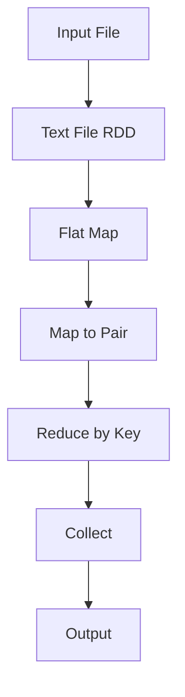

## 14.6.2 Using Apache Hadoop and Spark

As data continues to grow exponentially, the need for efficient data processing frameworks becomes paramount. Apache Hadoop and Apache Spark are two of the most popular frameworks for handling big data. In this section, we'll explore how Clojure, a functional programming language, can be integrated with these frameworks to process large datasets efficiently. We'll also introduce libraries such as `sparkling` for Apache Spark integration, providing a seamless experience for Clojure developers.

### Understanding Apache Hadoop and Spark

Before diving into the integration with Clojure, let's briefly understand what Apache Hadoop and Spark are and how they differ.

**Apache Hadoop** is an open-source framework that allows for the distributed processing of large data sets across clusters of computers using simple programming models. It is designed to scale up from single servers to thousands of machines, each offering local computation and storage.

**Apache Spark**, on the other hand, is a unified analytics engine for big data processing, with built-in modules for streaming, SQL, machine learning, and graph processing. Spark is known for its speed and ease of use, as it can perform in-memory computations, which significantly boosts performance compared to Hadoop's disk-based processing.

### Clojure and Big Data

Clojure, with its emphasis on immutability and functional programming, offers unique advantages when working with big data. Its ability to handle concurrency and its rich set of data structures make it an excellent choice for data processing tasks. Moreover, Clojure's interoperability with Java allows it to leverage existing Java libraries and frameworks, including Hadoop and Spark.

### Integrating Clojure with Apache Hadoop

To integrate Clojure with Hadoop, we can use the `clojure-hadoop` library, which provides a Clojure-friendly API for Hadoop's MapReduce framework. This library allows developers to write MapReduce jobs in Clojure, leveraging its functional programming capabilities.

#### Setting Up Clojure with Hadoop

1. **Install Hadoop**: Ensure that Hadoop is installed and configured on your system. You can follow the [official Hadoop installation guide](https://hadoop.apache.org/docs/stable/hadoop-project-dist/hadoop-common/SingleCluster.html) for detailed instructions.

2. **Add Clojure Dependencies**: Add the `clojure-hadoop` dependency to your `project.clj` file:

   ```clojure
   (defproject my-hadoop-project "0.1.0-SNAPSHOT"
     :dependencies [[org.clojure/clojure "1.10.3"]
                    [clojure-hadoop "1.5.0"]])
   ```

3. **Write a MapReduce Job**: Here's a simple example of a word count MapReduce job in Clojure:

   ```clojure
   (ns my-hadoop-project.core
     (:require [clojure-hadoop.job :as job]))

   (defn map-fn [key value]
     (for [word (clojure.string/split value #"\s+")]
       [word 1]))

   (defn reduce-fn [key values]
     [(apply + values)])

   (defn -main [& args]
     (job/run-job {:input-path "input"
                   :output-path "output"
                   :mapper map-fn
                   :reducer reduce-fn}))
   ```

   In this example, the `map-fn` splits each line into words and emits a key-value pair for each word. The `reduce-fn` sums up the counts for each word.

4. **Run the Job**: Use the Hadoop command-line tools to run your Clojure MapReduce job.

### Integrating Clojure with Apache Spark

Apache Spark offers a more modern approach to big data processing, and Clojure can be integrated with Spark using the `sparkling` library. `sparkling` is a Clojure library that provides idiomatic Clojure bindings for Apache Spark.

#### Setting Up Clojure with Spark

1. **Install Spark**: Ensure that Spark is installed on your system. You can follow the [official Spark installation guide](https://spark.apache.org/docs/latest/) for detailed instructions.

2. **Add Sparkling Dependencies**: Add the `sparkling` dependency to your `project.clj` file:

   ```clojure
   (defproject my-spark-project "0.1.0-SNAPSHOT"
     :dependencies [[org.clojure/clojure "1.10.3"]
                    [gorillalabs/sparkling "2.1.0"]])
   ```

3. **Write a Spark Job**: Here's an example of a word count job using Sparkling:

   ```clojure
   (ns my-spark-project.core
     (:require [sparkling.core :as spark]
               [sparkling.conf :as conf]))

   (defn -main [& args]
     (let [sc (spark/spark-context (conf/spark-conf))]
       (-> (spark/text-file sc "input.txt")
           (spark/flat-map #(clojure.string/split % #"\s+"))
           (spark/map-to-pair (fn [word] [word 1]))
           (spark/reduce-by-key +)
           (spark/collect)
           (println))))
   ```

   In this example, we create a Spark context, read a text file, split each line into words, map each word to a key-value pair, reduce by key to count occurrences, and collect the results.

4. **Run the Job**: Use the Spark command-line tools to submit your Clojure Spark job.

### Comparing Hadoop and Spark with Clojure

| Feature        | Hadoop with Clojure                     | Spark with Clojure                      |
|----------------|-----------------------------------------|-----------------------------------------|
| **Processing** | Disk-based MapReduce                    | In-memory processing                    |
| **Speed**      | Slower due to disk I/O                  | Faster due to in-memory computations    |
| **Ease of Use**| Requires more boilerplate code          | More concise and expressive with Sparkling |
| **Use Cases**  | Batch processing                        | Batch and real-time processing          |

### Try It Yourself

To deepen your understanding, try modifying the code examples above:

- **Hadoop**: Change the input and output paths, or modify the `map-fn` to filter specific words.
- **Spark**: Experiment with different transformations, such as filtering words by length or converting text to uppercase.

### Visualizing Data Flow in Spark

Below is a diagram illustrating the data flow in a Spark job using the `sparkling` library:



**Diagram Description**: This flowchart represents the stages of a Spark job, from reading an input file to collecting the results.

### Further Reading

- [Official Clojure Documentation](https://clojure.org/reference/documentation)
- [Apache Hadoop Documentation](https://hadoop.apache.org/docs/stable/)
- [Apache Spark Documentation](https://spark.apache.org/docs/latest/)
- [Sparkling GitHub Repository](https://github.com/gorillalabs/sparkling)

### Exercises

1. **Implement a Custom Transformation**: Modify the Spark job to include a custom transformation, such as filtering out stop words.
2. **Integrate with a Database**: Extend the Hadoop or Spark job to read from or write to a database.
3. **Performance Comparison**: Compare the performance of a Hadoop job and a Spark job on the same dataset.

### Key Takeaways

- **Clojure's Functional Paradigm**: Leverage Clojure's functional programming features to write concise and efficient big data processing jobs.
- **Integration with Java**: Utilize Clojure's interoperability with Java to access Hadoop and Spark libraries.
- **Choosing the Right Tool**: Understand the differences between Hadoop and Spark to choose the appropriate framework for your use case.

By integrating Clojure with Hadoop and Spark, you can harness the power of functional programming to process large datasets efficiently. Now that we've explored these integrations, let's apply these concepts to build scalable data processing applications.

---

## Quiz: Mastering Clojure Integration with Apache Hadoop and Spark



### What is the primary advantage of using Apache Spark over Hadoop for big data processing?

- [x] In-memory processing
- [ ] Disk-based processing
- [ ] Requires less memory
- [ ] More complex setup

> **Explanation:** Apache Spark's primary advantage is its ability to perform in-memory processing, which significantly speeds up data processing compared to Hadoop's disk-based approach.

### Which Clojure library provides idiomatic bindings for Apache Spark?

- [ ] clojure-hadoop
- [x] sparkling
- [ ] clojure-spark
- [ ] spark-clj

> **Explanation:** The `sparkling` library provides idiomatic Clojure bindings for Apache Spark, allowing developers to write Spark jobs in Clojure.

### In a Clojure Spark job, which function is used to split lines into words?

- [ ] map-to-pair
- [x] flat-map
- [ ] reduce-by-key
- [ ] collect

> **Explanation:** The `flat-map` function is used to split lines into words in a Clojure Spark job, as it allows for one-to-many transformations.

### What is the purpose of the `reduce-by-key` function in a Spark job?

- [x] To aggregate values by key
- [ ] To split lines into words
- [ ] To collect results
- [ ] To filter data

> **Explanation:** The `reduce-by-key` function aggregates values by key, which is essential for operations like counting word occurrences.

### Which of the following is a key feature of Clojure that benefits big data processing?

- [x] Immutability
- [ ] Mutable state
- [ ] Object-oriented programming
- [ ] Manual memory management

> **Explanation:** Clojure's immutability is a key feature that benefits big data processing by ensuring thread safety and simplifying concurrency.

### How does Clojure's interoperability with Java benefit big data processing?

- [x] Allows access to Java libraries and frameworks
- [ ] Requires rewriting Java code
- [ ] Limits the use of Java libraries
- [ ] Increases code complexity

> **Explanation:** Clojure's interoperability with Java allows developers to access Java libraries and frameworks, such as Hadoop and Spark, without rewriting existing code.

### What is the role of the `spark-context` in a Spark job?

- [x] To initialize and manage the Spark application
- [ ] To split lines into words
- [ ] To aggregate values by key
- [ ] To collect results

> **Explanation:** The `spark-context` initializes and manages the Spark application, providing the necessary context for executing Spark jobs.

### Which of the following is a common use case for Apache Hadoop?

- [x] Batch processing
- [ ] Real-time processing
- [ ] In-memory computations
- [ ] Interactive queries

> **Explanation:** Apache Hadoop is commonly used for batch processing due to its disk-based MapReduce framework.

### What is the main benefit of using the `sparkling` library for Spark integration in Clojure?

- [x] Provides idiomatic Clojure bindings for Spark
- [ ] Requires less memory
- [ ] Simplifies Hadoop integration
- [ ] Increases code complexity

> **Explanation:** The `sparkling` library provides idiomatic Clojure bindings for Spark, making it easier to write Spark jobs in Clojure.

### True or False: Clojure's functional programming paradigm is well-suited for big data processing.

- [x] True
- [ ] False

> **Explanation:** True. Clojure's functional programming paradigm, with its emphasis on immutability and higher-order functions, is well-suited for big data processing.




