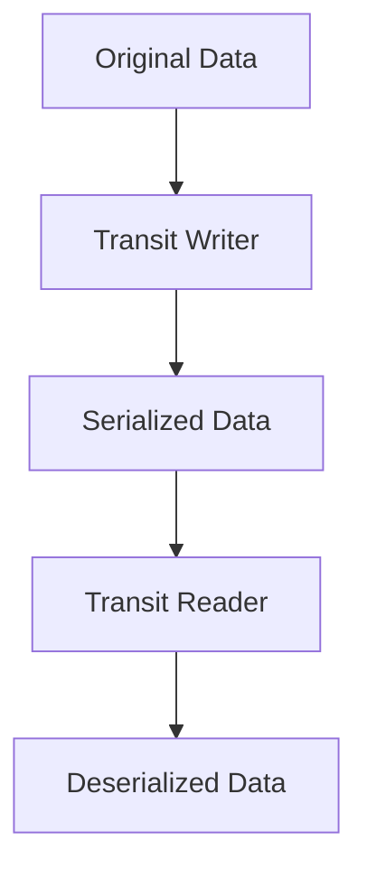

## 14.7.2 Using Transit

In the world of data serialization, choosing the right format can significantly impact the performance and interoperability of your applications. For Clojure and ClojureScript developers, **Transit** offers a compelling solution. Designed to be both efficient and extensible, Transit is a data serialization format that seamlessly integrates with Clojure's data structures and idioms. In this section, we'll explore how to use Transit to serialize and deserialize data, drawing parallels with Java's serialization mechanisms to ease the transition for Java developers.

### Understanding Transit

Transit is a format developed by Cognitect, the same company behind Clojure. It is designed to be a lightweight, efficient, and extensible format for transferring data between applications. Transit supports multiple encoding formats, including JSON and MessagePack, making it versatile for different use cases.

#### Key Features of Transit

- **Efficiency**: Transit is optimized for both size and speed, making it suitable for high-performance applications.
- **Extensibility**: You can extend Transit to support custom data types, which is particularly useful for domain-specific applications.
- **Compatibility**: Transit is designed to work seamlessly with Clojure's immutable data structures, providing a natural fit for Clojure applications.
- **Interoperability**: With support for multiple encoding formats, Transit can be used in a variety of environments, including JavaScript and Java.

### Comparing Transit with Java Serialization

Java developers are familiar with serialization mechanisms like Java's built-in serialization and JSON libraries such as Jackson. Let's compare these with Transit to understand its advantages:

- **Java Serialization**: Java's native serialization is binary and tightly coupled with Java's object model, which can lead to compatibility issues and larger payloads.
- **JSON Libraries**: While JSON is widely used and human-readable, it lacks support for complex data types and can be verbose.
- **Transit**: Offers a balance between efficiency and readability, with support for complex data types and extensibility.

### Setting Up Transit in Clojure

To use Transit in your Clojure project, you'll need to include the Transit library in your dependencies. Here's how you can set it up using Leiningen:

```clojure
;; Add the following dependency to your project.clj file
:dependencies [[org.clojure/clojure "1.10.3"]
               [com.cognitect/transit-clj "1.0.324"]]
```

For ClojureScript projects, you would include the `transit-cljs` library:

```clojure
;; Add the following dependency to your project.clj file
:dependencies [[org.clojure/clojurescript "1.10.844"]
               [com.cognitect/transit-cljs "0.8.256"]]
```

### Serializing Data with Transit

Let's start by serializing some Clojure data structures using Transit. We'll use the JSON encoding for simplicity.

```clojure
(require '[cognitect.transit :as transit])
(require '[clojure.java.io :as io])

;; Define a sample data structure
(def data {:name "Alice"
           :age 30
           :languages ["Clojure" "Java" "Python"]})

;; Create a Transit writer
(def writer (transit/writer (io/output-stream "data.json") :json))

;; Serialize the data
(transit/write writer data)
```

In this example, we create a Transit writer that writes to a file named `data.json`. We then serialize a Clojure map containing some basic information.

### Deserializing Data with Transit

Deserializing data with Transit is just as straightforward. Let's read the data back from the file we just wrote.

```clojure
;; Create a Transit reader
(def reader (transit/reader (io/input-stream "data.json") :json))

;; Deserialize the data
(def deserialized-data (transit/read reader))

;; Print the deserialized data
(println deserialized-data)
```

This code snippet creates a Transit reader and reads the data from `data.json`, reconstructing the original Clojure map.

### Extending Transit for Custom Data Types

One of Transit’s powerful features is its extensibility. You can define custom handlers to serialize and deserialize your own data types. Let's see how this works with a simple example.

Suppose we have a custom data type representing a point in a 2D space:

```clojure
(defrecord Point [x y])

;; Define a custom handler for the Point type
(def point-handler
  (transit/write-handler
    (fn [_] "point")
    (fn [p] [(:x p) (:y p)])))

;; Register the custom handler
(def writer (transit/writer (io/output-stream "point.json") :json {:handlers {Point point-handler}}))

;; Serialize a Point instance
(transit/write writer (->Point 3 4))
```

In this example, we define a `Point` record and a custom handler that specifies how to serialize it. We then register this handler with the Transit writer.

### Handling Complex Data Structures

Transit excels at handling complex, nested data structures. Let's serialize a more complex example involving nested maps and vectors.

```clojure
(def complex-data
  {:user {:name "Bob"
          :contacts [{:type :email :value "bob@example.com"}
                     {:type :phone :value "555-1234"}]}
   :preferences {:theme "dark"
                 :notifications true}})

(def writer (transit/writer (io/output-stream "complex.json") :json))

(transit/write writer complex-data)
```

This example demonstrates how Transit can efficiently serialize nested data structures, preserving the relationships between elements.

### Comparing with Java Code

To help Java developers understand Transit, let's compare the above Clojure code with equivalent Java code using Jackson for JSON serialization.

```java
import com.fasterxml.jackson.databind.ObjectMapper;
import java.util.*;

public class JavaSerializationExample {
    public static void main(String[] args) throws Exception {
        ObjectMapper mapper = new ObjectMapper();

        Map<String, Object> data = new HashMap<>();
        data.put("name", "Alice");
        data.put("age", 30);
        data.put("languages", Arrays.asList("Clojure", "Java", "Python"));

        // Serialize to JSON
        String json = mapper.writeValueAsString(data);
        System.out.println(json);

        // Deserialize from JSON
        Map<String, Object> deserializedData = mapper.readValue(json, Map.class);
        System.out.println(deserializedData);
    }
}
```

While both approaches achieve similar results, Transit provides a more idiomatic way to work with Clojure's data structures and offers additional features like custom handlers.

### Try It Yourself

To deepen your understanding of Transit, try modifying the examples above:

- **Add more complex data types**: Extend the examples to include other Clojure data structures such as sets or keywords.
- **Implement custom handlers**: Create custom handlers for other data types, such as dates or UUIDs.
- **Experiment with different encodings**: Try using MessagePack instead of JSON and observe the differences in performance and size.

### Visualizing Data Flow with Transit

To better understand how data flows through Transit serialization and deserialization, let's visualize the process using a flowchart.



**Diagram Description**: This flowchart illustrates the process of serializing and deserializing data using Transit. The original data is passed to a Transit writer, which produces serialized data. This serialized data is then read by a Transit reader to reconstruct the original data.

### Exercises

1. **Serialize and Deserialize Custom Data Types**: Create a custom data type and implement Transit handlers to serialize and deserialize it.
2. **Compare Performance**: Measure the performance of Transit serialization compared to JSON serialization using a library like Jackson in Java.
3. **Explore MessagePack Encoding**: Modify the examples to use MessagePack encoding and compare the file sizes and serialization times with JSON.

### Key Takeaways

- **Transit is optimized for Clojure**: It provides a natural fit for Clojure's data structures and idioms, making it an excellent choice for Clojure applications.
- **Extensibility is a strength**: Transit allows you to define custom handlers for your data types, offering flexibility and control over the serialization process.
- **Interoperability with Java**: While Transit is tailored for Clojure, its support for multiple encodings and efficient serialization makes it a viable option for Java interoperability.

By mastering Transit, you can efficiently serialize and deserialize data in your Clojure applications, leveraging its strengths to build robust and performant systems. Now that we've explored how to use Transit, let's apply these concepts to manage data serialization effectively in your applications.

## Quiz: Mastering Transit for Data Serialization in Clojure



### What is Transit primarily designed for?

- [x] Efficient data serialization for Clojure and ClojureScript
- [ ] Real-time data processing
- [ ] Database management
- [ ] Network communication

> **Explanation:** Transit is a data serialization format optimized for Clojure and ClojureScript, focusing on efficiency and extensibility.

### Which encoding formats does Transit support?

- [x] JSON and MessagePack
- [ ] XML and YAML
- [ ] CSV and TSV
- [ ] BSON and Avro

> **Explanation:** Transit supports JSON and MessagePack encoding formats, providing flexibility for different use cases.

### How do you register a custom handler in Transit?

- [x] By passing a map of handlers to the Transit writer
- [ ] By modifying the Transit library source code
- [ ] By using a special annotation in Clojure
- [ ] By creating a separate configuration file

> **Explanation:** Custom handlers are registered by passing a map of handlers to the Transit writer, allowing for extensibility.

### What is a key advantage of Transit over Java's native serialization?

- [x] Better compatibility with Clojure's data structures
- [ ] Faster execution speed
- [ ] Smaller file sizes
- [ ] Easier to implement

> **Explanation:** Transit is designed to work seamlessly with Clojure's immutable data structures, providing better compatibility than Java's native serialization.

### What is the purpose of the `transit/write-handler` function?

- [x] To define how a custom data type should be serialized
- [ ] To read serialized data from a file
- [ ] To convert JSON to XML
- [ ] To handle network errors

> **Explanation:** The `transit/write-handler` function is used to define how a custom data type should be serialized in Transit.

### Which library is used for JSON serialization in Java?

- [x] Jackson
- [ ] Gson
- [ ] Transit
- [ ] JSON.simple

> **Explanation:** Jackson is a popular library used for JSON serialization and deserialization in Java.

### What is a common use case for extending Transit?

- [x] Supporting custom data types
- [ ] Improving network latency
- [ ] Enhancing database queries
- [ ] Simplifying user interfaces

> **Explanation:** Extending Transit is commonly used to support custom data types, allowing for more flexible serialization.

### How does Transit handle nested data structures?

- [x] It efficiently serializes and preserves relationships between elements
- [ ] It flattens them into a single list
- [ ] It converts them into XML
- [ ] It ignores nested structures

> **Explanation:** Transit efficiently serializes nested data structures, preserving the relationships between elements.

### What is the benefit of using MessagePack encoding with Transit?

- [x] Smaller file sizes and faster serialization
- [ ] Human-readable format
- [ ] Easier to debug
- [ ] Better support for XML

> **Explanation:** MessagePack encoding with Transit results in smaller file sizes and faster serialization compared to JSON.

### True or False: Transit can only be used with Clojure and ClojureScript.

- [ ] True
- [x] False

> **Explanation:** While Transit is optimized for Clojure and ClojureScript, it can be used in other environments, including JavaScript and Java, due to its support for multiple encoding formats.


