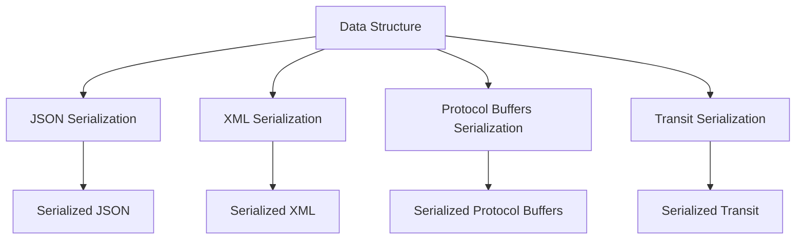

## 14.7.3 Comparing Serialization Formats

In the world of data serialization, choosing the right format can significantly impact the performance, compatibility, and ease of use of your applications. As experienced Java developers transitioning to Clojure, understanding the nuances of different serialization formats is crucial. In this section, we will delve into four popular serialization formats: **Transit**, **JSON**, **XML**, and **Protocol Buffers**. We'll compare their performance, compatibility, and ease of use, providing insights into when to use each format.

### Understanding Serialization Formats

Serialization is the process of converting an object into a format that can be easily stored or transmitted and later reconstructed. In Java, serialization is often associated with converting objects to a byte stream. In Clojure, we have several options for serialization, each with its own strengths and weaknesses.

#### JSON (JavaScript Object Notation)

**JSON** is a lightweight data interchange format that is easy for humans to read and write and easy for machines to parse and generate. It is widely used in web applications for data exchange.

**Advantages:**
- **Human-readable**: JSON is text-based and easy to read.
- **Widely supported**: Almost every programming language has libraries for JSON parsing and generation.
- **Simple structure**: JSON's key-value pair structure is straightforward.

**Disadvantages:**
- **Limited data types**: JSON supports only a few data types, such as strings, numbers, arrays, and objects.
- **No schema enforcement**: JSON does not enforce any schema, which can lead to data inconsistency.

#### XML (eXtensible Markup Language)

**XML** is a markup language that defines a set of rules for encoding documents in a format that is both human-readable and machine-readable.

**Advantages:**
- **Schema support**: XML supports schemas, allowing for data validation.
- **Extensible**: XML is highly extensible and can represent complex data structures.

**Disadvantages:**
- **Verbose**: XML can be quite verbose compared to other formats.
- **Complex parsing**: Parsing XML can be more complex and slower than JSON.

#### Protocol Buffers

**Protocol Buffers** is a language-agnostic binary serialization format developed by Google. It is designed for performance and efficiency.

**Advantages:**
- **Compact and efficient**: Protocol Buffers are binary, making them more compact and faster to serialize/deserialize.
- **Schema enforcement**: Protocol Buffers enforce a schema, ensuring data consistency.

**Disadvantages:**
- **Less human-readable**: Being binary, Protocol Buffers are not human-readable.
- **Requires compilation**: Protocol Buffers require a compilation step to generate code for serialization/deserialization.

#### Transit

**Transit** is a format designed for transferring data between applications. It is optimized for use with Clojure and ClojureScript.

**Advantages:**
- **Rich data types**: Transit supports a wide range of data types, including those native to Clojure.
- **Efficient**: Transit is designed to be efficient in terms of both size and speed.
- **Extensible**: Transit can be extended to support custom data types.

**Disadvantages:**
- **Less widespread**: Transit is not as widely supported as JSON or XML.
- **Learning curve**: Developers new to Clojure might find Transit less intuitive initially.

### Performance Comparison

Performance is a critical factor when choosing a serialization format, especially for applications that handle large volumes of data or require real-time processing.

#### Serialization and Deserialization Speed

- **Protocol Buffers** generally offer the fastest serialization and deserialization speeds due to their binary nature.
- **Transit** is optimized for Clojure and performs well, especially when dealing with Clojure-specific data types.
- **JSON** is slower than Protocol Buffers and Transit but is often fast enough for many applications.
- **XML** tends to be the slowest due to its verbosity and complexity.

#### Data Size

- **Protocol Buffers** produce the smallest serialized data size, which is beneficial for network transmission and storage.
- **Transit** also offers compact data sizes, especially when using its binary encoding.
- **JSON** data size is larger than Protocol Buffers and Transit but smaller than XML.
- **XML** is the most verbose, resulting in the largest data size.

### Compatibility and Ease of Use

Compatibility and ease of use are important considerations, especially when integrating with other systems or when the data format needs to be human-readable.

#### Compatibility

- **JSON** is the most compatible format, with support in virtually every programming language.
- **XML** is also highly compatible and is often used in enterprise environments.
- **Protocol Buffers** require language-specific libraries but support many languages.
- **Transit** is primarily used in Clojure and ClojureScript environments.

#### Ease of Use

- **JSON** is easy to use and understand, making it a popular choice for web APIs.
- **XML** can be more complex due to its verbosity and schema support.
- **Protocol Buffers** require a schema definition and a compilation step, which can add complexity.
- **Transit** is straightforward for Clojure developers but may require learning for those new to the language.

### Code Examples

Let's explore some code examples to illustrate how these serialization formats work in Clojure.

#### JSON Example

```clojure
(require '[cheshire.core :as json])

(def data {:name "John Doe" :age 30 :email "john.doe@example.com"})

;; Serialize to JSON
(def json-data (json/generate-string data))
;; => "{\"name\":\"John Doe\",\"age\":30,\"email\":\"john.doe@example.com\"}"

;; Deserialize from JSON
(def deserialized-data (json/parse-string json-data true))
;; => {:name "John Doe", :age 30, :email "john.doe@example.com"}
```

In this example, we use the `cheshire` library to serialize and deserialize data to and from JSON. The process is straightforward and similar to JSON handling in Java.

#### XML Example

```clojure
(require '[clojure.data.xml :as xml])

(def data {:name "John Doe" :age 30 :email "john.doe@example.com"})

;; Serialize to XML
(def xml-data (xml/emit-str (xml/element :person {} (map (fn [[k v]] (xml/element k {} (str v))) data))))
;; => "<person><name>John Doe</name><age>30</age><email>john.doe@example.com</email></person>"

;; Deserialize from XML (requires custom parsing logic)
```

XML serialization in Clojure requires more boilerplate code compared to JSON. Deserialization often requires custom parsing logic.

#### Protocol Buffers Example

Protocol Buffers require a `.proto` file to define the schema and a compilation step to generate Clojure code. Here's a simplified example:

```protobuf
// person.proto
syntax = "proto3";

message Person {
  string name = 1;
  int32 age = 2;
  string email = 3;
}
```

After compiling the `.proto` file, you can use the generated code to serialize and deserialize data.

#### Transit Example

```clojure
(require '[cognitect.transit :as transit])
(require '[clojure.java.io :as io])

(def data {:name "John Doe" :age 30 :email "john.doe@example.com"})

;; Serialize to Transit
(with-open [out (io/output-stream (io/file "data.transit"))]
  (transit/write (transit/writer out :json) data))

;; Deserialize from Transit
(with-open [in (io/input-stream (io/file "data.transit"))]
  (def deserialized-data (transit/read (transit/reader in :json))))
;; => {:name "John Doe", :age 30, :email "john.doe@example.com"}
```

Transit serialization is efficient and supports a wide range of data types, making it a good choice for Clojure applications.

### Diagrams and Visualizations

To better understand the flow of data through these serialization formats, let's visualize the process using Mermaid.js diagrams.



**Diagram Description**: This flowchart illustrates the process of serializing a data structure into different formats: JSON, XML, Protocol Buffers, and Transit.

### When to Use Each Format

Choosing the right serialization format depends on your specific use case. Here are some guidelines:

- **Use JSON** when you need a simple, human-readable format with wide compatibility, especially for web APIs.
- **Use XML** when you need schema validation and are working in an enterprise environment.
- **Use Protocol Buffers** when performance and efficiency are critical, and you can afford the complexity of schema management.
- **Use Transit** when working within the Clojure ecosystem and you need support for rich data types.

### Try It Yourself

To deepen your understanding, try modifying the code examples above:

- **JSON**: Add nested data structures and see how they are serialized.
- **XML**: Experiment with adding attributes to XML elements.
- **Protocol Buffers**: Define a more complex schema and observe the serialization process.
- **Transit**: Explore using different data types and custom handlers.

### Exercises

1. Serialize and deserialize a complex data structure using each format. Compare the serialized data sizes.
2. Implement a simple web service that uses JSON and Protocol Buffers for data exchange. Measure the performance difference.
3. Create a custom data type in Clojure and serialize it using Transit. Implement a custom handler if necessary.

### Summary and Key Takeaways

In this section, we've explored the differences between Transit, JSON, XML, and Protocol Buffers for data serialization in Clojure. Each format has its strengths and weaknesses, and the choice depends on factors such as performance, compatibility, and ease of use. By understanding these differences, you can make informed decisions about which serialization format to use in your applications.

### Further Reading

- [Official Clojure Documentation](https://clojure.org/)
- [Cheshire JSON Library](https://github.com/dakrone/cheshire)
- [Clojure Data XML](https://github.com/clojure/data.xml)
- [Protocol Buffers Documentation](https://developers.google.com/protocol-buffers)
- [Cognitect Transit](https://github.com/cognitect/transit-clj)

## Quiz: Test Your Knowledge on Serialization Formats



### Which serialization format is known for its compact binary representation?

- [ ] JSON
- [ ] XML
- [x] Protocol Buffers
- [ ] Transit

> **Explanation:** Protocol Buffers is a binary serialization format known for its compactness and efficiency.

### What is a key advantage of using JSON for data serialization?

- [x] Human-readable format
- [ ] Schema enforcement
- [ ] Binary efficiency
- [ ] Requires compilation

> **Explanation:** JSON is a text-based format that is easy for humans to read and write, making it a popular choice for web APIs.

### Which serialization format is specifically optimized for use with Clojure?

- [ ] JSON
- [ ] XML
- [ ] Protocol Buffers
- [x] Transit

> **Explanation:** Transit is optimized for use with Clojure and ClojureScript, supporting a wide range of data types.

### What is a disadvantage of using XML for serialization?

- [ ] Lack of schema support
- [x] Verbosity
- [ ] Limited data types
- [ ] Binary format

> **Explanation:** XML is known for being verbose, which can lead to larger data sizes compared to other formats.

### Which format requires a schema definition and a compilation step?

- [ ] JSON
- [ ] XML
- [x] Protocol Buffers
- [ ] Transit

> **Explanation:** Protocol Buffers require a schema definition in a `.proto` file and a compilation step to generate code for serialization/deserialization.

### What is a common use case for using Transit in Clojure applications?

- [ ] Web APIs
- [ ] Enterprise data exchange
- [x] Transferring Clojure-specific data types
- [ ] Schema validation

> **Explanation:** Transit is well-suited for transferring Clojure-specific data types between applications.

### Which serialization format is most widely supported across different programming languages?

- [x] JSON
- [ ] XML
- [ ] Protocol Buffers
- [ ] Transit

> **Explanation:** JSON is widely supported across virtually all programming languages, making it highly compatible.

### What is a benefit of using Protocol Buffers over JSON?

- [ ] Human readability
- [x] Compact and efficient binary format
- [ ] Simplicity
- [ ] No schema requirement

> **Explanation:** Protocol Buffers offer a compact and efficient binary format, which is beneficial for performance and storage.

### Which format is typically slower due to its verbosity and complexity?

- [ ] JSON
- [x] XML
- [ ] Protocol Buffers
- [ ] Transit

> **Explanation:** XML is typically slower due to its verbosity and the complexity of parsing.

### True or False: Transit is less widespread than JSON or XML.

- [x] True
- [ ] False

> **Explanation:** Transit is less widespread compared to JSON or XML, as it is primarily used within the Clojure ecosystem.


