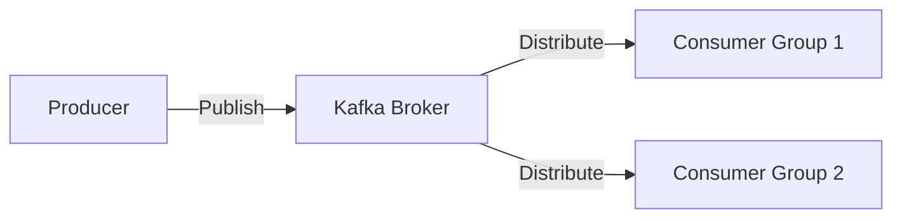
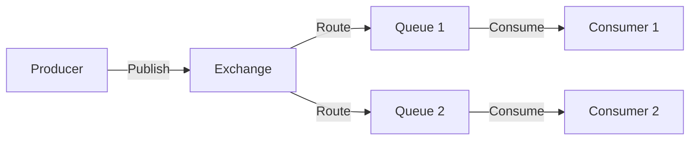

## 14.8.1 Event Streams and Messaging Systems

In today's fast-paced digital world, real-time data processing has become a cornerstone for many applications, from financial services to social media platforms. As experienced Java developers transitioning to Clojure, understanding how to leverage event streams and messaging systems is crucial for building responsive and scalable applications. In this section, we will explore the concepts of event streams, delve into popular messaging systems like Kafka and RabbitMQ, and demonstrate how to integrate these systems with Clojure.

### Understanding Event Streams

Event streams represent a continuous flow of data generated by various sources, such as user interactions, sensor readings, or system logs. Unlike traditional batch processing, event streams allow for real-time data processing, enabling applications to react to changes as they occur.

#### Key Characteristics of Event Streams

- **Continuous Flow**: Data is continuously generated and processed, allowing for immediate insights and actions.
- **Immutable Events**: Each event is a record of a specific occurrence and is immutable, ensuring data integrity.
- **Time-Ordered**: Events are typically processed in the order they occur, preserving the sequence of actions.

### Messaging Systems Overview

Messaging systems facilitate the communication between different components of a distributed system by transmitting messages asynchronously. They decouple the sender and receiver, allowing for greater flexibility and scalability.

#### Popular Messaging Systems

- **Apache Kafka**: A distributed event streaming platform designed for high-throughput and fault-tolerant data processing.
- **RabbitMQ**: A message broker that implements the Advanced Message Queuing Protocol (AMQP), known for its flexibility and ease of use.

### Apache Kafka

Kafka is widely used for building real-time data pipelines and streaming applications. It is designed to handle high volumes of data with low latency and provides robust features for fault tolerance and scalability.

#### Key Concepts in Kafka

- **Topics**: Logical channels to which producers send messages and from which consumers read.
- **Producers**: Applications that publish messages to Kafka topics.
- **Consumers**: Applications that subscribe to topics and process incoming messages.
- **Brokers**: Kafka servers that store and serve messages to consumers.

#### Kafka Architecture



*Diagram: Kafka architecture showing producers publishing to brokers, which distribute messages to consumer groups.*

### Integrating Kafka with Clojure

To integrate Kafka with Clojure, we can use the [clj-kafka](https://github.com/pingles/clj-kafka) library, which provides a Clojure-friendly API for interacting with Kafka.

#### Setting Up Kafka

Before diving into code, ensure that Kafka is installed and running on your system. You can download Kafka from the [official website](https://kafka.apache.org/downloads).

#### Producing Messages in Clojure

Here's a simple example of producing messages to a Kafka topic using Clojure:

```clojure
(ns myapp.kafka-producer
  (:require [clj-kafka.producer :as producer]))

(defn send-message [topic message]
  (let [producer-config {:bootstrap.servers "localhost:9092"
                         :key.serializer "org.apache.kafka.common.serialization.StringSerializer"
                         :value.serializer "org.apache.kafka.common.serialization.StringSerializer"}
        kafka-producer (producer/producer producer-config)]
    (producer/send kafka-producer {:topic topic :value message})
    (.close kafka-producer)))

;; Usage
(send-message "my-topic" "Hello, Kafka!")
```

*Code Explanation:*
- We define a `send-message` function that takes a topic and a message as arguments.
- We configure the Kafka producer with the necessary settings, including the bootstrap servers and serializers.
- We create a producer instance and send the message to the specified topic.

#### Consuming Messages in Clojure

Next, let's look at how to consume messages from a Kafka topic:

```clojure
(ns myapp.kafka-consumer
  (:require [clj-kafka.consumer :as consumer]))

(defn consume-messages [topic]
  (let [consumer-config {:bootstrap.servers "localhost:9092"
                         :group.id "my-group"
                         :key.deserializer "org.apache.kafka.common.serialization.StringDeserializer"
                         :value.deserializer "org.apache.kafka.common.serialization.StringDeserializer"}
        kafka-consumer (consumer/consumer consumer-config)]
    (consumer/subscribe kafka-consumer [topic])
    (while true
      (let [records (consumer/poll kafka-consumer 1000)]
        (doseq [record records]
          (println "Received message:" (.value record)))))
    (.close kafka-consumer)))

;; Usage
(consume-messages "my-topic")
```

*Code Explanation:*
- We define a `consume-messages` function that subscribes to a Kafka topic.
- We configure the Kafka consumer with the necessary settings, including the group ID and deserializers.
- We enter an infinite loop to continuously poll for new messages and print them to the console.

### RabbitMQ

RabbitMQ is another popular messaging system known for its reliability and support for various messaging protocols. It is often used for building distributed systems that require complex routing and message delivery guarantees.

#### Key Concepts in RabbitMQ

- **Exchanges**: Routes messages to one or more queues based on routing rules.
- **Queues**: Buffers that store messages until they are consumed.
- **Bindings**: Define the relationship between exchanges and queues.

#### RabbitMQ Architecture



*Diagram: RabbitMQ architecture showing producers publishing to exchanges, which route messages to queues consumed by consumers.*

### Integrating RabbitMQ with Clojure

To integrate RabbitMQ with Clojure, we can use the [langohr](https://github.com/michaelklishin/langohr) library, which provides a comprehensive API for interacting with RabbitMQ.

#### Setting Up RabbitMQ

Ensure that RabbitMQ is installed and running on your system. You can download RabbitMQ from the [official website](https://www.rabbitmq.com/download.html).

#### Producing Messages in Clojure

Here's an example of producing messages to a RabbitMQ queue using Clojure:

```clojure
(ns myapp.rabbitmq-producer
  (:require [langohr.core :as rmq]
            [langohr.channel :as ch]
            [langohr.basic :as lb]))

(defn send-message [queue message]
  (let [conn (rmq/connect)
        channel (ch/open conn)]
    (lb/publish channel "" queue message)
    (ch/close channel)
    (rmq/close conn)))

;; Usage
(send-message "my-queue" "Hello, RabbitMQ!")
```

*Code Explanation:*
- We define a `send-message` function that takes a queue and a message as arguments.
- We establish a connection to RabbitMQ and open a channel.
- We publish the message to the specified queue and close the channel and connection.

#### Consuming Messages in Clojure

Let's look at how to consume messages from a RabbitMQ queue:

```clojure
(ns myapp.rabbitmq-consumer
  (:require [langohr.core :as rmq]
            [langohr.channel :as ch]
            [langohr.basic :as lb]))

(defn consume-messages [queue]
  (let [conn (rmq/connect)
        channel (ch/open conn)]
    (lb/consume channel queue (fn [ch metadata ^bytes payload]
                                (println "Received message:" (String. payload "UTF-8"))))
    (Thread/sleep 10000) ;; Keep the consumer running for 10 seconds
    (ch/close channel)
    (rmq/close conn)))

;; Usage
(consume-messages "my-queue")
```

*Code Explanation:*
- We define a `consume-messages` function that listens to a RabbitMQ queue.
- We establish a connection and open a channel.
- We set up a consumer that prints incoming messages to the console.

### Comparing Kafka and RabbitMQ

Both Kafka and RabbitMQ are powerful messaging systems, but they have different strengths and use cases.

| Feature           | Kafka                                      | RabbitMQ                                  |
|-------------------|--------------------------------------------|-------------------------------------------|
| **Use Case**      | High-throughput, real-time data streaming  | Complex routing, reliable message delivery|
| **Architecture**  | Distributed, partitioned log               | Centralized broker with exchanges and queues|
| **Message Order** | Preserved within partitions                | Not guaranteed across queues              |
| **Scalability**   | Horizontally scalable with partitions      | Limited by broker capacity                |

### Try It Yourself

Now that we've explored how to integrate Kafka and RabbitMQ with Clojure, try modifying the code examples to suit your needs:

- **Kafka**: Experiment with different serializers and deserializers to handle various data formats.
- **RabbitMQ**: Implement custom routing logic by defining exchanges and bindings.

### Exercises

1. **Kafka Exercise**: Create a Kafka producer and consumer that handle JSON messages. Use the `cheshire` library for JSON serialization and deserialization.
2. **RabbitMQ Exercise**: Set up a RabbitMQ exchange with multiple queues. Implement a producer that sends messages to the exchange and consumers that read from the queues.

### Key Takeaways

- Event streams and messaging systems enable real-time data processing and decoupled communication between components.
- Kafka is ideal for high-throughput, fault-tolerant data streaming, while RabbitMQ excels in complex routing and reliable message delivery.
- Integrating these systems with Clojure is straightforward using libraries like `clj-kafka` and `langohr`.

By mastering these concepts, you'll be well-equipped to build responsive and scalable applications in Clojure. For further reading, explore the [Kafka Documentation](https://kafka.apache.org/documentation/) and [RabbitMQ Documentation](https://www.rabbitmq.com/documentation.html).

## Quiz: Mastering Event Streams and Messaging Systems in Clojure



### What is a key characteristic of event streams?

- [x] Continuous flow of data
- [ ] Batch processing
- [ ] Mutable events
- [ ] Unordered data

> **Explanation:** Event streams are characterized by a continuous flow of data, allowing for real-time processing.

### Which messaging system is known for high-throughput data streaming?

- [x] Apache Kafka
- [ ] RabbitMQ
- [ ] ActiveMQ
- [ ] ZeroMQ

> **Explanation:** Apache Kafka is designed for high-throughput, fault-tolerant data streaming.

### In Kafka, what is a logical channel to which producers send messages?

- [x] Topic
- [ ] Queue
- [ ] Exchange
- [ ] Broker

> **Explanation:** In Kafka, a topic is a logical channel for sending and receiving messages.

### What is the role of a consumer in a messaging system?

- [x] To subscribe to topics or queues and process messages
- [ ] To publish messages to topics or queues
- [ ] To route messages between producers and consumers
- [ ] To store messages temporarily

> **Explanation:** Consumers subscribe to topics or queues and process incoming messages.

### Which library is used for integrating Kafka with Clojure?

- [x] clj-kafka
- [ ] langohr
- [ ] core.async
- [ ] aleph

> **Explanation:** The `clj-kafka` library provides a Clojure-friendly API for interacting with Kafka.

### What is a key feature of RabbitMQ?

- [x] Complex routing and reliable message delivery
- [ ] High-throughput data streaming
- [ ] Distributed log storage
- [ ] Immutable events

> **Explanation:** RabbitMQ is known for its complex routing capabilities and reliable message delivery.

### In RabbitMQ, what defines the relationship between exchanges and queues?

- [x] Bindings
- [ ] Topics
- [ ] Partitions
- [ ] Brokers

> **Explanation:** Bindings define how messages are routed from exchanges to queues in RabbitMQ.

### Which messaging system uses the Advanced Message Queuing Protocol (AMQP)?

- [x] RabbitMQ
- [ ] Apache Kafka
- [ ] ZeroMQ
- [ ] MQTT

> **Explanation:** RabbitMQ implements the Advanced Message Queuing Protocol (AMQP).

### What is a common use case for Kafka?

- [x] Real-time data pipelines
- [ ] Complex message routing
- [ ] Centralized logging
- [ ] File storage

> **Explanation:** Kafka is commonly used for building real-time data pipelines and streaming applications.

### True or False: Kafka guarantees message order across all topics.

- [ ] True
- [x] False

> **Explanation:** Kafka preserves message order within partitions, but not across all topics.


