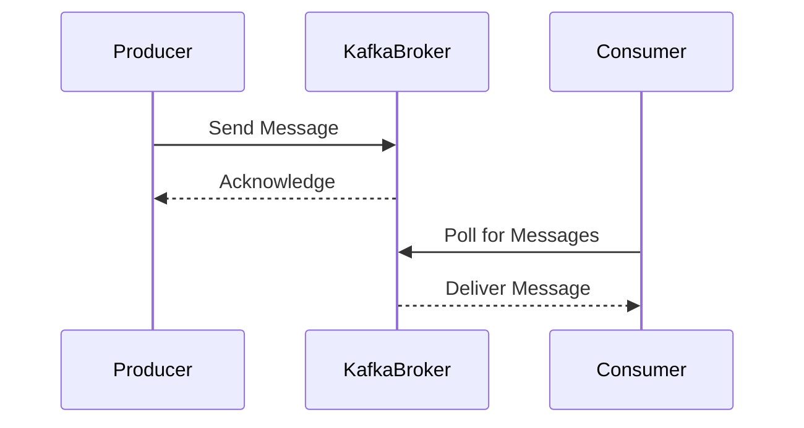

## 14.8.2 Integrating with Kafka

Apache Kafka is a powerful distributed event streaming platform capable of handling trillions of events a day. It is widely used for building real-time data pipelines and streaming applications. In this section, we will explore how to integrate Clojure with Kafka using popular libraries such as `clj-kafka` and `franzy`. We will cover the essentials of producing and consuming messages, and draw parallels to Java implementations to ease the transition for Java developers.

### Understanding Kafka

Before diving into the integration, let's briefly understand the core concepts of Kafka:

- **Producer**: An application that sends messages to Kafka.
- **Consumer**: An application that reads messages from Kafka.
- **Topic**: A category or feed name to which records are published.
- **Partition**: A single topic is split into partitions, allowing parallel processing.
- **Broker**: A Kafka server that stores messages in the partitions.

Kafka's architecture is designed to provide high throughput, scalability, and fault tolerance, making it ideal for real-time data processing.

### Setting Up Kafka

To get started, you need a running Kafka instance. You can set up Kafka locally or use a managed service like Confluent Cloud. For local setup, download Kafka from the [Apache Kafka website](https://kafka.apache.org/downloads) and follow the installation instructions.

### Integrating Clojure with Kafka

Clojure provides several libraries for interacting with Kafka. Two popular choices are `clj-kafka` and `franzy`. Both libraries offer idiomatic Clojure interfaces for Kafka's producer and consumer APIs.

#### Using `clj-kafka`

`clj-kafka` is a Clojure wrapper around the Kafka Java client. It provides a straightforward API for producing and consuming messages.

##### Producing Messages with `clj-kafka`

Let's start by creating a Kafka producer in Clojure using `clj-kafka`.

```clojure
(ns kafka-producer-example
  (:require [clj-kafka.producer :as producer]))

(def producer-config
  {"bootstrap.servers" "localhost:9092"
   "key.serializer" "org.apache.kafka.common.serialization.StringSerializer"
   "value.serializer" "org.apache.kafka.common.serialization.StringSerializer"})

(defn send-message [topic key value]
  (producer/send producer-config
                 {:topic topic
                  :key key
                  :value value}))

;; Example usage
(send-message "my-topic" "key1" "Hello, Kafka!")
```

**Explanation:**

- We define a `producer-config` map with necessary configurations like `bootstrap.servers`.
- The `send-message` function sends a message to the specified topic using the producer configuration.

##### Consuming Messages with `clj-kafka`

Now, let's create a Kafka consumer to read messages.

```clojure
(ns kafka-consumer-example
  (:require [clj-kafka.consumer :as consumer]))

(def consumer-config
  {"bootstrap.servers" "localhost:9092"
   "group.id" "my-consumer-group"
   "key.deserializer" "org.apache.kafka.common.serialization.StringDeserializer"
   "value.deserializer" "org.apache.kafka.common.serialization.StringDeserializer"
   "auto.offset.reset" "earliest"})

(defn consume-messages [topic]
  (consumer/with-consumer [c consumer-config]
    (consumer/subscribe c [topic])
    (while true
      (let [records (consumer/poll c 1000)]
        (doseq [record records]
          (println "Received message:" (.value record)))))))

;; Example usage
(consume-messages "my-topic")
```

**Explanation:**

- The `consumer-config` map includes configurations such as `group.id` and deserializers.
- The `consume-messages` function subscribes to a topic and continuously polls for new messages.

#### Using `franzy`

`franzy` is another Clojure library for Kafka, offering a more idiomatic and functional approach.

##### Producing Messages with `franzy`

Here's how you can produce messages using `franzy`.

```clojure
(ns franzy-producer-example
  (:require [franzy.clients.producer.client :as producer]
            [franzy.serialization.serializers :as serializers]))

(def producer-config
  {:bootstrap.servers "localhost:9092"
   :key.serializer (serializers/string-serializer)
   :value.serializer (serializers/string-serializer)})

(defn send-message [topic key value]
  (with-open [p (producer/make-producer producer-config)]
    (producer/send p {:topic topic :key key :value value})))

;; Example usage
(send-message "my-topic" "key1" "Hello, Franzy!")
```

**Explanation:**

- `franzy` uses a map for configuration and provides a `make-producer` function to create a producer.
- The `send-message` function sends messages using the producer.

##### Consuming Messages with `franzy`

Let's consume messages using `franzy`.

```clojure
(ns franzy-consumer-example
  (:require [franzy.clients.consumer.client :as consumer]
            [franzy.serialization.deserializers :as deserializers]))

(def consumer-config
  {:bootstrap.servers "localhost:9092"
   :group.id "my-consumer-group"
   :key.deserializer (deserializers/string-deserializer)
   :value.deserializer (deserializers/string-deserializer)
   :auto.offset.reset "earliest"})

(defn consume-messages [topic]
  (with-open [c (consumer/make-consumer consumer-config)]
    (consumer/subscribe c [topic])
    (while true
      (let [records (consumer/poll c 1000)]
        (doseq [record records]
          (println "Received message:" (:value record)))))))

;; Example usage
(consume-messages "my-topic")
```

**Explanation:**

- `franzy` provides a `make-consumer` function and uses maps for configuration.
- The `consume-messages` function subscribes to a topic and polls for messages.

### Comparing with Java

For Java developers, the transition to Clojure's Kafka libraries can be smooth, given the similarities in configuration and API usage. Here's a quick comparison:

#### Java Kafka Producer Example

```java
import org.apache.kafka.clients.producer.KafkaProducer;
import org.apache.kafka.clients.producer.ProducerRecord;
import java.util.Properties;

public class JavaKafkaProducer {
    public static void main(String[] args) {
        Properties props = new Properties();
        props.put("bootstrap.servers", "localhost:9092");
        props.put("key.serializer", "org.apache.kafka.common.serialization.StringSerializer");
        props.put("value.serializer", "org.apache.kafka.common.serialization.StringSerializer");

        KafkaProducer<String, String> producer = new KafkaProducer<>(props);
        producer.send(new ProducerRecord<>("my-topic", "key1", "Hello, Kafka!"));
        producer.close();
    }
}
```

**Comparison:**

- Both Clojure and Java require similar configurations for producers.
- Clojure's `clj-kafka` and `franzy` offer more concise and functional syntax compared to Java's imperative style.

#### Java Kafka Consumer Example

```java
import org.apache.kafka.clients.consumer.ConsumerRecord;
import org.apache.kafka.clients.consumer.KafkaConsumer;
import org.apache.kafka.clients.consumer.ConsumerRecords;
import java.util.Collections;
import java.util.Properties;

public class JavaKafkaConsumer {
    public static void main(String[] args) {
        Properties props = new Properties();
        props.put("bootstrap.servers", "localhost:9092");
        props.put("group.id", "my-consumer-group");
        props.put("key.deserializer", "org.apache.kafka.common.serialization.StringDeserializer");
        props.put("value.deserializer", "org.apache.kafka.common.serialization.StringDeserializer");
        props.put("auto.offset.reset", "earliest");

        KafkaConsumer<String, String> consumer = new KafkaConsumer<>(props);
        consumer.subscribe(Collections.singletonList("my-topic"));

        while (true) {
            ConsumerRecords<String, String> records = consumer.poll(1000);
            for (ConsumerRecord<String, String> record : records) {
                System.out.println("Received message: " + record.value());
            }
        }
    }
}
```

**Comparison:**

- The Clojure consumer code is more concise and leverages functional constructs like `doseq`.
- Both languages require similar configurations, but Clojure's syntax is more expressive.

### Try It Yourself

To deepen your understanding, try modifying the code examples:

- Change the topic name and observe how messages are routed.
- Experiment with different serializers and deserializers.
- Implement error handling for network failures or message processing errors.

### Diagrams

To visualize the flow of data in Kafka, let's look at a sequence diagram showing the interaction between a producer, Kafka broker, and consumer.



**Diagram Explanation:**

- The producer sends a message to the Kafka broker, which acknowledges receipt.
- The consumer polls the broker for messages and receives the delivered message.

### Exercises

1. **Implement a Kafka Stream Processor**: Use Clojure to create a simple stream processor that reads from one topic, processes the data, and writes to another topic.
2. **Error Handling**: Enhance the consumer example to handle deserialization errors gracefully.
3. **Performance Tuning**: Experiment with different configurations to optimize throughput and latency.

### Key Takeaways

- **Clojure's Functional Approach**: Clojure's functional style and concise syntax make it a powerful choice for Kafka integration.
- **Seamless Transition**: Java developers can leverage their existing knowledge to quickly adapt to Clojure's Kafka libraries.
- **Real-Time Processing**: Kafka's architecture, combined with Clojure's capabilities, enables efficient real-time data processing.

For further reading, explore the [Official Kafka Documentation](https://kafka.apache.org/documentation/) and [ClojureDocs](https://clojuredocs.org/).

---

## Quiz: Mastering Kafka Integration with Clojure



### What is the primary role of a Kafka producer?

- [x] To send messages to Kafka topics
- [ ] To read messages from Kafka topics
- [ ] To manage Kafka brokers
- [ ] To partition data across Kafka clusters

> **Explanation:** A Kafka producer is responsible for sending messages to Kafka topics.

### Which Clojure library provides a functional approach to Kafka integration?

- [ ] clj-kafka
- [x] franzy
- [ ] kafka-clj
- [ ] kafka-streams

> **Explanation:** `franzy` offers a more idiomatic and functional approach to Kafka integration in Clojure.

### In Clojure, which function is used to create a Kafka producer with `franzy`?

- [ ] make-producer
- [x] producer/make-producer
- [ ] create-producer
- [ ] init-producer

> **Explanation:** The `producer/make-producer` function is used to create a Kafka producer in `franzy`.

### What is the purpose of the `auto.offset.reset` configuration in Kafka consumers?

- [ ] To set the maximum message size
- [x] To determine the starting point for reading messages
- [ ] To specify the number of partitions
- [ ] To configure the message retention period

> **Explanation:** The `auto.offset.reset` configuration determines where the consumer starts reading messages if no offset is present.

### Which of the following is a key advantage of using Clojure for Kafka integration?

- [x] Concise syntax and functional constructs
- [ ] Built-in support for Kafka
- [ ] Automatic message serialization
- [ ] Native Kafka client

> **Explanation:** Clojure's concise syntax and functional constructs make it advantageous for Kafka integration.

### What is the role of a Kafka broker?

- [x] To store and manage messages in partitions
- [ ] To send messages to consumers
- [ ] To serialize and deserialize messages
- [ ] To configure Kafka topics

> **Explanation:** A Kafka broker stores and manages messages in partitions.

### How does Clojure's `doseq` function enhance Kafka consumer code?

- [x] By iterating over collections in a concise manner
- [ ] By serializing messages automatically
- [ ] By managing Kafka brokers
- [ ] By configuring consumer groups

> **Explanation:** The `doseq` function allows for concise iteration over collections, enhancing Kafka consumer code.

### What is the primary function of a Kafka consumer?

- [ ] To send messages to Kafka topics
- [x] To read messages from Kafka topics
- [ ] To manage Kafka brokers
- [ ] To partition data across Kafka clusters

> **Explanation:** A Kafka consumer reads messages from Kafka topics.

### Which configuration is essential for connecting a Kafka producer to a broker?

- [x] bootstrap.servers
- [ ] key.serializer
- [ ] group.id
- [ ] auto.offset.reset

> **Explanation:** The `bootstrap.servers` configuration specifies the Kafka broker addresses for the producer to connect.

### True or False: Clojure's `franzy` library requires Java interop for Kafka integration.

- [ ] True
- [x] False

> **Explanation:** `franzy` provides a native Clojure interface for Kafka integration without requiring Java interop.


