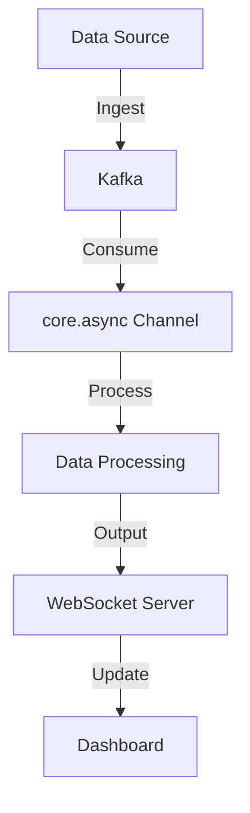

## 14.8.3 Real-Time Analytics

In today's fast-paced digital world, the ability to process and analyze data in real-time is crucial for businesses to make informed decisions quickly. Real-time analytics involves processing data as it arrives, allowing for immediate insights and actions. In this section, we'll explore how to build real-time analytics pipelines using Clojure, a functional programming language that excels in handling concurrent and parallel data processing tasks.

### Introduction to Real-Time Analytics

Real-time analytics refers to the process of analyzing data as it is ingested into a system, providing immediate insights and enabling timely decision-making. This is particularly useful in scenarios such as monitoring financial transactions, tracking user behavior on websites, or managing IoT devices.

#### Key Concepts

- **Data Streams**: Continuous flow of data generated by various sources, such as sensors, user interactions, or system logs.
- **Event-Driven Architecture**: A software architecture paradigm promoting the production, detection, consumption, and reaction to events.
- **Latency**: The delay between data generation and its processing. Real-time systems aim to minimize this delay.
- **Throughput**: The amount of data processed in a given time frame. High throughput is essential for handling large volumes of data.

### Why Clojure for Real-Time Analytics?

Clojure is a powerful language for building real-time analytics systems due to its functional programming paradigm, immutable data structures, and robust concurrency support. Here are some reasons why Clojure is an excellent choice:

- **Immutable Data Structures**: Clojure's persistent data structures ensure thread safety and reduce the complexity of concurrent programming.
- **Concurrency Primitives**: Clojure provides atoms, refs, agents, and core.async for managing state and concurrency effectively.
- **Java Interoperability**: Clojure runs on the JVM, allowing seamless integration with existing Java libraries and tools.
- **Functional Programming**: Encourages writing pure functions, leading to more predictable and testable code.

### Building Real-Time Analytics Pipelines

To build a real-time analytics pipeline in Clojure, we need to focus on data ingestion, processing, and output. Let's break down these components:

#### Data Ingestion

Data ingestion is the process of collecting and importing data for immediate use. In a real-time analytics system, data is typically ingested from various sources, such as message queues, databases, or APIs.

##### Example: Using Kafka for Data Ingestion

Apache Kafka is a popular distributed event streaming platform used for building real-time data pipelines. Here's how you can use Kafka with Clojure:

```clojure
(ns real-time-analytics.kafka
  (:require [clj-kafka.consumer :as consumer]
            [clj-kafka.producer :as producer]))

(defn start-consumer []
  (let [config {:zookeeper.connect "localhost:2181"
                :group.id "real-time-group"
                :auto.offset.reset "smallest"}
        topic "real-time-data"]
    (consumer/with-resource [c (consumer/consumer config)]
      (consumer/consume c topic
        (fn [message]
          (println "Received message:" message))))))

(defn start-producer []
  (let [config {:metadata.broker.list "localhost:9092"}
        topic "real-time-data"]
    (producer/with-resource [p (producer/producer config)]
      (producer/send p topic "key" "value"))))
```

In this example, we define a Kafka consumer and producer using the `clj-kafka` library. The consumer listens to a topic and processes incoming messages, while the producer sends messages to the topic.

#### Data Processing

Once data is ingested, it needs to be processed in real-time. This involves transforming, filtering, and aggregating data to extract meaningful insights.

##### Example: Using core.async for Data Processing

Clojure's `core.async` library provides facilities for asynchronous programming using channels and go blocks. Here's how you can use it for real-time data processing:

```clojure
(ns real-time-analytics.processing
  (:require [clojure.core.async :as async]))

(defn process-data [input-channel output-channel]
  (async/go-loop []
    (when-let [data (async/<! input-channel)]
      (let [processed-data (str "Processed: " data)]
        (async/>! output-channel processed-data))
      (recur))))

(defn start-processing []
  (let [input-channel (async/chan)
        output-channel (async/chan)]
    (process-data input-channel output-channel)
    (async/go-loop []
      (when-let [result (async/<! output-channel)]
        (println "Output:" result)
        (recur)))))
```

In this example, we define a `process-data` function that reads from an input channel, processes the data, and writes the result to an output channel. The `start-processing` function sets up the channels and starts the processing loop.

#### Data Output

The final step in a real-time analytics pipeline is outputting the processed data to a dashboard, alerting system, or storage for further analysis.

##### Example: Updating a Dashboard

Let's assume we have a simple web dashboard that displays real-time analytics. We can use a WebSocket connection to push updates to the dashboard:

```clojure
(ns real-time-analytics.dashboard
  (:require [org.httpkit.server :as http]
            [clojure.core.async :as async]))

(defn start-websocket-server [output-channel]
  (http/run-server
    (fn [req]
      (http/with-channel req channel
        (async/go-loop []
          (when-let [data (async/<! output-channel)]
            (http/send! channel data)
            (recur)))))
    {:port 8080}))

(defn start-dashboard []
  (let [output-channel (async/chan)]
    (start-websocket-server output-channel)
    (async/go-loop []
      (async/>! output-channel "Real-time update")
      (async/<! (async/timeout 1000))
      (recur))))
```

In this example, we use the `http-kit` library to create a WebSocket server that listens for connections and sends real-time updates from the output channel.

### Comparing Clojure and Java for Real-Time Analytics

Java is a well-established language for building real-time systems, but Clojure offers several advantages due to its functional nature and concurrency support. Let's compare some key aspects:

#### Concurrency

- **Java**: Uses threads, locks, and concurrent collections to manage concurrency. This can lead to complex and error-prone code.
- **Clojure**: Provides higher-level concurrency primitives like atoms, refs, and agents, simplifying state management and reducing the risk of race conditions.

#### Immutability

- **Java**: Mutable data structures are common, requiring careful synchronization in concurrent environments.
- **Clojure**: Immutable data structures are the default, making it easier to reason about state changes and ensuring thread safety.

#### Code Simplicity

- **Java**: Object-oriented programming can lead to verbose and complex code, especially when dealing with concurrency.
- **Clojure**: Functional programming encourages concise and expressive code, focusing on what to do rather than how to do it.

### Try It Yourself

To deepen your understanding of real-time analytics in Clojure, try modifying the code examples provided:

1. **Extend the Kafka Example**: Add error handling and logging to the Kafka consumer and producer.
2. **Enhance Data Processing**: Implement additional data transformations, such as filtering or aggregating data before outputting it.
3. **Customize the Dashboard**: Modify the WebSocket server to send different types of updates based on the processed data.

### Diagrams and Visualizations

To better understand the flow of data in a real-time analytics pipeline, let's visualize the process using a flowchart:



**Diagram 1**: This flowchart illustrates the data flow in a real-time analytics pipeline, from data ingestion to dashboard updates.

### Exercises

1. **Implement a Real-Time Alert System**: Use Clojure to build a system that triggers alerts based on specific conditions in the data stream.
2. **Integrate with a Database**: Extend the pipeline to store processed data in a database for historical analysis.
3. **Benchmark Performance**: Measure the latency and throughput of your pipeline and optimize it for better performance.

### Key Takeaways

- Real-time analytics enables immediate insights and actions by processing data as it arrives.
- Clojure's functional programming paradigm, immutable data structures, and concurrency primitives make it an excellent choice for building real-time analytics systems.
- By leveraging tools like Kafka and core.async, you can build efficient and scalable data pipelines in Clojure.

### Further Reading

- [Official Clojure Documentation](https://clojure.org/reference/documentation)
- [ClojureDocs](https://clojuredocs.org/)
- [Apache Kafka Documentation](https://kafka.apache.org/documentation/)
- [core.async Guide](https://clojure.github.io/core.async/)

Now that we've explored how to build real-time analytics pipelines in Clojure, let's apply these concepts to create efficient and responsive systems that can handle large volumes of data with ease.

## Real-Time Analytics Quiz: Test Your Knowledge



### What is real-time analytics?

- [x] Processing data as it arrives for immediate insights
- [ ] Analyzing data in batches at scheduled intervals
- [ ] Storing data for future analysis
- [ ] Visualizing historical data trends

> **Explanation:** Real-time analytics involves processing data as it is ingested, allowing for immediate insights and actions.

### Which Clojure library is commonly used for asynchronous programming?

- [x] core.async
- [ ] clojure.java.jdbc
- [ ] clj-http
- [ ] ring

> **Explanation:** The `core.async` library provides facilities for asynchronous programming using channels and go blocks.

### What is the primary advantage of using immutable data structures in Clojure?

- [x] Ensures thread safety and reduces complexity in concurrent programming
- [ ] Allows for dynamic typing
- [ ] Improves performance by avoiding garbage collection
- [ ] Simplifies syntax for beginners

> **Explanation:** Immutable data structures ensure thread safety and reduce the complexity of concurrent programming by preventing unintended state changes.

### How does Clojure's concurrency model differ from Java's?

- [x] Clojure uses higher-level concurrency primitives like atoms, refs, and agents
- [ ] Clojure relies on synchronized blocks and locks
- [ ] Clojure does not support concurrency
- [ ] Clojure uses only threads for concurrency

> **Explanation:** Clojure provides higher-level concurrency primitives like atoms, refs, and agents, simplifying state management and reducing the risk of race conditions.

### What is the role of Kafka in a real-time analytics pipeline?

- [x] Acts as a distributed event streaming platform for data ingestion
- [ ] Provides a database for storing processed data
- [ ] Visualizes data in real-time dashboards
- [ ] Handles authentication and authorization

> **Explanation:** Kafka is a distributed event streaming platform used for building real-time data pipelines, handling data ingestion from various sources.

### Which Clojure library is used to create WebSocket servers?

- [x] http-kit
- [ ] ring
- [ ] clojure.java.jdbc
- [ ] clj-http

> **Explanation:** The `http-kit` library is used to create WebSocket servers in Clojure, allowing for real-time communication with clients.

### What is the purpose of a WebSocket connection in a real-time analytics system?

- [x] To push real-time updates to a dashboard
- [ ] To store data in a database
- [ ] To process data asynchronously
- [ ] To secure data transmission

> **Explanation:** A WebSocket connection is used to push real-time updates to a dashboard, enabling immediate visualization of processed data.

### How can you enhance a real-time analytics pipeline in Clojure?

- [x] By adding error handling and logging
- [ ] By removing concurrency primitives
- [ ] By using mutable data structures
- [ ] By avoiding data transformations

> **Explanation:** Enhancing a real-time analytics pipeline can involve adding error handling and logging to improve reliability and maintainability.

### What is the benefit of using core.async channels in data processing?

- [x] Facilitates asynchronous communication between different parts of the system
- [ ] Increases the size of data storage
- [ ] Simplifies the syntax of data transformations
- [ ] Reduces the need for data serialization

> **Explanation:** Core.async channels facilitate asynchronous communication between different parts of the system, enabling efficient data processing.

### True or False: Clojure's functional programming paradigm encourages writing pure functions.

- [x] True
- [ ] False

> **Explanation:** Clojure's functional programming paradigm encourages writing pure functions, leading to more predictable and testable code.


