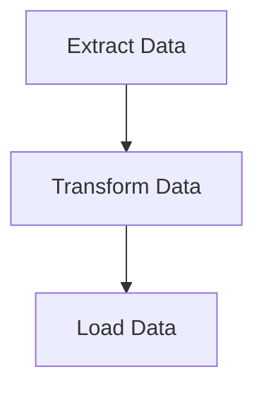

## 14.9.1 Data Processing Pipelines

In the world of data engineering, **data processing pipelines** are essential for transforming raw data into valuable insights. As experienced Java developers, you may be familiar with building such pipelines using Java frameworks. In this section, we'll explore how Clojure, with its functional programming paradigm, can offer a more expressive and concise approach to constructing data processing pipelines.

### Understanding Data Processing Pipelines

A **data processing pipeline** is a series of data transformations applied in sequence. Each stage of the pipeline takes input data, processes it, and passes the output to the next stage. This concept is akin to the **stream processing** model in Java, where data flows through a series of operations.

#### Key Characteristics of Data Processing Pipelines

- **Modularity**: Pipelines are composed of discrete stages, each responsible for a specific transformation.
- **Reusability**: Individual stages can be reused across different pipelines.
- **Scalability**: Pipelines can be scaled horizontally to handle large volumes of data.
- **Fault Tolerance**: Pipelines can be designed to handle errors gracefully, ensuring data integrity.

### Building Pipelines in Clojure

Clojure's functional programming features, such as **higher-order functions** and **immutable data structures**, make it an excellent choice for building data processing pipelines. Let's explore how we can leverage these features to construct efficient pipelines.

#### Higher-Order Functions in Pipelines

Higher-order functions are functions that take other functions as arguments or return them as results. In Clojure, functions like `map`, `filter`, and `reduce` are commonly used to process collections in a pipeline fashion.

```clojure
(defn process-data [data]
  (->> data
       (map #(assoc % :processed true)) ; Add a processed flag
       (filter :valid)                  ; Keep only valid entries
       (reduce (fn [acc item]           ; Aggregate data
                 (update acc :count inc))
               {:count 0})))
```

In this example, we use the threading macro `->>` to pass the data through a series of transformations. Each function in the pipeline operates on the data and passes the result to the next function.

#### Immutability and Concurrency

Clojure's immutable data structures ensure that data is not modified in place, which simplifies reasoning about concurrent data processing. This is particularly beneficial when scaling pipelines across multiple threads or nodes.

```clojure
(defn concurrent-process [data]
  (pmap #(assoc % :processed true) data)) ; Parallel map for concurrent processing
```

The `pmap` function processes data in parallel, leveraging Clojure's concurrency primitives to improve performance.

### Comparing Clojure and Java Pipelines

Java 8 introduced the **Stream API**, which provides a similar pipeline model for processing collections. Let's compare a simple data processing task in both Java and Clojure.

#### Java Example

```java
List<Data> processedData = data.stream()
    .map(d -> { d.setProcessed(true); return d; })
    .filter(Data::isValid)
    .collect(Collectors.toList());
```

#### Clojure Example

```clojure
(def processed-data
  (->> data
       (map #(assoc % :processed true))
       (filter :valid)))
```

**Key Differences:**

- **Conciseness**: Clojure's syntax is more concise, reducing boilerplate code.
- **Immutability**: Clojure's data structures are immutable by default, whereas Java requires explicit handling of immutability.
- **Functional Composition**: Clojure's use of higher-order functions and threading macros facilitates functional composition.

### Tools and Libraries for Data Workflows

While Clojure provides powerful built-in functions for data processing, several libraries can enhance your ability to build complex data workflows.

#### Apache NiFi

**Apache NiFi** is a robust data integration tool that automates the flow of data between systems. It offers a visual interface for designing data pipelines, making it accessible for non-developers. However, for developers, integrating NiFi with Clojure can provide a powerful combination of visual design and programmatic control.

- **Integration with Clojure**: Use Clojure to define custom processors or extend NiFi's capabilities.
- **Scalability**: NiFi's distributed architecture supports large-scale data processing.

#### Onyx

**Onyx** is a distributed, masterless, fault-tolerant data processing system written in Clojure. It is designed for building complex data workflows with ease.

- **Functional API**: Onyx provides a functional API that aligns with Clojure's programming model.
- **State Management**: Onyx supports stateful processing, allowing you to maintain state across pipeline stages.

```clojure
(def workflow
  [{:onyx/name :read-data
    :onyx/fn :my-app.core/read-data
    :onyx/type :input}
   {:onyx/name :process-data
    :onyx/fn :my-app.core/process-data
    :onyx/type :function}
   {:onyx/name :write-data
    :onyx/fn :my-app.core/write-data
    :onyx/type :output}])
```

In this example, we define a simple Onyx workflow with three stages: reading, processing, and writing data.

#### Clojure's Core.async

**Core.async** is a library for asynchronous programming in Clojure. It provides channels for communication between concurrent processes, making it suitable for building pipelines that require asynchronous data processing.

```clojure
(require '[clojure.core.async :as async])

(defn async-pipeline [data]
  (let [ch (async/chan)]
    (async/go
      (doseq [item data]
        (async/>! ch (assoc item :processed true))))
    (async/go
      (loop []
        (when-let [item (async/<! ch)]
          (println "Processed item:" item)
          (recur))))))
```

In this example, we use `core.async` to process data asynchronously, demonstrating how channels can facilitate communication between pipeline stages.

### Designing a Custom Data Processing Pipeline

Let's walk through the process of designing a custom data processing pipeline in Clojure. We'll build a pipeline that reads data from a source, processes it, and writes the results to a destination.

#### Step 1: Define the Pipeline Stages

First, identify the stages of your pipeline. For example, a simple ETL (Extract, Transform, Load) pipeline might include:

- **Extract**: Read data from a source (e.g., a database or file).
- **Transform**: Apply transformations to the data (e.g., filtering, aggregation).
- **Load**: Write the transformed data to a destination (e.g., another database or file).

#### Step 2: Implement Each Stage

Implement each stage as a separate function. This modular approach makes it easy to test and reuse individual stages.

```clojure
(defn extract-data [source]
  ;; Simulate data extraction
  (println "Extracting data from" source)
  [{:id 1 :value 10} {:id 2 :value 20}])

(defn transform-data [data]
  ;; Simulate data transformation
  (println "Transforming data")
  (map #(update % :value inc) data))

(defn load-data [data destination]
  ;; Simulate data loading
  (println "Loading data to" destination)
  (doseq [item data]
    (println "Loaded item:" item)))
```

#### Step 3: Compose the Pipeline

Use Clojure's functional composition to connect the stages into a pipeline.

```clojure
(defn run-pipeline [source destination]
  (->> (extract-data source)
       (transform-data)
       (load-data destination)))
```

#### Step 4: Execute the Pipeline

Finally, execute the pipeline with the desired source and destination.

```clojure
(run-pipeline "source-db" "destination-db")
```

### Try It Yourself

Experiment with the pipeline by modifying the transformation logic or adding new stages. For example, try adding a filtering stage to remove items with a value less than 15.

### Visualizing Data Flow

To better understand the flow of data through a pipeline, let's visualize it using a flowchart.



**Diagram Description**: This flowchart illustrates a simple ETL pipeline with three stages: Extract, Transform, and Load.

### Exercises

1. **Modify the Pipeline**: Add a new stage to the pipeline that logs each data item before loading it.
2. **Parallel Processing**: Use `pmap` to parallelize the transformation stage and measure the performance improvement.
3. **Error Handling**: Implement error handling in the pipeline to gracefully handle failures during data extraction or loading.

### Key Takeaways

- Clojure's functional programming features, such as higher-order functions and immutability, make it well-suited for building data processing pipelines.
- Libraries like Onyx and core.async provide powerful tools for constructing scalable and fault-tolerant data workflows.
- By leveraging Clojure's expressive syntax and concurrency primitives, you can build efficient pipelines that are easy to reason about and maintain.

For further reading, explore the [Official Clojure Documentation](https://clojure.org/reference/documentation) and [ClojureDocs](https://clojuredocs.org/) for more examples and detailed explanations of Clojure's core functions and libraries.

## Quiz: Mastering Data Processing Pipelines in Clojure



### What is a key characteristic of data processing pipelines?

- [x] Modularity
- [ ] Complexity
- [ ] Immutability
- [ ] Synchronous processing

> **Explanation:** Data processing pipelines are modular, allowing each stage to perform a specific transformation.

### Which Clojure function is used for parallel processing in pipelines?

- [ ] map
- [ ] filter
- [x] pmap
- [ ] reduce

> **Explanation:** `pmap` is used for parallel processing, distributing the workload across multiple threads.

### What is the primary advantage of using immutable data structures in pipelines?

- [x] Simplified reasoning about concurrency
- [ ] Increased memory usage
- [ ] Faster data processing
- [ ] Reduced code complexity

> **Explanation:** Immutability simplifies reasoning about concurrency, as data cannot be modified in place.

### Which library provides channels for asynchronous data processing in Clojure?

- [ ] Onyx
- [x] core.async
- [ ] Apache NiFi
- [ ] Ring

> **Explanation:** `core.async` provides channels for asynchronous data processing in Clojure.

### How does Clojure's syntax compare to Java's when building pipelines?

- [x] More concise
- [ ] More verbose
- [ ] Less expressive
- [ ] More complex

> **Explanation:** Clojure's syntax is more concise, reducing boilerplate code compared to Java.

### What is the purpose of the `->>` macro in Clojure?

- [x] To thread data through a series of transformations
- [ ] To perform parallel processing
- [ ] To handle errors
- [ ] To define functions

> **Explanation:** The `->>` macro threads data through a series of transformations, making the code more readable.

### Which tool is known for its visual interface for designing data pipelines?

- [ ] Onyx
- [x] Apache NiFi
- [ ] core.async
- [ ] Leiningen

> **Explanation:** Apache NiFi offers a visual interface for designing data pipelines, making it accessible for non-developers.

### What is a common use case for Onyx in data processing?

- [ ] Synchronous processing
- [x] Distributed, fault-tolerant workflows
- [ ] Simple data transformations
- [ ] Visual pipeline design

> **Explanation:** Onyx is designed for distributed, fault-tolerant workflows, making it suitable for complex data processing tasks.

### Which Clojure feature facilitates functional composition in pipelines?

- [x] Higher-order functions
- [ ] Mutable data structures
- [ ] Object-oriented programming
- [ ] Synchronous processing

> **Explanation:** Higher-order functions facilitate functional composition, allowing functions to be combined in pipelines.

### True or False: Clojure's `pmap` function modifies data in place.

- [ ] True
- [x] False

> **Explanation:** Clojure's `pmap` function does not modify data in place; it returns a new collection with the processed data.


