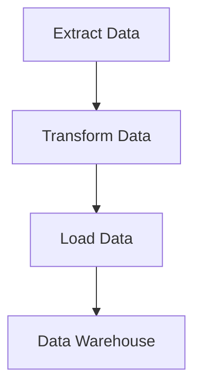

## 14.9.2 ETL Processes

In the world of data-driven applications, ETL (Extract, Transform, Load) processes are crucial for moving and transforming data from various sources into a centralized data warehouse. Clojure, with its functional programming paradigm and rich set of libraries, offers a powerful platform for building efficient ETL pipelines. In this section, we'll explore how to leverage Clojure's capabilities to construct robust ETL processes, drawing parallels to Java where applicable.

### Understanding ETL Processes

ETL processes are composed of three main stages:

1. **Extract**: Data is gathered from various sources, such as databases, APIs, or flat files.
2. **Transform**: The extracted data is cleaned, normalized, and transformed into a suitable format for analysis.
3. **Load**: The transformed data is loaded into a data warehouse or another storage system for further use.

Let's delve into each stage, examining how Clojure can be utilized effectively.

### Extracting Data

Data extraction involves retrieving data from multiple sources. Clojure's interoperability with Java allows us to use existing Java libraries for database access, HTTP requests, and file handling.

#### Database Extraction

For database extraction, Clojure provides libraries like `clojure.java.jdbc` and `next.jdbc` to interact with relational databases. Here's a simple example of extracting data from a PostgreSQL database using `next.jdbc`:

```clojure
(require '[next.jdbc :as jdbc])

(def db-spec {:dbtype "postgresql"
              :dbname "mydb"
              :host "localhost"
              :user "user"
              :password "password"})

(defn extract-data []
  (jdbc/execute! db-spec ["SELECT * FROM my_table"]))
```

**Explanation**: This code snippet connects to a PostgreSQL database and executes a query to extract data from `my_table`.

#### API Extraction

For extracting data from APIs, Clojure's `clj-http` library is a popular choice. Here's how you can fetch data from a REST API:

```clojure
(require '[clj-http.client :as client])

(defn extract-api-data []
  (let [response (client/get "https://api.example.com/data" {:as :json})]
    (:body response)))
```

**Explanation**: This function makes an HTTP GET request to an API endpoint and returns the JSON response body.

#### File Extraction

Clojure's standard library provides functions for reading files, making it easy to extract data from CSV or JSON files:

```clojure
(require '[clojure.data.csv :as csv]
         '[clojure.java.io :as io])

(defn extract-csv-data [file-path]
  (with-open [reader (io/reader file-path)]
    (doall
      (csv/read-csv reader))))
```

**Explanation**: This function reads a CSV file and returns its contents as a sequence of vectors.

### Transforming Data

Data transformation is where Clojure's functional programming strengths shine. Using higher-order functions and immutable data structures, we can perform complex transformations concisely and efficiently.

#### Data Cleaning and Normalization

Suppose we need to clean and normalize data by trimming whitespace and converting strings to lowercase. Here's how we can achieve this in Clojure:

```clojure
(defn clean-data [data]
  (map #(update % :name clojure.string/trim)
       (map #(update % :name clojure.string/lower-case) data)))
```

**Explanation**: This function uses `map` to apply transformations to each element in the data sequence, demonstrating the power of higher-order functions.

#### Aggregating and Summarizing Data

Clojure's `reduce` function is ideal for aggregating data. Let's calculate the total sales from a collection of sales records:

```clojure
(defn total-sales [sales-data]
  (reduce + (map :amount sales-data)))
```

**Explanation**: This function extracts the `:amount` from each sales record and sums them up using `reduce`.

#### Data Transformation with Transducers

Transducers provide a way to compose transformations without creating intermediate collections, improving performance:

```clojure
(defn transform-data [data]
  (into [] (comp (map :amount) (filter pos?)) data))
```

**Explanation**: This code uses a transducer to filter positive amounts and collect them into a vector.

### Loading Data

The final step in an ETL process is loading the transformed data into a data warehouse. Clojure's interoperability with Java allows us to use JDBC for database operations or libraries like `clojure.data.json` for writing JSON files.

#### Loading into a Database

Here's how to insert transformed data back into a database:

```clojure
(defn load-data [db-spec data]
  (jdbc/execute! db-spec
                 ["INSERT INTO processed_data (amount) VALUES (?)"
                  (map :amount data)]))
```

**Explanation**: This function inserts each transformed data record into the `processed_data` table.

#### Writing to a File

To write data to a JSON file, we can use `clojure.data.json`:

```clojure
(require '[clojure.data.json :as json])

(defn write-json [file-path data]
  (with-open [writer (io/writer file-path)]
    (json/write data writer)))
```

**Explanation**: This function writes the transformed data to a JSON file.

### Comparing with Java

In Java, ETL processes typically involve using frameworks like Apache Camel or Spring Batch, which provide a lot of boilerplate code and configuration. Clojure's concise syntax and functional approach reduce the complexity and verbosity often associated with Java-based ETL solutions.

### Try It Yourself

Experiment with the provided code snippets by modifying the data sources, transformation logic, or output formats. Try integrating additional data sources or applying more complex transformations to see the flexibility of Clojure's ETL capabilities.

### Visualizing ETL Processes

Below is a diagram illustrating the flow of data through an ETL process in Clojure:



**Diagram Explanation**: This flowchart represents the ETL process, showing the sequential steps of extracting, transforming, and loading data into a data warehouse.

### Further Reading

For more information on Clojure's data processing capabilities, consider exploring the following resources:

- [Clojure Documentation](https://clojure.org/reference/documentation)
- [ClojureDocs](https://clojuredocs.org/)
- [next.jdbc GitHub Repository](https://github.com/seancorfield/next-jdbc)
- [clj-http GitHub Repository](https://github.com/dakrone/clj-http)

### Exercises

1. **Extract and Transform**: Modify the extraction code to read from a different data source, such as an XML file, and apply a custom transformation.
2. **Load and Validate**: Implement a function to load data into a different database or file format, and validate the data integrity after loading.
3. **Performance Optimization**: Use transducers to optimize a transformation pipeline and compare the performance with a non-transducer approach.

### Key Takeaways

- Clojure's functional programming paradigm simplifies ETL processes by leveraging higher-order functions and immutable data structures.
- Interoperability with Java allows seamless integration with existing Java libraries for data extraction and loading.
- Transducers offer a performance advantage by eliminating intermediate collections during data transformation.
- Clojure's concise syntax reduces the complexity and verbosity often associated with Java-based ETL solutions.

Now that we've explored building ETL processes in Clojure, let's apply these concepts to create efficient data workflows in your applications.

## ETL Processes in Clojure: Quiz



### What are the three main stages of an ETL process?

- [x] Extract, Transform, Load
- [ ] Extract, Transfer, Load
- [ ] Extract, Translate, Load
- [ ] Extract, Transform, Link

> **Explanation:** ETL stands for Extract, Transform, Load, which are the three main stages of the process.

### Which Clojure library is commonly used for interacting with relational databases?

- [x] next.jdbc
- [ ] clj-http
- [ ] clojure.data.json
- [ ] clojure.core.async

> **Explanation:** `next.jdbc` is a Clojure library used for interacting with relational databases.

### How does Clojure's `reduce` function help in data transformation?

- [x] It aggregates data by applying a function cumulatively to the elements of a collection.
- [ ] It filters data based on a predicate.
- [ ] It maps a function over a collection.
- [ ] It sorts data in a collection.

> **Explanation:** `reduce` is used to aggregate data by applying a function cumulatively to the elements of a collection.

### What is the advantage of using transducers in Clojure?

- [x] They eliminate intermediate collections, improving performance.
- [ ] They provide a way to handle concurrency.
- [ ] They simplify error handling in asynchronous code.
- [ ] They allow for dynamic code evaluation.

> **Explanation:** Transducers eliminate intermediate collections, improving performance in data transformation pipelines.

### Which Clojure library is used for making HTTP requests?

- [x] clj-http
- [ ] next.jdbc
- [ ] clojure.data.json
- [ ] core.async

> **Explanation:** `clj-http` is a Clojure library used for making HTTP requests.

### True or False: Clojure's syntax is more verbose than Java's when implementing ETL processes.

- [ ] True
- [x] False

> **Explanation:** Clojure's syntax is generally more concise than Java's, especially when implementing ETL processes.

### What is the purpose of the `with-open` function in Clojure?

- [x] It ensures that resources are properly closed after use.
- [ ] It opens a new thread for concurrent execution.
- [ ] It locks a resource for exclusive access.
- [ ] It initializes a new database connection.

> **Explanation:** `with-open` is used to ensure that resources, such as file readers, are properly closed after use.

### Which function is used to write JSON data to a file in Clojure?

- [x] clojure.data.json/write
- [ ] clojure.java.io/write
- [ ] clojure.core/print
- [ ] clojure.string/join

> **Explanation:** `clojure.data.json/write` is used to write JSON data to a file in Clojure.

### How does Clojure handle data immutability in ETL processes?

- [x] By using immutable data structures, ensuring data consistency.
- [ ] By locking data structures during transformations.
- [ ] By using mutable collections for faster processing.
- [ ] By dynamically changing data types during execution.

> **Explanation:** Clojure uses immutable data structures, ensuring data consistency throughout ETL processes.

### Which of the following is a benefit of using Clojure for ETL processes?

- [x] Concise syntax and functional programming capabilities.
- [ ] Extensive use of boilerplate code.
- [ ] Strong emphasis on object-oriented design.
- [ ] Reliance on mutable state for data handling.

> **Explanation:** Clojure's concise syntax and functional programming capabilities make it well-suited for ETL processes.


