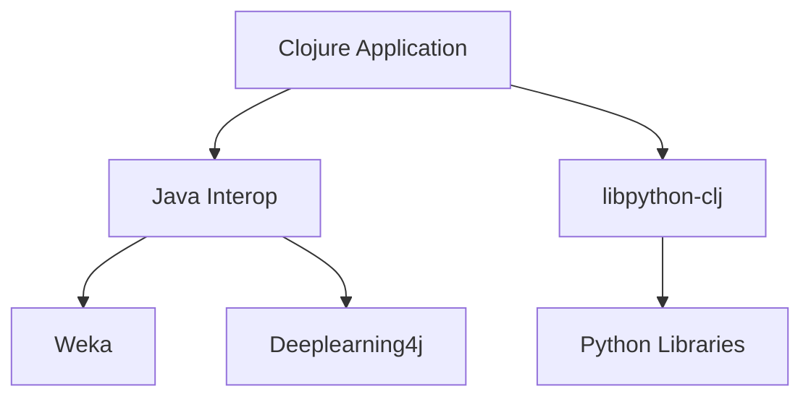

## 14.9.3 Integration with Machine Learning Libraries

As experienced Java developers, you're likely familiar with the growing importance of machine learning (ML) in modern software development. Clojure, with its functional programming paradigm and seamless Java interoperability, offers unique advantages for integrating with machine learning libraries. In this section, we'll explore how to leverage Clojure to work with popular ML libraries such as Weka, Deeplearning4j, and Python-based libraries through interoperability tools.

### Why Integrate Clojure with Machine Learning Libraries?

Clojure's strengths in handling data transformations, immutability, and concurrency make it an excellent choice for data-intensive applications. By integrating with ML libraries, you can harness the power of Clojure to preprocess data, build models, and deploy machine learning solutions efficiently.

#### Key Advantages:

- **Functional Programming Paradigm**: Clojure's functional approach simplifies data transformations and feature engineering.
- **Immutable Data Structures**: Ensure data integrity and simplify concurrent data processing.
- **Java Interoperability**: Access a vast ecosystem of Java-based ML libraries.
- **REPL-Driven Development**: Experiment and iterate quickly with live feedback.

### Integrating with Weka

Weka is a popular Java-based machine learning library that provides a collection of algorithms for data mining tasks. Its integration with Clojure is straightforward due to Clojure's seamless Java interoperability.

#### Setting Up Weka with Clojure

To use Weka in a Clojure project, you'll need to add Weka as a dependency in your `project.clj` file:

```clojure
(defproject ml-clojure "0.1.0-SNAPSHOT"
  :dependencies [[org.clojure/clojure "1.10.3"]
                 [nz.ac.waikato.cms.weka/weka-stable "3.8.5"]])
```

#### Example: Building a Simple Classifier

Let's build a simple classifier using Weka's J48 decision tree algorithm.

```clojure
(ns ml-clojure.core
  (:import [weka.core Instances]
           [weka.classifiers.trees J48]
           [weka.classifiers Evaluation]
           [java.io BufferedReader FileReader]))

(defn load-dataset [file-path]
  ;; Load dataset from ARFF file
  (with-open [reader (BufferedReader. (FileReader. file-path))]
    (let [data (Instances. reader)]
      (.setClassIndex data (- (.numAttributes data) 1))
      data)))

(defn train-classifier [data]
  ;; Train J48 classifier
  (let [classifier (J48.)]
    (.buildClassifier classifier data)
    classifier))

(defn evaluate-model [classifier data]
  ;; Evaluate classifier
  (let [evaluation (Evaluation. data)]
    (.crossValidateModel evaluation classifier data 10 (java.util.Random. 1))
    (.toSummaryString evaluation "\nResults\n" false)))

(defn -main [& args]
  (let [data (load-dataset "path/to/dataset.arff")
        classifier (train-classifier data)]
    (println (evaluate-model classifier data))))
```

**Explanation**: This code demonstrates loading a dataset, training a J48 classifier, and evaluating its performance using cross-validation.

### Integrating with Deeplearning4j

Deeplearning4j (DL4J) is a powerful Java-based deep learning library. It provides a comprehensive suite for building neural networks and is well-suited for integration with Clojure.

#### Setting Up Deeplearning4j with Clojure

Add DL4J as a dependency in your `project.clj`:

```clojure
(defproject dl4j-clojure "0.1.0-SNAPSHOT"
  :dependencies [[org.clojure/clojure "1.10.3"]
                 [org.deeplearning4j/deeplearning4j-core "1.0.0-beta7"]
                 [org.nd4j/nd4j-native-platform "1.0.0-beta7"]])
```

#### Example: Building a Neural Network

Let's create a simple neural network for classification using DL4J.

```clojure
(ns dl4j-clojure.core
  (:import [org.deeplearning4j.nn.conf NeuralNetConfiguration$Builder]
           [org.deeplearning4j.nn.conf.layers DenseLayer OutputLayer]
           [org.deeplearning4j.nn.multilayer MultiLayerNetwork]
           [org.nd4j.linalg.lossfunctions LossFunctions$LossFunction]
           [org.nd4j.linalg.activations Activation]
           [org.nd4j.linalg.dataset.api.iterator DataSetIterator]
           [org.nd4j.linalg.dataset.api.preprocessor NormalizerStandardize]
           [org.nd4j.linalg.factory Nd4j]))

(defn build-model []
  ;; Build a simple neural network
  (let [conf (-> (NeuralNetConfiguration$Builder.)
                 (.list)
                 (.layer 0 (DenseLayer$Builder. 10)
                         (.activation Activation/RELU)
                         (.nIn 784)
                         (.nOut 100)
                         .build)
                 (.layer 1 (OutputLayer$Builder. (LossFunctions$LossFunction/NEGATIVELOGLIKELIHOOD))
                         (.activation Activation/SOFTMAX)
                         (.nIn 100)
                         (.nOut 10)
                         .build)
                 .build)]
    (MultiLayerNetwork. conf)))

(defn train-model [model data-iterator]
  ;; Train the model
  (.init model)
  (let [normalizer (NormalizerStandardize.)]
    (.fit normalizer data-iterator)
    (.setPreProcessor data-iterator normalizer)
    (dotimes [_ 10]
      (.fit model data-iterator))))

(defn -main [& args]
  (let [model (build-model)
        data-iterator (create-data-iterator "path/to/data")]
    (train-model model data-iterator)
    (println "Model training complete.")))
```

**Explanation**: This example demonstrates building a simple feedforward neural network with two layers using DL4J.

### Interoperability with Python Libraries

Python is a dominant language in the machine learning community, with libraries like TensorFlow, PyTorch, and scikit-learn. Clojure can interoperate with Python using tools like [libpython-clj](https://github.com/clj-python/libpython-clj).

#### Setting Up libpython-clj

Add `libpython-clj` to your `project.clj`:

```clojure
(defproject python-clojure "0.1.0-SNAPSHOT"
  :dependencies [[org.clojure/clojure "1.10.3"]
                 [clj-python/libpython-clj "2.00"]])
```

#### Example: Using scikit-learn from Clojure

```clojure
(ns python-clojure.core
  (:require [libpython-clj.python :as py]))

(defn -main [& args]
  ;; Initialize Python environment
  (py/initialize!)

  ;; Import scikit-learn's datasets and model selection
  (py/import-module "sklearn.datasets" :as datasets)
  (py/import-module "sklearn.model_selection" :as model-selection)
  (py/import-module "sklearn.svm" :as svm)

  ;; Load the iris dataset
  (let [iris (py/call-attr datasets "load_iris")
        X (py/get-attr iris "data")
        y (py/get-attr iris "target")
        [X-train X-test y-train y-test] (py/call-attr model-selection "train_test_split" X y :test_size 0.2)
        clf (py/call-attr svm "SVC" :kernel "linear")]

    ;; Train the SVM classifier
    (py/call-attr clf "fit" X-train y-train)

    ;; Evaluate the classifier
    (let [score (py/call-attr clf "score" X-test y-test)]
      (println "Model accuracy:" score))))
```

**Explanation**: This code demonstrates using scikit-learn's SVM classifier from Clojure to train and evaluate a model on the iris dataset.

### Try It Yourself

To deepen your understanding, try modifying the examples:

- **Weka**: Experiment with different classifiers and datasets.
- **Deeplearning4j**: Adjust the network architecture and observe the impact on performance.
- **Python Interop**: Use different Python ML libraries and explore their functionalities.

### Diagrams and Visualizations

Below is a flowchart illustrating the integration process between Clojure and machine learning libraries:



**Diagram Description**: This flowchart shows how a Clojure application can integrate with Java-based libraries like Weka and Deeplearning4j through Java Interop, and with Python libraries using libpython-clj.

### Further Reading

- [Official Clojure Documentation](https://clojure.org/reference/documentation)
- [Deeplearning4j Documentation](https://deeplearning4j.org/docs/latest/)
- [libpython-clj GitHub Repository](https://github.com/clj-python/libpython-clj)

### Exercises

1. **Modify the Weka Example**: Try using a different dataset and classifier. Evaluate the results and compare them with the J48 classifier.
2. **Enhance the DL4J Model**: Add more layers to the neural network and experiment with different activation functions.
3. **Explore Python Interop**: Use libpython-clj to integrate with another Python library, such as TensorFlow or PyTorch, and build a simple model.

### Key Takeaways

- Clojure's interoperability with Java and Python makes it a versatile choice for integrating with machine learning libraries.
- Functional programming paradigms in Clojure simplify data transformations and model building.
- Experimentation with different libraries and tools can lead to more robust and efficient machine learning solutions.

Now that we've explored how to integrate Clojure with machine learning libraries, let's apply these concepts to build powerful data-driven applications.

## Quiz: Mastering Clojure Integration with Machine Learning Libraries



### What is an advantage of using Clojure for machine learning integration?

- [x] Seamless Java interoperability
- [ ] Lack of library support
- [ ] Limited data processing capabilities
- [ ] Complex syntax

> **Explanation:** Clojure's seamless Java interoperability allows easy integration with Java-based machine learning libraries.

### Which library is used for deep learning in Java?

- [ ] Weka
- [x] Deeplearning4j
- [ ] scikit-learn
- [ ] TensorFlow

> **Explanation:** Deeplearning4j is a Java-based library used for deep learning.

### How can Clojure interoperate with Python libraries?

- [ ] Using Java Interop
- [x] Using libpython-clj
- [ ] Using ClojureScript
- [ ] Using Leiningen

> **Explanation:** libpython-clj is a tool that allows Clojure to interoperate with Python libraries.

### What is the purpose of the `NormalizerStandardize` class in DL4J?

- [x] To normalize and standardize data
- [ ] To build neural networks
- [ ] To evaluate models
- [ ] To handle exceptions

> **Explanation:** `NormalizerStandardize` is used to normalize and standardize data before training a model.

### Which of the following is a Python-based machine learning library?

- [x] scikit-learn
- [ ] Weka
- [ ] Deeplearning4j
- [ ] Apache Spark

> **Explanation:** scikit-learn is a popular Python-based machine learning library.

### What is the role of the `J48` class in Weka?

- [x] To implement a decision tree classifier
- [ ] To preprocess data
- [ ] To handle exceptions
- [ ] To perform clustering

> **Explanation:** The `J48` class in Weka is used to implement a decision tree classifier.

### Which tool allows Clojure to call Python functions?

- [ ] Leiningen
- [ ] ClojureScript
- [x] libpython-clj
- [ ] Ring

> **Explanation:** libpython-clj allows Clojure to call Python functions and use Python libraries.

### What is a key feature of Clojure that aids in data processing?

- [x] Immutability
- [ ] Mutable state
- [ ] Complex syntax
- [ ] Lack of concurrency support

> **Explanation:** Immutability in Clojure ensures data integrity and simplifies concurrent data processing.

### How does Clojure handle Java-based libraries?

- [x] Through Java Interop
- [ ] Through ClojureScript
- [ ] Through Python Interop
- [ ] Through Leiningen

> **Explanation:** Clojure uses Java Interop to handle Java-based libraries.

### True or False: Clojure can only integrate with Java-based machine learning libraries.

- [ ] True
- [x] False

> **Explanation:** Clojure can integrate with both Java-based and Python-based machine learning libraries using interoperability tools like libpython-clj.


