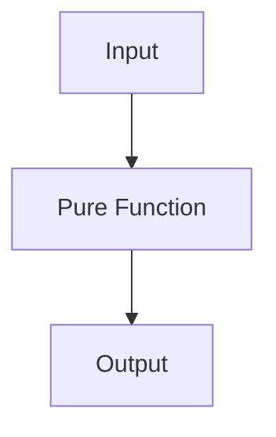

## 15.1.1 Testing Pure Functions

In the world of software development, testing is a critical component that ensures code quality and reliability. As experienced Java developers transitioning to Clojure, you might be familiar with the challenges of testing in an object-oriented paradigm. Functional programming, with its emphasis on pure functions, offers a refreshing perspective that simplifies and enhances the testing process. In this section, we'll explore how pure functions in Clojure make testing more straightforward and reliable, and discuss the benefits of testing in a functional context.

### Understanding Pure Functions

Before diving into testing, let's clarify what pure functions are. A pure function is a function where the output is determined solely by its input values, without observable side effects. This means:

- **Deterministic Output**: Given the same input, a pure function will always produce the same output.
- **No Side Effects**: Pure functions do not modify any external state or interact with the outside world (e.g., no I/O operations, no modifying global variables).

These characteristics make pure functions inherently easier to test. Let's compare a simple example in both Java and Clojure to illustrate this concept.

#### Java Example: Impure Function

```java
public class Counter {
    private int count = 0;

    public int increment() {
        return ++count;
    }
}
```

In this Java example, the `increment` method is impure because it modifies the state of the `count` variable. Testing this method requires setting up the initial state and verifying the state change, which can be cumbersome.

#### Clojure Example: Pure Function

```clojure
(defn increment [count]
  (inc count))
```

In Clojure, the `increment` function is pure. It takes a `count` as an argument and returns a new value without modifying any state. Testing this function is straightforward because it only depends on its input.

### Benefits of Testing Pure Functions

Testing pure functions offers several advantages:

1. **Predictability**: Since pure functions are deterministic, tests are more predictable and reliable.
2. **Isolation**: Pure functions can be tested in isolation without the need for complex setup or teardown procedures.
3. **Simplicity**: Tests for pure functions are often simpler and more concise, focusing solely on input-output relationships.
4. **Parallel Testing**: Pure functions can be tested in parallel without concerns about shared state or race conditions.

### Writing Tests for Pure Functions in Clojure

Let's explore how to write tests for pure functions in Clojure using the `clojure.test` library. We'll start with a simple example and gradually introduce more complex scenarios.

#### Example: Testing a Simple Pure Function

Consider a function that calculates the square of a number:

```clojure
(defn square [x]
  (* x x))
```

To test this function, we can use `clojure.test` as follows:

```clojure
(ns myapp.core-test
  (:require [clojure.test :refer :all]
            [myapp.core :refer :all]))

(deftest test-square
  (testing "Square function"
    (is (= 4 (square 2)))
    (is (= 9 (square 3)))
    (is (= 0 (square 0)))))
```

In this test, we define a test namespace `myapp.core-test` and use the `deftest` macro to create a test case. The `testing` macro provides a description, and the `is` macro checks that the function produces the expected output.

#### Try It Yourself

Experiment with the `square` function by adding more test cases. What happens if you pass negative numbers or non-integer values?

### Testing Functions with Multiple Inputs

Pure functions can have multiple inputs, and testing them involves verifying the output for various combinations of inputs. Consider a function that adds two numbers:

```clojure
(defn add [a b]
  (+ a b))
```

Here's how we can test it:

```clojure
(deftest test-add
  (testing "Add function"
    (is (= 5 (add 2 3)))
    (is (= 0 (add 0 0)))
    (is (= -1 (add -2 1)))))
```

### Testing Functions with Collections

Clojure's rich set of immutable collections makes it easy to work with data. Let's test a function that filters even numbers from a list:

```clojure
(defn filter-evens [numbers]
  (filter even? numbers))
```

The corresponding test might look like this:

```clojure
(deftest test-filter-evens
  (testing "Filter evens function"
    (is (= [2 4] (filter-evens [1 2 3 4])))
    (is (= [] (filter-evens [1 3 5])))
    (is (= [0] (filter-evens [0])))))
```

### Comparing with Java: Testing Impure Functions

In Java, testing often involves dealing with side effects and state management. Consider a Java method that modifies a list:

```java
public class ListModifier {
    public void addElement(List<Integer> list, int element) {
        list.add(element);
    }
}
```

Testing this method requires setting up the list, invoking the method, and verifying the state change:

```java
@Test
public void testAddElement() {
    List<Integer> list = new ArrayList<>();
    ListModifier modifier = new ListModifier();
    modifier.addElement(list, 5);
    assertEquals(Arrays.asList(5), list);
}
```

In contrast, Clojure's emphasis on immutability and pure functions simplifies testing by eliminating state-related complexities.

### Visualizing Pure Function Testing

To better understand the flow of data in pure functions, let's visualize it using a flowchart:



**Diagram Description**: This flowchart illustrates the straightforward flow of data in a pure function, where the output is solely determined by the input.

### Best Practices for Testing Pure Functions

- **Test Edge Cases**: Ensure your tests cover edge cases, such as empty collections or boundary values.
- **Use Property-Based Testing**: Consider using libraries like `test.check` for property-based testing, which can automatically generate test cases based on properties you define.
- **Keep Tests Independent**: Each test should be independent and not rely on the outcome of other tests.
- **Focus on Input-Output**: Concentrate on verifying the relationship between inputs and outputs, without worrying about internal state.

### Exercises: Practice Testing Pure Functions

1. **Exercise 1**: Write a pure function that reverses a string and test it with various inputs.
2. **Exercise 2**: Create a function that calculates the factorial of a number and write tests to verify its correctness.
3. **Exercise 3**: Implement a function that merges two sorted lists into a single sorted list and test it with different scenarios.

### Key Takeaways

- Pure functions are deterministic and free of side effects, making them ideal for testing.
- Testing pure functions in Clojure is straightforward, focusing on input-output relationships.
- Clojure's immutability and functional paradigm simplify testing compared to Java's object-oriented approach.
- Visualizing data flow and adhering to best practices enhance the testing process.

### Further Reading

For more information on testing in Clojure, consider exploring the following resources:

- [Official Clojure Documentation](https://clojure.org/reference/documentation)
- [ClojureDocs](https://clojuredocs.org/)
- [Clojure Testing Libraries](https://github.com/clojure/test.check)

Now that we've explored how testing pure functions can simplify your development process, let's apply these concepts to improve the reliability and maintainability of your Clojure applications.

## Quiz: Mastering Testing of Pure Functions in Clojure



### What is a characteristic of a pure function?

- [x] It produces the same output for the same input.
- [ ] It can modify external state.
- [ ] It performs I/O operations.
- [ ] It depends on global variables.

> **Explanation:** A pure function is deterministic and produces the same output for the same input, without side effects.

### Why are pure functions easier to test?

- [x] They have no side effects.
- [ ] They require complex setup.
- [ ] They depend on external state.
- [ ] They can change global variables.

> **Explanation:** Pure functions are easier to test because they have no side effects and do not depend on external state.

### Which Clojure library is commonly used for testing?

- [x] clojure.test
- [ ] clojure.core
- [ ] clojure.data
- [ ] clojure.string

> **Explanation:** `clojure.test` is the standard library used for testing in Clojure.

### What is the purpose of the `is` macro in `clojure.test`?

- [x] To assert that a condition is true.
- [ ] To define a new function.
- [ ] To create a namespace.
- [ ] To import a library.

> **Explanation:** The `is` macro is used to assert that a condition is true in a test.

### How can you test a function with multiple inputs in Clojure?

- [x] By writing test cases for various input combinations.
- [ ] By modifying the function to accept fewer inputs.
- [ ] By using global variables.
- [ ] By performing I/O operations.

> **Explanation:** Testing a function with multiple inputs involves writing test cases for different input combinations.

### What is a benefit of testing pure functions?

- [x] Predictability and reliability.
- [ ] Complexity and state management.
- [ ] Dependency on external systems.
- [ ] Need for extensive mocking.

> **Explanation:** Pure functions offer predictability and reliability, making them easier to test.

### How does Clojure's immutability aid in testing?

- [x] It eliminates state-related complexities.
- [ ] It requires mutable data structures.
- [ ] It complicates test setup.
- [ ] It depends on global state.

> **Explanation:** Clojure's immutability simplifies testing by eliminating state-related complexities.

### What is property-based testing?

- [x] Testing based on properties and automatically generated test cases.
- [ ] Testing with manually written test cases.
- [ ] Testing with global variables.
- [ ] Testing with side effects.

> **Explanation:** Property-based testing involves defining properties and automatically generating test cases.

### What is an example of a pure function in Clojure?

- [x] A function that calculates the square of a number.
- [ ] A function that modifies a global variable.
- [ ] A function that performs I/O operations.
- [ ] A function that depends on external state.

> **Explanation:** A function that calculates the square of a number is pure, as it depends only on its input.

### True or False: Pure functions can be tested in parallel without concerns about shared state.

- [x] True
- [ ] False

> **Explanation:** Pure functions can be tested in parallel because they do not modify shared state.


