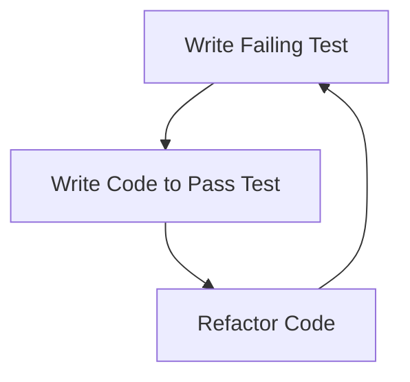

## 15.10.1 Test-Driven Development (TDD)

Test-Driven Development (TDD) is a software development approach where tests are written before the actual code. This methodology ensures that the code meets the requirements and behaves as expected. For Java developers transitioning to Clojure, understanding TDD in a functional programming context can enhance code quality and maintainability.

### Understanding TDD: A Brief Overview

TDD is based on a simple cycle: **Red, Green, Refactor**. This cycle is repeated for each new feature or bug fix:

1. **Red**: Write a test that fails. This step defines what the code should do.
2. **Green**: Write the minimal amount of code necessary to pass the test.
3. **Refactor**: Clean up the code while ensuring that all tests still pass.

This approach encourages developers to think about the requirements and design before writing the actual code, leading to more robust and error-free software.

### TDD in Java vs. Clojure

In Java, TDD is often implemented using frameworks like JUnit or TestNG. These frameworks provide annotations and assertions to facilitate testing. In Clojure, the `clojure.test` library is commonly used for TDD. While the principles remain the same, the syntax and idioms differ due to Clojure's functional nature.

#### Java Example: TDD with JUnit

```java
// Java: A simple test case using JUnit
import static org.junit.Assert.assertEquals;
import org.junit.Test;

public class CalculatorTest {
    @Test
    public void testAddition() {
        Calculator calc = new Calculator();
        assertEquals(5, calc.add(2, 3));
    }
}
```

#### Clojure Example: TDD with clojure.test

```clojure
;; Clojure: A simple test case using clojure.test
(ns calculator-test
  (:require [clojure.test :refer :all]
            [calculator :refer :all]))

(deftest test-addition
  (testing "Addition of two numbers"
    (is (= 5 (add 2 3)))))
```

### Writing Tests Before Code in Clojure

Let's explore how to apply TDD in Clojure by developing a simple calculator application. We'll start by writing tests for the addition function.

#### Step 1: Write a Failing Test

First, we define a test for the addition function. Since the function doesn't exist yet, this test will fail.

```clojure
(ns calculator-test
  (:require [clojure.test :refer :all]
            [calculator :refer :all]))

(deftest test-addition
  (testing "Addition of two numbers"
    (is (= 5 (add 2 3)))))
```

#### Step 2: Implement the Function

Next, we implement the `add` function in the `calculator` namespace to make the test pass.

```clojure
(ns calculator)

(defn add [a b]
  (+ a b))
```

#### Step 3: Refactor

After ensuring the test passes, we can refactor the code if necessary. In this simple example, the function is already optimal, but in more complex scenarios, refactoring might involve improving performance or readability.

### Advantages of TDD in Clojure

- **Improved Code Quality**: Writing tests first ensures that the code meets the requirements and behaves as expected.
- **Refactoring Confidence**: With a comprehensive test suite, developers can refactor code with confidence, knowing that any regressions will be caught by the tests.
- **Documentation**: Tests serve as documentation, illustrating how the code is intended to be used.

### Clojure's Functional Paradigm and TDD

Clojure's functional nature complements TDD by encouraging pure functions, which are easier to test. Pure functions have no side effects and return the same output for the same input, making them predictable and reliable.

#### Example: Testing a Pure Function

Consider a function that calculates the factorial of a number. We'll write a test before implementing the function.

```clojure
(ns math-test
  (:require [clojure.test :refer :all]
            [math :refer :all]))

(deftest test-factorial
  (testing "Factorial of a number"
    (is (= 120 (factorial 5)))
    (is (= 1 (factorial 0)))))
```

Now, let's implement the `factorial` function.

```clojure
(ns math)

(defn factorial [n]
  (reduce * (range 1 (inc n))))
```

### TDD and Immutability

Clojure's emphasis on immutability aligns well with TDD. Immutable data structures ensure that functions do not alter the state, reducing the likelihood of bugs and making tests more reliable.

#### Example: Testing with Immutable Data

Let's test a function that processes a list of numbers and returns a new list with each number doubled.

```clojure
(ns list-utils-test
  (:require [clojure.test :refer :all]
            [list-utils :refer :all]))

(deftest test-double-numbers
  (testing "Doubling numbers in a list"
    (is (= [2 4 6] (double-numbers [1 2 3])))))
```

Implementing the `double-numbers` function:

```clojure
(ns list-utils)

(defn double-numbers [numbers]
  (map #(* 2 %) numbers))
```

### TDD in Practice: A Real-World Example

Let's apply TDD to a more complex scenario: developing a simple banking application. We'll start by writing tests for a function that calculates the balance after a series of transactions.

#### Step 1: Write Tests

```clojure
(ns bank-test
  (:require [clojure.test :refer :all]
            [bank :refer :all]))

(deftest test-calculate-balance
  (testing "Calculating balance after transactions"
    (is (= 100 (calculate-balance [{:type :deposit :amount 100}
                                   {:type :withdraw :amount 50}
                                   {:type :deposit :amount 50}])))
    (is (= 0 (calculate-balance [{:type :withdraw :amount 50}
                                 {:type :deposit :amount 50}])))))
```

#### Step 2: Implement the Function

```clojure
(ns bank)

(defn calculate-balance [transactions]
  (reduce (fn [balance {:keys [type amount]}]
            (case type
              :deposit (+ balance amount)
              :withdraw (- balance amount)
              balance))
          0
          transactions))
```

### Try It Yourself

Experiment with the examples by modifying the tests and functions. For instance, add a test case for a new transaction type, such as a transfer, and implement the corresponding logic.

### Diagrams and Visualizations

To better understand the TDD process, let's visualize the Red-Green-Refactor cycle using a flowchart.



*Diagram 1: The TDD Cycle - Red-Green-Refactor*

### Further Reading

For more information on TDD and Clojure testing, consider the following resources:

- [Official Clojure Documentation](https://clojure.org/reference/documentation)
- [ClojureDocs](https://clojuredocs.org/)
- [JUnit 5 User Guide](https://junit.org/junit5/docs/current/user-guide/)

### Exercises

1. Write a test for a function that calculates the Fibonacci sequence and implement the function.
2. Refactor an existing Java application to use TDD principles in Clojure.
3. Explore the use of property-based testing with `test.check` in Clojure.

### Key Takeaways

- **TDD is a powerful methodology** that improves code quality and maintainability.
- **Clojure's functional paradigm** complements TDD by promoting pure functions and immutability.
- **Writing tests first** encourages thoughtful design and reduces the likelihood of bugs.
- **Experiment with TDD** by applying it to real-world scenarios and exploring advanced testing techniques.

Now that we've explored TDD in Clojure, let's apply these principles to enhance your development workflow and build robust, reliable applications.

## SEO optimized quiz title



### What is the first step in the TDD cycle?

- [x] Write a failing test
- [ ] Write code to pass the test
- [ ] Refactor the code
- [ ] Deploy the application

> **Explanation:** The first step in the TDD cycle is to write a failing test, which defines the expected behavior of the code.

### How does Clojure's functional nature complement TDD?

- [x] By promoting pure functions and immutability
- [ ] By allowing mutable state
- [ ] By using object-oriented principles
- [ ] By supporting inheritance

> **Explanation:** Clojure's functional nature complements TDD by promoting pure functions and immutability, making tests more reliable and predictable.

### In the TDD cycle, what does the "Green" phase involve?

- [x] Writing the minimal code to pass the test
- [ ] Refactoring the code
- [ ] Writing a failing test
- [ ] Deploying the application

> **Explanation:** The "Green" phase involves writing the minimal code necessary to pass the test.

### What library is commonly used for TDD in Clojure?

- [x] clojure.test
- [ ] JUnit
- [ ] TestNG
- [ ] Mockito

> **Explanation:** The `clojure.test` library is commonly used for TDD in Clojure.

### Which of the following is a benefit of TDD?

- [x] Improved code quality
- [x] Refactoring confidence
- [ ] Increased code complexity
- [ ] Longer development time

> **Explanation:** TDD improves code quality and provides refactoring confidence by ensuring that tests catch regressions.

### What is the purpose of the "Refactor" phase in TDD?

- [x] To clean up and optimize the code
- [ ] To write a failing test
- [ ] To deploy the application
- [ ] To write documentation

> **Explanation:** The "Refactor" phase is for cleaning up and optimizing the code while ensuring that all tests still pass.

### How does immutability in Clojure align with TDD?

- [x] It reduces the likelihood of bugs
- [x] It makes tests more reliable
- [ ] It allows for mutable state
- [ ] It complicates testing

> **Explanation:** Immutability in Clojure reduces the likelihood of bugs and makes tests more reliable by ensuring that functions do not alter the state.

### What is the role of tests in TDD?

- [x] To define expected behavior
- [ ] To increase code complexity
- [ ] To replace documentation
- [ ] To slow down development

> **Explanation:** In TDD, tests define the expected behavior of the code, guiding development and ensuring correctness.

### Which phase of TDD involves writing the minimal code necessary to pass the test?

- [x] Green
- [ ] Red
- [ ] Refactor
- [ ] Deploy

> **Explanation:** The "Green" phase involves writing the minimal code necessary to pass the test.

### True or False: TDD encourages writing tests after the code is complete.

- [ ] True
- [x] False

> **Explanation:** False. TDD encourages writing tests before the code is implemented, guiding development and ensuring correctness.


