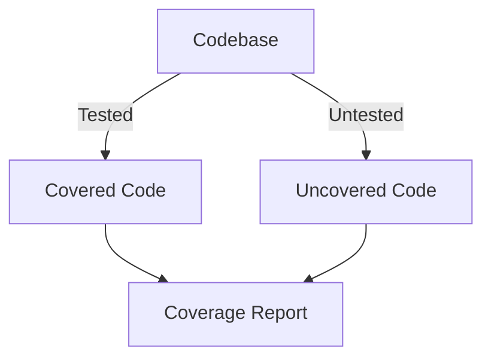

## 15.10.3 Balancing Test Coverage and Effort

In the realm of software development, testing is a critical component that ensures the reliability and robustness of applications. For Java developers transitioning to Clojure, understanding how to balance test coverage with the effort required is essential. This section delves into the nuances of achieving optimal test coverage in Clojure, focusing on critical code paths while managing the associated effort.

### Understanding Test Coverage

Test coverage is a metric used to determine the extent to which the source code of a program is tested. It is often expressed as a percentage, indicating the proportion of code executed by the test suite. High test coverage is generally desirable as it suggests that more of the codebase is verified to work as intended.

#### Types of Test Coverage

1. **Statement Coverage**: Ensures each statement in the code is executed at least once.
2. **Branch Coverage**: Validates that each branch (e.g., if-else conditions) is executed.
3. **Function Coverage**: Confirms that each function is called during testing.
4. **Path Coverage**: Tests all possible paths through the code.

### The Trade-offs of High Test Coverage

While high test coverage can lead to more reliable software, it comes with trade-offs:

- **Increased Effort**: Writing tests for every possible code path can be time-consuming.
- **Diminishing Returns**: Beyond a certain point, additional tests may not significantly improve code quality.
- **Maintenance Overhead**: More tests mean more maintenance, especially when code changes.

### Balancing Coverage and Effort in Clojure

Clojure, with its emphasis on immutability and functional programming, offers unique opportunities and challenges for testing. Let's explore how to balance test coverage and effort effectively.

#### Focus on Critical Code Paths

Not all code paths are equally important. Prioritize testing:

- **Core Business Logic**: Ensure that the most critical parts of your application are thoroughly tested.
- **Complex Algorithms**: Focus on areas with complex logic or calculations.
- **High-Risk Areas**: Identify parts of the code that are prone to errors or have a history of bugs.

#### Leverage Clojure's Functional Nature

Clojure's functional programming paradigm simplifies testing:

- **Pure Functions**: Since pure functions have no side effects, they are easier to test. Focus on writing and testing pure functions wherever possible.
- **Immutability**: Clojure's immutable data structures reduce the complexity of state management in tests.

#### Example: Testing a Pure Function

Let's consider a simple example of testing a pure function in Clojure:

```clojure
(ns myapp.core-test
  (:require [clojure.test :refer :all]
            [myapp.core :refer :all]))

(deftest test-add
  (testing "Addition of two numbers"
    (is (= 5 (add 2 3)))  ; Test case 1
    (is (= 0 (add -1 1))) ; Test case 2
    (is (= -3 (add -1 -2))))) ; Test case 3
```

In this example, the `add` function is pure, making it straightforward to test. Each test case verifies a different aspect of the function's behavior.

#### Compare with Java

In Java, testing might involve more setup, especially for classes with state or dependencies. Here's a simple Java test for comparison:

```java
import static org.junit.Assert.assertEquals;
import org.junit.Test;

public class MathTest {
    @Test
    public void testAdd() {
        Math math = new Math();
        assertEquals(5, math.add(2, 3)); // Test case 1
        assertEquals(0, math.add(-1, 1)); // Test case 2
        assertEquals(-3, math.add(-1, -2)); // Test case 3
    }
}
```

Notice how the Java test requires instantiation of the `Math` class, whereas the Clojure test directly calls the function.

### Strategies for Effective Testing

To balance test coverage and effort, consider the following strategies:

1. **Adopt a Risk-Based Approach**: Focus on testing areas with the highest risk of failure.
2. **Use Property-Based Testing**: Tools like `test.check` in Clojure can help test a wide range of inputs with minimal effort.
3. **Automate Test Execution**: Use continuous integration (CI) to run tests automatically, ensuring that new code doesn't break existing functionality.

#### Property-Based Testing Example

Property-based testing allows you to define properties that should hold true for a wide range of inputs. Here's an example using `test.check`:

```clojure
(ns myapp.core-test
  (:require [clojure.test :refer :all]
            [clojure.test.check :as tc]
            [clojure.test.check.generators :as gen]
            [clojure.test.check.properties :as prop]))

(def add-commutative
  (prop/for-all [a gen/int
                 b gen/int]
    (= (add a b) (add b a))))

(tc/quick-check 1000 add-commutative)
```

This test verifies that the `add` function is commutative for a wide range of integer inputs.

### Visualizing Test Coverage

Visualizing test coverage can help identify untested areas. Tools like Cloverage can generate reports that highlight which parts of the code are covered by tests.



*Diagram: This flowchart illustrates the process of generating a test coverage report, highlighting both covered and uncovered code.*

### Challenges in Balancing Coverage and Effort

1. **Complexity of Code**: Complex code may require more tests to achieve adequate coverage.
2. **Changing Requirements**: As requirements evolve, tests must be updated, increasing maintenance effort.
3. **Resource Constraints**: Limited time and resources can make it challenging to achieve high coverage.

### Best Practices for Clojure Testing

- **Write Tests Early**: Adopt test-driven development (TDD) to write tests before code.
- **Keep Tests Simple**: Write clear, concise tests that are easy to understand and maintain.
- **Review and Refactor**: Regularly review test cases to ensure they remain relevant and effective.

### Try It Yourself

Experiment with the provided Clojure code examples by:

- Modifying the `add` function to introduce a bug and observe how tests catch the error.
- Adding new test cases to cover edge cases, such as adding very large numbers.
- Implementing a new function and writing property-based tests for it.

### Exercises

1. **Identify Critical Paths**: Choose a small project and identify the critical code paths that require thorough testing.
2. **Implement Property-Based Tests**: Use `test.check` to write property-based tests for a function of your choice.
3. **Visualize Coverage**: Use Cloverage to generate a coverage report for your project and analyze the results.

### Key Takeaways

- **Balance is Key**: Achieving the right balance between test coverage and effort is crucial for effective testing.
- **Focus on Critical Areas**: Prioritize testing critical code paths and high-risk areas.
- **Leverage Clojure's Strengths**: Use Clojure's functional features to simplify testing and improve code quality.

By understanding and applying these principles, you can ensure that your Clojure applications are well-tested and robust, without expending unnecessary effort.

### Further Reading

- [Clojure Testing Guide](https://clojure.org/guides/testing)
- [Cloverage Documentation](https://github.com/cloverage/cloverage)
- [Property-Based Testing with test.check](https://github.com/clojure/test.check)

---

## Quiz: Mastering Test Coverage and Effort in Clojure



### What is the primary goal of test coverage?

- [x] To ensure that a significant portion of the codebase is executed by tests
- [ ] To guarantee that all possible bugs are found
- [ ] To make the code run faster
- [ ] To replace manual testing entirely

> **Explanation:** Test coverage aims to ensure that a significant portion of the codebase is executed by tests, increasing the likelihood of catching errors.

### Which type of test coverage ensures that each branch of code is executed?

- [ ] Statement Coverage
- [x] Branch Coverage
- [ ] Function Coverage
- [ ] Path Coverage

> **Explanation:** Branch coverage ensures that each branch (e.g., if-else conditions) in the code is executed.

### What is a key advantage of testing pure functions in Clojure?

- [x] They have no side effects, making them easier to test
- [ ] They require complex setup
- [ ] They are inherently faster
- [ ] They eliminate the need for any tests

> **Explanation:** Pure functions have no side effects, which simplifies testing as they always produce the same output for the same input.

### How does property-based testing differ from traditional unit testing?

- [x] It tests properties over a wide range of inputs
- [ ] It only tests a single input
- [ ] It requires manual input generation
- [ ] It is less reliable than unit testing

> **Explanation:** Property-based testing verifies that certain properties hold true over a wide range of inputs, unlike traditional unit tests that check specific cases.

### What tool can be used to visualize test coverage in Clojure?

- [ ] JUnit
- [ ] Mockito
- [x] Cloverage
- [ ] Selenium

> **Explanation:** Cloverage is a tool used to generate test coverage reports in Clojure.

### Why might high test coverage lead to diminishing returns?

- [x] Additional tests may not significantly improve code quality
- [ ] It always guarantees bug-free code
- [ ] It makes the code run slower
- [ ] It reduces the need for code reviews

> **Explanation:** Beyond a certain point, additional tests may not significantly improve code quality, leading to diminishing returns.

### What is a benefit of using Clojure's immutable data structures in testing?

- [x] They reduce the complexity of state management
- [ ] They make tests run faster
- [ ] They eliminate the need for tests
- [ ] They require more setup

> **Explanation:** Immutable data structures reduce the complexity of managing state in tests, making them easier to write and maintain.

### Which strategy helps balance test coverage and effort?

- [x] Focus on critical code paths
- [ ] Test every possible input
- [ ] Avoid testing complex logic
- [ ] Write tests after code is complete

> **Explanation:** Focusing on critical code paths ensures that the most important parts of the application are thoroughly tested without unnecessary effort.

### What is a challenge of maintaining high test coverage?

- [x] Increased maintenance effort as code changes
- [ ] It guarantees bug-free software
- [ ] It makes the code harder to read
- [ ] It reduces the need for documentation

> **Explanation:** High test coverage can lead to increased maintenance effort as tests need to be updated with code changes.

### True or False: Test-driven development (TDD) involves writing tests after the code is complete.

- [ ] True
- [x] False

> **Explanation:** Test-driven development (TDD) involves writing tests before the code is implemented, guiding the development process.


