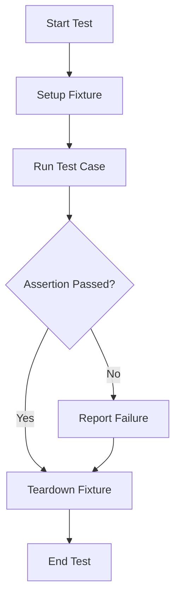

## 15.2.1 Introduction to `clojure.test`

As experienced Java developers, you are likely familiar with JUnit, a widely used testing framework in the Java ecosystem. In Clojure, the equivalent built-in testing framework is `clojure.test`. This framework provides a simple yet powerful way to write and run tests, ensuring that your Clojure code behaves as expected. In this section, we will explore the features of `clojure.test`, learn how to write test cases using `deftest` and `is`, and understand how it integrates with the Clojure development workflow.

### Understanding `clojure.test`

`clojure.test` is a part of the Clojure standard library, which means you don't need to install any additional dependencies to use it. It is designed to be straightforward and integrates seamlessly with the Clojure ecosystem. The framework provides essential tools for defining test cases, running them, and reporting results.

#### Key Features of `clojure.test`

- **Simplicity**: `clojure.test` is easy to use, with a minimalistic API that allows you to focus on writing tests rather than configuring the testing environment.
- **Integration**: It integrates well with Clojure's REPL, allowing for interactive test-driven development.
- **Extensibility**: You can extend `clojure.test` with custom assertions and reporting mechanisms.
- **Compatibility**: It works well with other Clojure libraries and tools, such as Leiningen and CIDER.

### Writing Test Cases with `deftest` and `is`

The core of `clojure.test` revolves around two primary constructs: `deftest` and `is`. Let's explore these in detail.

#### Using `deftest`

The `deftest` macro is used to define a test case. It takes a test name and a body of expressions that make up the test. Here's a simple example:

```clojure
(ns myapp.core-test
  (:require [clojure.test :refer :all]
            [myapp.core :refer :all]))

(deftest addition-test
  (is (= 4 (+ 2 2))))
```

In this example, we define a namespace `myapp.core-test` and require `clojure.test` and the namespace we want to test, `myapp.core`. The `deftest` macro defines a test named `addition-test`, which checks if the sum of 2 and 2 equals 4.

#### Using `is`

The `is` macro is used within a `deftest` to assert that a given expression evaluates to true. If the expression evaluates to false, the test fails, and `clojure.test` provides a detailed error message. Here's how you can use `is`:

```clojure
(deftest subtraction-test
  (is (= 0 (- 2 2)))
  (is (not= 1 (- 2 2))))
```

In this test, we use `is` to assert that subtracting 2 from 2 results in 0 and that the result is not equal to 1.

### Running Tests

Once you've written your tests, you can run them using the `run-tests` function. This function can be called from the REPL or as part of your build process with Leiningen. Here's how you can run tests in the REPL:

```clojure
(run-tests 'myapp.core-test)
```

This command runs all tests in the `myapp.core-test` namespace and reports the results.

### Comparing `clojure.test` with JUnit

For Java developers, understanding the differences between `clojure.test` and JUnit can help ease the transition to Clojure testing. Here are some key comparisons:

- **Setup and Teardown**: JUnit uses `@Before` and `@After` annotations for setup and teardown. In `clojure.test`, you can use `use-fixtures` to achieve similar functionality.
- **Assertions**: JUnit provides a variety of assertion methods, while `clojure.test` primarily uses the `is` macro, which can be extended with custom assertions.
- **Test Suites**: JUnit organizes tests into suites, whereas `clojure.test` uses namespaces to group related tests.

### Advanced Features of `clojure.test`

#### Fixtures

Fixtures in `clojure.test` allow you to define setup and teardown logic that runs before and after your tests. You can define fixtures at the namespace or test level. Here's an example:

```clojure
(defn setup []
  (println "Setting up test environment"))

(defn teardown []
  (println "Tearing down test environment"))

(use-fixtures :each setup teardown)
```

In this example, `setup` and `teardown` functions are defined to run before and after each test.

#### Custom Assertions

You can extend `clojure.test` with custom assertions by defining new macros. Here's an example of a custom assertion:

```clojure
(defmacro is-positive [x]
  `(is (> ~x 0) (str "Expected " ~x " to be positive")))

(deftest positive-test
  (is-positive 5))
```

This custom assertion checks if a number is positive and provides a custom error message if it is not.

### Try It Yourself

To get hands-on experience with `clojure.test`, try modifying the code examples above. For instance, add more test cases to the `addition-test` and `subtraction-test` functions. Experiment with defining your own custom assertions and fixtures.

### Visualizing Test Flow

To better understand how `clojure.test` works, let's visualize the flow of a test case using a Mermaid.js diagram:



**Diagram Description**: This flowchart illustrates the lifecycle of a test case in `clojure.test`, including setup, execution, assertion checking, and teardown.

### Further Reading

For more information on `clojure.test`, consider exploring the following resources:

- [Official Clojure Documentation](https://clojure.org/reference/testing)
- [ClojureDocs](https://clojuredocs.org/clojure.test)
- [Clojure Testing Guide on GitHub](https://github.com/clojure/clojure/blob/master/src/clj/clojure/test.clj)

### Exercises

1. **Write a Test Suite**: Create a new namespace for testing a simple Clojure application. Write multiple test cases using `deftest` and `is`.
2. **Custom Assertions**: Define a custom assertion macro that checks if a collection is empty. Use it in a test case.
3. **Fixtures**: Implement a fixture that initializes a database connection before each test and closes it afterward.

### Key Takeaways

- `clojure.test` is a built-in testing framework in Clojure, providing essential tools for writing and running tests.
- The `deftest` and `is` macros are central to defining test cases and assertions.
- Fixtures and custom assertions enhance the flexibility and power of `clojure.test`.
- Understanding the differences between `clojure.test` and JUnit can help Java developers transition smoothly to Clojure testing.

Now that we've explored the basics of `clojure.test`, you're equipped to start writing tests for your Clojure applications. Testing is a crucial part of software development, ensuring that your code is reliable and maintainable.

## Quiz: Mastering `clojure.test` for Clojure Testing



### What is the primary purpose of `clojure.test` in Clojure?

- [x] To provide a framework for writing and running tests
- [ ] To compile Clojure code
- [ ] To manage dependencies
- [ ] To deploy Clojure applications

> **Explanation:** `clojure.test` is the built-in testing framework in Clojure, designed for writing and running tests.

### Which macro is used to define a test case in `clojure.test`?

- [x] `deftest`
- [ ] `defn`
- [ ] `defmacro`
- [ ] `def`

> **Explanation:** The `deftest` macro is used to define a test case in `clojure.test`.

### How do you assert that an expression evaluates to true in `clojure.test`?

- [x] Using the `is` macro
- [ ] Using the `assert` macro
- [ ] Using the `check` macro
- [ ] Using the `validate` macro

> **Explanation:** The `is` macro is used to assert that an expression evaluates to true in `clojure.test`.

### What is the purpose of fixtures in `clojure.test`?

- [x] To define setup and teardown logic for tests
- [ ] To compile Clojure code
- [ ] To manage dependencies
- [ ] To deploy Clojure applications

> **Explanation:** Fixtures in `clojure.test` are used to define setup and teardown logic that runs before and after tests.

### Which function is used to run tests in a specific namespace?

- [x] `run-tests`
- [ ] `execute-tests`
- [x] `start-tests`
- [ ] `init-tests`

> **Explanation:** The `run-tests` function is used to run tests in a specific namespace in `clojure.test`.

### How can you extend `clojure.test` with custom assertions?

- [x] By defining new macros
- [ ] By using the `extend` function
- [ ] By using the `add-assertion` function
- [ ] By using the `customize` function

> **Explanation:** You can extend `clojure.test` with custom assertions by defining new macros.

### What is the equivalent of JUnit's `@Before` annotation in `clojure.test`?

- [x] `use-fixtures`
- [ ] `setup`
- [x] `init`
- [ ] `prepare`

> **Explanation:** The `use-fixtures` function in `clojure.test` is used to define setup logic, similar to JUnit's `@Before` annotation.

### What is the main advantage of using `clojure.test` over JUnit for Clojure developers?

- [x] Seamless integration with Clojure's REPL
- [ ] Better performance
- [ ] More comprehensive assertions
- [ ] Easier to use

> **Explanation:** `clojure.test` integrates seamlessly with Clojure's REPL, making it ideal for interactive development.

### Which of the following is NOT a feature of `clojure.test`?

- [x] Dependency management
- [ ] Simplicity
- [ ] Integration with REPL
- [ ] Extensibility

> **Explanation:** `clojure.test` does not handle dependency management; it focuses on testing.

### True or False: `clojure.test` is part of the Clojure standard library.

- [x] True
- [ ] False

> **Explanation:** `clojure.test` is indeed part of the Clojure standard library, requiring no additional installation.


