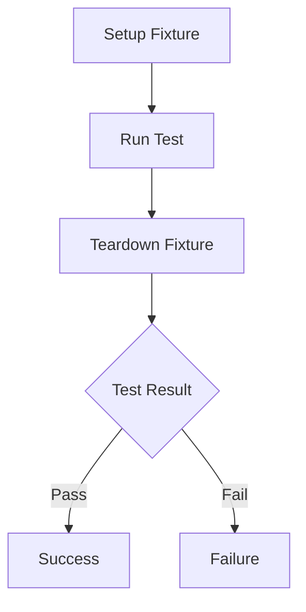

## 15.2.2 Writing Effective Unit Tests

As experienced Java developers, you are likely familiar with the importance of unit testing in ensuring code quality and reliability. Transitioning to Clojure, you'll find that the principles of writing effective unit tests remain largely the same, but the functional paradigm and Clojure's unique features offer new opportunities and challenges. In this section, we'll explore how to write effective unit tests in Clojure using `clojure.test`, focusing on testing edge cases, using test fixtures, and structuring test namespaces.

### Understanding Unit Testing in Clojure

Unit testing in Clojure is facilitated by the `clojure.test` library, which provides a simple yet powerful framework for writing and running tests. The library is part of the Clojure core, so you don't need to install any additional dependencies to get started.

#### Key Concepts

- **Test Functions**: In Clojure, test functions are defined using the `deftest` macro. Each test function can contain multiple assertions.
- **Assertions**: Use the `is` macro to make assertions about the expected behavior of your code.
- **Test Namespaces**: Organize your tests in separate namespaces, typically mirroring the structure of your source code.

### Writing Your First Unit Test

Let's start with a simple example. Suppose we have a function `add` that adds two numbers:

```clojure
(defn add [a b]
  (+ a b))
```

To test this function, we create a test namespace and define a test function using `deftest`:

```clojure
(ns myapp.core-test
  (:require [clojure.test :refer :all]
            [myapp.core :refer :all]))

(deftest test-add
  (is (= 4 (add 2 2)))  ; Test for expected output
  (is (= 0 (add 0 0)))  ; Test with zero
  (is (= -1 (add -2 1)))) ; Test with negative numbers
```

### Testing Edge Cases

Testing edge cases is crucial for ensuring the robustness of your code. Edge cases often reveal hidden bugs that might not be apparent with typical inputs.

#### Example: Testing Edge Cases for a Division Function

Consider a division function:

```clojure
(defn divide [numerator denominator]
  (when (not= denominator 0)
    (/ numerator denominator)))
```

To test this function, we need to consider edge cases such as division by zero:

```clojure
(deftest test-divide
  (is (= 2 (divide 4 2)))  ; Normal division
  (is (nil? (divide 4 0))) ; Division by zero should return nil
  (is (= -2 (divide -4 2))) ; Negative numerator
  (is (= 0 (divide 0 5)))) ; Zero numerator
```

### Using Test Fixtures

Test fixtures are used to set up the environment for your tests, ensuring that each test runs in a clean state. Clojure provides several ways to define test fixtures, including `use-fixtures`.

#### Example: Using Test Fixtures

Suppose we have a function that interacts with a database. We can use a fixture to set up and tear down the database connection:

```clojure
(defn setup-db []
  ;; Code to set up database connection
  )

(defn teardown-db []
  ;; Code to tear down database connection
  )

(use-fixtures :each (fn [f]
                      (setup-db)
                      (f)
                      (teardown-db)))

(deftest test-db-function
  (is (= expected-result (db-function))))
```

### Structuring Test Namespaces

Organizing your tests into namespaces that mirror your source code structure helps maintain clarity and manageability. Each test namespace should correspond to a source namespace, and test files should be placed in a `test` directory.

#### Example: Structuring Test Namespaces

For a project with the following structure:

```
src/
  myapp/
    core.clj
    utils.clj
test/
  myapp/
    core_test.clj
    utils_test.clj
```

Each source file has a corresponding test file. This organization makes it easy to locate tests and ensures that all code is covered.

### Comparing Clojure and Java Unit Testing

In Java, unit testing is often done using frameworks like JUnit. While the concepts are similar, Clojure's functional nature and concise syntax can make tests more expressive and easier to write.

#### Java vs. Clojure: A Comparison

**Java Example (JUnit)**

```java
import static org.junit.Assert.assertEquals;
import org.junit.Test;

public class MathTest {
    @Test
    public void testAdd() {
        assertEquals(4, Math.add(2, 2));
    }
}
```

**Clojure Example**

```clojure
(deftest test-add
  (is (= 4 (add 2 2))))
```

**Key Differences:**

- **Syntax**: Clojure's syntax is more concise, reducing boilerplate code.
- **Functional Style**: Clojure encourages a functional approach, which can lead to more predictable and testable code.

### Best Practices for Writing Effective Unit Tests

1. **Test Small Units**: Focus on testing small, isolated units of functionality.
2. **Use Descriptive Names**: Name your test functions clearly to indicate what they are testing.
3. **Test Edge Cases**: Always consider edge cases and unexpected inputs.
4. **Keep Tests Independent**: Ensure tests do not depend on each other.
5. **Use Fixtures Wisely**: Use fixtures to manage setup and teardown, but avoid overusing them as they can complicate tests.
6. **Run Tests Frequently**: Integrate tests into your development workflow to catch issues early.

### Try It Yourself

Experiment with the following modifications to deepen your understanding:

- **Add More Edge Cases**: Extend the `test-divide` function to handle more edge cases, such as very large numbers.
- **Refactor with Fixtures**: Introduce a fixture to manage state in a more complex test scenario.
- **Compare with Java**: Write a similar test in Java using JUnit and compare the experience.

### Diagrams and Visual Aids

To better understand how data flows through your tests, consider the following diagram illustrating the lifecycle of a test with fixtures:



*Diagram: Test Lifecycle with Fixtures* - This diagram shows the sequence of steps in a test lifecycle, including setup, execution, teardown, and result evaluation.

### Further Reading

For more information on unit testing in Clojure, consider exploring the following resources:

- [Official Clojure Documentation](https://clojure.org/reference/testing)
- [ClojureDocs](https://clojuredocs.org/)
- [Clojure Testing Libraries on GitHub](https://github.com/clojure/test.check)

### Exercises and Practice Problems

1. **Write Tests for a New Function**: Create a new function in Clojure and write comprehensive tests for it, covering normal cases and edge cases.
2. **Refactor Tests with Fixtures**: Take an existing set of tests and refactor them to use fixtures for setup and teardown.
3. **Compare with Java**: Implement the same function and tests in Java, and compare the testing experience and code readability.

### Summary and Key Takeaways

- **Unit Testing in Clojure**: Leverage `clojure.test` for effective unit testing, focusing on small, isolated units of functionality.
- **Testing Edge Cases**: Always consider edge cases to ensure robustness.
- **Using Fixtures**: Manage test setup and teardown with fixtures to maintain a clean test environment.
- **Structuring Tests**: Organize test namespaces to mirror your source code structure for clarity and manageability.
- **Comparing with Java**: Appreciate the concise syntax and functional style of Clojure tests compared to Java.

By mastering these concepts, you'll be well-equipped to write effective unit tests in Clojure, ensuring your code is reliable and maintainable.

---

## Quiz: Mastering Unit Testing in Clojure



### What is the primary purpose of unit testing in Clojure?

- [x] To ensure individual units of code work as expected
- [ ] To test the entire application as a whole
- [ ] To replace integration testing
- [ ] To debug code in production

> **Explanation:** Unit testing focuses on verifying that individual units of code, such as functions, work as expected.

### Which macro is used to define a test function in Clojure?

- [x] `deftest`
- [ ] `def`
- [ ] `defn`
- [ ] `defmacro`

> **Explanation:** The `deftest` macro is used to define test functions in Clojure.

### How can you test for edge cases in Clojure?

- [x] By writing specific test cases that cover unusual or extreme inputs
- [ ] By running tests only on normal inputs
- [ ] By ignoring edge cases
- [ ] By using only integration tests

> **Explanation:** Testing edge cases involves writing test cases that cover unusual or extreme inputs to ensure robustness.

### What is the role of test fixtures in Clojure?

- [x] To set up and tear down the environment for tests
- [ ] To replace test functions
- [ ] To execute tests in parallel
- [ ] To generate test data automatically

> **Explanation:** Test fixtures are used to set up and tear down the environment for tests, ensuring a clean state.

### How should test namespaces be structured in Clojure?

- [x] They should mirror the structure of the source code
- [ ] They should be completely separate from the source code
- [ ] They should be in the same file as the source code
- [ ] They should be named randomly

> **Explanation:** Test namespaces should mirror the structure of the source code for clarity and manageability.

### What is a key difference between unit testing in Clojure and Java?

- [x] Clojure tests are more concise due to its functional style
- [ ] Java tests are more concise
- [ ] Clojure does not support unit testing
- [ ] Java uses the `deftest` macro

> **Explanation:** Clojure's functional style and concise syntax make its tests more concise compared to Java.

### Which of the following is a best practice for writing effective unit tests?

- [x] Test small, isolated units of functionality
- [ ] Test only the main function of the application
- [ ] Avoid testing edge cases
- [ ] Depend on other tests for setup

> **Explanation:** Testing small, isolated units of functionality is a best practice for effective unit testing.

### What is the purpose of the `is` macro in Clojure tests?

- [x] To make assertions about expected behavior
- [ ] To define test functions
- [ ] To set up test fixtures
- [ ] To tear down test environments

> **Explanation:** The `is` macro is used to make assertions about the expected behavior of code in Clojure tests.

### How can you integrate unit tests into your development workflow?

- [x] By running tests frequently to catch issues early
- [ ] By running tests only before deployment
- [ ] By ignoring tests during development
- [ ] By writing tests after the project is complete

> **Explanation:** Integrating unit tests into your development workflow by running them frequently helps catch issues early.

### True or False: In Clojure, test functions can contain multiple assertions.

- [x] True
- [ ] False

> **Explanation:** In Clojure, test functions can contain multiple assertions, allowing you to test various aspects of a function's behavior.


