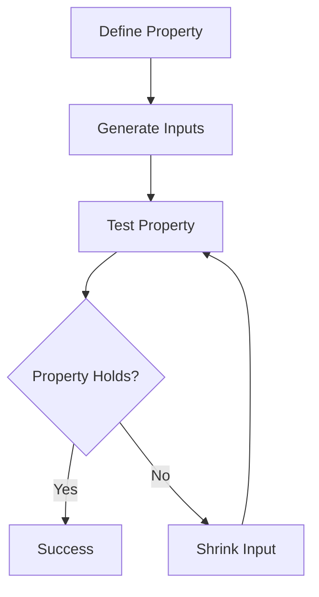

## 15.3.1 Understanding Property-Based Testing

As experienced Java developers, you are likely familiar with unit testing, where specific inputs are tested against expected outputs. However, this approach can sometimes miss edge cases or unexpected inputs. Enter **property-based testing**, a powerful testing methodology that focuses on defining properties or invariants that should hold true for a wide range of inputs. In this section, we will explore how property-based testing can be implemented in Clojure using the `test.check` library, and how it can complement your existing testing strategies.

### What is Property-Based Testing?

Property-based testing is a testing approach where you define properties that your code should satisfy, and then automatically generate a wide range of inputs to test those properties. Unlike traditional unit tests that check specific cases, property-based tests aim to uncover edge cases and unexpected behaviors by testing the code with many different inputs.

#### Key Concepts

- **Properties**: These are general statements about the expected behavior of your code. For example, "reversing a list twice should return the original list."
- **Generators**: These are used to produce a wide variety of inputs for testing properties. Generators can create random data that fits the type and constraints of your properties.
- **Shrinking**: When a test fails, shrinking attempts to find the smallest input that still causes the failure, making it easier to diagnose the issue.

### Why Use Property-Based Testing?

Property-based testing offers several advantages over traditional unit testing:

1. **Broader Coverage**: By testing a wide range of inputs, property-based testing can uncover edge cases that might be missed by example-based tests.
2. **Less Maintenance**: Instead of writing numerous specific test cases, you define properties that should always hold true, reducing the need for test maintenance.
3. **Better Understanding**: Defining properties encourages a deeper understanding of the code's intended behavior.

### Property-Based Testing in Clojure with `test.check`

Clojure's `test.check` library provides a robust framework for property-based testing. It allows you to define properties and use generators to test them across a wide range of inputs.

#### Setting Up `test.check`

To get started with `test.check`, you'll need to add it to your Clojure project. If you're using Leiningen, add the following dependency to your `project.clj`:

```clojure
:dependencies [[org.clojure/test.check "1.1.0"]]
```

#### Defining Properties

Let's define a simple property: reversing a list twice should return the original list. In `test.check`, you can use the `defspec` macro to define a property-based test.

```clojure
(ns myproject.core-test
  (:require [clojure.test :refer :all]
            [clojure.test.check :as tc]
            [clojure.test.check.properties :as prop]
            [clojure.test.check.generators :as gen]))

(defspec reverse-twice-is-original
  100 ;; Number of tests
  (prop/for-all [v (gen/vector gen/int)]
    (= v (reverse (reverse v)))))
```

**Explanation**:
- **`defspec`**: Defines a property-based test.
- **`prop/for-all`**: Specifies the property to test. It takes a vector of generators and a body that describes the property.
- **`gen/vector` and `gen/int`**: Generators for vectors and integers, respectively.

#### Generators

Generators are a core part of property-based testing. They create the diverse inputs needed to test properties. `test.check` provides a variety of built-in generators, and you can also create custom ones.

##### Built-in Generators

- **`gen/int`**: Generates random integers.
- **`gen/string`**: Generates random strings.
- **`gen/boolean`**: Generates random booleans.

##### Custom Generators

You can create custom generators using the `gen/fmap` and `gen/bind` functions. Here's an example of a custom generator for even numbers:

```clojure
(def even-gen
  (gen/fmap #(* 2 %) gen/int))
```

**Explanation**:
- **`gen/fmap`**: Transforms the output of a generator. Here, it multiplies each generated integer by 2 to produce even numbers.

#### Shrinking

Shrinking is the process of simplifying a failing test case to its minimal form. `test.check` automatically attempts to shrink inputs when a property fails, helping you identify the root cause of the failure.

### Comparing Property-Based Testing in Clojure and Java

Java developers might be familiar with libraries like JUnit or TestNG for unit testing. While these libraries are excellent for example-based testing, they don't natively support property-based testing. However, libraries like [JUnit-Quickcheck](https://pholser.github.io/junit-quickcheck/) bring property-based testing to Java, offering similar capabilities to Clojure's `test.check`.

#### Example: Testing a Sorting Function

Let's compare how you might test a sorting function in both Java and Clojure.

**Java Example with JUnit-Quickcheck**:

```java
import com.pholser.junit.quickcheck.Property;
import com.pholser.junit.quickcheck.runner.JUnitQuickcheck;
import org.junit.runner.RunWith;
import static org.junit.Assert.*;

@RunWith(JUnitQuickcheck.class)
public class SortProperties {
    @Property
    public void sortPreservesLength(int[] array) {
        int[] sorted = sort(array);
        assertEquals(array.length, sorted.length);
    }

    private int[] sort(int[] array) {
        // Sorting logic here
    }
}
```

**Clojure Example with `test.check`**:

```clojure
(defspec sort-preserves-length
  100
  (prop/for-all [v (gen/vector gen/int)]
    (= (count v) (count (sort v)))))
```

**Comparison**:
- Both examples define a property that the length of the array should remain the same after sorting.
- Clojure's `test.check` uses generators to produce input data, similar to JUnit-Quickcheck's annotations.
- Clojure's syntax is more concise, leveraging its functional nature.

### Try It Yourself

Experiment with the following code by modifying the properties or generators:

1. Change the generator to produce strings instead of integers.
2. Define a new property that checks if sorting a list results in a non-decreasing order.
3. Create a custom generator for lists of even numbers and test a property on them.

### Diagrams and Visualizations

To better understand the flow of property-based testing, consider the following diagram illustrating the process:



**Diagram Explanation**: This flowchart represents the process of property-based testing. It starts with defining a property, generating inputs, testing the property, and either succeeding or shrinking inputs if the property fails.

### Further Reading

For more information on property-based testing and `test.check`, consider the following resources:

- [Official Clojure `test.check` Documentation](https://clojure.github.io/test.check/)
- [ClojureDocs on `test.check`](https://clojuredocs.org/clojure.test.check)
- [JUnit-Quickcheck Documentation](https://pholser.github.io/junit-quickcheck/)

### Exercises

1. **Define a Property**: Write a property-based test for a function that calculates the factorial of a number. Ensure that the factorial of a number is always greater than or equal to 1.
2. **Custom Generator**: Create a custom generator for generating prime numbers and test a property that checks if a number is prime.
3. **Complex Property**: Define a property for a function that merges two sorted lists into one sorted list. Ensure that the merged list is sorted and contains all elements from both lists.

### Key Takeaways

- **Property-based testing** allows you to test code properties across a wide range of inputs, uncovering edge cases and unexpected behaviors.
- **Generators** are crucial for producing diverse inputs, and `test.check` provides a variety of built-in and custom generators.
- **Shrinking** helps simplify failing test cases, making it easier to diagnose issues.
- **Clojure's `test.check`** offers a powerful framework for property-based testing, complementing traditional unit tests.

Now that we've explored property-based testing in Clojure, let's apply these concepts to enhance your testing strategy and ensure robust, reliable code.

## Quiz: Mastering Property-Based Testing in Clojure



### What is the primary goal of property-based testing?

- [x] To test code properties across a wide range of inputs
- [ ] To test specific inputs and expected outputs
- [ ] To replace unit testing entirely
- [ ] To focus only on edge cases

> **Explanation:** Property-based testing aims to validate code properties across diverse inputs, uncovering edge cases and unexpected behaviors.

### Which Clojure library is used for property-based testing?

- [x] `test.check`
- [ ] `clojure.test`
- [ ] `midje`
- [ ] `speclj`

> **Explanation:** `test.check` is the Clojure library specifically designed for property-based testing.

### What is a generator in the context of property-based testing?

- [x] A tool to produce diverse inputs for testing properties
- [ ] A function that generates random numbers
- [ ] A method to create test cases manually
- [ ] A way to shrink failing test cases

> **Explanation:** Generators produce a wide variety of inputs needed to test properties in property-based testing.

### What is the purpose of shrinking in property-based testing?

- [x] To simplify failing test cases to their minimal form
- [ ] To generate more complex test cases
- [ ] To increase the number of test cases
- [ ] To remove redundant test cases

> **Explanation:** Shrinking helps identify the root cause of a failure by simplifying the failing test case to its minimal form.

### How does property-based testing differ from traditional unit testing?

- [x] It tests properties across many inputs
- [ ] It focuses on specific inputs and outputs
- [x] It uncovers edge cases
- [ ] It requires more test maintenance

> **Explanation:** Property-based testing tests properties across diverse inputs and uncovers edge cases, whereas unit testing focuses on specific inputs and outputs.

### What is the `defspec` macro used for in `test.check`?

- [x] To define a property-based test
- [ ] To define a unit test
- [ ] To create a custom generator
- [ ] To shrink test cases

> **Explanation:** The `defspec` macro is used to define a property-based test in `test.check`.

### Which of the following is a built-in generator in `test.check`?

- [x] `gen/int`
- [ ] `gen/float`
- [x] `gen/string`
- [ ] `gen/char`

> **Explanation:** `gen/int` and `gen/string` are examples of built-in generators in `test.check`.

### What is the advantage of using custom generators?

- [x] To create specific types of inputs for testing
- [ ] To reduce the number of test cases
- [ ] To avoid using built-in generators
- [ ] To simplify test case writing

> **Explanation:** Custom generators allow you to create specific types of inputs tailored to your testing needs.

### How can property-based testing enhance code quality?

- [x] By uncovering edge cases and unexpected behaviors
- [ ] By replacing all other forms of testing
- [ ] By focusing only on happy paths
- [ ] By reducing the need for any testing

> **Explanation:** Property-based testing enhances code quality by uncovering edge cases and unexpected behaviors through diverse input testing.

### True or False: Property-based testing can completely replace unit testing.

- [ ] True
- [x] False

> **Explanation:** Property-based testing complements unit testing but does not replace it entirely. Both approaches have their strengths and are best used together.


